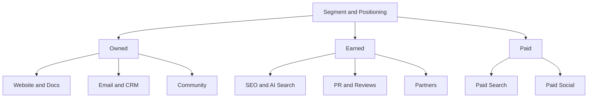

# 채널 전략 · Content · Paid · Lifecycle · Community

채널은 전략이 아니라 **전략을 실행하는 경로**다. 먼저 Segment와 Positioning이 있고, 그 고객이 실제로 있는 곳을 고른다.

## 채널 지도

| 유형 | 특징 | 비용 구조 |
|---|---|---|
| Owned | 우리가 통제하는 자산 | 제작·운영 비용, 누적 효과 |
| Earned | 남이 우리를 언급·추천 | 직접 구매 불가, 신뢰도 높음 |
| Paid | 돈을 내고 노출 구매 | 즉시 효과, 멈추면 끊김 |

## 채널 선택 질문

- 우리 ICP는 문제를 느낄 때 어디서 무엇을 검색하거나 묻는가?
- 구매 전 누구의 말을 믿는가? (동료, 커뮤니티, 리뷰, AI 답변)
- 우리 단가와 LTV로 감당 가능한 CAC는 얼마인가? (07 문서)
- 이 채널에서 효과를 측정할 수 있는가? (06 문서)

초기에는 채널을 넓게 펼치기보다 **한두 개 채널에서 반복 가능한 성과를 증명**하는 편이 낫다.

## Content · SEO

검색 유입은 누적 자산이지만 느리다.

Google의 공식 입장(Search Central)은 일관된다.

- AI 사용 여부가 아니라 **콘텐츠가 사람에게 유용한가**를 본다
- 검색 순위 조작이 주목적인 자동 생성은 Spam Policy 위반이다
- 2024-03 Google은 Scaled Content Abuse, Site Reputation Abuse, Expired Domain Abuse를 새 Spam Policy로 발표했다

나쁜 예:

> 키워드별로 AI 글 500개를 자동 생성해 게시한다.

좋은 예:

> 고객 인터뷰에서 반복된 질문 20개를 골라, 실제 설정 화면과 오류 사례를 담은 문서로 만든다.

## Paid Search · Paid Social

| 구분 | Paid Search | Paid Social |
|---|---|---|
| 사용자 상태 | 이미 문제를 인식하고 검색 중 | 피드 소비 중, 수요가 잠재적 |
| 강점 | 높은 구매 의도 | 수요 창출, 정교한 도달 |
| 약점 | 검색량 이상으로 늘릴 수 없음 | 소재 피로, 전환까지 길다 |
| 핵심 변수 | 키워드·검색어, 입찰, Landing Page | 소재(Creative), 타깃, 빈도 |

### 자동화 캠페인의 확산

주요 광고 플랫폼은 타깃·입찰·소재 조합을 AI로 자동화하는 캠페인 유형을 전면에 두고 있다. 예: Google의 Performance Max와 AI Max for Search campaigns(2025 발표), Meta의 Advantage+ 캠페인.

실무 원칙:

- 자동화는 **입력 신호(전환 데이터)의 품질**만큼만 똑똑하다
- 플랫폼이 보고하는 전환은 플랫폼 기준의 Attribution이다 (06 문서)
- 제외 조건, 브랜드 안전, 예산 상한은 사람이 정한다
- 자동 생성 소재도 표시·광고 규정을 똑같이 적용받는다 (09 문서)

## Email · CRM · Lifecycle

이미 관계가 있는 고객과의 채널이다. 획득보다 **활성화·유지·확장**에 기여한다.

| 단계 | 메시지 예 | Trigger |
|---|---|---|
| Onboarding | 첫 가치 경험 안내 | 가입 직후, 미완료 단계 |
| Activation | 핵심 기능 사용 유도 | 특정 행동 미발생 |
| Retention | 사용 요약, 새 가치 | 사용 감소 신호 |
| Expansion | 상위 Plan, 팀 초대 | 한도 근접 |
| Win-back | 복귀 이유 제시 | 해지·장기 미사용 |

### 발송 인프라 요건

- Gmail은 2024-02부터 하루 5,000통 이상을 Gmail 계정으로 보내는 발신자에게 SPF·DKIM 인증, DMARC, 마케팅 메일의 원클릭 수신 거부(RFC 8058), Postmaster Tools 기준 스팸 신고율 0.3% 미만 유지를 요구한다. Google은 2025-11부터 미준수 트래픽에 대한 집행을 강화한다고 안내했다.
- Apple Mail Privacy Protection(2021-06 발표)은 원격 콘텐츠를 미리 내려받아 발신자가 열람 여부를 알 수 없게 한다. 따라서 **Open Rate는 신뢰하기 어려운 지표**다. 클릭, 전환, 해지율을 본다.
- 한국에서는 광고성 메시지에 사전 수신 동의, (광고) 표시, 수신 거부 방법 안내 등이 필요하다 (09 문서).

## Community

Community는 광고 채널이 아니라 **고객끼리 서로 돕는 구조**다.

- 효과: 지원 비용 감소, 제품 피드백, 신뢰, 추천
- 조건: 꾸준한 운영 인력, 명확한 규칙, 회사가 대화를 독점하지 않기
- 지표: 활성 참여자 수, 질문 대비 답변률, 커뮤니티 경유 가입·유지 (인과 확인은 어렵다)

## Partnerships

| 유형 | 예 | 주의 |
|---|---|---|
| Integration / Marketplace | 다른 제품의 연동 목록에 등재 | 상대 플랫폼 정책 변경 리스크 |
| Reseller / Agency | 대행사·리셀러 판매 | 마진, 고객 관계 소유권 |
| Co-marketing | 공동 웨비나, 공동 콘텐츠 | 대상 고객이 실제로 겹치는가 |
| Affiliate / Referral | 추천 보상 | 경제적 이해관계 표시 의무 (09 문서) |

## 흔한 실수

- 경쟁사가 하니까 같은 채널에 들어가기
- 채널별 성과를 서로 다른 기준으로 비교하기
- 자동화 캠페인에 전환 정의를 대충 넣기
- Open Rate로 이메일 성과를 판단하기
- Community를 공지 게시판으로 쓰기

## 참고 자료

- [What web creators should know about our March 2024 core update and new spam policies — Google Search Central](https://developers.google.com/search/blog/2024/03/core-update-spam-policies) (2024-03, 접속 2026-09-28)
- [Google Search's guidance about AI-generated content — Google Search Central](https://developers.google.com/search/blog/2023/02/google-search-and-ai-content) (2023-02, 접속 2026-09-28)
- [Unlock next-level performance with AI Max for Search campaigns — Google](https://blog.google/products/ads-commerce/google-ai-max-for-search-campaigns/) (2025, 접속 2026-09-28)
- [Meta Advantage+ — Meta for Business](https://www.facebook.com/business/ads/meta-advantage-plus) (접속 2026-09-28)
- [Email sender guidelines — Gmail Help](https://support.google.com/a/answer/81126?hl=en) (접속 2026-09-28)
- [Email sender guidelines FAQ — Gmail Help](https://support.google.com/mail/answer/14229414?hl=en) (접속 2026-09-28)
- [Mail Privacy Protection & Privacy — Apple](https://www.apple.com/legal/privacy/data/en/mail-privacy-protection/) (접속 2026-09-28)
- [Apple advances its privacy leadership with iOS 15 — Apple Newsroom](https://www.apple.com/newsroom/2021/06/apple-advances-its-privacy-leadership-with-ios-15-ipados-15-macos-monterey-and-watchos-8/) (2021-06, 접속 2026-09-28)
