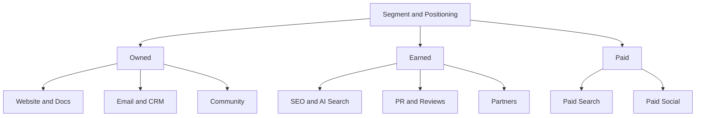

# 채널 전략 · Content · Paid · Lifecycle · Community

채널은 전략이 아니라 **전략을 실행하는 경로**다. 먼저 Segment와 Positioning이 있고, 그 고객이 실제로 있는 곳을 고른다.

## 채널 지도



| 유형 | 특징 | 비용 구조 |
|---|---|---|
| Owned | 우리가 통제하는 자산 | 제작·운영 비용, 누적 효과 |
| Earned | 남이 우리를 언급·추천 | 직접 구매 불가, 신뢰도 높음 |
| Paid | 돈을 내고 노출 구매 | 즉시 효과, 멈추면 끊김 |

## 채널 선택 질문

- 우리 ICP는 문제를 느낄 때 어디서 무엇을 검색하거나 묻는가?
- 구매 전 누구의 말을 믿는가? (동료, 커뮤니티, 리뷰, AI 답변)
- 우리 단가와 LTV로 감당 가능한 CAC는 얼마인가? (07 문서)
- 이 채널에서 효과를 측정할 수 있는가? (06 문서)

초기에는 채널을 넓게 펼치기보다 **한두 개 채널에서 반복 가능한 성과를 증명**하는 편이 낫다.

## Content · SEO

검색 유입은 누적 자산이지만 느리다.

Google의 공식 입장(Search Central)은 일관된다.

- AI 사용 여부가 아니라 **콘텐츠가 사람에게 유용한가**를 본다
- 검색 순위 조작이 주목적인 자동 생성은 Spam Policy 위반이다
- 2024-03 Google은 Scaled Content Abuse, Site Reputation Abuse, Expired Domain Abuse를 새 Spam Policy로 발표했다

나쁜 예:

> 키워드별로 AI 글 500개를 자동 생성해 게시한다.

좋은 예:

> 고객 인터뷰에서 반복된 질문 20개를 골라, 실제 설정 화면과 오류 사례를 담은 문서로 만든다.

## Paid Search · Paid Social

| 구분 | Paid Search | Paid Social |
|---|---|---|
| 사용자 상태 | 이미 문제를 인식하고 검색 중 | 피드 소비 중, 수요가 잠재적 |
| 강점 | 높은 구매 의도 | 수요 창출, 정교한 도달 |
| 약점 | 검색량 이상으로 늘릴 수 없음 | 소재 피로, 전환까지 길다 |
| 핵심 변수 | 키워드·검색어, 입찰, Landing Page | 소재(Creative), 타깃, 빈도 |

### 자동화 캠페인의 확산

주요 광고 플랫폼은 타깃·입찰·소재 조합을 AI로 자동화하는 캠페인 유형을 전면에 두고 있다. 예: Google의 Performance Max와 AI Max for Search campaigns(2025 발표), Meta의 Advantage+ 캠페인.

실무 원칙:

- 자동화는 **입력 신호(전환 데이터)의 품질**만큼만 똑똑하다
- 플랫폼이 보고하는 전환은 플랫폼 기준의 Attribution이다 (06 문서)
- 제외 조건, 브랜드 안전, 예산 상한은 사람이 정한다
- 자동 생성 소재도 표시·광고 규정을 똑같이 적용받는다 (09 문서)

## Email · CRM · Lifecycle

이미 관계가 있는 고객과의 채널이다. 획득보다 **활성화·유지·확장**에 기여한다.

| 단계 | 메시지 예 | Trigger |
|---|---|---|
| Onboarding | 첫 가치 경험 안내 | 가입 직후, 미완료 단계 |
| Activation | 핵심 기능 사용 유도 | 특정 행동 미발생 |
| Retention | 사용 요약, 새 가치 | 사용 감소 신호 |
| Expansion | 상위 Plan, 팀 초대 | 한도 근접 |
| Win-back | 복귀 이유 제시 | 해지·장기 미사용 |

Onboarding과 Activation 메시지는 **Activation Event**를 향해야 한다. 이 이벤트는 추측으로 정하지 않는다. 몇 달 뒤에도 남아 있는 사용자와 떠난 사용자의 첫 1–2주 행동을 비교해, 유지와 가장 강하게 함께 나타나는 행동을 고른다. 예시 제품이라면 "첫 주 안에 서비스 1개를 연동하고, 알림 1건에서 원인 화면을 연다" 같은 행동이 후보다 (가정). 이것은 상관이므로 Onboarding 실험으로 인과를 확인한다. 방법은 03 문서에서 **실제로 유료 전환한 계정의 행동으로 PQL 기준을 찾는 방식**과 같다.

### 발송 인프라 요건

- Gmail은 2024-02부터 하루 5,000통 이상을 Gmail 계정으로 보내는 발신자에게 SPF·DKIM 인증, DMARC, 마케팅 메일의 원클릭 수신 거부(RFC 8058)를 요구한다. Postmaster Tools 기준 스팸 신고율은 **0.10% 미만으로 유지하고 0.30%에는 절대 도달하지 않도록** 하라고 안내한다. Google은 2025-11부터 미준수 트래픽에 대한 집행을 강화한다고 안내했다.
- Apple Mail Privacy Protection(2021-06 발표)은 원격 콘텐츠를 미리 내려받아 발신자가 열람 여부를 알 수 없게 한다. 따라서 **Open Rate는 신뢰하기 어려운 지표**다. 클릭, 전환, 해지율을 본다.
- 한국에서는 광고성 메시지에 사전 수신 동의, (광고) 표시, 수신 거부 방법 안내 등이 필요하다 (09 문서).

## Community

Community는 광고 채널이 아니라 **고객끼리 서로 돕는 구조**다.

- 효과: 지원 비용 감소, 제품 피드백, 신뢰, 추천
- 조건: 꾸준한 운영 인력, 명확한 규칙, 회사가 대화를 독점하지 않기
- 지표: 활성 참여자 수, 질문 대비 답변률, 커뮤니티 경유 가입·유지 (인과 확인은 어렵다)

## Partnerships

| 유형 | 예 | 주의 |
|---|---|---|
| Integration / Marketplace | 다른 제품의 연동 목록에 등재 | 상대 플랫폼 정책 변경 리스크 |
| Reseller / Agency | 대행사·리셀러 판매 | 마진, 고객 관계 소유권 |
| Co-marketing | 공동 웨비나, 공동 콘텐츠 | 대상 고객이 실제로 겹치는가 |
| Affiliate / Referral | 추천 보상 | 경제적 이해관계 표시 의무 (09 문서) |

## 한국 채널 특이점

한국 고객을 겨냥하면 글로벌 채널 목록만으로는 부족하다. 네이버와 카카오는 검색·메시지·커머스를 한 사업자 안에 묶어 두고 있어, **채널마다 성격과 적용 법규가 다르다.**

정보통신망법 제50조의 광고성 정보 규칙(사전 수신 동의, (광고) 표시, 야간 별도 동의, 수신 거부 안내)은 **문자, 이메일, 앱 푸시, 메신저 메시지처럼 수신자에게 보내는 전송형 채널**에 적용된다. 검색 결과나 피드에 노출되는 광고는 전송이 아니므로 제50조 대상이 아니지만, 광고 문구와 협찬 표시는 표시·광고법과 공정위 추천·보증 심사지침을 따른다 (09 문서).

| 채널 | 성격 | 정보통신망법 제50조 적용 | 측정 가능성 |
|---|---|---|---|
| 네이버 검색광고 (파워링크 등) | 키워드에 입찰하고 클릭당 과금하는 검색광고. 한국어 검색 수요 포착 | 노출형이라 해당 없음 | 클릭·비용은 광고 시스템에서, 가입·결제는 UTM과 자체 분석으로 연결 |
| 네이버 블로그·카페 | 검색 결과에 함께 노출되는 후기·커뮤니티 콘텐츠 (Earned·Owned) | 게시물은 해당 없음. 체험단·협찬 글은 추천·보증 지침의 경제적 이해관계 표시 대상 | UTM으로 일부 유입만 확인. 영향은 브랜드 검색량 추이 같은 간접 지표 |
| 네이버 스마트스토어 | 네이버 쇼핑·네이버페이와 연결된 판매 채널 (주로 B2C 상품) | 구매자에게 광고성 알림을 보내면 해당 | 판매자센터 통계 중심. 자사 분석과 합치려면 별도 설계 필요 |
| 카카오톡 채널 | 친구 추가 기반 Owned 채널 (채팅, 게시물, 메시지) | 광고 메시지를 보내면 해당: (광고) 표시, 연락처, 수신 거부 방법 | 발송·클릭 지표, 채널 친구 수 |
| 알림톡 | 주문·결제·가입 등 거래와 서비스 이용에 필요한 **정보성** 메시지 전용. 광고 내용이 일부라도 섞이면 발송 불가 | 정보성 범위 안이면 광고성 정보 규칙의 예외. 광고가 섞이면 광고성으로 판단 | 발송·도달은 발송 대행사 보고, 이후 행동은 링크 UTM |
| 브랜드 메시지 (친구톡 대체) | **광고성** 메시지. 친구톡은 2025-12-31 종료되고 2026-01-01부터 브랜드 메시지로 대체. 채널 친구와 마케팅 수신 동의 고객에게 발송 | 해당: 사전 수신 동의, (광고) 표시, 야간 별도 동의, 수신 거부 안내 | 발송·클릭, 링크 UTM |
| 카카오모먼트 | 비즈보드(채팅 탭 상단 배너), 디스플레이·동영상·메시지 광고를 집행하는 광고 플랫폼 | 노출형은 해당 없음, 메시지 광고는 해당 | 플랫폼 보고 전환 (06 문서의 Attribution 한계가 그대로 적용) |
| 당근 (비즈프로필, 당근 광고) | 동네 기반 로컬 채널. 비즈프로필은 무료, 광고는 지역·연령·관심사 타겟 | 노출형 광고는 해당 없음 | 광고 관리 도구 지표. 지역 단위 타겟이라 Geo 실험 후보 |
| Instagram · YouTube | 글로벌 플랫폼이지만 한국 B2C·크리에이터 마케팅에서 기본으로 검토하는 채널 | 피드·동영상 광고는 해당 없음. 협찬 콘텐츠는 추천·보증 지침 적용 | 플랫폼 보고 전환, 플랫폼 Lift 도구 |

판단 예: 예시 제품(개발자용 장애 모니터링 도구)이라면 네이버·Google 검색광고와 기술 블로그, 가입·결제 안내용 알림톡이 우선 후보이고, 당근·Instagram은 우선순위가 낮다. 로컬 매장이나 B2C 커머스라면 순서가 거의 반대가 된다.

상품명과 정책은 자주 바뀐다. 위 표는 2026-09-28 기준 각 사업자 안내를 요약한 것이므로 집행 전에 원문을 다시 확인한다.

## 예산 배분

채널 수보다 **돈을 늘리는 순서**가 중요하다.

1. **한 채널에서 먼저 증명한다.** 반복 가능한 CAC가 나오기 전에는 채널을 늘리지 않는다.
2. **테스트 예산에 상한을 둔다.** 새 채널 실험은 금액과 기간(예: 전체의 10–20%, 6–8주, 가정)을 정하고 중단 기준을 미리 적는다.
3. **확대는 Incrementality 확인 뒤에 한다.** 플랫폼 보고 ROAS가 아니라 Lift·Geo 실험 결과로 판단한다 (06 문서).
4. **평균 CAC가 아니라 Marginal CAC를 본다.** 대부분의 채널은 예산을 늘릴수록 효율이 떨어진다(Diminishing Returns). 가장 싼 수요(브랜드 검색, 의도가 높은 키워드)부터 먼저 소진되기 때문이다.

```text
Marginal CAC 예 (가정)
월 200만 원 → 신규 20명   평균 CAC 10만 원
월 300만 원 → 신규 25명   평균 CAC 12만 원
추가 100만 원 → 추가 5명   Marginal CAC 20만 원
```

평균 CAC 12만 원은 괜찮아 보여도, 마지막 100만 원은 고객 한 명에 20만 원을 쓰고 있다. 확대 판단은 이 숫자로 한다.

### 채널 믹스 예시: 5인 B2B SaaS, 월 500만 원 (가정)

예시 제품을 만드는 5인 팀이 월 500만 원을 쓴다고 가정한 배분이다. 금액은 읽는 법을 보여 주기 위한 **가정**이다.

| 채널 | 월 예산 | 역할 | 측정 |
|---|---|---|---|
| 네이버·Google 검색광고 ("배포 후 오류", "로그 모니터링" 등 문제 키워드) | 200만 원 | 이미 문제를 느끼는 수요 포착 | 검색어별 가입→Activation 전환, Paid CAC, 분기 1회 On/Off 또는 Geo 테스트 |
| Content·SEO·AI 검색 (장애 사례 글, 설정 가이드) | 150만 원 | 누적 자산, AI 답변 인용 후보 | 자연 검색 가입, Search Console(생성형 AI 보고서 포함), AI 서비스 Referrer |
| Lifecycle 이메일·인앱 (Onboarding, PQL Nurture) | 50만 원 | Activation과 유료 전환 | Activation률, 무료→유료 전환, 미발송 Holdout 그룹과 비교 |
| Community·파트너 (개발자 커뮤니티 후원, 연동 마켓플레이스) | 50만 원 | 신뢰와 추천 | 커뮤니티 경유 가입(UTM), 가입 설문 "어디서 알게 되었나요" |
| 테스트 예산 (다음 채널 후보) | 50만 원 | 새 채널 검증 | 사전에 정한 중단 기준과 기간 |

## 흔한 실수

- 경쟁사가 하니까 같은 채널에 들어가기
- 채널별 성과를 서로 다른 기준으로 비교하기
- 자동화 캠페인에 전환 정의를 대충 넣기
- Open Rate로 이메일 성과를 판단하기
- Community를 공지 게시판으로 쓰기

## 참고 자료

- [What web creators should know about our March 2024 core update and new spam policies — Google Search Central](https://developers.google.com/search/blog/2024/03/core-update-spam-policies) (2024-03, 접속 2026-09-28)
- [Google Search's guidance about AI-generated content — Google Search Central](https://developers.google.com/search/blog/2023/02/google-search-and-ai-content) (2023-02, 접속 2026-09-28)
- [Unlock next-level performance with AI Max for Search campaigns — Google](https://blog.google/products/ads-commerce/google-ai-max-for-search-campaigns/) (2025, 접속 2026-09-28)
- [Meta Advantage+ — Meta for Business](https://www.facebook.com/business/ads/meta-advantage-plus) (접속 2026-09-28)
- [Email sender guidelines — Gmail Help](https://support.google.com/a/answer/81126?hl=en) (접속 2026-09-28, 스팸 신고율 0.10%·0.30% 기준 확인)
- [Email sender guidelines FAQ — Gmail Help](https://support.google.com/mail/answer/14229414?hl=en) (접속 2026-09-28)
- [Mail Privacy Protection & Privacy — Apple](https://www.apple.com/legal/privacy/data/en/mail-privacy-protection/) (접속 2026-09-28)
- [Apple advances its privacy leadership with iOS 15 — Apple Newsroom](https://www.apple.com/newsroom/2021/06/apple-advances-its-privacy-leadership-with-ios-15-ipados-15-macos-monterey-and-watchos-8/) (2021-06, 접속 2026-09-28)
- [네이버 검색광고 — NAVER](https://searchad.naver.com/) (접속 2026-09-28)
- [마케터들이 운영하는 실제 파워링크 세팅법 — 마케팅 인사이드](https://inside.ampm.co.kr/insight/10860) (접속 2026-09-28)
- [네이버 스마트스토어센터 — NAVER](https://sell.smartstore.naver.com/) (접속 2026-09-28)
- [알림톡 — kakao business 비즈니스 가이드](https://kakaobusiness.gitbook.io/main/ad/infotalk) (접속 2026-09-28)
- [알림톡 메시지 발송 유의사항 — kakao business 비즈니스 가이드](https://kakaobusiness.gitbook.io/main/ad/infotalk/operations) (접속 2026-09-28)
- [채널 메시지 발송 유의사항 — kakao business 비즈니스 가이드](https://kakaobusiness.gitbook.io/main/ad/moment/start/messagead/operations) (접속 2026-09-28)
- [카카오 친구톡 서비스 종료에 따른 브랜드 메시지 자동 대체 발송 안내 — SOLAPI](https://solapi.com/notices/notices-2025-12-04) (2025-12-04, 접속 2026-09-28)
- [카카오모먼트 — kakao business 비즈니스 가이드](https://kakaobusiness.gitbook.io/main/ad/moment) (접속 2026-09-28)
- [당근 광고를 소개해요 — 당근 비즈스쿨](https://bizschool.daangn.com/ads) (접속 2026-09-28)
- [당근비즈니스 — 당근](https://business.daangn.com/) (접속 2026-09-28)
- [정보통신망법 제50조 — 국가법령정보센터](https://www.law.go.kr/%EB%B2%95%EB%A0%B9/%EC%A0%95%EB%B3%B4%ED%86%B5%EC%8B%A0%EB%A7%9D%EC%9D%B4%EC%9A%A9%EC%B4%89%EC%A7%84%EB%B0%8F%EC%A0%95%EB%B3%B4%EB%B3%B4%ED%98%B8%EB%93%B1%EC%97%90%EA%B4%80%ED%95%9C%EB%B2%95%EB%A5%A0/%EC%A0%9C50%EC%A1%B0) (접속 2026-09-28)
