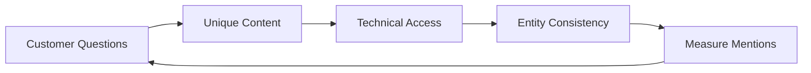

# AI 검색 · Answer Engine · GEO/AEO

2024–2026년 검색의 가장 큰 변화는 **링크 목록 대신 AI가 요약한 답변이 먼저 보이는 화면**이 늘어난 것이다. 업계에서는 이에 대응하는 활동을 GEO(Generative Engine Optimization) 또는 AEO(Answer Engine Optimization)라고 부른다.

## 현재 상황 (2026-09-28 기준, 출처 날짜 명시)

| 서비스 | 확인된 사실 | 출처 시점 |
|---|---|---|
| Google AI Overviews | 200개 이상 국가·지역, 40개 이상 언어로 제공 | 2025-05 Google 발표 |
| Google AI Mode | 한국어 등 5개 언어 추가 | 2025-09 Google 발표 |
| Google AI Mode | 출시 1년 만에 월 사용자 10억 명 돌파라고 Google이 발표 | 2026-05 Google I/O |
| Search Console | 생성형 AI 기능 노출을 따로 보는 보고서 도입 | 2026-06 발표 |
| ChatGPT search | 웹 출처 링크와 함께 답변 제공 시작 | 2024-10 OpenAI 발표 |
| ChatGPT 광고 | 미국 Free·Go 이용자 대상 광고 테스트 발표, 이후 한국 등으로 파일럿 확대 보도 | 2026-01 발표, 2026-08 보도 |
| Naver AI 브리핑 | 통합검색에 AI 요약 답변과 출처 표시 도입 | 2025-03 보도 |

사용자 수·국가 수는 **제공사 자체 발표**이며 자주 바뀐다. 계획을 세우기 전에 원문을 다시 확인한다.

## 클릭은 줄 수 있다

Pew Research Center가 미국 성인 900명의 2025-03 브라우징 데이터를 분석한 결과(2025-07-22 발표), AI 요약이 있는 Google 검색 페이지에서 결과 링크를 클릭한 비율은 8%, AI 요약이 없는 페이지에서는 15%였다. AI 요약 안의 출처 링크 클릭은 매우 드물었다.

이것은 **한 연구의 관찰 결과**이며 업종·질의 유형별로 다를 수 있다. 다만 방향성은 분명하다.

- "정보형 질의 → 블로그 유입 → 전환" 모델은 약해질 수 있다
- 노출(Impression)과 클릭의 차이가 커진다
- **답변 안에서 언급·인용되는 것** 자체가 목표 중 하나가 된다

Gartner는 2024-02에 "2026년까지 전통적 검색엔진 검색량이 25% 줄 것"이라고 **예측**했다. 예측이지 측정값이 아니다.

## Google이 공식적으로 말하는 것

Google Search Central의 안내(2025-05 블로그, 2026-05 최적화 가이드)는 요약하면 다음과 같다.

- AI Overviews·AI Mode에 나오기 위한 **별도 기술 요건은 없다.** 색인되고 Snippet 표시가 가능하면 후보가 된다
- 기존 SEO 기본기가 그대로 기반이다
- 새 기계용 파일, AI 전용 텍스트 파일, 특별한 Schema는 **필요 없다**
- 콘텐츠를 억지로 잘게 쪼갤(Chunking) 필요가 없다
- 흔한 정보가 아닌 **고유하고 경험에 기반한(Non-commodity) 콘텐츠**가 중요하다
- "AEO/GEO 요령"(인위적 언급 만들기 등)보다 SEO 기본을 우선하라고 권고한다

주의: 이것은 **Google Search에 대한** 안내다. 다른 Answer Engine의 동작은 각 사업자 문서를 따로 확인해야 한다.

## ChatGPT search와 Crawler

OpenAI 문서에 따르면 Crawler 역할이 나뉘어 있다.

| User-agent | 역할 | 막으면 |
|---|---|---|
| OAI-SearchBot | ChatGPT 검색 결과 노출용 | ChatGPT 검색 답변·Snippet에 나오기 어려움 |
| GPTBot | 생성형 모델 학습용 수집 | 학습 사용을 원하지 않는다는 의사 표시 |

즉 **검색 노출은 허용하고 학습 수집은 거부**하는 조합이 가능하다. robots.txt 설정은 법무·콘텐츠 정책과 함께 결정한다.

## 실무 체크리스트

1. **질문 목록 만들기**: 고객이 AI에 물을 법한 질문을 인터뷰·영업·CS 기록에서 모은다.
2. **고유한 답 만들기**: 가격, 제한, 비교, 설정 절차, 실제 사례처럼 우리만 정확히 아는 정보를 공개한다.
3. **접근 가능하게 하기**: 색인, 크롤링 허용 여부, 렌더링, 페이지 속도를 점검한다.
4. **일관성 유지**: 제품명·가격·기능 설명이 사이트, 문서, 마켓플레이스, 리뷰 사이트에서 서로 맞는지 확인한다. AI 답변은 여러 출처를 합치므로 불일치가 오답으로 이어질 수 있다.
5. **측정하기**: Search Console의 생성형 AI 보고서, 주요 질문을 정기적으로 AI 서비스에 물어 언급·정확도를 기록하는 수동 점검.

## 나쁜 예 / 좋은 예

나쁜 예:

> AI에 잘 나오도록 FAQ 페이지 100개를 자동 생성하고, 커뮤니티에 우리 제품 칭찬 글을 부탁한다.

좋은 예:

> 고객이 실제로 묻는 "기존 도구에서 옮길 때 데이터는 어떻게 되나요?"에 대해, 이전 절차·제한·소요 시간을 정확히 적은 문서를 만들고, 가격 페이지와 문서의 수치를 일치시킨다.

나쁜 예의 두 번째 행동은 Google이 권하지 않는 인위적 언급이며, 대가가 있다면 광고 표시 문제로도 이어진다 (09 문서).

## 아직 불확실한 것

- AI 답변의 출처 선택 방식은 공개되지 않은 부분이 많다
- 서비스마다 측정 도구 수준이 다르다
- AI 답변 안 광고의 형식·규칙은 계속 바뀌고 있다

## 참고 자료

- [AI Overviews are now available in over 200 countries and territories — Google](https://blog.google/products-and-platforms/products/search/ai-overview-expansion-may-2025-update/) (2025-05, 접속 2026-09-28)
- [AI Mode is now available in five new languages — Google](https://blog.google/products/search/ai-mode-expands-more-languages/) (2025-09, 접속 2026-09-28)
- [Google Search's I/O 2026 updates — Google](https://blog.google/products-and-platforms/products/search/search-io-2026/) (2026-05, 접속 2026-09-28)
- [AI Features and Your Website — Google Search Central](https://developers.google.com/search/docs/appearance/ai-features) (접속 2026-09-28)
- [Top ways to ensure your content performs well in Google's AI experiences on Search — Google Search Central](https://developers.google.com/search/blog/2025/05/succeeding-in-ai-search) (2025-05, 접속 2026-09-28)
- [A new resource for optimizing for generative AI in Google Search — Google Search Central](https://developers.google.com/search/blog/2026/05/a-new-resource-for-optimizing) (2026-05, 접속 2026-09-28)
- [Introducing Search Generative AI performance reports in Search Console — Google Search Central](https://developers.google.com/search/blog/2026/06/gen-ai-performance-reports) (2026-06, 접속 2026-09-28)
- [Google users are less likely to click on links when an AI summary appears — Pew Research Center](https://www.pewresearch.org/short-reads/2025/07/22/google-users-are-less-likely-to-click-on-links-when-an-ai-summary-appears-in-the-results/) (2025-07-22, 접속 2026-09-28)
- [Gartner Predicts Search Engine Volume Will Drop 25% by 2026 — Gartner](https://www.gartner.com/en/newsroom/press-releases/2024-02-19-gartner-predicts-search-engine-volume-will-drop-25-percent-by-2026-due-to-ai-chatbots-and-other-virtual-agents) (2024-02-19, 접속 2026-09-28)
- [Introducing ChatGPT search — OpenAI](https://openai.com/index/introducing-chatgpt-search/) (2024-10, 접속 2026-09-28)
- [Overview of OpenAI Crawlers — OpenAI](https://developers.openai.com/api/docs/bots) (접속 2026-09-28)
- [Testing ads in ChatGPT — OpenAI](https://openai.com/index/testing-ads-in-chatgpt/) (2026-01-16, 접속 2026-09-28)
- [OpenAI ChatGPT ads pilot in five countries including Korea — ZDNet Korea](https://zdnet.co.kr/view/?no=20260813204559) (2026-08-13, 접속 2026-09-28)
- [Naver introduces AI Briefing in search — NewDaily](https://biz.newdaily.co.kr/site/data/html/2025/03/24/2025032400067.html) (2025-03-24, 접속 2026-09-28)
