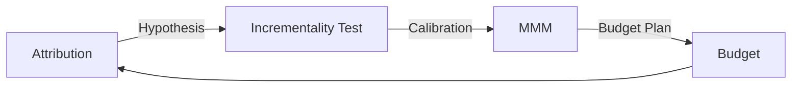

# 측정 · Attribution · Incrementality · Privacy

"이 광고가 매출을 만들었는가?"는 Marketing에서 가장 어려운 질문이다. 핵심은 **상관(Correlation)과 인과(Causation)를 구분하는 것**이다.

## 세 가지 측정 도구

| 방법 | 질문 | 강점 | 약점 |
|---|---|---|---|
| Attribution (MTA, Last-click 등) | 전환 전에 어떤 접점이 있었나 | 빠름, 세밀함 | 인과가 아님, 추적 가능한 접점만 봄 |
| Incrementality Test (Lift, Geo 실험) | 광고가 없었다면 전환이 얼마나 줄었나 | 인과 추정 | 비용·시간, 한 번에 하나의 질문 |
| MMM (Marketing Mix Modeling) | 채널별 예산이 결과에 얼마나 기여했나 | 개인 추적 불필요, 오프라인 포함 | 데이터 기간 필요, 모델 가정에 민감 |



IAB의 State of Data 2026 보고서도 Privacy 변화, 플랫폼별로 닫힌 측정, 채널 간 불일치 때문에 노출과 사업 성과를 연결하기 어렵다는 점을 다루며, AI를 Attribution·Incrementality·MMM을 보강하는 도구로 본다.

실무에서는 하나만 쓰지 않는다. **Attribution으로 가설을 세우고, 실험으로 검증하고, 실험 결과로 MMM을 보정**하는 조합이 권장된다. Meta의 Robyn 문서도 Lift 실험 결과로 MMM을 보정(Calibration)하는 방식을 설명한다.

## Attribution의 한계

- **Last-click**은 검색·리타기팅처럼 전환 직전 접점을 과대평가한다
- **플랫폼 보고 전환**은 각 플랫폼이 자기 기준으로 계산하므로 합치면 실제보다 커지기 쉽다
- **어차피 샀을 고객**(브랜드 검색, 기존 고객)에게 크레딧이 몰린다
- 추적이 막힌 사용자(동의 거부, 앱 추적 거부)는 보이지 않는다

나쁜 예:

> 브랜드 키워드 광고 ROAS가 20배다. 예산을 두 배로 늘리자.

좋은 예:

> 브랜드 키워드 광고를 일부 지역에서 4주간 끄고 전체 전환 변화를 비교해 순증(Incremental) 효과를 추정한다.

## Incrementality Test

```text
Test 그룹: 광고 노출
Control 그룹: 광고 미노출 (무작위 또는 지역 단위)
Lift = (Test 전환율 - Control 전환율) / Control 전환율
```

- 사용자 단위 실험: 플랫폼의 Conversion Lift 도구 (예: Google Ads, Meta)
- 지역 단위 실험: Geo 실험 (예: Meta GeoLift, Google Meridian GeoX)
- Google Meridian GeoX: 2026-05 미리 공개된 오픈소스 Geo 실험 라이브러리로, 광고 매체와 무관하게 지역을 Test·Control로 나눠 순증을 측정하고 그 결과로 Meridian MMM을 보정하도록 설계되었다. 2026-09-09 정식 출시(GA)가 보도되었다
- Google은 2025년 Google Ads 증분 실험의 최소 예산을 낮췄다고 안내했다 (Google Ads Help 기준 최소 5,000달러)

주의: 표본이 작으면 결과가 흔들린다. 실험 전에 **관찰 기간, 최소 효과 크기, 판단 기준**을 먼저 정한다.

### 숫자로 보는 예

사용자 단위 Lift 실험을 읽는 법을 보여 주는 **일반 예시**다. 04·07의 예시 제품(검색광고 월 200만 원, 분기 유료 계정 10곳)이 아니라, 광고 도달 규모가 큰 서비스를 가정했다. 여기서 **전환은 무료 가입**이다. 모든 수치는 예시다.

```text
전환 = 무료 가입
각 그룹 50,000명 (무작위 배정)
Control 전환율 2.0%  → 전환 1,000건
Test    전환율 2.4%  → 전환 1,200건

Lift             = (2.4 - 2.0) / 2.0 = 20%
Incremental 전환 = 50,000 × (2.4% - 2.0%) = 200건
Test 광고비      = 1,000만 원
Incremental CAC  = 1,000만 원 / 200건 = 5만 원
```

플랫폼이 Test 그룹의 전환 1,200건을 모두 광고 덕분으로 보고하면 CAC는 약 8,333원으로 보인다. 실제로 광고가 **추가로** 만든 전환은 200건이고, 예산 판단은 Incremental CAC 5만 원으로 한다. 이것은 무료 가입 1건당 비용이므로, 유료 고객 1명당 비용으로 바꾸려면 가입→유료 전환율로 한 번 더 나눠야 한다.

04·07의 예시 제품 규모에서는 이 방식의 **검정력이 부족하다**. 아래 계산처럼 2.0% → 2.4%를 감지하려면 그룹당 약 2.1만 명이 필요한데, 월 200만 원 검색광고와 분기 유료 계정 10곳 규모로는 가입 기준으로도 표본을 채우기 어렵고 유료 전환 기준으로는 차이를 감지할 수 없다. 그래서 04의 채널 믹스는 이 채널을 **분기 1회 On/Off 또는 Geo 테스트**로 확인하도록 했다.

### 실험 전에 정할 것

- **MDE(Minimum Detectable Effect)**: 감지하려는 최소 Lift를 먼저 정한다. 필요한 표본은 MDE의 제곱에 반비례해 늘어나므로 MDE를 절반으로 줄이면 표본은 약 4배가 필요하다.
- **최소 표본·지역 수**: 위 예에서 2.0% → 2.4%를 검정력 80%, 유의수준 5%(양측)로 감지하려면 그룹당 약 2.1만 명이 필요하다(정규 근사). Geo 실험은 지역 수가 적으면 지역 간 편차가 효과를 덮으므로, GeoLift·GeoX의 Power 분석으로 지역 수와 기간을 정한다.
- **고정된 기간의 사전 등록**: 기간, 지표, 판단 기준을 실험 전에 문서로 남긴다. 요일 효과가 섞이지 않도록 주 단위로 잡는다.
- **Peeking 금지**: 결과를 매일 보다가 유의해 보이는 날 멈추면 거짓 양성 확률이 명목 5%보다 크게 높아진다. 중간 확인이 필요하면 처음부터 Sequential Test처럼 중간 분석을 전제로 한 방법을 쓴다.

## MMM

- Google Meridian: 2025-01-29 전체 공개된 오픈소스 Bayesian MMM
- Meta Robyn: Meta Marketing Science의 오픈소스 MMM 패키지

MMM은 개인 단위 추적이 필요 없어서 Privacy 변화에 강하다. 대신 **최소 1–2년 치의 주간 데이터, 충분한 예산 변동**이 있어야 의미 있는 결과가 나오는 경우가 많다.

## Privacy 변화: 무엇이 실제로 바뀌었나

| 영역 | 상태 (날짜) |
|---|---|
| Chrome 3rd-party Cookie | 2024-07 일정 기반 폐지 대신 사용자 선택 방식으로 방향 전환 → 2025-04 별도 선택 Prompt도 도입하지 않기로 발표. 기존 설정 화면에서 사용자가 제어 |
| Privacy Sandbox | 2025-10-17 Topics, Protected Audience, Attribution Reporting 등 대부분 API 은퇴 발표. CHIPS, FedCM, Private State Tokens는 유지 |
| Safari | 2020-03 WebKit이 3rd-party Cookie 전면 차단 기본값 발표 |
| Firefox | 2022-06 Total Cookie Protection(사이트별 Cookie 분리)을 전 세계 기본값으로 적용 |
| iOS ATT | 2021년부터 앱이 추적하려면 사용자 허락 필요. 프랑스 경쟁당국 1.5억 유로(2025-03-31), 이탈리아 AGCM 약 9,860만 유로(2025-12) 과징금, 독일 연방카르텔청은 Prompt 중립화 등 확약을 구속력 있게 수용(2026-08-17) |
| iOS 광고 측정 | SKAdNetwork에 이어 AdAttributionKit(2024) 제공, 개인 식별 없이 집계형 Postback |
| Google Consent Mode v2 | 2024-03부터 EEA 사용자에 대해 광고 측정·개인화 동의 신호(ad_user_data, ad_personalization) 전달 필요 |

정리하면:

- "Cookie가 사라진다"는 **Chrome 기준으로는 사실이 아니게 되었다.**
- 그러나 Safari·Firefox의 차단, iOS ATT, 동의 거부 때문에 **추적 가능한 비율은 이미 불완전**하다.
- 동의가 필요한 법적 요건(예: EU ePrivacy, 한국 개인정보 보호법)은 Browser 정책과 무관하게 그대로다.

## First-party 데이터와 Server-side 전송

추적 손실을 줄이는 방법으로 플랫폼들은 동의 받은 First-party 데이터를 서버에서 전송하는 방식을 제공한다.

- Meta Conversions API: 서버·CRM의 이벤트를 Meta로 직접 전송
- Google Ads Enhanced Conversions: 이메일 등 First-party 데이터를 SHA256 Hash로 보내 전환 매칭 보완

이것은 **동의를 우회하는 수단이 아니다.** 동의 범위 안에서만 쓴다.

## 흔한 실수

- 플랫폼별 보고 전환을 더해서 총 성과로 보고하기
- 실험 없이 Attribution 숫자로 예산을 재배분하기
- "Cookie 종말"을 전제로 한 오래된 계획을 그대로 두기
- 동의 설정 없이 Server-side 전송 도입하기

## 참고 자료

- [Update on Plans for Privacy Sandbox Technologies — Google Privacy Sandbox](https://privacysandbox.google.com/blog/update-on-plans-for-privacy-sandbox-technologies) (2025-10-17, 접속 2026-09-28)
- [Next steps for Privacy Sandbox and tracking protections in Chrome — Google Privacy Sandbox](https://privacysandbox.google.com/blog/privacy-sandbox-next-steps) (2025-04, 접속 2026-09-28)
- [Full Third-Party Cookie Blocking and More — WebKit](https://webkit.org/blog/10218/full-third-party-cookie-blocking-and-more/) (2020-03, 접속 2026-09-28)
- [Firefox Rolls Out Total Cookie Protection By Default — Mozilla](https://blog.mozilla.org/en/mozilla/firefox-rolls-out-total-cookie-protection-by-default-to-all-users-worldwide/) (2022-06, 접속 2026-09-28)
- [Autorité de la concurrence fines Apple for the ATT framework — Autorité de la concurrence](https://www.autoritedelaconcurrence.fr/en/press-release/targeted-advertising-autorite-de-la-concurrence-imposes-fine-eu150000000-apple) (2025-03-31, 접속 2026-09-28)
- [The Italian Competition Authority fines Apple over 98 million euro — AGCM](https://en.agcm.it/en/media/press-releases/2025/12/A561) (2025-12, 접속 2026-09-28)
- [Apple changes its rules for personalised advertising in apps — Bundeskartellamt](https://www.bundeskartellamt.de/SharedDocs/Meldung/EN/Pressemitteilungen/2026/08_17_2026_Apple_ATTF.html) (2026-08-17, 접속 2026-09-28)
- [AdAttributionKit — Apple Developer Documentation](https://developer.apple.com/documentation/AdAttributionKit) (접속 2026-09-28)
- [Updates to consent mode for traffic in the EEA — Google Ads Help](https://support.google.com/google-ads/answer/13695607?hl=en) (접속 2026-09-28)
- [Meridian is now available to everyone — Google](https://blog.google/products/ads-commerce/meridian-marketing-mix-model-open-to-everyone/) (2025-01-29, 접속 2026-09-28)
- [An Analyst's Guide to MMM — Meta Robyn](https://facebookexperimental.github.io/Robyn/docs/analysts-guide-to-MMM/) (접속 2026-09-28)
- [Meridian GeoX: Google's new open-source Geo incrementality solution — Google](https://business.google.com/us/accelerate/announcements/meridian-geox-googles-new-open-source-geo-incrementality-solution/) (2026-05, 접속 2026-09-28)
- [google/meridian-geox — GitHub](https://github.com/google/meridian-geox) (접속 2026-09-28)
- [Google Launches Meridian GeoX Globally — Search Engine Journal](https://www.searchenginejournal.com/google-launches-meridian-geox-globally/589030/) (2026-09, 접속 2026-09-28)
- [Strengthen media measurement with incrementality testing improvements — Google Ads Help](https://support.google.com/google-ads/answer/16719772?hl=en) (2025, 접속 2026-09-28)
- [Conversions API — Meta for Developers](https://developers.facebook.com/docs/marketing-api/conversions-api/) (접속 2026-09-28)
- [About enhanced conversions — Google Ads Help](https://support.google.com/google-ads/answer/9888656?hl=en) (접속 2026-09-28)
- [State of Data 2026: The AI-Powered Measurement Transformation — IAB](https://www.iab.com/insights/2026-state-of-data-report/) (2026, 접속 2026-09-28)
