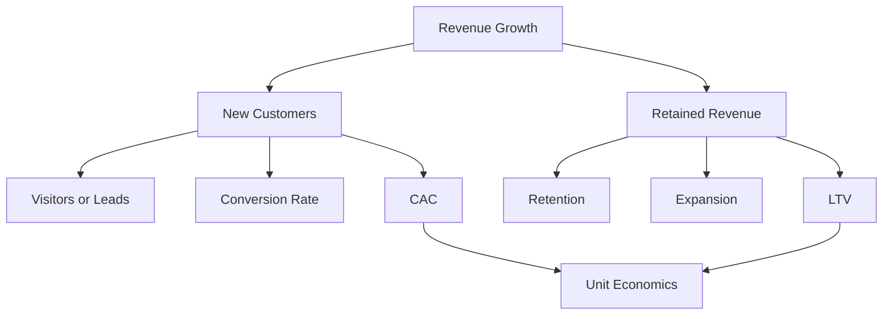

# Marketing Metrics · Unit Economics

Marketing Metric의 목적은 보고가 아니라 **"이 방식으로 고객을 더 사도 돈이 되는가?"에 답하는 것**이다.

## Metric Tree



## 핵심 정의

| Metric | 정의 | 주의 |
|---|---|---|
| CAC | 신규 고객 획득 비용 = (Marketing + Sales 비용) / 신규 고객 수 | 포함 비용 범위를 명시 |
| Paid CAC | 유료 채널 비용 / 유료 채널로 획득한 고객 | Blended CAC와 구분 |
| LTV | 고객 관계 기간 동안의 순이익(또는 매출총이익) 현재가치 | 매출 기준으로 계산하면 과대평가 |
| LTV:CAC | LTV / CAC | 계산 가정에 매우 민감 |
| CAC Payback | CAC를 회수하는 데 걸리는 개월 수 | Gross Margin 반영 여부 명시 |
| Retention | 일정 기간 후 남아 있는 고객(또는 매출) 비율 | Logo 기준과 Revenue 기준 구분 |
| NRR | 기존 고객 매출의 유지·확장률 (Expansion 포함) | 대형 고객 한두 곳에 좌우될 수 있음 |
| Conversion Rate | 단계 간 전환 비율 | 분모 정의가 바뀌면 비교 불가 |

### Blended CAC vs Paid CAC

a16z의 "16 Startup Metrics"는 Organic으로 들어온 고객까지 포함한 **Blended CAC**만 보면 유료 채널이 실제로 수익성 있는지 알 수 없다고 지적한다. 예산을 늘릴지 판단하려면 **Paid CAC**를 따로 본다.

### CAC Payback 계산

```text
CAC Payback (개월)
= CAC / (고객당 월 매출 × Gross Margin)

예: CAC 600만 원, 월 매출 50만 원, Gross Margin 80%
= 600 / (50 × 0.8) = 15개월
```

Gross Margin을 빼고 계산하면 회수 기간이 실제보다 짧아 보인다.

## 예시: 장애 모니터링 도구의 Unit Economics (가정)

위 Payback 예와 같은 숫자로 LTV, LTV:CAC, Blended·Paid CAC까지 한 번에 계산한다. 모든 수치는 **가정**이다.

```text
가정
- ARPA (계정당 월 매출): 50만 원
- Gross Margin: 80%
- 월 Logo Churn: 3%, 기간과 관계없이 일정
- Expansion 없음, 할인율(현재가치 환산) 미적용
- CAC (Marketing + Sales, Blended): 600만 원

월 매출총이익   = 50만 × 0.8 = 40만 원
평균 고객 수명  ≈ 1 / 0.03 ≈ 33.3개월
LTV             ≈ 40만 / 0.03 ≈ 1,333만 원
LTV:CAC         ≈ 1,333만 / 600만 ≈ 2.2
CAC Payback     = 600만 / 40만 = 15개월
```

Blended CAC와 Paid CAC를 나누면 그림이 달라진다.

```text
이번 분기 신규 유료 계정 10곳, Marketing + Sales 총비용 6,000만 원
- 유료 채널 경유 4곳, 유료 채널 비용(광고비 + 해당 영업비) 4,000만 원
- 자연 검색·추천 경유 6곳, 콘텐츠·커뮤니티 비용 2,000만 원

Blended CAC = 6,000만 / 10곳 = 600만 원   → LTV:CAC ≈ 2.2, Payback 15개월
Paid CAC    = 4,000만 / 4곳  = 1,000만 원 → LTV:CAC ≈ 1.3, Payback 25개월
```

Blended 숫자만 보면 유료 채널을 늘려도 될 것 같지만, 유료 채널만 떼어 보면 회수에 2년 넘게 걸린다. **예산을 늘릴지는 Paid CAC(가능하면 06 문서의 Incremental CAC)로 판단한다.** Churn이 시간이 지나며 줄거나 Expansion이 있으면 LTV는 더 커지므로, 가정을 바꿀 때마다 다시 계산한다.

## 벤치마크는 참고일 뿐이다

자주 인용되는 경험칙:

- **LTV:CAC 3:1**: a16z는 투자자들이 소비자 기업의 재무 건전성을 볼 때 3배를 대략적인 기준으로 쓴다고 설명한다. 같은 글은 LTV:CAC를 2배에서 3배로 올리면 기업가치가 거의 3배가 될 수 있다는 계산 예를 보여 준다. CAC 1원당 재투자할 수 있는 이익이 커지기 때문이다. 위 예시의 2.2는 이 기준에 못 미친다.
- **CAC Payback**: 공개된 Payback 벤치마크는 조사 기관, 연도, 고객 규모(SMB·Enterprise), Gross Margin 반영 여부에 따라 범위가 크게 다르다. 출처와 정의를 확인할 수 없는 범위는 목표로 쓰지 않는다.

이 숫자들은 **업종, 가격 모델, 성장 단계, 자본 비용**에 따라 달라진다. 우리 회사의 Cohort 데이터가 더 중요한 기준이다.

## Cohort로 보기

평균은 거짓말을 잘한다. 가입 월·획득 채널별 Cohort로 나눠 본다.

```text
         M0    M1    M2    M3
1월 가입 100%  62%   51%   47%
2월 가입 100%  58%   45%   40%
3월 가입 100%  66%   57%   -
```

- 곡선이 **평평해지는가**(Retention이 바닥을 찾는가)가 핵심이다
- 채널별로 나누면 "싸게 들어오지만 빨리 떠나는" 채널을 찾을 수 있다
- 위 표는 읽는 법을 보여주기 위한 **가상의 예시**다

## Funnel Metric 읽는 법

| 단계 | 예시 Metric | 흔한 착각 |
|---|---|---|
| Awareness | 노출, 도달, 브랜드 검색량 | 노출이 늘면 성과가 좋아진 것 |
| Acquisition | 방문, 가입, Lead | Lead 수가 많으면 좋은 것 |
| Activation | 첫 가치 경험 도달률 | 가입 = 활성 사용자 |
| Revenue | 유료 전환, ARPU | 할인으로 올린 전환도 같은 전환 |
| Retention | 잔존율, 해지율 | 전체 평균으로 충분 |
| Referral | 추천·초대 | 보상으로 만든 추천도 같은 추천 |

## 나쁜 예 / 좋은 예

나쁜 예:

> 이번 분기 Lead가 40% 늘었습니다.

좋은 예:

> 이번 분기 Paid 채널 Lead는 40% 늘었지만 유료 전환율이 떨어져 Paid CAC는 12% 올랐습니다. 신규 Cohort의 3개월 Retention은 이전과 같아 LTV 가정은 유지합니다. 다음 분기에는 전환율이 가장 낮은 캠페인 두 개의 예산을 줄이고 Landing Page 실험을 합니다.

좋은 보고는 **숫자 → 해석 → 결정**으로 이어진다.

## Metric의 함정

- 측정 가능한 Vanity Metric(팔로워, 노출)을 목표로 삼기
- 분모를 바꿔서 전환율을 좋아 보이게 만들기
- LTV를 매출 기준, 무기한으로 계산하기
- Attribution 기반 채널별 CAC를 사실처럼 쓰기 (06 문서)
- Metric을 목표로 만들어 Gaming을 유발하기

## 참고 자료

- [16 Startup Metrics — Andreessen Horowitz](https://a16z.com/16-startup-metrics/) (2015, 접속 2026-09-28)
- [Why Do Investors Care So Much About LTV:CAC? — Andreessen Horowitz](https://a16z.com/why-do-investors-care-so-much-about-ltvcac/) (2023-08, 접속 2026-09-28)
- [What is the CAC payback period? — Stripe](https://stripe.com/resources/more/what-is-the-cac-payback-period) (접속 2026-09-28)
- [It's Payback Time: A Crash Course in Our Favorite SaaS Metric — HubSpot](https://product.hubspot.com/blog/its-payback-time-a-crash-course-in-saas-metrics) (접속 2026-09-28)
