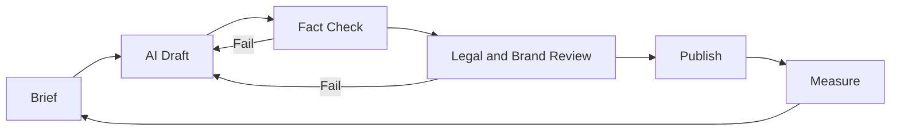

# AI 활용 Workflow · 리스크

Marketing은 생성형 AI가 가장 널리 쓰이는 업무 영역 중 하나다. McKinsey의 State of AI 조사(2025-03)는 조직이 생성형 AI를 가장 많이 쓰는 기능으로 Marketing and Sales를 꼽았다. 반면 IAB의 State of Data 2025(2025-03)는 미디어 캠페인 전 과정에 AI를 완전히 통합한 에이전시·브랜드·퍼블리셔가 30%에 그친다고 보고했다. 즉 도입은 넓지만 깊이는 아직 제각각이다. 중요한 것은 **어디에 쓰고, 어디서 사람이 확인하는가**다.

## 쓰임새 지도

| 업무 | AI 활용 예 | 사람이 반드시 할 일 |
|---|---|---|
| 리서치 | 인터뷰 녹취 요약, 리뷰·문의 분류 | 원문 확인, 편향 점검 |
| Positioning·Message | 표현 후보 생성, 경쟁사 메시지 정리 | 선택과 책임, 근거 확인 |
| Content | 초안, 번역, 요약, 변형 | 사실 확인, 고유한 경험 추가 |
| Creative | 광고 이미지·영상 변형 | 권리 확인, 표시 의무 확인 |
| Paid | 자동 입찰·타깃·소재 조합 (플랫폼 내장) | 전환 정의, 예산 상한, 브랜드 안전 |
| Lifecycle | 세그먼트별 문구 개인화 | 동의 범위, 빈도 제한 |
| 분석 | 쿼리 작성, 데이터 요약, 이상치 탐지 | 계산 검증, 인과 해석 |
| 고객 응대 | FAQ 답변, 상담 요약 | 오답 시 책임, 사람 연결 경로 |

## 권장 Workflow



### Brief에 들어가야 할 것

```text
목표: 누구에게 무엇을 하게 할 것인가
Segment와 상황:
Positioning 요약과 금지 표현:
사용 가능한 사실과 수치 (출처 포함):
형식, 길이, 톤:
검토자:
```

AI에게 사실을 **만들게** 하지 말고, 검증된 사실을 **주고 표현만 맡긴다.**

## 주요 리스크

NIST의 Generative AI Profile(NIST AI 600-1, 2024-07-26)은 생성형 AI 고유 리스크로 Confabulation(그럴듯한 오답), 유해 콘텐츠, 개인정보, 정보 보안, 지식재산권 등을 정리했다. Marketing에서 자주 만나는 형태는 다음과 같다.

| 리스크 | Marketing에서의 모습 | 대응 |
|---|---|---|
| Confabulation | 없는 기능, 틀린 수치, 존재하지 않는 인용 | 사실 목록 제공, 출처 대조 |
| 개인정보 | 고객 데이터를 외부 도구에 입력 | 입력 금지 데이터 정의, 계약·설정 확인 |
| 권리 침해 | 타인의 저작물·초상·상표와 유사한 결과 | 사용 권리 확인, 유사성 점검 |
| 기만적 표현 | 실제 인물처럼 보이는 AI 인물, 가짜 후기 | 표시 의무 준수, 가짜 후기 금지 (09 문서) |
| 획일화 | 모두가 같은 도구로 비슷한 글 | 고유한 데이터·경험을 넣기 |
| 검색 품질 | 대량 자동 생성 페이지 | Google Spam Policy 위반 가능 (04 문서) |
| 자동화 과신 | 플랫폼 AI 캠페인을 검증 없이 확대 | Incrementality Test (06 문서) |

## 나쁜 예 / 좋은 예

나쁜 예:

> "우리 제품 장점 10개와 고객 후기 5개를 써줘"라고 요청해 결과를 그대로 게시한다.

좋은 예:

> 실제 고객 인터뷰 요약과 승인된 기능 목록을 주고 Landing Page 문구 후보 5개를 받는다. 마케터가 2개를 고르고, 제품팀이 기능 설명을 확인하고, 수치는 원 데이터와 대조한 뒤 A/B Test로 검증한다. 후기는 실제 고객 동의를 받은 원문만 쓴다.

## 도입 체크리스트

- 어떤 데이터를 AI 도구에 넣어도 되는지 정책이 있는가
- 도구의 데이터 보관·학습 사용 조건을 확인했는가
- 게시 전 사실 확인 책임자가 정해져 있는가
- AI 생성물 표시가 필요한 경우를 알고 있는가 (09 문서)
- 결과물의 효과를 사람이 만든 것과 같은 기준으로 측정하는가

## 흔한 실수

- 생산량 증가를 성과로 보고하기
- AI 답변을 사실 확인 없이 고객에게 노출하기
- 법무·브랜드 검토를 "AI가 썼으니" 생략하기
- 프롬프트와 결과를 기록하지 않아 문제 발생 시 추적 불가

## 참고 자료

- [The state of AI: How organizations are rewiring to capture value — McKinsey](https://www.mckinsey.com/capabilities/quantumblack/our-insights/the-state-of-ai-how-organizations-are-rewiring-to-capture-value) (2025-03, 접속 2026-09-28)
- [AI Risk Management Framework: Generative AI Profile (NIST AI 600-1) — NIST](https://www.nist.gov/publications/artificial-intelligence-risk-management-framework-generative-artificial-intelligence) (2024-07-26, 접속 2026-09-28)
- [Google Search's Guidance on Generative AI Content on Your Website — Google Search Central](https://developers.google.com/search/docs/fundamentals/using-gen-ai-content) (접속 2026-09-28)
- [Meta Advantage+ Creative — Meta for Business](https://www.facebook.com/business/ads/meta-advantage-plus/creative) (접속 2026-09-28)
- [State of Data 2025: The Now, The Near, and The Next Evolution of AI for Media Campaigns — IAB](https://www.iab.com/insights/2025-state-of-data-report/) (2025-03, 접속 2026-09-28)
