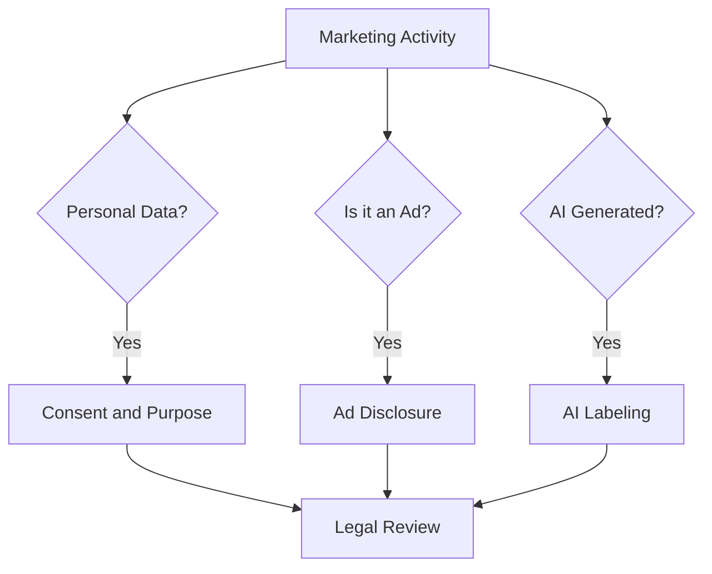

# 법 · 윤리 · 광고 표시

이 문서는 법률 자문이 아니다. **개발자·PO가 "이건 확인해야 한다"를 알아차리기 위한 지도**다. 실제 적용은 법무 검토와 최신 원문으로 확인한다.

## 세 가지 질문

1. **개인정보를 쓰는가?** → 수집·이용 동의, 목적 제한, 맞춤형 광고 동의
2. **광고인가?** → 광고 표시, 경제적 이해관계 표시, 수신 동의
3. **AI 생성물인가?** → AI 생성·가상인물 표시

## 한국: 광고성 정보 전송 (정보통신망법)

정보통신망법 제50조와 시행령은 전자적 전송매체(문자, 이메일, 앱 푸시 등)로 영리 목적 광고성 정보를 보낼 때의 규칙을 정한다.

| 요건 | 내용 |
|---|---|
| 사전 수신 동의 | 원칙적으로 수신자의 명시적 사전 동의 필요 |
| 야간 전송 | 오후 9시부터 다음 날 오전 8시까지는 별도의 사전 동의 필요 |
| 표시 의무 | 광고성 정보가 시작되는 부분에 "(광고)" 표시, 전송자 명칭·연락처, 수신 거부 방법 안내 |
| 거부·철회 | 수신 거부나 동의 철회 후에는 전송 금지 |
| 수신 동의 확인 | 동의를 받은 날부터 2년마다 수신 동의 여부를 확인 (시행령 제62조의3) |

나쁜 예:

> 회원가입 필수 약관에 마케팅 수신 동의를 묶고, 이벤트 푸시를 밤 10시에 보낸다.

좋은 예:

> 마케팅 수신 동의를 선택 항목으로 분리하고, 야간 발송은 별도 동의자에게만 보낸다. 모든 메시지 첫머리에 (광고)를 붙이고 수신 거부 경로를 넣는다.

## 한국: 개인정보와 맞춤형 광고 (개인정보 보호법)

- 개인정보 보호법 제22조는 재화·서비스 홍보나 판매 권유를 위해 개인정보 처리 동의를 받을 때 **정보주체가 명확하게 인지할 수 있도록 알리고** 동의를 받도록 한다. 선택 동의를 거부했다는 이유로 서비스 제공을 거부할 수 없다.
- 개인정보보호위원회는 2022-09 이용자 동의 없이 타사 행태정보를 수집·이용했다며 Google(692억 원)과 Meta(308억 원)에 과징금을 부과했고, 서울행정법원은 2025-01-23 이 처분이 정당하다고 판단했다.
- 개인정보보호위원회는 2024-01 「맞춤형 광고에 활용되는 온라인 행태정보 보호를 위한 정책 방안」을 발표하고 가이드라인 개정을 예고했다. 개정 가이드라인의 최종 확정 여부와 내용은 원문으로 다시 확인해야 한다.

## 한국: 추천·보증과 AI 가상인물 (공정거래위원회)

- 「추천·보증 등에 관한 표시·광고 심사지침」은 인플루언서·후기 등에서 금전 지원, 할인, 협찬 같은 **경제적 이해관계를 소비자가 쉽게 알 수 있게 표시**하도록 한다. 표시는 제목이나 첫 부분처럼 쉽게 보이는 위치에 해야 하며, 본문 중간·댓글·"더보기" 뒤에 숨기는 방식은 적절하지 않다고 본다.
- 공정위는 2026-04 행정예고를 거쳐 개정 지침을 2026-06-01부터 시행했다. 생성형 AI 등으로 만든 **가상인물이 추천·보증하는 광고에는 "가상인물"임을 명확히 표시**해야 한다.

## 한국: 인공지능 기본법

- 「인공지능 발전과 신뢰 기반 조성 등에 관한 기본법」은 2026-01-22 시행되었다.
- 생성형 AI 결과물임을 표시하는 의무가 포함되며, 딥페이크 결과물은 더 명확하게 표시해야 한다.
- 과학기술정보통신부는 과태료 계도기간을 최소 1년 이상 운영하겠다고 밝혔다. 구체적 기간과 방식은 원문으로 확인한다.

## EU

- **Consent**: EEA 사용자에 대해 Google 광고 측정·개인화 기능을 계속 쓰려면 동의를 받고 Consent Mode 신호를 전달해야 한다 (2024-03부터).
- **AI Act 제50조**: 2026-08-02부터 투명성 의무가 적용된다. 딥페이크를 배포하는 Deployer는 늦어도 처음 노출될 때 명확하게 알려야 한다. European Commission FAQ는 2026-08-02 이전에 출시된 시스템의 AI 생성물 Marking 의무에 한해 2026-12-02까지 제한적 유예를 언급한다.

## 미국

- FTC는 2023-06 Endorsement Guides를 개정해 소셜미디어·리뷰 환경의 추천·보증 규칙을 갱신했다.
- FTC의 소비자 리뷰·추천 규칙(Consumer Reviews and Testimonials Rule)은 2024-10-21 시행되었고, 존재하지 않는 사람의 후기(AI 생성 가짜 후기 포함)나 실제 경험이 없는 사람의 후기를 만들거나 판매하는 행위를 금지한다.

## 실무 체크리스트

- 마케팅 동의와 서비스 필수 동의가 분리되어 있는가
- 동의 기록(시점, 범위, 경로)이 남는가
- 광고 메시지 템플릿에 (광고), 발신자, 수신 거부가 기본 포함되는가
- 인플루언서·제휴 계약에 표시 의무가 명시되어 있는가
- AI 생성 인물·이미지·후기 사용 기준이 있는가
- 해외 사용자를 대상으로 하면 해당 국가 규칙을 확인했는가

## 윤리: 법보다 먼저 지킬 선

- 고객이 알면 불쾌할 방식으로 데이터를 쓰지 않는다
- 해지·수신 거부를 가입보다 어렵게 만들지 않는다 (Dark Pattern)
- 검증할 수 없는 수치·비교를 쓰지 않는다
- 취약한 사용자(미성년자 등)를 겨냥한 압박을 하지 않는다

## 참고 자료

- [Network Act Article 50 — Korea National Law Information Center](https://www.law.go.kr/%EB%B2%95%EB%A0%B9/%EC%A0%95%EB%B3%B4%ED%86%B5%EC%8B%A0%EB%A7%9D%EC%9D%B4%EC%9A%A9%EC%B4%89%EC%A7%84%EB%B0%8F%EC%A0%95%EB%B3%B4%EB%B3%B4%ED%98%B8%EB%93%B1%EC%97%90%EA%B4%80%ED%95%9C%EB%B2%95%EB%A5%A0/%EC%A0%9C50%EC%A1%B0) (접속 2026-09-28)
- [Network Act Enforcement Decree Article 62-3 — Korea National Law Information Center](https://www.law.go.kr/%EB%B2%95%EB%A0%B9/%EC%A0%95%EB%B3%B4%ED%86%B5%EC%8B%A0%EB%A7%9D%EC%9D%B4%EC%9A%A9%EC%B4%89%EC%A7%84%EB%B0%8F%EC%A0%95%EB%B3%B4%EB%B3%B4%ED%98%B8%EB%93%B1%EC%97%90%EA%B4%80%ED%95%9C%EB%B2%95%EB%A5%A0%EC%8B%9C%ED%96%89%EB%A0%B9/%EC%A0%9C62%EC%A1%B0%EC%9D%983) (접속 2026-09-28)
- [Personal Information Protection Act Article 22 — Korea National Law Information Center](https://www.law.go.kr/%EB%B2%95%EB%A0%B9/%EA%B0%9C%EC%9D%B8%EC%A0%95%EB%B3%B4%EB%B3%B4%ED%98%B8%EB%B2%95/%EC%A0%9C22%EC%A1%B0) (접속 2026-09-28)
- [PIPC fines Google and Meta for unlawful collection of behavioral data — Korea.kr](https://m.korea.kr/news/policyNewsView.do?newsId=148905887) (2022-09, 접속 2026-09-28)
- [PIPC wins administrative lawsuit by Google and Meta — Korea.kr](https://www.korea.kr/briefing/pressReleaseView.do?newsId=156671852) (2025-01, 접속 2026-09-28)
- [PIPC briefing on online behavioral advertising policy — Korea.kr](https://www.korea.kr/briefing/policyBriefingView.do?newsId=156613321) (2024-01, 접속 2026-09-28)
- [KFTC amended guidelines on endorsements and testimonials take effect — KFTC](https://www.ftc.go.kr/www/selectBbsNttView.do?pageUnit=10&pageIndex=1&searchCnd=all&key=12&bordCd=3&searchCtgry=01%2C02&nttSn=47547) (2026, 접속 2026-09-28)
- [AI Basic Act takes effect with labeling duty for generative AI output — Korea.kr](https://www.korea.kr/news/policyNewsView.do?newsId=148958380) (2026-01, 접속 2026-09-28)
- [Updates to consent mode for traffic in the EEA — Google Ads Help](https://support.google.com/google-ads/answer/13695607?hl=en) (접속 2026-09-28)
- [Transparency obligations under Article 50 of the AI Act — European Commission](https://digital-strategy.ec.europa.eu/en/faqs/transparency-obligations-under-article-50-ai-act) (접속 2026-09-28)
- [FTC Announces Updated Advertising Guides to Combat Deceptive Reviews and Endorsements — FTC](https://www.ftc.gov/news-events/news/press-releases/2023/06/federal-trade-commission-announces-updated-advertising-guides-combat-deceptive-reviews-endorsements) (2023-06, 접속 2026-09-28)
- [FTC Announces Final Rule Banning Fake Reviews and Testimonials — FTC](https://www.ftc.gov/news-events/news/press-releases/2024/08/federal-trade-commission-announces-final-rule-banning-fake-reviews-testimonials) (2024-08, 접속 2026-09-28)
- [The Consumer Reviews and Testimonials Rule: Questions and Answers — FTC](https://www.ftc.gov/business-guidance/resources/consumer-reviews-testimonials-rule-questions-answers) (접속 2026-09-28)
