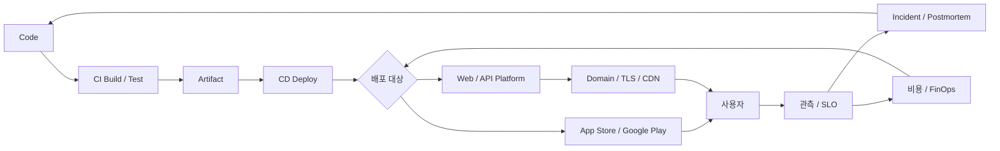

# Platform 배포와 서비스 전체 개요

기준일: 2026-09-28

코드를 "완성"하는 것과 사용자가 그 코드를 **매일 안정적으로 쓰는 것** 사이에는 긴 거리가 있다. 이 트랙은 그 거리를 구성하는 결정들을 한 장의 지도로 정리한다.

> Deployment는 코드를 실행 환경에 올리는 행위이고, Service는 그 결과를 약속한 품질로 계속 제공하는 일이다.

## 이 트랙이 답하는 질문

1. 어디에 올릴 것인가? (Static, PaaS, Container, Serverless, Cloud)
2. 어떻게 자동으로 올릴 것인가? (CI/CD)
3. 어떻게 위험을 줄이며 내보낼 것인가? (Canary, Feature Flag, Rollback)
4. 모바일 앱은 Store 심사와 정책을 어떻게 통과하는가?
5. 사용자는 어떤 주소와 경로로 도달하는가? (Domain, DNS, TLS, CDN)
6. 잘 돌아가는지 어떻게 아는가? (SLO, Observability, Incident)
7. 무엇이 들어 있고 누가 만들었는지 증명할 수 있는가? (Supply Chain)
8. 비용은 누가 보고 누가 줄이는가? (FinOps)
9. 여러 팀이 같은 길로 배포하게 하려면? (Platform Engineering)

## 전체 흐름



화살표가 다시 Code로 돌아온다는 점이 핵심이다. 배포는 한 번의 이벤트가 아니라 **관측과 개선이 반복되는 Loop**다.

## 문서 구성

| # | 문서 | 핵심 질문 |
|---|---|---|
| 01 | 배포 대상 고르기 | Static, Edge, PaaS, Serverless 중 무엇이 맞는가 |
| 02 | Cloud와 Kubernetes | AWS / Google Cloud / Azure / 국내 Cloud와 Container 운영 |
| 03 | CI/CD Pipeline | Commit부터 Production까지 무엇을 자동화하는가 |
| 04 | Release 전략 | Rolling, Blue-Green, Canary, Feature Flag, Rollback |
| 05 | 모바일 Store 배포 | App Store, Google Play 심사와 Testing Track, 2026 정책 |
| 06 | Domain · DNS · TLS · CDN | 사용자가 안전하고 빠르게 도달하는 경로 |
| 07 | Observability와 Incident | SLI/SLO, Error Budget, On-call, Postmortem |
| 08 | 보안과 Supply Chain | Secret, SBOM, SLSA, 의존성, 규제 |
| 09 | FinOps와 Platform Engineering | 비용 책임과 내부 개발자 Platform |
| 10 | 작은 팀 실전 가이드 | 1인·소규모 팀의 최소 구성 |

## 계층으로 보면

```text
사용자 경험    Store 심사, Domain, 응답 속도, 장애 공지
운영 품질      SLO, Monitoring, On-call, Postmortem
전달 흐름      CI/CD, Release 전략, Rollback
실행 환경      Static / PaaS / Container / Serverless / Cloud
신뢰 기반      Secret, SBOM, Provenance, 비용 통제
```

아래 계층이 흔들리면 위 계층의 노력은 쉽게 무너진다. 반대로 위 계층(사용자 경험)이 목표를 정해 주지 않으면 아래 계층은 과잉 설계가 되기 쉽다.

## 역할별 읽는 순서

| 역할 | 추천 순서 |
|---|---|
| 개발자 | 01 → 03 → 04 → 07 → 08 |
| PO / PM | 00 → 04 → 05 → 07 → 09 |
| 1인 개발자 | 10 → 01 → 06 → 05 |
| 운영 / Platform 담당 | 02 → 07 → 08 → 09 |

## 이 트랙의 작성 원칙

- 시점이 중요한 정보(정책 기한, 버전, 과금 모델)는 **확인 날짜와 출처**를 함께 적었다.
- 정확한 가격은 자주 바뀌므로 적지 않고 **과금 모델의 모양**만 설명한다.
- 도구 이름보다 **결정 기준**을 먼저 설명한다. 도구는 바뀌어도 질문은 남는다.
- 각 문서 끝의 참고 자료는 2026-09-28에 확인한 공식 문서·공식 블로그를 우선했다.

## 나쁜 예 / 좋은 예

```text
나쁜 예: "일단 Kubernetes로 가자. 나중에 어차피 필요해진다."
좋은 예: "지금 트래픽과 팀 규모에서는 PaaS로 시작한다.
         대신 Container Image로 build해 두어 이전 비용을 낮춘다."
```

```text
나쁜 예: "배포는 금요일 저녁에 한 번에 전부."
좋은 예: "작은 변경을 자주, 일부 사용자에게 먼저, 되돌리는 방법을 확인한 뒤."
```

## 한 문장 요약

좋은 배포 체계는 **자주 내보내도 무섭지 않은 상태**를 만든다. 속도와 안정성은 서로 빼앗는 관계가 아니라, 같은 습관(작은 변경, 자동화, 관측, 빠른 복구)에서 함께 나온다.

## 참고 자료

- [DORA's software delivery performance metrics](https://dora.dev/guides/dora-metrics/) — DORA, 접근일 2026-09-28
- [Service Level Objectives (Site Reliability Engineering)](https://sre.google/sre-book/service-level-objectives/) — Google SRE Book, 접근일 2026-09-28
- [CNCF Platforms White Paper](https://tag-app-delivery.cncf.io/whitepapers/platforms/) — CNCF TAG App Delivery, 2023-04 발행, 접근일 2026-09-28
