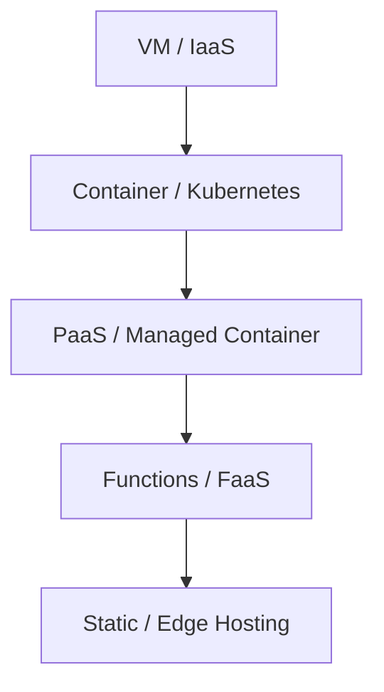
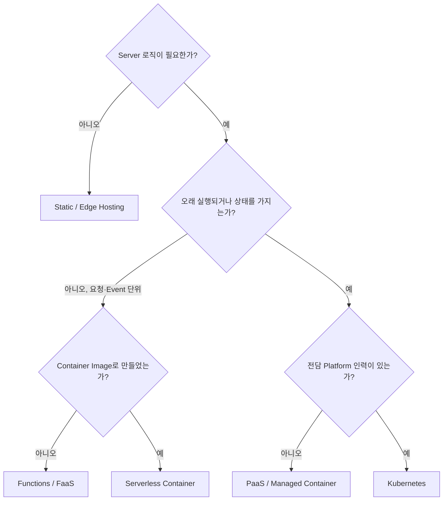

# 배포 대상 고르기: Static부터 Serverless까지

"어디에 올릴까?"는 기술 취향이 아니라 **운영 부담을 누가 질 것인가**에 대한 결정이다.

## 추상화 사다리



- 아래로 내려갈수록 **직접 관리할 것**(OS, Patch, Scaling, Load Balancer)이 줄어든다.
- 대신 **제약**(실행 시간, 언어, Network, 상태 저장 방식)이 늘어난다.
- 좋은 선택은 "가장 강력한 것"이 아니라 **요구사항을 만족하는 가장 아래 칸**이다.

## 유형별 비교

| 유형 | 예시 | 잘 맞는 경우 | 주의점 |
|---|---|---|---|
| Static / Edge | GitHub Pages, Cloudflare Workers Static Assets, Netlify, Vercel | 문서, Landing Page, SPA | Server 로직은 없거나 Edge Function으로 제한 |
| PaaS | Heroku, Azure App Service | 표준 Web App, 빠른 시작 | 제공사 로드맵에 종속 |
| Managed / Serverless Container | Google Cloud Run, Azure Container Apps, Amazon ECS Express Mode | Container Image가 있는 API | Cold Start, 요청 시간 제한 |
| Functions (FaaS) | AWS Lambda, Cloud Run functions, Azure Functions | Event 처리, 짧은 작업 | 실행 시간·메모리 제한, 상태 없음 |
| Kubernetes | Amazon EKS, GKE, AKS, 국내 NKS | 다수 Service, 전담 운영 인력 | 학습·운영 비용이 크다 |
| VM | Amazon EC2, Compute Engine, Azure VM | 특수 Software, 완전한 통제 | Patch와 장애 대응이 전부 내 몫 |

## 선택 흐름



## 주요 Hosting Platform 현황 (2026-09-28 확인)

| Platform | 확인한 사실 |
|---|---|
| GitHub Pages | 게시 사이트 최대 1 GB, 월 100 GB soft bandwidth limit, 시간당 10회 soft build limit (Custom GitHub Actions Workflow로 게시하면 build limit 미적용) |
| Vercel | Hobby 플랜은 개인·비상업 용도 한정이며 상한 초과 구매 불가. Pro는 포함 Credit + 초과분 종량제. Functions는 Fluid compute의 Active CPU 과금(코드가 실제로 CPU를 쓰는 시간만 과금, 메모리는 별도) |
| Netlify | 2025-09-04 이후 신규 계정은 Credit 기반 요금제. Production Deploy, Compute, Bandwidth, Web Request 등이 Credit을 소모. 이전 계정은 Legacy 플랜 유지 가능 |
| Cloudflare | 신규 프로젝트는 Pages 대신 Workers 사용 권장(Pages는 계속 동작하나 새 기능은 Workers 중심). Workers는 Request + CPU Time 과금, Egress 과금 없음, Static Asset 요청은 무료·무제한 |
| Heroku | 2026-02-06 Heroku(Salesforce)가 공식 Blog에서 "Sustaining Engineering" 모델 전환 발표. 보안·안정성 유지는 계속하나 신규 기능 개발 중단, 신규 Enterprise 계약 중단 |
| AWS App Runner | 2026-04-30부터 신규 고객을 받지 않음. 기존 고객은 계속 사용 가능하나 신규 기능 계획 없음. AWS는 Amazon ECS Express Mode를 대안으로 권장 |

> 교훈: Platform도 **수명 주기**가 있다. "지금 편한가"와 함께 "3년 뒤에도 이 Platform이 성장하고 있는가"를 확인한다.

## Serverless 과금 모델의 모양

정확한 단가는 바뀌지만 **무엇에 돈을 내는지**는 잘 바뀌지 않는다.

| 서비스 | 과금 단위 | 특징 |
|---|---|---|
| AWS Lambda | 요청 수 + 실행 시간(할당 메모리 × 시간, GB-second) | 2020-12부터 1ms 단위 과금 |
| Google Cloud Run | Request-based(기본) 또는 Instance-based | 요청이 들쭉날쭉하면 Request-based, 꾸준하면 Instance-based 권장. 요청이 없으면 0으로 축소 |
| Azure Container Apps | 실행 중 자원 사용량 | KEDA 기반 Autoscale, 대부분 0까지 축소 가능, 0일 때 사용량 과금 없음 |
| Vercel Functions | Active CPU + Provisioned Memory | I/O 대기 시간에는 CPU 과금이 멈춘다 |
| Cloudflare Workers | Request + CPU Time | 외부 호출을 기다리는 시간은 CPU Time에 포함되지 않음 |

Scale to Zero는 비용을 줄이지만, 첫 요청이 Instance 시작을 기다리는 **Cold Start**가 생길 수 있다. 응답 지연이 중요한 API라면 최소 Instance 설정 비용과 비교한다.

## 나쁜 예 / 좋은 예

```text
나쁜 예: 사내 문서 사이트를 위해 VM을 띄우고 Nginx, 인증서, OS Patch를 직접 관리한다.
좋은 예: 문서 사이트는 Static Hosting에 올리고, 운영 시간은 제품 기능에 쓴다.
```

```text
나쁜 예: 상업 서비스를 비상업 전용 무료 플랜에 올려 두고 약관을 확인하지 않는다.
좋은 예: 매출이 생기기 전에 플랜 약관, 상한, 초과 과금 방식을 확인한다.
```

## 선택 Checklist

- [ ] 상업적 사용이 허용되는 플랜인가?
- [ ] 과금 단위(요청, CPU 시간, Bandwidth, Credit) 중 내 Traffic에서 무엇이 커지는가?
- [ ] 제공사가 기능 동결이나 신규 고객 중단을 발표하지 않았는가?
- [ ] Container Image나 표준 Build 결과물로 남겨 **이전 경로**를 확보했는가?
- [ ] 사용자와 데이터가 있는 지역에 Region 또는 Edge가 있는가?
- [ ] 장애 시 Status Page와 지원 창구가 있는가?

## 참고 자료

- [GitHub Pages limits](https://docs.github.com/en/pages/getting-started-with-github-pages/github-pages-limits) — GitHub Docs, 접근일 2026-09-28
- [Vercel Hobby Plan](https://vercel.com/docs/plans/hobby) — Vercel Docs, 접근일 2026-09-28
- [Fluid compute pricing](https://vercel.com/docs/functions/usage-and-pricing) — Vercel Docs, 접근일 2026-09-28
- [Netlify pricing update: Introducing credit-based plans](https://www.netlify.com/changelog/netlify-pricing-update-introducing-credit-based-plans/) — Netlify Changelog, 2025-09, 접근일 2026-09-28
- [Migrate from Pages to Workers](https://developers.cloudflare.com/workers/static-assets/migration-guides/migrate-from-pages/) — Cloudflare Docs, 접근일 2026-09-28
- [Cloudflare Workers Pricing](https://developers.cloudflare.com/workers/platform/pricing/) — Cloudflare Docs, 접근일 2026-09-28
- [An Update on Heroku](https://www.heroku.com/blog/an-update-on-heroku/) — Heroku Blog, 2026-02-06, 접근일 2026-09-28
- [Salesforce Freezes Heroku Feature Development](https://devops.com/salesforce-freezes-heroku-feature-development-signals-long-term-shift/) — DevOps.com, 2026-02, 접근일 2026-09-28
- [AWS App Runner availability change](https://docs.aws.amazon.com/apprunner/latest/dg/apprunner-availability-change.html) — AWS Docs, 접근일 2026-09-28
- [Announcing Amazon ECS Express Mode](https://aws.amazon.com/about-aws/whats-new/2025/11/announcing-amazon-ecs-express-mode/) — AWS, 2025-11, 접근일 2026-09-28
- [AWS Lambda Pricing](https://aws.amazon.com/lambda/pricing/) — AWS, 접근일 2026-09-28
- [New for AWS Lambda – 1ms Billing Granularity](https://aws.amazon.com/blogs/aws/new-for-aws-lambda-1ms-billing-granularity-adds-cost-savings/) — AWS News Blog, 2020-12, 접근일 2026-09-28
- [Cloud Run billing settings for services](https://docs.cloud.google.com/run/docs/configuring/billing-settings) — Google Cloud Docs, 접근일 2026-09-28
- [Scaling in Azure Container Apps](https://learn.microsoft.com/en-us/azure/container-apps/scale-app) — Microsoft Learn, 접근일 2026-09-28
