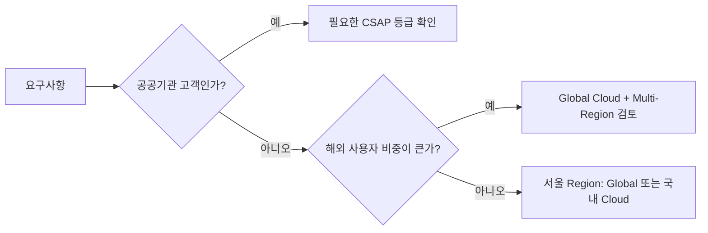

# Cloud와 Kubernetes: AWS · Google Cloud · Azure · 국내 Cloud

3대 Cloud는 서비스 이름은 다르지만 **같은 문제를 푸는 같은 모양의 부품**을 가지고 있다. 이름을 외우기보다 대응 관계를 먼저 잡는다.

## 3대 Cloud 대응표

| 영역 | AWS | Google Cloud | Azure |
|---|---|---|---|
| VM | Amazon EC2 | Compute Engine | Azure Virtual Machines |
| Managed Kubernetes | Amazon EKS | GKE | AKS |
| Serverless Container | Amazon ECS (Express Mode, Fargate) | Cloud Run | Azure Container Apps |
| Functions | AWS Lambda | Cloud Run functions | Azure Functions |
| Object Storage | Amazon S3 | Cloud Storage | Azure Blob Storage |
| 서울 Region | ap-northeast-2 | asia-northeast3 | Korea Central |

- Google Cloud의 Cloud Functions는 **Cloud Run functions**로 이름이 바뀌고 Cloud Run 기반으로 통합되었다.
- 세 Cloud 모두 서울 Region을 운영한다. 국내 사용자 대상이면 지연 시간과 데이터 위치 측면에서 먼저 검토한다.

### 고르는 기준

- **팀의 경험**: 이미 운영해 본 Cloud가 있다면 그것이 가장 큰 할인이다. IAM · Network · 과금 모델을 새로 배우는 비용은 생각보다 크다.
- **필요한 Managed Service**: 쓰려는 DB, Queue, Data 분석, AI 서비스가 어느 Cloud에 Managed로 있는지, 서울 Region에서도 제공되는지 목록부터 만든다.
- **Startup Credit**: AWS Activate, Google for Startups Cloud Program, Microsoft for Startups가 Credit을 준다. 조건과 금액은 자주 바뀌므로 신청 시점에 확인하고, **Credit이 끝난 뒤의 청구서**로 판단한다.
- **Region과 Compliance**: 서울 Region 여부, 필요한 인증(공공은 CSAP, 금융권은 별도 기준), 데이터 국외 이전 조건을 확인한다.
- **Egress와 Lock-in**: 밖으로 나가는 데이터 전송(Egress) 요금은 구조에 따라 청구서의 큰 부분이 된다. 한 Cloud 전용 기능을 많이 쓸수록 이전 비용이 커지므로 Container, IaC, OpenTelemetry처럼 옮길 수 있는 층을 남겨 둔다.

## 설계 기준: Well-Architected

AWS Well-Architected Framework는 6개 Pillar로 설계를 점검한다.

| Pillar | 질문 |
|---|---|
| Operational Excellence | 운영하고 관측하고 개선할 수 있는가 |
| Security | 정보, 시스템, 자산을 보호하는가 |
| Reliability | 장애에서 회복하고 수요 변화에 대응하는가 |
| Performance Efficiency | 자원을 효율적으로 쓰는가 |
| Cost Optimization | 비용 대비 가치가 최대인가 |
| Sustainability | 에너지와 자원 사용을 줄이는가 |

Pillar 사이에는 **Trade-off**가 있다. 예를 들어 Multi-Region은 Reliability를 올리지만 Cost와 운영 복잡도를 올린다. Google Cloud와 Azure도 비슷한 Architecture Framework를 제공한다.

## 국내 Cloud와 공공 시장

| 사업자 | 확인한 내용 |
|---|---|
| 네이버클라우드 | Ncloud Kubernetes Service. SourceCommit · SourceBuild · SourceDeploy · SourcePipeline으로 CI/CD 구성 가능 |
| NHN Cloud | NHN Kubernetes Service(NKS), Deploy 서비스. 2022-12 공공기관용 NHN Cloud CSAP 인증 취득(자사 안내) |
| KT Cloud | 네이버클라우드·NHN Cloud와 함께 국내 공공 Cloud '빅3'로 보도(2024-02). 2026-03 자체 개발한 'kt cloud PLATFORM'(Kubernetes 기반으로 OpenStack 재구성)의 CSAP 인증 획득 보도 |
| 카카오클라우드 | 카카오엔터프라이즈 운영. Managed Kubernetes인 Kubernetes Engine 제공. 전신 '카카오 i 클라우드'가 Kubernetes 기반 IaaS로 CSAP 사후심사를 통과했다고 2022-06 보도 |

**CSAP(클라우드 서비스 보안인증)** 은 「클라우드컴퓨팅 발전 및 이용자 보호에 관한 법률」에 근거해 공공기관에 공급되는 Cloud의 정보보호 기준 준수를 인증하는 제도다.

- 2023-01 등급제(상·중·하) 도입: 이용기관 특성과 시스템 중요도에 따라 평가 기준을 차등 적용
- 하 등급: 개인정보가 없는 공개 공공 데이터를 다루는 시스템 등에 사용
- 보도 기준 Microsoft(2024-12), Google Cloud(2025-02), AWS(2025-04)가 하 등급을 획득
- 2026-04-20 과학기술정보통신부와 국가정보원은 공공 Cloud 보안 검증을 **국정원 단일 체계로 일원화**하고 CSAP를 폐지하는 개편을 발표했다. 보도 기준 시행은 2027-07이며, 개편 전에 CSAP 인증을 받은 제품은 남은 인증 유효기간을 그대로 인정받는다(보도 기준). 공공 사업은 계약 시점에 적용되는 기준을 발주처와 확인한다.



## Container: 한 번 Build, 여러 번 배포

Container Image는 실행 환경까지 묶은 **불변 Artifact**다. 같은 Image를 Dev → Staging → Production으로 승격하면 "내 PC에서는 됐는데" 문제가 줄어든다.

```dockerfile
FROM node:22-slim
WORKDIR /app
COPY package*.json ./
RUN npm ci --omit=dev
COPY . .
USER node
CMD ["node", "server.js"]
```

- 운영 Image에는 개발 의존성을 넣지 않는다.
- root가 아닌 사용자로 실행한다.
- Tag보다 **Digest**(sha256)로 배포하면 "같은 이름, 다른 내용" 사고를 막는다.

Dockerfile 옆에 `.dockerignore`를 둔다.

```text
node_modules
.env
.git
```

`COPY . .`는 Build Context 전체를 Image에 넣는다. `.dockerignore`가 없으면 로컬 `node_modules`가 `npm ci` 결과를 덮어써 운영 Image에 다른 의존성이 들어가고, `.env`의 Secret과 `.git` 이력이 Image Layer에 그대로 남는다. Build Context가 작아져 Build도 빨라진다.

## Kubernetes 핵심 개념

| 개념 | 역할 |
|---|---|
| Pod | Container 실행 단위 |
| Deployment | 원하는 Pod 수와 버전, Rolling Update 관리 |
| Service | Pod 묶음에 안정적인 내부 주소 제공 |
| Ingress / Gateway API | 외부 HTTP Traffic을 Service로 연결 |
| ConfigMap / Secret | 설정과 민감 정보 주입 |
| HorizontalPodAutoscaler | 부하에 따라 Pod 수 조절 |

### 최소 Manifest: Deployment + Service

```yaml
apiVersion: apps/v1
kind: Deployment
metadata:
  name: web
spec:
  replicas: 2
  selector:
    matchLabels:
      app: web
  template:
    metadata:
      labels:
        app: web
    spec:
      containers:
        - name: web
          image: registry.example.com/web@sha256:<digest>
          ports:
            - containerPort: 8080
          readinessProbe:
            httpGet:
              path: /healthz/ready
              port: 8080
            periodSeconds: 5
          livenessProbe:
            httpGet:
              path: /healthz/live
              port: 8080
            initialDelaySeconds: 10
            periodSeconds: 10
          resources:
            requests:
              cpu: 250m
              memory: 256Mi
            limits:
              memory: 512Mi
---
apiVersion: v1
kind: Service
metadata:
  name: web
spec:
  selector:
    app: web
  ports:
    - port: 80
      targetPort: 8080
```

- **readinessProbe**: 통과해야 Service가 이 Pod로 Traffic을 보낸다. 준비 상태(DB 연결, Cache 준비)를 본다.
- **livenessProbe**: 실패하면 Container를 재시작한다. 프로세스가 멈췄는지만 본다. 외부 DB까지 검사하면 DB 장애 때 모든 Pod가 함께 재시작된다.
- **resources.requests**: Scheduler가 이 값으로 Pod를 놓을 Node를 고른다.

| 빠뜨린 것 | 일어나는 일 |
|---|---|
| readinessProbe 없음 | Container가 시작되자마자 Ready로 간주된다. 아직 초기화 중인 Pod로 Traffic이 가서 Rolling Update 때마다 Error가 튄다 |
| resources.requests 없음 | Scheduler가 필요한 자원을 모른 채 한 Node에 Pod를 몰아넣는다. Node 자원이 부족해지면 사용량이 요청량을 넘는 Pod부터 Evict되는데, 요청량이 0인 Pod(BestEffort)가 가장 먼저 대상이 된다 |
| replicas: 1 | 그 Pod가 재시작 · Evict되거나 Node를 비울(Drain) 때마다 받아 줄 Pod가 없다. Rollout도 새 Pod 하나의 Readiness에만 기대므로 Probe가 부정확하면 곧바로 중단이다 |

## Kubernetes 버전과 수명 (2026-09-28 기준)

- 최신 Minor는 **v1.37**(2026-08-26 출시). 프로젝트는 최근 3개 Minor(1.37, 1.36, 1.35)의 Release Branch를 유지한다.
- 각 Minor의 Patch 지원은 **약 14개월**이다. 즉 **1년에 한 번 이상 Upgrade**는 운영 비용에 포함해야 한다.
- Managed Kubernetes(EKS, GKE, AKS, NKS)는 각자 지원 일정을 따로 공지하므로 제공사 문서를 확인한다.

### Ingress NGINX 은퇴

Kubernetes 프로젝트는 널리 쓰이던 **Ingress NGINX** Controller의 은퇴를 2025-11에 발표했다. Best-effort 유지보수는 2026-03까지였고, 이후에는 Release, Bugfix, 보안 수정이 없다. 권장 경로는 **Gateway API** 또는 다른 Ingress Controller로의 이전이며, 변환 도구 Ingress2Gateway 1.0이 2026-03에 나왔다.

## 나쁜 예 / 좋은 예

```text
나쁜 예: Service 2개, 개발자 3명인데 Kubernetes Cluster를 직접 구성하고
        Upgrade 계획 없이 2년째 같은 버전을 쓴다.
좋은 예: Serverless Container로 시작하고, Service 수·Traffic·팀이 커져
        공통 운영이 필요해질 때 Managed Kubernetes로 옮긴다.
```

## Kubernetes가 필요해지는 신호

- 독립 배포되는 Service가 많고 공통 Network·보안 정책이 필요하다.
- Batch, GPU, Stateful Workload 등 Serverless 제약을 자주 넘는다.
- Cluster Upgrade와 장애 대응을 맡을 **전담 인력**이 있다.

## 참고 자료

- [The pillars of the framework - AWS Well-Architected Framework](https://docs.aws.amazon.com/wellarchitected/latest/framework/the-pillars-of-the-framework.html) — AWS Docs, 접근일 2026-09-28
- [Google Cloud Functions is now Cloud Run functions](https://cloud.google.com/blog/products/serverless/google-cloud-functions-is-now-cloud-run-functions) — Google Cloud Blog, 접근일 2026-09-28
- [AWS Regions and Availability Zones](https://docs.aws.amazon.com/global-infrastructure/latest/regions/aws-regions.html) — AWS Docs, 접근일 2026-09-28
- [Kubernetes Service - NAVER Cloud Platform](https://www.ncloud.com/product/containers/nks) — 네이버클라우드, 접근일 2026-09-28
- [SourceDeploy: Create and manage deployment scenarios](https://guide.ncloud-docs.com/docs/en/sourcedeploy-use-scenario) — NAVER Cloud Docs, 접근일 2026-09-28
- [NHN Kubernetes Service(NKS) 사용 가이드](https://docs.nhncloud.com/ko/Container/NKS/ko/user-guide/) — NHN Cloud Docs, 접근일 2026-09-28
- [NHN Cloud 인증 소개](https://www.nhncloud.com/kr/certification?lang=ko) — NHN Cloud, 접근일 2026-09-28
- [클라우드서비스 보안인증(CSAP)](https://www.kisa.or.kr/1050603) — KISA, 접근일 2026-09-28
- [구글·MS 이어 AWS도 CSAP 하 등급 획득](https://zdnet.co.kr/view/?no=20250401173707) — ZDNet Korea, 2025-04-01, 접근일 2026-09-28
- [Releases](https://kubernetes.io/releases/) — Kubernetes, 접근일 2026-09-28
- [Kubernetes v1.37 release](https://kubernetes.io/blog/2026/08/26/kubernetes-v1-37-release/) — Kubernetes Blog, 2026-08-26, 접근일 2026-09-28
- [Ingress NGINX Retirement: What You Need to Know](https://kubernetes.io/blog/2025/11/11/ingress-nginx-retirement/) — Kubernetes Blog, 2025-11-11, 접근일 2026-09-28
- [Announcing Ingress2Gateway 1.0](https://kubernetes.io/blog/2026/03/20/ingress2gateway-1-0-release/) — Kubernetes Blog, 2026-03-20, 접근일 2026-09-28
- [Configure Liveness, Readiness and Startup Probes](https://kubernetes.io/docs/tasks/configure-pod-container/configure-liveness-readiness-startup-probes/) — Kubernetes Docs, 접근일 2026-09-28
- [Resource Management for Pods and Containers](https://kubernetes.io/docs/concepts/configuration/manage-resources-containers/) — Kubernetes Docs, 접근일 2026-09-28
- [Node-pressure Eviction](https://kubernetes.io/docs/concepts/scheduling-eviction/node-pressure-eviction/) — Kubernetes Docs, 접근일 2026-09-28
- [Build context: .dockerignore files](https://docs.docker.com/build/concepts/context/#dockerignore-files) — Docker Docs, 접근일 2026-09-28
- [AWS Activate Credits](https://aws.amazon.com/startups/lp/aws-activate-credits) — AWS, 접근일 2026-09-28
- [Google for Startups Cloud Program](https://cloud.google.com/startup) — Google Cloud, 접근일 2026-09-28
- [Microsoft for Startups](https://www.microsoft.com/en-us/startups) — Microsoft, 접근일 2026-09-28
- [KT·네이버·NHN, 공공 클라우드 '불꽃 경쟁'](https://zdnet.co.kr/view/?no=20240219151548) — ZDNet Korea, 2024-02-19, 접근일 2026-09-28
- [KT클라우드, 자체 플랫폼 CSAP 인증 획득…공공시장 공략 본격화](https://view.asiae.co.kr/article/2026033010085798928) — 아시아경제, 2026-03-30, 접근일 2026-09-28
- [카카오엔터프라이즈, 쿠버네티스 기반 클라우드로 CSAP 획득](https://zdnet.co.kr/view/?no=20220630091430) — ZDNet Korea, 2022-06-30, 접근일 2026-09-28
- [Kubernetes Engine](https://docs.kakaocloud.com/en/service/container-pack/k8se) — KakaoCloud Docs, 접근일 2026-09-28
- [공공클라우드 인증, 국정원으로 단일화...CSAP 10년만에 해체](https://zdnet.co.kr/view/?no=20260420130424) — ZDNet Korea, 2026-04-20, 접근일 2026-09-28
- [공공 클라우드 문턱 낮춘다…CSAP 폐지하고 국정원으로 통합](https://www.mt.co.kr/tech/2026/04/20/2026042010255865866) — 머니투데이, 2026-04-20, 접근일 2026-09-28
