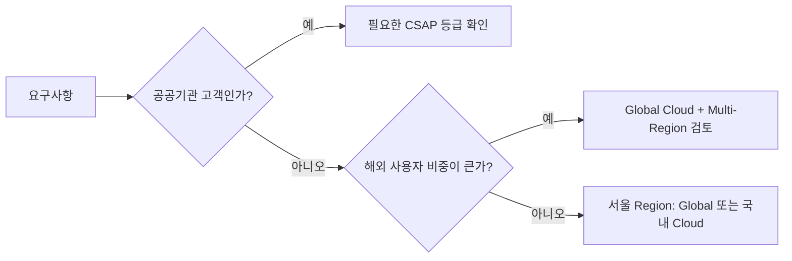

# Cloud와 Kubernetes: AWS · Google Cloud · Azure · 국내 Cloud

3대 Cloud는 서비스 이름은 다르지만 **같은 문제를 푸는 같은 모양의 부품**을 가지고 있다. 이름을 외우기보다 대응 관계를 먼저 잡는다.

## 3대 Cloud 대응표

| 영역 | AWS | Google Cloud | Azure |
|---|---|---|---|
| VM | Amazon EC2 | Compute Engine | Azure Virtual Machines |
| Managed Kubernetes | Amazon EKS | GKE | AKS |
| Serverless Container | Amazon ECS (Express Mode, Fargate) | Cloud Run | Azure Container Apps |
| Functions | AWS Lambda | Cloud Run functions | Azure Functions |
| Object Storage | Amazon S3 | Cloud Storage | Azure Blob Storage |
| 서울 Region | ap-northeast-2 | asia-northeast3 | Korea Central |

- Google Cloud의 Cloud Functions는 **Cloud Run functions**로 이름이 바뀌고 Cloud Run 기반으로 통합되었다.
- 세 Cloud 모두 서울 Region을 운영한다. 국내 사용자 대상이면 지연 시간과 데이터 위치 측면에서 먼저 검토한다.

## 설계 기준: Well-Architected

AWS Well-Architected Framework는 6개 Pillar로 설계를 점검한다.

| Pillar | 질문 |
|---|---|
| Operational Excellence | 운영하고 관측하고 개선할 수 있는가 |
| Security | 정보, 시스템, 자산을 보호하는가 |
| Reliability | 장애에서 회복하고 수요 변화에 대응하는가 |
| Performance Efficiency | 자원을 효율적으로 쓰는가 |
| Cost Optimization | 비용 대비 가치가 최대인가 |
| Sustainability | 에너지와 자원 사용을 줄이는가 |

Pillar 사이에는 **Trade-off**가 있다. 예를 들어 Multi-Region은 Reliability를 올리지만 Cost와 운영 복잡도를 올린다. Google Cloud와 Azure도 비슷한 Architecture Framework를 제공한다.

## 국내 Cloud와 공공 시장

| 사업자 | 확인한 내용 |
|---|---|
| 네이버클라우드 | Ncloud Kubernetes Service. SourceCommit · SourceBuild · SourceDeploy · SourcePipeline으로 CI/CD 구성 가능 |
| NHN Cloud | NHN Kubernetes Service(NKS), Deploy 서비스. 2022-12 공공기관용 NHN Cloud CSAP 인증 취득(자사 안내) |
| KT Cloud | 네이버클라우드·NHN Cloud와 함께 국내 공공 Cloud 시장의 주요 사업자로 보도됨 |

**CSAP(클라우드 서비스 보안인증)** 은 「클라우드컴퓨팅 발전 및 이용자 보호에 관한 법률」에 근거해 공공기관에 공급되는 Cloud의 정보보호 기준 준수를 인증하는 제도다.

- 2023-01 등급제(상·중·하) 도입: 이용기관 특성과 시스템 중요도에 따라 평가 기준을 차등 적용
- 하 등급: 개인정보가 없는 공개 공공 데이터를 다루는 시스템 등에 사용
- 보도 기준 Microsoft(2024-12), Google Cloud(2025-02), AWS(2025-04)가 하 등급을 획득



## Container: 한 번 Build, 여러 번 배포

Container Image는 실행 환경까지 묶은 **불변 Artifact**다. 같은 Image를 Dev → Staging → Production으로 승격하면 "내 PC에서는 됐는데" 문제가 줄어든다.

```dockerfile
FROM node:22-slim
WORKDIR /app
COPY package*.json ./
RUN npm ci --omit=dev
COPY . .
USER node
CMD ["node", "server.js"]
```

- 운영 Image에는 개발 의존성을 넣지 않는다.
- root가 아닌 사용자로 실행한다.
- Tag보다 **Digest**(sha256)로 배포하면 "같은 이름, 다른 내용" 사고를 막는다.

## Kubernetes 핵심 개념

| 개념 | 역할 |
|---|---|
| Pod | Container 실행 단위 |
| Deployment | 원하는 Pod 수와 버전, Rolling Update 관리 |
| Service | Pod 묶음에 안정적인 내부 주소 제공 |
| Ingress / Gateway API | 외부 HTTP Traffic을 Service로 연결 |
| ConfigMap / Secret | 설정과 민감 정보 주입 |
| HorizontalPodAutoscaler | 부하에 따라 Pod 수 조절 |

## Kubernetes 버전과 수명 (2026-09-28 기준)

- 최신 Minor는 **v1.37**(2026-08-26 출시). 프로젝트는 최근 3개 Minor(1.37, 1.36, 1.35)의 Release Branch를 유지한다.
- 각 Minor의 Patch 지원은 **약 14개월**이다. 즉 **1년에 한 번 이상 Upgrade**는 운영 비용에 포함해야 한다.
- Managed Kubernetes(EKS, GKE, AKS, NKS)는 각자 지원 일정을 따로 공지하므로 제공사 문서를 확인한다.

### Ingress NGINX 은퇴

Kubernetes 프로젝트는 널리 쓰이던 **Ingress NGINX** Controller의 은퇴를 2025-11에 발표했다. Best-effort 유지보수는 2026-03까지였고, 이후에는 Release, Bugfix, 보안 수정이 없다. 권장 경로는 **Gateway API** 또는 다른 Ingress Controller로의 이전이며, 변환 도구 Ingress2Gateway 1.0이 2026-03에 나왔다.

## 나쁜 예 / 좋은 예

```text
나쁜 예: Service 2개, 개발자 3명인데 Kubernetes Cluster를 직접 구성하고
        Upgrade 계획 없이 2년째 같은 버전을 쓴다.
좋은 예: Serverless Container로 시작하고, Service 수·Traffic·팀이 커져
        공통 운영이 필요해질 때 Managed Kubernetes로 옮긴다.
```

## Kubernetes가 필요해지는 신호

- 독립 배포되는 Service가 많고 공통 Network·보안 정책이 필요하다.
- Batch, GPU, Stateful Workload 등 Serverless 제약을 자주 넘는다.
- Cluster Upgrade와 장애 대응을 맡을 **전담 인력**이 있다.

## 참고 자료

- [The pillars of the framework - AWS Well-Architected Framework](https://docs.aws.amazon.com/wellarchitected/latest/framework/the-pillars-of-the-framework.html) — AWS Docs, 접근일 2026-09-28
- [Google Cloud Functions is now Cloud Run functions](https://cloud.google.com/blog/products/serverless/google-cloud-functions-is-now-cloud-run-functions) — Google Cloud Blog, 접근일 2026-09-28
- [AWS Regions and Availability Zones](https://docs.aws.amazon.com/global-infrastructure/latest/regions/aws-regions.html) — AWS Docs, 접근일 2026-09-28
- [Kubernetes Service - NAVER Cloud Platform](https://www.ncloud.com/product/containers/nks) — 네이버클라우드, 접근일 2026-09-28
- [SourceDeploy: Create and manage deployment scenarios](https://guide.ncloud-docs.com/docs/en/sourcedeploy-use-scenario) — NAVER Cloud Docs, 접근일 2026-09-28
- [NHN Kubernetes Service(NKS) 사용 가이드](https://docs.nhncloud.com/ko/Container/NKS/ko/user-guide/) — NHN Cloud Docs, 접근일 2026-09-28
- [NHN Cloud 인증 소개](https://www.nhncloud.com/kr/certification?lang=ko) — NHN Cloud, 접근일 2026-09-28
- [클라우드서비스 보안인증(CSAP)](https://www.kisa.or.kr/1050603) — KISA, 접근일 2026-09-28
- [구글·MS 이어 AWS도 CSAP 하 등급 획득](https://zdnet.co.kr/view/?no=20250401173707) — ZDNet Korea, 2025-04-01, 접근일 2026-09-28
- [Releases](https://kubernetes.io/releases/) — Kubernetes, 접근일 2026-09-28
- [Kubernetes v1.37 release](https://kubernetes.io/blog/2026/08/26/kubernetes-v1-37-release/) — Kubernetes Blog, 2026-08-26, 접근일 2026-09-28
- [Ingress NGINX Retirement: What You Need to Know](https://kubernetes.io/blog/2025/11/11/ingress-nginx-retirement/) — Kubernetes Blog, 2025-11-11, 접근일 2026-09-28
- [Announcing Ingress2Gateway 1.0](https://kubernetes.io/blog/2026/03/20/ingress2gateway-1-0-release/) — Kubernetes Blog, 2026-03-20, 접근일 2026-09-28
