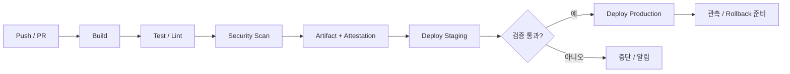
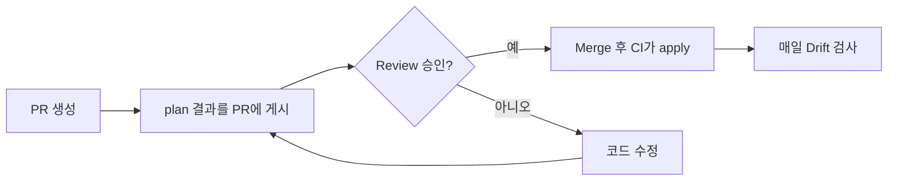

# CI/CD Pipeline: Commit에서 Production까지

CI/CD는 "자동으로 배포하는 Script"가 아니라 **변경이 Production에 도달하기까지의 품질 관문을 코드로 만든 것**이다.

## 용어 구분

| 용어 | 의미 |
|---|---|
| CI (Continuous Integration) | 변경을 자주 합치고, 합칠 때마다 Build와 Test를 자동 실행 |
| Continuous Delivery | 언제든 Production에 내보낼 수 있는 상태를 유지. 최종 배포는 사람이 승인할 수 있다 |
| Continuous Deployment | 관문을 통과한 변경이 사람 개입 없이 Production까지 배포 |
| Artifact | Build 결과물. Container Image, 앱 번들, 정적 파일 묶음 등 |
| Environment | Dev, Staging, Production처럼 Artifact가 실행되는 장소 |

## 표준 흐름



핵심 원칙은 **한 번 Build한 Artifact를 모든 Environment에 승격**하는 것이다. Environment마다 다시 Build하면 Staging에서 검증한 것과 Production에 나간 것이 달라질 수 있다.

## 설정은 코드 밖에

Twelve-Factor App은 배포마다 달라지는 값(DB 주소, 외부 서비스 자격 증명, Hostname 등)을 **코드가 아닌 Environment에 두라**고 권한다. 같은 Artifact가 Environment만 바꿔 여러 곳에서 돌 수 있어야 한다. 최근에는 Secret을 Volume으로 Mount하는 방식도 함께 논의된다.

## Environment 설계

| 항목 | Preview (PR마다) | Staging | Production |
|---|---|---|---|
| 목적 | 변경을 눈으로 확인하고 Review | 배포 절차 · Migration · 외부 연동 검증 | 실제 사용자 |
| Data | Seed 또는 가짜 Data | 합성 Data 또는 익명화한 일부 | 실제 Data |
| 누가 배포 | PR을 열면 자동 | main Merge 시 자동 | 승인 후 CI만 |
| 보호 규칙 | 짧은 수명, PR 종료 시 삭제, 결제 · 메일 · Push는 Sandbox | 사내 접근만 허용, Production Secret 없음 | 필수 Reviewer, 대기 시간, 배포 가능 Branch 제한 |

### Environment별 설정과 Secret

- 같은 Artifact에 Environment 변수만 바꿔 넣는다. Environment 이름으로 코드 분기(`if (env === "staging")`)를 늘리지 않는다.
- Secret은 Environment마다 따로 둔다. GitHub의 Environment Secret은 그 Environment를 참조하는 Job만 읽을 수 있고, 승인이 필요한 Environment라면 Reviewer가 승인하기 전에는 읽을 수 없다.
- 가능하면 Cloud 계정이나 Project도 나눈다. Staging의 실수가 Production Resource에 닿지 않는다.
- GitHub 요금제에 따라 Private Repository에서는 필수 Reviewer · 대기 시간 같은 보호 규칙을 쓸 수 없을 수 있다. 쓰기 전에 요금제별 제공 범위를 확인한다.

### Production 같은 Data의 함정

- Production DB를 그대로 복사하지 않는다. 개인정보가 보호 수준이 낮은 환경으로 옮겨진다. 필요하면 익명화 · 가명 처리한 최소한만 쓴다.
- 복사한 Data에 실제 이메일 · 전화번호가 남아 있으면 Staging의 알림 Test가 실제 고객에게 나간다. 외부 발송은 Sandbox 계정으로 막는다.

### 작은 팀이 Staging을 건너뛰어도 되는 조건

다음이 **모두** 참이면 Preview → Production으로 바로 가도 된다.

1. PR마다 Preview가 Production과 같은 Artifact · 설정 구조로 뜬다.
2. DB Migration이 Expand → Contract로 하위 호환된다(04 문서).
3. Rollback을 수 분 안에 할 수 있고 실제로 해 봤다.
4. 위험한 기능은 Feature Flag로 노출을 제어한다.

하나라도 아니면 Staging을 둔다. 특히 되돌릴 수 없는 Migration, 결제 · 인증 · 외부 연동 변경이 잦다면 필수다.

## GitHub Actions 예시

```yaml
name: deploy
on:
  push:
    branches: [main]
permissions:
  contents: read
  id-token: write
jobs:
  build-deploy:
    runs-on: ubuntu-latest
    environment: production
    steps:
      - uses: actions/checkout@<commit-sha>
      - run: npm ci && npm test
      - run: npm run build
      - run: ./scripts/deploy.sh
```

- `permissions`를 최소로 선언한다. `id-token: write`는 OIDC로 Cloud에 인증할 때만 필요하다.
- `environment: production`으로 보호 규칙(승인자, 대기 시간)을 걸 수 있다.
- 외부 Action은 Tag 대신 **Commit SHA로 고정**한다(아래 사고 사례 참고).

## 장기 Secret 대신 OIDC

GitHub Actions의 OpenID Connect를 쓰면 Workflow가 실행될 때마다 Cloud 제공사로부터 **짧은 수명의 Token**을 받는다. AWS, Azure, Google Cloud, HashiCorp Vault 등이 지원한다.

```text
나쁜 예: Cloud Access Key를 Repository Secret에 저장하고 몇 년째 교체하지 않는다.
좋은 예: OIDC Trust를 "이 Repository의 main Branch, production Environment"로 좁히고
        Job이 끝나면 만료되는 Token만 사용한다.
```

AWS 예시. Workflow 쪽에는 `id-token: write`와 Role만 있고 Access Key는 없다.

```yaml
permissions:
  id-token: write
  contents: read
jobs:
  deploy:
    runs-on: ubuntu-latest
    environment: production
    steps:
      - uses: aws-actions/configure-aws-credentials@<commit-sha>
        with:
          role-to-assume: arn:aws:iam::123456789012:role/deploy-production
          aws-region: ap-northeast-2
      - run: aws sts get-caller-identity
```

AWS IAM Role의 Trust Policy는 **어느 Workflow가 이 Role을 받을 수 있는지**를 `sub` Claim으로 좁힌다.

```json
{
  "Version": "2012-10-17",
  "Statement": [
    {
      "Effect": "Allow",
      "Principal": {
        "Federated": "arn:aws:iam::123456789012:oidc-provider/token.actions.githubusercontent.com"
      },
      "Action": "sts:AssumeRoleWithWebIdentity",
      "Condition": {
        "StringEquals": {
          "token.actions.githubusercontent.com:aud": "sts.amazonaws.com",
          "token.actions.githubusercontent.com:sub": "repo:ORG/REPO:environment:production"
        }
      }
    }
  ]
}
```

- `environment:production` 형식의 `sub`는 Job이 `environment: production`을 선언했을 때만 나온다. 그래서 Environment 보호 규칙(승인, 배포 Branch 제한)을 통과해야 Token을 받는다.
- **실패 모드**: `sub`를 `StringLike`와 Wildcard로 `repo:ORG/*`나 `repo:ORG/REPO:*`처럼 열면, 그 Organization의 아무 Repository나 아무 Branch의 Workflow가 Production Role을 받는다. Push 권한만 있으면 새 Branch를 만들어 Code Review · Branch 보호 · Environment 승인을 모두 우회할 수 있다. `sub` 조건이 아예 없으면 GitHub의 **어떤 Repository든** 이 Role을 요청할 수 있다.
- 2026-07-15 이후 새로 만들었거나 이름을 바꾸거나 옮긴 Repository는 기본 `sub`에 Owner · Repository의 불변 ID가 들어간다(`repo:ORG@<owner-id>/REPO@<repo-id>:...` 형태). Trust Policy를 쓰기 전에 실제 Token의 `sub` 값을 확인한다.

## 사고 사례: CI도 공격 대상이다

- 2025-03, 널리 쓰이던 `tj-actions/changed-files` Action이 변조되어 Workflow Log에 Secret이 노출될 수 있었다(CVE-2025-30066). CISA는 영향 Repository 확인과 **모든 노출 가능 Secret 교체**를 권고했다.
- GitHub는 2025-08 Actions Policy에서 **SHA 고정 강제와 특정 Action 차단**을 지원하기 시작했다.

## GitOps: Pull 방식 배포

OpenGitOps 원칙은 네 가지다.

1. **Declarative**: 원하는 상태를 선언적으로 표현한다.
2. **Versioned and Immutable**: 원하는 상태를 버전과 전체 이력이 남는 곳에 저장한다.
3. **Pulled Automatically**: Agent가 원하는 상태를 자동으로 가져온다.
4. **Continuously Reconciled**: Agent가 실제 상태를 계속 관찰하고 원하는 상태로 맞춘다.

CI가 Cluster에 직접 Push하는 대신, Cluster 안의 Agent가 Git을 보고 따라가게 하면 **Drift**(누군가 손으로 바꾼 설정)가 자동으로 드러난다.

## Infra도 코드로

Console에서 손으로 만든 Infra(Click-ops)는 누가 무엇을 왜 바꿨는지 남지 않고, 같은 Environment를 다시 만들 수도 없다. **IaC(Infrastructure as Code)** 는 Infra를 Application 코드처럼 Review하고 Version을 남기고 재현한다.

| IaC로 관리 | Click-ops로 남겨도 되는 것 |
|---|---|
| Network(VPC, Subnet), DNS Record, DB · Queue · Bucket, IAM Role과 Policy, Environment별 Service 설정, 경보와 Dashboard | 최초 1회 Bootstrap(State 저장소, 관리 계정), 결제와 조직 설정, 장애 중 긴급 조치(끝나면 코드에 반영), 탐색용 개인 Sandbox |

### 도구 한 줄 비교

- **Terraform**: HCL로 선언하며 Provider 생태계가 가장 넓다. 2023-08 License가 MPL 2.0에서 BSL(Business Source License)로 바뀌었다.
- **OpenTofu**: License 변경 전 Terraform에서 갈라진 Open Source Fork. Linux Foundation 산하이며 2025-04 CNCF Sandbox Project가 되었다. 같은 HCL과 Provider를 쓴다.
- **Pulumi**: TypeScript · Python · Go 같은 일반 Programming Language로 Infra를 작성한다.
- **AWS CDK**: TypeScript · Python 등으로 작성해 CloudFormation Template으로 합성한다. AWS 전용이다.

### Remote State와 Locking

State는 코드와 실제 Resource의 대응표다. 로컬 PC에 두면 팀원끼리 덮어쓰고, Resource 속성에 들어 있는 Secret이 평문으로 남을 수 있다. **원격 Backend**에 암호화해 두고 접근을 제한한다. 두 사람이 동시에 `apply`하면 State가 깨지므로 **Lock**도 건다. Terraform의 S3 Backend는 1.10에서 S3 자체 Lock(`use_lockfile`)을 도입했고, 1.11에서 정식 기능이 되면서 DynamoDB 기반 Lock은 Deprecated되었다.

```hcl
terraform {
  backend "s3" {
    bucket       = "acme-tfstate"
    key          = "prod/network.tfstate"
    region       = "ap-northeast-2"
    encrypt      = true
    use_lockfile = true
  }
}

resource "aws_s3_bucket" "assets" {
  bucket = "acme-prod-assets"
}
```

### plan을 PR Check로



PR마다 `plan`을 돌려 "무엇이 생기고, 바뀌고, 지워지는지"를 Review에 붙인다. `destroy`가 보이면 멈춘다. `apply`는 Merge 뒤 CI만 하고, CI는 OIDC로 받은 Role을 쓴다(위 절).

```yaml
      - run: terraform init -input=false
      - run: terraform plan -input=false -out=tfplan
```

### Drift 검사

main에는 적용되지 않은 코드가 없어야 하므로, 매일 main에서 `terraform plan -detailed-exitcode`를 돌린다. Exit Code 0은 변화 없음, 1은 오류, 2는 차이 있음이다. 2가 나오면 누군가 Console에서 바꾼 것이니 코드에 반영하거나 되돌린다. 사람에게는 Production Console 읽기 권한만 주면 Drift 자체가 줄어든다.

## 성과 측정: DORA 지표

| 지표 | 의미 |
|---|---|
| Deployment Frequency | Production에 성공적으로 배포하는 빈도 |
| Change Lead Time | Commit부터 Production 배포 성공까지 걸리는 시간 |
| Failed Deployment Recovery Time | 배포로 생긴 장애에서 회복하는 데 걸리는 시간 |
| Change Fail Rate | 배포 직후 Rollback이나 Hotfix 같은 즉각 개입이 필요한 비율 |
| Deployment Rework Rate | 계획되지 않은(버그 수정용) 배포의 비율 |

DORA는 Change Fail Rate와 Deployment Rework Rate를 **Instability**(불안정성)를 보는 두 지표로 쓰며, Deployment Rework Rate는 2024년에 다섯 번째 지표로 추가되었다. 지표는 팀을 비교하는 순위표가 아니라 **개선 방향을 찾는 신호**로 쓴다.

## 단계적 검증 설계

```text
PR Check     빠른 Lint, Unit Test (수 분 이내)
Main Merge   Integration Test, Image Build, Staging 배포
Release      Smoke Test, 승인, Production 배포
Nightly      무거운 E2E, 성능, 의존성 Scan
```

모든 검사를 PR마다 돌리면 느려지고, 아무것도 안 돌리면 위험하다. **빠른 것은 앞에, 무거운 것은 뒤에** 둔다.

## 참고 자료

- [Store config in the environment](https://12factor.net/config) — The Twelve-Factor App, 접근일 2026-09-28
- [OpenID Connect](https://docs.github.com/en/actions/concepts/security/openid-connect) — GitHub Docs, 접근일 2026-09-28
- [Secure use reference](https://docs.github.com/en/actions/reference/security/secure-use) — GitHub Docs, 접근일 2026-09-28
- [Supply Chain Compromise of Third-Party tj-actions/changed-files (CVE-2025-30066)](https://www.cisa.gov/news-events/alerts/2025/03/18/supply-chain-compromise-third-party-tj-actionschanged-files-cve-2025-30066-and-reviewdogaction) — CISA, 2025-03-18, 접근일 2026-09-28
- [GitHub Actions policy now supports blocking and SHA pinning actions](https://github.blog/changelog/2025-08-15-github-actions-policy-now-supports-blocking-and-sha-pinning-actions/) — GitHub Changelog, 2025-08-15, 접근일 2026-09-28
- [OpenGitOps Principles](https://github.com/open-gitops/documents/blob/main/PRINCIPLES.md) — OpenGitOps, 접근일 2026-09-28
- [DORA's software delivery performance metrics](https://dora.dev/guides/dora-metrics/) — DORA, 접근일 2026-09-28
- [A history of DORA's software delivery metrics](https://dora.dev/insights/dora-metrics-history/) — DORA, 접근일 2026-09-28
- [Deployments and environments](https://docs.github.com/en/actions/reference/workflows-and-actions/deployments-and-environments) — GitHub Docs, 접근일 2026-09-28
- [Configuring OpenID Connect in Amazon Web Services](https://docs.github.com/actions/deployment/security-hardening-your-deployments/configuring-openid-connect-in-amazon-web-services) — GitHub Docs, 접근일 2026-09-28
- [Avoiding mistakes with AWS OIDC integration conditions](https://www.wiz.io/blog/avoiding-mistakes-with-aws-oidc-integration-conditions) — Wiz Blog, 접근일 2026-09-28
- [Immutable subject claims for GitHub Actions OIDC tokens](https://github.blog/changelog/2026-04-23-immutable-subject-claims-for-github-actions-oidc-tokens/) — GitHub Changelog, 2026-04-23, 접근일 2026-09-28
- [Backend Type: s3](https://developer.hashicorp.com/terraform/language/backend/s3) — HashiCorp Developer, 접근일 2026-09-28
- [terraform plan command](https://developer.hashicorp.com/terraform/cli/commands/plan) — HashiCorp Developer, 접근일 2026-09-28
- [HashiCorp adopts Business Source License](https://www.hashicorp.com/blog/hashicorp-adopts-business-source-license) — HashiCorp Blog, 2023-08-10, 접근일 2026-09-28
- [Linux Foundation Launches OpenTofu](https://www.linuxfoundation.org/press/announcing-opentofu) — Linux Foundation, 2023-09-20, 접근일 2026-09-28
- [OpenTofu](https://www.cncf.io/projects/opentofu/) — CNCF, 접근일 2026-09-28
- [Pulumi Docs](https://www.pulumi.com/docs/) — Pulumi, 접근일 2026-09-28
- [What is the AWS CDK?](https://docs.aws.amazon.com/cdk/v2/guide/home.html) — AWS Docs, 접근일 2026-09-28
