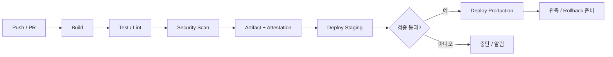

# CI/CD Pipeline: Commit에서 Production까지

CI/CD는 "자동으로 배포하는 Script"가 아니라 **변경이 Production에 도달하기까지의 품질 관문을 코드로 만든 것**이다.

## 용어 구분

| 용어 | 의미 |
|---|---|
| CI (Continuous Integration) | 변경을 자주 합치고, 합칠 때마다 Build와 Test를 자동 실행 |
| Continuous Delivery | 언제든 Production에 내보낼 수 있는 상태를 유지. 최종 배포는 사람이 승인할 수 있다 |
| Continuous Deployment | 관문을 통과한 변경이 사람 개입 없이 Production까지 배포 |
| Artifact | Build 결과물. Container Image, 앱 번들, 정적 파일 묶음 등 |
| Environment | Dev, Staging, Production처럼 Artifact가 실행되는 장소 |

## 표준 흐름



핵심 원칙은 **한 번 Build한 Artifact를 모든 Environment에 승격**하는 것이다. Environment마다 다시 Build하면 Staging에서 검증한 것과 Production에 나간 것이 달라질 수 있다.

## 설정은 코드 밖에

Twelve-Factor App은 배포마다 달라지는 값(DB 주소, 외부 서비스 자격 증명, Hostname 등)을 **코드가 아닌 Environment에 두라**고 권한다. 같은 Artifact가 Environment만 바꿔 여러 곳에서 돌 수 있어야 한다. 최근에는 Secret을 Volume으로 Mount하는 방식도 함께 논의된다.

## GitHub Actions 예시

```yaml
name: deploy
on:
  push:
    branches: [main]
permissions:
  contents: read
  id-token: write
jobs:
  build-deploy:
    runs-on: ubuntu-latest
    environment: production
    steps:
      - uses: actions/checkout@<commit-sha>
      - run: npm ci && npm test
      - run: npm run build
      - run: ./scripts/deploy.sh
```

- `permissions`를 최소로 선언한다. `id-token: write`는 OIDC로 Cloud에 인증할 때만 필요하다.
- `environment: production`으로 보호 규칙(승인자, 대기 시간)을 걸 수 있다.
- 외부 Action은 Tag 대신 **Commit SHA로 고정**한다(아래 사고 사례 참고).

## 장기 Secret 대신 OIDC

GitHub Actions의 OpenID Connect를 쓰면 Workflow가 실행될 때마다 Cloud 제공사로부터 **짧은 수명의 Token**을 받는다. AWS, Azure, Google Cloud, HashiCorp Vault 등이 지원한다.

```text
나쁜 예: Cloud Access Key를 Repository Secret에 저장하고 몇 년째 교체하지 않는다.
좋은 예: OIDC Trust를 "이 Repository의 main Branch, production Environment"로 좁히고
        Job이 끝나면 만료되는 Token만 사용한다.
```

## 사고 사례: CI도 공격 대상이다

- 2025-03, 널리 쓰이던 `tj-actions/changed-files` Action이 변조되어 Workflow Log에 Secret이 노출될 수 있었다(CVE-2025-30066). CISA는 영향 Repository 확인과 **모든 노출 가능 Secret 교체**를 권고했다.
- GitHub는 2025-08 Actions Policy에서 **SHA 고정 강제와 특정 Action 차단**을 지원하기 시작했다.

## GitOps: Pull 방식 배포

OpenGitOps 원칙은 네 가지다.

1. **Declarative**: 원하는 상태를 선언적으로 표현한다.
2. **Versioned and Immutable**: 원하는 상태를 버전과 전체 이력이 남는 곳에 저장한다.
3. **Pulled Automatically**: Agent가 원하는 상태를 자동으로 가져온다.
4. **Continuously Reconciled**: Agent가 실제 상태를 계속 관찰하고 원하는 상태로 맞춘다.

CI가 Cluster에 직접 Push하는 대신, Cluster 안의 Agent가 Git을 보고 따라가게 하면 **Drift**(누군가 손으로 바꾼 설정)가 자동으로 드러난다.

## 성과 측정: DORA 지표

| 지표 | 의미 |
|---|---|
| Deployment Frequency | Production에 성공적으로 배포하는 빈도 |
| Change Lead Time | Commit부터 Production 배포 성공까지 걸리는 시간 |
| Failed Deployment Recovery Time | 배포로 생긴 장애에서 회복하는 데 걸리는 시간 |
| Change Fail Rate | 배포 직후 Rollback이나 Hotfix 같은 즉각 개입이 필요한 비율 |
| Deployment Rework Rate | 계획되지 않은(버그 수정용) 배포의 비율 |

DORA는 Change Fail Rate와 Deployment Rework Rate를 **Instability**(불안정성)를 보는 두 지표로 쓰며, Deployment Rework Rate는 2024년에 다섯 번째 지표로 추가되었다. 지표는 팀을 비교하는 순위표가 아니라 **개선 방향을 찾는 신호**로 쓴다.

## 단계적 검증 설계

```text
PR Check     빠른 Lint, Unit Test (수 분 이내)
Main Merge   Integration Test, Image Build, Staging 배포
Release      Smoke Test, 승인, Production 배포
Nightly      무거운 E2E, 성능, 의존성 Scan
```

모든 검사를 PR마다 돌리면 느려지고, 아무것도 안 돌리면 위험하다. **빠른 것은 앞에, 무거운 것은 뒤에** 둔다.

## 참고 자료

- [Store config in the environment](https://12factor.net/config) — The Twelve-Factor App, 접근일 2026-09-28
- [OpenID Connect](https://docs.github.com/en/actions/concepts/security/openid-connect) — GitHub Docs, 접근일 2026-09-28
- [Secure use reference](https://docs.github.com/en/actions/reference/security/secure-use) — GitHub Docs, 접근일 2026-09-28
- [Supply Chain Compromise of Third-Party tj-actions/changed-files (CVE-2025-30066)](https://www.cisa.gov/news-events/alerts/2025/03/18/supply-chain-compromise-third-party-tj-actionschanged-files-cve-2025-30066-and-reviewdogaction) — CISA, 2025-03-18, 접근일 2026-09-28
- [GitHub Actions policy now supports blocking and SHA pinning actions](https://github.blog/changelog/2025-08-15-github-actions-policy-now-supports-blocking-and-sha-pinning-actions/) — GitHub Changelog, 2025-08-15, 접근일 2026-09-28
- [OpenGitOps Principles](https://github.com/open-gitops/documents/blob/main/PRINCIPLES.md) — OpenGitOps, 접근일 2026-09-28
- [DORA's software delivery performance metrics](https://dora.dev/guides/dora-metrics/) — DORA, 접근일 2026-09-28
- [A history of DORA's software delivery metrics](https://dora.dev/insights/dora-metrics-history/) — DORA, 접근일 2026-09-28
