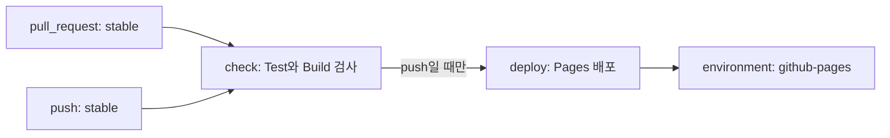

# GitHub Actions 실전: Workflow 구조 · 권한 · 캐시 · 비용

Trigger와 기본 문법은 「GitHub Actions · Hook · Cron」, 전체 흐름과 OIDC는 「CI/CD · OIDC · GitOps」에서 다뤘다. 이 문서는 그다음 단계인 **Workflow를 안전하고 싸고 빠르게 운영하는 법**을 다룬다. Job 의존, 재사용, 캐시, 배포 승인, 최소 권한, Action 고정, 신뢰할 수 없는 입력, Runner, 요금, 디버깅을 보고, 마지막에 이 사이트에 CI를 붙인다면 어떤 Workflow가 되는지 설계한다. 모든 사실은 2026-09 기준이다. 요금과 제공 범위는 자주 바뀌므로 도입 전에 참고 자료의 원문을 다시 확인한다.

## Workflow 해부

Workflow는 **Event → Job → Step** 순서로 읽는다. Job은 기본적으로 병렬로 돌고, `needs`를 쓰면 순서와 값 전달이 생긴다. 아래는 이 문서 끝의 예시 설계를 그린 것이다.



| 키 | 하는 일 | 자주 하는 실수 |
|---|---|---|
| `on` | 실행할 Event와 Branch · Path Filter | Filter 없이 `push`와 `pull_request`를 둘 다 걸어 같은 변경을 두 번 검사 |
| `needs` | 앞 Job이 성공해야 실행, `needs.<id>.outputs`로 값 전달 | 실패해도 돌아야 할 알림 · 정리 Job에 `if: failure()`나 `always()`를 빠뜨림 |
| `strategy.matrix` | 같은 Job을 OS · Version 조합별로 복제 | 조합이 곱으로 늘어 분 단위 요금이 폭증 |
| `if` | Job · Step 실행 조건 | Expression 안 문자열에 `"`를 씀. 문자열은 `'`만 쓴다 |

**Context**는 Expression에서 읽는 값의 묶음이다. `github`(Event · Ref · Actor), `env`, `vars`, `secrets`, `matrix`, `needs`, `runner`, `inputs`를 자주 쓴다. 상태 함수 `success()`(기본), `failure()`, `always()`, `cancelled()`로 실패 알림과 정리 Job을 만든다. 모든 Job에 `timeout-minutes`를 둔다. 기본값 360분이면 멈춘 Job이 6시간 동안 분을 쓴다.

## 재사용: Reusable Workflow와 Composite Action

| 기준 | Reusable Workflow (`workflow_call`) | Composite Action (`action.yml`) |
|---|---|---|
| 단위 · 호출 | Job 여러 개를 담은 Workflow. Job 수준 `uses:` | Step 묶음. Step 수준 `uses:` |
| Runner | 자기 Job마다 지정 | 호출한 Job의 Runner를 그대로 사용 |
| Secret | `secrets:`로 받거나 `secrets: inherit` | 직접 못 씀. 입력으로 넘긴다 |
| Log · 중첩 | Job · Step별 Log, 최대 10단계 | 한 Step으로 묶인 Log, 최대 10개 중첩 |

기준: **배포 절차처럼 Job과 Environment가 필요한 것은 Reusable Workflow, "Setup + 설치 + 캐시"처럼 반복되는 Step 몇 줄은 Composite Action**이다. 다른 저장소의 Reusable Workflow도 `owner/repo/.github/workflows/deploy.yml@<commit-sha>`처럼 SHA로 부른다.

## 캐시와 Artifact

| 구분 | Cache | Artifact |
|---|---|---|
| 목적 | 다음 실행을 **빠르게**(의존성, Build 중간물) | Job 사이 · 사람에게 **결과 전달**(Build 산출물, Test 보고서) |
| 수명 | 7일 넘게 안 쓰면 삭제, 저장소당 기본 10 GB를 넘으면 오래된 것부터 삭제 | 기본 90일, `retention-days`로 줄인다 |
| 범위 | 현재 Branch, 기본 Branch, PR의 Base Branch 캐시만 복원 | 같은 Run의 다른 Job, 또는 UI · API로 다운로드 |

```yaml
      - uses: actions/setup-node@820762786026740c76f36085b0efc47a31fe5020 # v7.0.0
        with: { node-version: 22, cache: npm }
      - uses: actions/cache@55cc8345863c7cc4c66a329aec7e433d2d1c52a9 # v6.1.0
        with:
          path: .build-cache
          key: build-${{ runner.os }}-${{ hashFiles('package-lock.json') }}
```

`setup-*` Action의 내장 캐시가 먼저다. `actions/cache`는 그 밖의 경로에만 쓴다. 캐시에는 Secret을 넣지 않는다. 읽기 권한만 있어도 PR로 캐시 내용을 볼 수 있다. **Cache Poisoning 방어**: `pull_request_target`, `issue_comment`, `workflow_run`처럼 외부인이 일으킬 수 있는 Event는 기본 Branch 범위 캐시를 읽기만 한다. 기본 Branch 캐시는 `push`로 도는 신뢰할 수 있는 Workflow가 갱신한다.

## Environment와 배포 보호 규칙

Job에 `environment:`를 적으면 보호 규칙을 통과해야 Job이 시작되고, 그 뒤에야 Environment Secret을 읽는다(「CI/CD · OIDC · GitOps」의 "Environment 설계"). **요금제 제약**: Free · Pro · Team에서는 Required reviewers, Wait timer, Custom protection rules, 관리자 우회 설정을 **Public 저장소에서만** 쓰고, Free의 Private 저장소는 Environment Secret도 못 쓴다. Private 저장소에 승인 관문이 필요하면 Enterprise 요금제를 검토하거나, 보호된 Branch와 수동 `workflow_dispatch`로 대신한다.

| 규칙 | 내용 |
|---|---|
| Required reviewers | 사람 · 팀 최대 6개, 그중 한 명이 승인하면 진행. 배포를 시작한 사람의 자기 승인을 막을 수 있다 |
| Wait timer | 1–43,200분(30일) 대기. 대기 시간은 과금되지 않는다 |
| Deployment branches and tags | 보호된 Branch만, 또는 이름 Pattern이 맞는 Branch · Tag만 배포 |
| Custom protection rules | GitHub App이 외부 시스템(관측, 변경 관리)의 판단으로 승인 · 거부. 관리자 우회는 끌 수 있다 |

## concurrency: 겹치는 실행 정리

같은 `concurrency.group`에서는 하나만 돌고, 대기 중인 실행은 기본적으로 최신 하나만 남는다. PR 검사는 `cancel-in-progress`로 이전 실행을 취소하고, **배포 Job은 `cancel-in-progress: false`** 로 진행 중인 배포를 끝까지 마친다. 중간에 끊긴 배포는 반쯤 바뀐 상태를 남긴다. 두 설정을 함께 쓰는 모양은 아래 예시 설계에 있다. 2026-09 문서에는 대기열을 최대 100개까지 쌓는 `queue: max`도 있다(`cancel-in-progress: true`와는 함께 못 쓴다).

## 권한: 최소 GITHUB_TOKEN

`GITHUB_TOKEN`은 Job마다 발급되고 Job이 끝나면 만료되는 저장소 한정 Token이다. 기본 권한은 Enterprise · Organization · 저장소 설정에서 오고, 2023-02 이후 새로 만든 Organization과 개인 저장소는 읽기 전용이 기본이다. 설정에 기대지 말고 Workflow에 적는다.

- 최상위는 `permissions: {}`로 닫고 필요한 Job에서만 연다(예: `permissions: { contents: read, pull-requests: write }`). `id-token: write`는 OIDC가 필요한 Job에만 준다. `GITHUB_TOKEN`으로 Push한 변경은 새 Workflow를 만들지 않는다(`workflow_dispatch` · `repository_dispatch` 제외). 무한 반복을 막는 장치다. Dependabot이 연 PR의 실행은 Fork처럼 읽기 전용 Token을 받고 Secret을 못 읽는다.
- **Secret과 Variable**: `secrets.NAME`은 Log에서 가려지고 `vars.NAME`은 그대로 보인다. Key는 Secret, Region · 공개 URL은 Variable에 두고, 둘 다 Organization · 저장소 · Environment 중 가장 좁은 곳에 둔다. Cloud 자격 증명은 저장하지 말고 OIDC로 받는다(「CI/CD · OIDC · GitOps」).

## 외부 Action 고정과 Dependabot

Tag(`@v7`)는 소유자나 공격자가 다른 Commit으로 옮길 수 있다. 2025-03 `tj-actions/changed-files` 사고가 이 경로였다(「Secret · SBOM · SLSA」). **전체 40자 Commit SHA로 고정하고 Version을 주석으로 붙인다.** Organization 정책으로 SHA 고정을 강제할 수도 있다(2025-08부터). SHA는 `git ls-remote https://github.com/actions/checkout refs/tags/v7.0.1 'refs/tags/v7.0.1^{}'`로 얻는다. 결과가 두 줄이면 Annotated Tag이고 `^{}` 줄의 SHA가 실제 Commit이다. 받은 SHA가 그 저장소 Release 화면의 Commit과 같은지도 본다. 고정한 SHA는 Dependabot이 SHA와 Version 주석을 함께 올리는 PR로 갱신한다.

```yaml
version: 2
updates:
  - package-ecosystem: github-actions
    directory: /
    schedule: { interval: weekly }
    cooldown: { default-days: 7 }
```

`cooldown`은 새 Version이 나온 뒤 며칠 기다렸다가 PR을 열어 막 변조된 Release를 바로 받지 않게 한다. 2026-09 문서 기준 Version Update에는 설정하지 않아도 기본 3일이 적용된다. GitHub는 2026-03 Workflow 수준 의존성 잠금(Dependency Locking)을 로드맵으로 발표했다. 2026-09-30 확인한 Workflow 문법 문서에는 아직 없으므로 그전까지는 SHA 고정 + Dependabot이 기본이다.

## 신뢰할 수 없는 입력: Injection과 pull_request_target

`${{ }}`는 Shell이 실행되기 **전에** 문자열로 치환된다. PR 제목, Branch 이름, Issue 본문처럼 외부인이 쓴 값을 `run:`에 바로 넣으면 그 값이 명령이 된다.

```yaml
      # 나쁜 예: 제목에 따옴표와 명령을 넣으면 그대로 실행된다
      - run: echo "PR title is ${{ github.event.pull_request.title }}"
      # 좋은 예: 환경 변수로 넘기고 따옴표 안의 Shell 변수로 읽는다
      - env:
          TITLE: ${{ github.event.pull_request.title }}
        run: echo "PR title is $TITLE"
```

| Event | 무엇이 어떤 권한으로 도는가 | 원칙 |
|---|---|---|
| `pull_request` | PR의 Merge Commit. Fork PR은 읽기 전용 Token, Secret 없음 | Build · Test는 여기서 |
| `pull_request_target` | 기본 Branch의 Workflow. 쓰기 가능한 Token과 Secret 보유 | PR 코드를 Checkout · 실행하지 않는다 |
| `workflow_run` | 앞 Workflow가 끝난 뒤 기본 Branch 맥락 | 앞 Run의 Artifact를 신뢰하지 않는다 |

2025-12-08부터 `pull_request_target`은 Base Branch와 관계없이 **항상 기본 Branch의 Workflow 파일**로 돈다. `actions/checkout` v7은 이 Event와 `workflow_run`에서 Fork PR 코드를 기본적으로 Checkout하지 않는다. CI 안의 AI Agent가 PR · Issue 내용을 읽을 때의 Prompt Injection은 「AI 시대의 CI/CD」에서 다룬다.

## Runner 선택

| Runner | 특징 | 비용 (2026-09) | 쓰지 말 곳 |
|---|---|---|---|
| GitHub-hosted 표준 | Job마다 새 VM. `ubuntu-latest`는 Ubuntu 24.04 | Public 무료, Private은 포함 분 차감 후 과금 | 사내망 접근이 필요한 Job |
| Larger runner | 더 많은 CPU · RAM, 고정 IP, GPU. Team · Enterprise Cloud만 | **항상 과금**. Public도, 포함 분 사용 불가 | 표준으로 충분한 Job |
| Self-hosted | 내 서버 · Cluster, 사내망. Job 사이 격리가 없으니 일회용(Ephemeral)으로 | GitHub 요금 없음, Infra는 내 비용 | **Public 저장소**. 누구나 PR로 내 Runner에서 코드를 돌린다 |

## 비용: 2026-09 기준

Public 저장소의 표준 Runner, GitHub Pages, Dependabot 실행은 무료다. Private 저장소는 계정 요금제의 포함량을 쓰고, 넘으면 과금된다.

| 요금제 | 포함 분(월) | Artifact 저장 | Cache (저장소당) |
|---|---|---|---|
| Free (개인 · Organization) | 2,000 | 500 MB | 10 GB |
| Pro / Team | 3,000 | 1 GB / 2 GB | 10 GB |
| Enterprise Cloud | 50,000 | 50 GB | 10 GB |

| 표준 Runner | Linux 1-core | Linux 2-core x64 / arm64 | Windows 2-core | macOS 3 · 4-core |
|---|---|---|---|---|
| 분당 USD | $0.002 | $0.006 / $0.005 | $0.010 | $0.062 |

- **2026-01-01 인하**: GitHub-hosted 요금이 기종에 따라 최대 39% 내렸다(예: Linux 2-core $0.008 → $0.006).
- **Self-hosted 과금은 보류**: GitHub는 2025-12-16 Changelog에서 2026-03-01부터 Private 저장소의 Self-hosted 사용에 분당 $0.002를 받겠다고 발표했다가 2025-12-17 보류했다. 2026-09-30 확인한 요금 문서에는 "Self-hosted 사용은 무료"로 남아 있다. 다시 도입될 수 있으니 Changelog를 지켜본다.
- Job마다 분 단위로 **올림**하고, 실패 후 재실행한 시간도 센다. 저장 초과분은 Artifact · Packages GB-월당 $0.25, Cache $0.07이며 시간 단위로 누적된다. 예전의 OS별 배수(Windows 2배, macOS 10배)는 현재 요금 문서에서 사라지고 기종별 분당 요금이 되었다. 포함 분이 Windows · macOS에서 어떻게 차감되는지는 Billing 화면에서 확인한다. 결제 수단이 없으면 포함량을 다 쓰는 순간 실행이 막힌다. 결제 수단이 있으면 **Budget**으로 상한을 건다. Private 저장소의 Copilot code review도 Actions 분을 쓴다.

## 디버깅

| 상황 | 방법 |
|---|---|
| 왜 실패하는지 모른다 | Secret 또는 Variable `ACTIONS_STEP_DEBUG=true`(Runner 진단은 `ACTIONS_RUNNER_DEBUG`). 이번만이면 "Enable debug logging"으로 재실행, `gh run rerun RUN_ID --debug` |
| 일부 Job만 실패 | "Re-run failed jobs" 또는 `gh run rerun RUN_ID --failed`. 30일 안, 최대 50회 |
| Push 없이 시험 | `act`(nektos/act)로 Docker에서 로컬 실행. `act -l`로 목록, `act pull_request -j check`로 Job 하나 |

재실행은 원래 Event의 `GITHUB_SHA`와 **처음 실행한 사람의 권한**으로 돈다. 코드를 고쳤다면 새 Push가 필요하고, 간헐적 실패를 재실행으로 덮지 않는다(「CI 기초와 테스트 전략」). `act`의 Image는 GitHub-hosted Runner와 같지 않다. 로컬 성공은 문법과 흐름까지만 보여 준다. Secret은 `--secret-file`로 주되 Production 값은 쓰지 않는다.

## 예시 설계: 이 사이트에 CI를 붙인다면

이 사이트는 `stable` Branch에서 GitHub Pages로 제공되는 정적 Site이고 2026-09-30 현재 CI가 **없다**. Test는 `node --test tests/*.cjs`, 생성 Page가 최신인지는 `node tools/build-site.mjs --check`로 검사한다. 아래는 저장소에 추가하지 않은 **설계 예시**이며, SHA는 2026-09-30 `git ls-remote`로 확인한 값이다.

```yaml
name: site
on:
  pull_request:
    branches: [stable]
  push:
    branches: [stable]
permissions: {}
concurrency:
  group: site-${{ github.ref }}
  cancel-in-progress: ${{ github.event_name == 'pull_request' }}
jobs:
  check:
    runs-on: ubuntu-latest
    timeout-minutes: 10
    permissions: { contents: read }
    steps:
      - uses: actions/checkout@3d3c42e5aac5ba805825da76410c181273ba90b1 # v7.0.1
        with: { persist-credentials: false }
      - uses: actions/setup-node@820762786026740c76f36085b0efc47a31fe5020 # v7.0.0
        with: { node-version: 22 }
      - run: node --test tests/*.cjs
      - run: node tools/build-site.mjs --check
  deploy:
    needs: check
    if: github.event_name == 'push'
    runs-on: ubuntu-latest
    timeout-minutes: 10
    permissions: { contents: read, pages: write, id-token: write }
    environment:
      name: github-pages
      url: ${{ steps.deployment.outputs.page_url }}
    concurrency: { group: pages, cancel-in-progress: false }
    steps:
      - uses: actions/checkout@3d3c42e5aac5ba805825da76410c181273ba90b1 # v7.0.1
        with: { persist-credentials: false }
      - uses: actions/configure-pages@45bfe0192ca1faeb007ade9deae92b16b8254a0d # v6.0.0
      - uses: actions/upload-pages-artifact@fc324d3547104276b827a68afc52ff2a11cc49c9 # v5.0.0
        with: { path: . }
      - id: deployment
        uses: actions/deploy-pages@368f82528645a54fb793d4d04e342629a3f51346 # v5.0.1
```

의존성이 없는 Node Script라 캐시는 넣지 않았다. Public 저장소의 표준 Runner라 요금도 없다. `deploy`를 쓰려면 Pages Source를 "Deploy from a branch"에서 **"GitHub Actions"** 로 바꾼다. Branch 배포를 유지한다면 `check`만 두고 Branch 보호의 필수 Status Check로 지정한다. `path: .`은 `.git` · `.github`와 숨김 파일을 뺀 저장소 전체를 올린다. `tests/` · `tools/`까지 공개하기 싫다면 공개할 파일만 모은 Directory를 올린다.

## 나쁜 예 / 좋은 예

```text
나쁜 예: 외부 Action을 @v2 Tag로 쓰고 permissions 선언이 없으며, run: 에 PR 제목을 그대로 넣는다.
좋은 예: 최상위 permissions: {}, Job별 최소 권한, 외부 Action은 SHA + Version 주석, 외부 입력은 env로 넘긴다.
나쁜 예: pull_request_target에서 PR Head를 Checkout해 Test를 돌린다. Fork 코드가 Secret과 쓰기 Token을 얻는다.
좋은 예: Build · Test는 pull_request에서, 코드를 실행하지 않는 Label · 댓글만 pull_request_target에서 한다.
```

## 자기 점검 질문

1. 여러분 저장소의 Workflow 하나에서 최상위 `permissions`를 `{}`로 바꾸면 어느 Step이 실패하는가? 그 Job에 어떤 권한만 주면 되는가?
2. `run: echo "${{ github.head_ref }}"`는 왜 위험한가? 같은 일을 안전하게 하도록 고쳐 보라.
3. Team 요금제의 Private 저장소에서 Production 배포 전에 사람의 승인을 받고 싶다. Required reviewers를 쓸 수 있는가? 없다면 무엇으로 대신하겠는가?
4. Private 저장소에서 Linux 2-core로 하루 40회, 한 번에 6분 걸리는 CI를 30일 돌리면 몇 분을 쓰는가? Pro 요금제의 포함 분을 넘는 부분의 요금은 얼마인가?
5. 예시 Workflow에서 `deploy` Job의 `concurrency`를 지우고 Workflow 수준 설정을 `cancel-in-progress: true`로 바꾸면 연속 Merge 때 무슨 일이 생길 수 있는가?

## 참고 자료

- [GitHub Actions billing](https://docs.github.com/en/billing/concepts/product-billing/github-actions) · [Actions runner pricing](https://docs.github.com/en/billing/reference/actions-runner-pricing) — GitHub Docs, 2026-09-30 확인(github/docs 저장소 원문)
- [Update to GitHub Actions pricing](https://github.blog/changelog/2025-12-16-coming-soon-simpler-pricing-and-a-better-experience-for-github-actions/) (2025-12-16) · [Reduced pricing for GitHub-hosted runners usage](https://github.blog/changelog/2026-01-01-reduced-pricing-for-github-hosted-runners-usage/) (2026-01-01) — GitHub Changelog, 검색 결과로 확인
- [Pricing changes for GitHub Actions](https://github.com/resources/insights/2026-pricing-changes-for-github-actions) · [Updates to GitHub Actions pricing](https://github.com/orgs/community/discussions/182186) (2025-12-17) — GitHub, 2026-09-30 확인
- [Workflow syntax](https://docs.github.com/en/actions/reference/workflows-and-actions/workflow-syntax) · [Reusing workflow configurations](https://docs.github.com/en/actions/concepts/workflows-and-actions/reusing-workflow-configurations) · [Dependency caching reference](https://docs.github.com/en/actions/reference/workflows-and-actions/dependency-caching) · [Deployments and environments](https://docs.github.com/en/actions/reference/workflows-and-actions/deployments-and-environments) · [Control the concurrency of workflows and jobs](https://docs.github.com/en/actions/how-tos/write-workflows/choose-when-workflows-run/control-workflow-concurrency) — GitHub Docs, 2026-09-30 확인(github/docs 저장소 원문)
- [GITHUB_TOKEN](https://docs.github.com/en/actions/concepts/security/github_token) · [Secure use reference](https://docs.github.com/en/actions/reference/security/secure-use) · [Events that trigger workflows](https://docs.github.com/en/actions/reference/workflows-and-actions/events-that-trigger-workflows#pull_request_target) — GitHub Docs, 2026-09-30 확인(github/docs 저장소 원문)
- [Updating the default GITHUB_TOKEN permissions to read-only](https://github.blog/changelog/2023-02-02-github-actions-updating-the-default-github_token-permissions-to-read-only/) (2023-02-02) · [Actions pull_request_target and environment branch protections changes](https://github.blog/changelog/2025-11-07-actions-pull_request_target-and-environment-branch-protections-changes/) (2025-11-07) — GitHub Changelog, 검색 결과로 확인
- [Dependabot options reference](https://docs.github.com/en/code-security/reference/supply-chain-security/dependabot-options-reference) — GitHub Docs, 2026-09-30 확인(github/docs 저장소 원문) · [Keeping your actions up to date with Dependabot](https://docs.github.com/en/code-security/how-tos/secure-your-supply-chain/secure-your-dependencies/keeping-your-actions-up-to-date-with-dependabot) — GitHub Docs, 검색 결과로 확인
- [What's coming to our GitHub Actions 2026 security roadmap](https://github.com/orgs/community/discussions/190621) — GitHub Community, 2026-03-26, 2026-09-30 확인
- [Actions limits](https://docs.github.com/en/actions/reference/limits) · [Enable debug logging](https://docs.github.com/en/actions/how-tos/monitor-workflows/enable-debug-logging) · [Re-run workflows and jobs](https://docs.github.com/en/actions/how-tos/manage-workflow-runs/re-run-workflows-and-jobs) — GitHub Docs, 2026-09-30 확인(github/docs 저장소 원문)
- [actions/checkout](https://github.com/actions/checkout) · [actions/runner-images](https://github.com/actions/runner-images) · [nektos/act](https://github.com/nektos/act) · [Pages starter workflow](https://github.com/actions/starter-workflows/blob/main/pages/static.yml) — GitHub, 2026-09-30 확인
