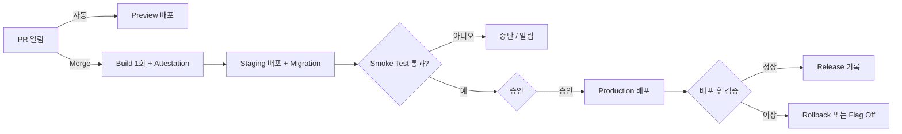

# 배포 자동화와 버전 관리: Merge에서 Release까지

CI가 "합쳐도 되는가"에 답한다면, CD는 **합친 것을 같은 절차로, 같은 Artifact로, 되돌릴 수 있게 내보내는 일**이다. 이 문서는 「CI/CD · OIDC · GitOps」의 심화편으로 배포 대상별 자동화, PR마다 뜨는 Preview, Environment 승격, DB Migration, 버전과 Release 자동화, 배포 후 검증을 다룬다. Canary · Blue-Green · Feature Flag 같은 **Release 전략은 「Canary · Blue-Green · Flag · Rollback」** 에, 배포 대상 선택은 「배포 대상 · Static · Serverless」에 있다. 사실 관계는 2026-09 기준이다.

## 배포 대상별 자동화

| 대상 | 배포 단위 | 자동화의 핵심 | 되돌리기 |
|---|---|---|---|
| 정적 사이트 (GitHub Pages, Cloudflare, Vercel · Netlify) | Build된 파일 묶음 | 한 번 Build → Upload → 원자적 교체 | 이전 배포로 전환, 또는 Revert 후 재배포 |
| Web App · Container | Container Image | 한 번 Build하고 **Digest**로 모든 Environment에 승격 | 이전 Digest로 |
| Serverless | Function Version, Revision | 불변 Version을 게시하고 Alias · Traffic만 옮김 | Alias · Traffic을 이전 Version으로 |
| 모바일 | 서명된 AAB · IPA | fastlane · EAS 등으로 Build · 서명 · Upload, Build 번호는 CI가 증가 | 설치된 Binary는 못 되돌림 (「App Store · Google Play」) |

### 예시: 이 사이트에 CD를 붙인다면

이 사이트는 GitHub Pages가 `stable` Branch의 루트 파일을 그대로 게시한다. `node tools/build-site.mjs`가 문서마다 HTML을 만들어 함께 Commit하고, `--check`는 생성 파일이 낡았는지 검사하며, Test는 `node --test tests/*.cjs`로 돈다. **지금은 CI가 없다.** 아래는 설계 예시이며 저장소에 넣은 Workflow가 아니다.

GitHub 문서에 따르면 Branch 게시도 항상 Actions 실행으로 배포되지만, GitHub가 관리하는 실행이라 그 앞에 Test를 끼울 수 없다. Pages의 Source를 **GitHub Actions**로 바꾸면 우리 Workflow가 Test를 통과한 Artifact만 올린다. PR에서는 검사만, `stable` Push에서는 검사 통과 뒤 `configure-pages` → `upload-pages-artifact` → `deploy-pages`를 도는 전체 Workflow는 「GitHub Actions 실전」의 "예시 설계"에 있다. 여기서는 **배포 쪽에서 달라지는 점**만 본다.

| 항목 | Branch 게시 (지금) | Actions 게시 (설계) |
|---|---|---|
| 배포 조건 | `stable`에 Push되면 무조건 | Test와 `build-site --check` 통과 후에만 |
| 게시되는 것 | `stable` Branch의 파일 그대로 | 검사를 통과한 실행이 올린 Artifact. 배포 Job에만 `pages: write`, `id-token: write` |
| 점으로 시작하는 폴더 | `.nojekyll` 때문에 `.ai/`, `.claude/`도 공개 주소로 열림 | `upload-pages-artifact`가 기본값으로 빼므로 더는 게시되지 않음 |
| 되돌리기 | Revert Commit Push | Revert Commit Push. Artifact 보존 기본값이 1일이라 옛 실행의 배포 Job만 다시 돌리면 실패할 수 있다 |

- Production 배포 실행은 취소하지 않는다. GitHub의 Pages 시작 Template도 `cancel-in-progress: false`로 둔다. PR 검사만 새 Push가 오면 취소한다.
- `github-pages` Environment의 배포 가능 Branch에 `stable`을 넣는다. GitHub는 이 Environment에 기본 Branch만 배포하도록 보호 규칙을 두라고 권한다.
- 배포 직후 Smoke Test는 첫 화면이 아니라 **이번에 바뀐 것**을 확인한다. 새로 고친 문서의 주소, 또는 `tools/site/template.html`이 자산 URL에 붙이는 `v` 값이 응답에 보이는지 본다. PR에 둘 Test는 「CI 기초와 테스트 전략」, 작은 팀의 최소 구성은 「작은 팀 실전 가이드」에서 다룬다.

### Container: 한 번 Build하고 Digest로 승격

- Tag(`:latest`, `:v1.4.0`)는 다른 Image로 옮겨질 수 있다. 배포 Manifest에는 `registry/app@sha256:…` 같은 **Digest**를 적어 Staging에서 검증한 바로 그 Image가 Production에 가게 한다. 승격은 다시 Build하는 것이 아니라 같은 Digest에 이름을 더 붙이는 일이다. 예: `docker buildx imagetools create --tag registry/app:prod registry/app@sha256:…`. GitOps라면 "Production 폴더의 Digest를 바꾸는 PR"이 승격이다.

### Serverless와 모바일

- **AWS Lambda**: 게시한 Version은 코드와 설정이 고정된 스냅숏이고, Alias는 Version을 가리키는 바꿀 수 있는 이름이다. 배포는 새 Version 게시 + Alias 이동, 되돌리기는 Alias를 되돌리는 것이다. 가중치 Alias는 두 Version까지 Traffic을 나눈다.
- **Cloud Run**: `--no-traffic`과 `--tag`로 새 Revision을 Traffic 없이 올리면 Tag 전용 URL이 생긴다. 거기서 확인한 뒤 Traffic을 옮긴다.
- **모바일**: Android `versionCode`는 새 Release마다 더 커야 하는 양의 정수이고 Google Play 최댓값은 2100000000이다. iOS Build 번호도 같은 버전 안에서 다시 쓸 수 없다. 번호는 CI가 올린다.

## PR마다 뜨는 Preview 배포

| 서비스 | 동작 (2026-09 확인) |
|---|---|
| Vercel | Production이 아닌 Branch로 Push할 때마다 Preview 배포를 만들고 PR 댓글로 URL을 준다 |
| Netlify | 연결된 저장소에 PR을 열면 기본으로 Deploy Preview를 Build한다. 주소는 `deploy-preview-<PR 번호>--<사이트>.netlify.app` |
| Cloudflare Workers | Workers Builds에서 Preview Build를 켜면 Production이 아닌 Branch마다 Preview를 만든다. Preview는 Production 설정을 물려받지 않는다 |
| GitHub Pages | `deploy-pages`의 `preview` 입력은 Alpha이며 일반에 공개되지 않았다 |

Preview는 **Production으로 새는 구멍**이 되기 쉽다.

- Cloudflare Worker Preview URL은 기본이 공개이고, Preview의 Service Binding은 연결된 Worker의 **Production** 배포를 부른다. 이런 예외를 먼저 읽는다. Preview에는 Production DB · 결제 Key를 주지 않고 Seed Data와 Sandbox 계정만 쓴다. Fork PR의 Preview Build에는 Secret을 넘기지 않는다(「GitHub Actions 실전」의 `pull_request_target` 절). PR이 닫히면 Preview와 임시 Resource를 지운다.

## Environment 승격과 승인



- 승격 때 다시 Build하지 않는다. 앞 단계가 남긴 Digest · Artifact ID를 다음 Job이 입력으로 받는다.
- GitHub Environment의 필수 Reviewer(최대 6명, 1명 승인)와 대기 시간(1–43,200분)은 **Free · Pro · Team에서는 Public Repository에서만** 쓴다. 배포 가능 Branch · Tag 제한은 Pro · Team이면 Private에서도 쓴다. 설정은 「GitHub Actions 실전」.
- 승인자가 "무엇이 나가는가"를 보게 Changelog, Migration 목록, Staging Smoke Test 결과를 승인 화면 가까이에 남긴다. 사람 승인이 없는 Continuous Deployment라면 **자동 검증과 자동 Rollback 조건**이 그 자리를 채운다.

## DB Migration을 Pipeline에 넣기

규칙은 하나다. **배포 중에는 구 코드와 새 코드가 모두 현재 Schema에서 동작해야 한다.** Expand → Migrate → Contract 개념은 「Canary · Blue-Green · Flag · Rollback」에 있고, 여기서는 Pipeline 순서로 옮긴다.

| 변경 | 언제 실행 | 이유 |
|---|---|---|
| Column · Table · Index 추가 (Expand) | 새 코드 배포 **전** | 구 코드는 새 Column을 무시하고, 새 코드는 그것이 필요하다 |
| Data Backfill | 새 코드가 양쪽에 쓰기 시작한 **뒤**, 별도 Job에서 작은 묶음으로 | 대량 Update가 배포와 Lock을 붙잡지 않게 |
| Column 삭제, NOT NULL 강제 (Contract) | 구 코드가 사라지고 **Rollback 창이 지난 뒤**, 다음 Release | 되돌아갈 구 코드가 아직 그 Column을 읽는다 |

Migration은 Pipeline의 **한 Job에서 한 번** 실행한다. App 시작 시 실행하면 Instance 수만큼 동시에 시도되고, 오래 걸리면 Health Check 실패와 재시작이 겹친다. PostgreSQL 예시이며, **여러 Release에 나뉘어 들어가는 단계**다.

```sql
-- Release N (배포 전): Lock을 오래 기다리지 말고 실패하게 한다
SET lock_timeout = '5s';
ALTER TABLE users ADD COLUMN display_name text;
-- Release N (별도 Migration): CONCURRENTLY는 Transaction Block 안에서 실행할 수 없다
CREATE INDEX CONCURRENTLY idx_users_display_name ON users (display_name);
-- Release N+2 (Contract): 구 코드와 Rollback 창이 모두 사라진 뒤
ALTER TABLE users DROP COLUMN name;
```

- `lock_timeout`은 Lock 대기가 한도를 넘으면 그 문장을 중단한다. Migration이 줄을 서서 뒤의 모든 Query를 막는 일을 줄인다. Migration 도구가 파일마다 Transaction을 건다면 `CREATE INDEX CONCURRENTLY`에는 도구의 "Transaction 끄기" 설정이 필요하다. PostgreSQL 11부터 상수(비휘발성) 기본값이 있는 `ADD COLUMN`은 Table을 다시 쓰지 않는다. `clock_timestamp()` 같은 휘발성 기본값은 여전히 Table과 Index를 다시 쓴다.

**Rollback의 한계.** Down Migration은 지운 Column의 Data를 되살리지 못한다. Flyway는 Undo Migration을 유료 Edition 기능으로 제공하고, 문서에서도 파괴적 변경에 주의하라고 적는다. Contract 전에는 Backup과 PITR 복구 시점을 확인하고(「SLO · On-call · Postmortem」의 Backup과 복구 목표), 문제가 나면 **Roll Forward**(고친 Migration을 새로 배포)를 기본으로 삼는다.

## 버전 붙이기

| 방식 | 형태 | 맞는 곳 |
|---|---|---|
| SemVer 2.0.0 | `MAJOR.MINOR.PATCH`, Pre-release `1.0.0-rc.1`, Build Metadata `1.0.0+20260930` | Library, 공개 API, CLI처럼 남이 의존하는 것 |
| CalVer | Ubuntu `YY.0M.MICRO`, pip `YY.MINOR.MICRO`, certifi `YYYY.MM.DD` | 범위가 넓거나 일정 · 외부 변화에 묶인 제품 |
| 배포 식별자 | Commit SHA, Build 번호, 배포 시각 | 사용자가 버전을 고르지 않는 내부 Web Service |

SemVer에서 MAJOR는 호환되지 않는 API 변경, MINOR는 호환되는 기능 추가, PATCH는 호환되는 버그 수정이다. `0.y.z`는 초기 개발 단계로 무엇이든 바뀔 수 있다. **한 번 Release한 버전의 내용은 바꾸지 않고** 새 버전을 낸다. Web Service라면 "지금 Production에 무엇이 떠 있나"에 한 줄로 답할 수 있으면 된다.

### Conventional Commits에서 버전으로

| Commit 예 | 뜻 | SemVer |
|---|---|---|
| `fix: 로그인 Redirect 수정` | 버그 수정 | PATCH |
| `feat(api): 검색 Filter 추가` | 기능 추가 | MINOR |
| `feat!: 구 인증 API 제거` 또는 Footer `BREAKING CHANGE:` | 호환 깨짐 | MAJOR |
| `docs:`, `ci:`, `chore:`, `refactor:` 등 | 명세가 강제하지 않는 추가 Type | 없음 (BREAKING CHANGE가 없으면) |

형식은 `<type>[optional scope]: <description>`이다(1.0.0). Squash Merge에서 PR 제목을 Commit 제목으로 쓰도록 설정했다면 **PR 제목**을 검사하는 편이 효과가 크다.

### Changelog와 Release 자동화 도구

| 도구 | 방식 | 사람이 개입하는 곳 | 맞는 곳 |
|---|---|---|---|
| release-please (Google) | Commit을 읽어 버전 · CHANGELOG를 담은 **Release PR**을 갱신. Merge하면 Tag와 GitHub Release 생성 | Release PR Merge | 앱 · 서비스, 여러 언어의 Release Type |
| semantic-release | Release Branch에서 CI가 성공할 때마다 버전 결정, Release Note, 게시까지 자동 | 없음. Commit 메시지가 곧 결정 | 자주 게시하는 Package |
| Changesets | 기여자가 PR마다 Changeset 파일로 올릴 버전 종류와 설명을 적고, Version PR로 모아 게시 | Changeset 작성, Version PR Merge | 여러 Package가 얽힌 Monorepo |

release-please로 Release가 생긴 실행에서만 배포하는 예시다(SHA는 2026-09-30 `v5.0.0` Tag).

```yaml
name: release
on:
  push:
    branches: [main]
permissions:
  contents: read
jobs:
  release-please:
    runs-on: ubuntu-latest
    permissions:
      contents: write
      issues: write
      pull-requests: write
    outputs:
      created: ${{ steps.rp.outputs.release_created }}
      tag: ${{ steps.rp.outputs.tag_name }}
    steps:
      - id: rp
        uses: googleapis/release-please-action@45996ed1f6d02564a971a2fa1b5860e934307cf7 # v5.0.0
        with:
          release-type: node
  deploy:
    needs: release-please
    if: needs.release-please.outputs.created == 'true'
    runs-on: ubuntu-latest
    environment: production
    steps:
      - uses: actions/checkout@3d3c42e5aac5ba805825da76410c181273ba90b1 # v7.0.1
        with:
          ref: ${{ needs.release-please.outputs.tag }}
      - env:
          TAG: ${{ needs.release-please.outputs.tag }}
        run: ./scripts/deploy.sh "$TAG"
```

- 기본 `GITHUB_TOKEN`으로 만든 Tag · Release · Push는 원칙적으로 **새 Workflow를 시작하지 않는다**(무한 반복 방지). 그래서 `on: release`로 따로 걸어 둔 배포 Workflow는 조용히 안 돈다. 위 예시처럼 같은 Workflow에서 Output으로 배포 Job을 잇거나 GitHub App Token을 쓴다. Tag 이름은 `run:`에 `${{ }}`로 넣지 않고 `env`로 넘긴다(「GitHub Actions 실전」의 Injection 절). 2026-09 GitHub 문서에는 이 Token이 만든 PR의 `pull_request` 실행을 "승인 필요" 상태로 만드는 예외가 추가되어 있다. Release PR의 CI가 멈춰 있다면 이것부터 본다.

### Tag와 GitHub Release

- **자동 Release Note**: Merge된 PR 목록, 기여자, 전체 변경 비교 Link를 만든다. `.github/release.yml`에서 Label별 분류와 제외 규칙을 정한다.
- **Immutable Release** (2025-10-28 정식 제공): 게시 후 Asset을 추가 · 교체 · 삭제할 수 없고, Release가 있는 동안 Tag를 옮기거나 지울 수 없다. Release를 지워도 같은 Tag 이름은 다시 못 쓴다. Release Attestation도 자동 생성된다. 그래서 **Draft 생성 → Asset 첨부 → 게시** 순서로 한다.
- **Tag 보호**: 예전 Tag Protection Rule은 2024-08-30에 Ruleset으로 옮겨졌다. `v*` Tag는 Release 자동화만 만들도록 Tag Ruleset으로 막는다.

## Build Provenance와 배포 전 확인

Release Build Job이 Artifact의 **Provenance Attestation**(어느 Workflow가 어느 Commit으로 만들었나)을 남기고, 배포 Job은 직전에 확인한다. Container라면 `gh attestation verify oci://<image>@sha256:… --owner <org>` 형태다. `actions/attest-build-provenance`는 v4부터 `actions/attest`의 Wrapper이며 새로 만든다면 `actions/attest`를 쓰라고 안내한다. Attestation은 모든 요금제의 Public Repository에서 쓰고, Private · Internal은 GitHub Enterprise Cloud가 필요하다. SBOM과 SLSA는 「Secret · SBOM · SLSA」에서 다룬다.

## 배포 후 검증과 자동 Rollback

| 검사 | 무엇을 보나 | 실패하면 |
|---|---|---|
| Smoke Test | 배포 직후 Pipeline이 핵심 경로 몇 개와 **실제로 떠 있는 버전**을 확인 | Pipeline 실패, Rollback 단계 실행 |
| Synthetic Check | 바깥에서 주기적으로 로그인 · 결제 같은 흐름을 대신 수행 | 경보와 On-call (「SLO · On-call · Postmortem」) |
| 지표 Gate | Error Rate, Latency를 배포 전 기준과 비교 | 자동 Rollback, Canary 중단 (「Canary · Blue-Green · Flag · Rollback」) |

```bash
for i in 1 2 3 4 5; do
  curl -fsS --max-time 10 "$APP_URL/version" | grep -q "$EXPECTED_SHA" && exit 0
  sleep 15
done
echo "smoke test failed: $EXPECTED_SHA is not live"; exit 1
```

- HTTP 200만 보지 않는다. CDN Cache나 옛 Instance도 200을 돌려준다. 응답에 Commit SHA나 버전을 넣고 비교한다. Platform의 자동 Rollback이 무엇을 보는지 확인한다. Amazon ECS는 Deployment Circuit Breaker와 CloudWatch Alarm으로 실패를 감지해 자동 Rollback할 수 있다. Kubernetes Deployment는 `progressDeadlineSeconds`(기본 600초)를 넘기면 상태만 보고하고 **스스로 되돌리지 않는다**. Argo Rollouts 같은 상위 도구나 Pipeline이 맡는다. Rollback 조건(어떤 지표가 몇 분 동안 얼마를 넘으면)은 배포 전에 정한다.

## 나쁜 예 / 좋은 예

```text
나쁜 예: Staging과 Production Job이 각각 docker build를 다시 돌린다. 그 사이 Base Image가 바뀌어
        검증하지 않은 Image가 Production에 나간다.
좋은 예: main에서 한 번 Build한 Image의 Digest를 Staging에서 검증하고, 같은 Digest를 승격한다.
```

```text
나쁜 예: Column 이름 변경 Migration을 App 시작 시 실행하고 같은 배포에 새 코드를 싣는다.
        Rollback하자 구 코드가 사라진 Column을 찾다가 전부 오류가 난다.
좋은 예: 추가 → 양쪽 쓰기 → Backfill → 읽기 전환 → 다음 Release에서 삭제. Migration은 한 Job이 실행한다.
```

## 자기 점검 질문

1. Staging에서 검증한 것과 Production에 나간 것이 같다는 것을 무엇으로 증명하는가? Tag와 Digest의 차이로 설명하라.
2. Column 이름을 바꾸는 변경을 Release 몇 개로 나누고, 각 Migration은 배포 전과 후 중 언제 실행하는가?
3. Down Migration이 있는데도 Roll Forward를 기본으로 삼는 이유는 무엇인가?
4. 기본 `GITHUB_TOKEN`으로 만든 Release에 `on: release` Workflow를 걸어 두면 왜 돌지 않고, 어떻게 고치는가?
5. Smoke Test가 HTTP 200만 확인하면 어떤 실패를 놓치는가? 이 사이트라면 무엇을 확인하겠는가?

## 참고 자료

- [Configuring a publishing source for your GitHub Pages site](https://docs.github.com/en/pages/getting-started-with-github-pages/configuring-a-publishing-source-for-your-github-pages-site), [Deployments and environments](https://docs.github.com/en/actions/reference/workflows-and-actions/deployments-and-environments), [Triggering a workflow](https://docs.github.com/en/actions/how-tos/write-workflows/choose-when-workflows-run/trigger-a-workflow, [Automatically generated release notes](https://docs.github.com/en/repositories/releasing-projects-on-github/automatically-generated-release-notes), [Immutable releases](https://docs.github.com/en/code-security/concepts/supply-chain-security/immutable-releases) — GitHub Docs(github/docs 원문), 2026-09-30 확인
- [actions/deploy-pages](https://github.com/actions/deploy-pages), [actions/upload-pages-artifact](https://github.com/actions/upload-pages-artifact), [Pages static starter workflow](https://github.com/actions/starter-workflows/blob/main/pages/static.yml), [actions/attest](https://github.com/actions/attest), [actions/attest-build-provenance](https://github.com/actions/attest-build-provenance), [gh attestation verify](https://cli.github.com/manual/gh_attestation_verify) — GitHub, 2026-09-30 확인
- [Immutable releases are now generally available](https://github.blog/changelog/2025-10-28-immutable-releases-are-now-generally-available/), [Sunset Notice - Tag Protections](https://github.blog/changelog/2024-05-29-sunset-notice-tag-protections/) — GitHub Changelog, 검색 결과로 확인(2026-09-30)
- [Semantic Versioning 2.0.0](https://semver.org/), [Calendar Versioning](https://calver.org/), [Conventional Commits 1.0.0](https://www.conventionalcommits.org/en/v1.0.0/) — 각 명세의 GitHub 원문; [release-please-action](https://github.com/googleapis/release-please-action), [semantic-release](https://github.com/semantic-release/semantic-release), [Changesets](https://github.com/changesets/changesets) — GitHub, 2026-09-30 확인
- [ALTER TABLE](https://www.postgresql.org/docs/current/sql-altertable.html), [CREATE INDEX](https://www.postgresql.org/docs/current/sql-createindex.html), [Client Connection Defaults (lock_timeout)](https://www.postgresql.org/docs/current/runtime-config-client.html), [PostgreSQL 11 Release Notes](https://www.postgresql.org/docs/release/11.0/) — PostgreSQL(문서 원문), 2026-09-30 확인
- [Undo migrations](https://documentation.red-gate.com/fd/undo-migrations-273973334.html) — Redgate Flyway Docs; [Vercel for GitHub](https://vercel.com/docs/git/vercel-for-github) — Vercel Docs; [Deploy Previews](https://docs.netlify.com/deploy/deploy-types/deploy-previews/) — Netlify Docs, 검색 결과로 확인(2026-09-30)
- [Previews](https://developers.cloudflare.com/workers/previews/), [Build branches](https://developers.cloudflare.com/workers/ci-cd/builds/build-branches/) — Cloudflare Docs(cloudflare-docs 원문), 2026-09-30 확인
- [Lambda aliases](https://docs.aws.amazon.com/lambda/latest/dg/configuration-aliases.html), [Weighted alias](https://docs.aws.amazon.com/lambda/latest/dg/configuring-alias-routing.html), [Amazon ECS deployment failure detection](https://docs.aws.amazon.com/AmazonECS/latest/developerguide/deployment-failure-detection.html) — AWS Docs; [Configure deployment previews](https://cloud.google.com/run/docs/tutorials/configure-deployment-previews) — Google Cloud Docs, 검색 결과로 확인(2026-09-30)
- [Deployments: progressDeadlineSeconds](https://kubernetes.io/docs/concepts/workloads/controllers/deployment/#progress-deadline-seconds) — Kubernetes Docs(원문), [docker buildx imagetools create](https://docs.docker.com/reference/cli/docker/buildx/imagetools/create/) — Docker Docs(docker/buildx 원문); [Version your app](https://developer.android.com/studio/publish/versioning) — Android Developers, 2026-09-30 확인; [TN2420: Version Numbers and Build Numbers](https://developer.apple.com/library/archive/technotes/tn2420/_index.html) — Apple Developer, 검색 결과로 확인(2026-09-30)
