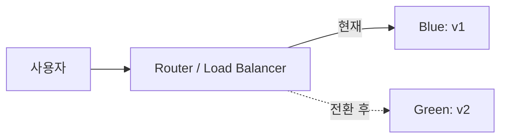
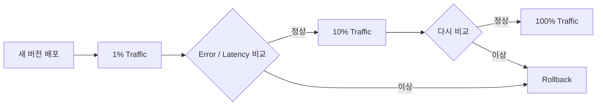

# Release 전략: Rolling · Blue-Green · Canary · Feature Flag · Rollback

배포(Deploy)와 출시(Release)는 다르다. **Deploy는 코드를 환경에 올리는 것**, **Release는 사용자가 그 변경을 경험하게 하는 것**이다. 둘을 분리할수록 위험이 작아진다.

## 전략 한눈에 보기

| 전략 | 방식 | 장점 | 비용 / 주의 |
|---|---|---|---|
| Recreate | 기존 버전을 내리고 새 버전을 올림 | 단순 | 중단 시간 발생 |
| Rolling | Instance를 조금씩 교체 | 추가 자원이 적음 | 두 버전이 잠시 공존 |
| Blue-Green | 동일한 환경을 하나 더 만들고 Routing 전환 | 전환·복귀가 빠름 | 일시적으로 자원 2배 |
| Canary | 일부 Traffic만 새 버전으로 보내고 비교 | 영향 범위 최소화 | 지표와 비교 기준 필요 |
| Feature Flag | 코드는 배포하고 기능 노출만 설정으로 제어 | Deploy와 Release 분리 | Flag 부채 관리 필요 |

## Rolling Update

Kubernetes Deployment의 기본 전략이다. `maxUnavailable`과 `maxSurge`의 기본값은 모두 **25%**다.

```yaml
spec:
  strategy:
    type: RollingUpdate
    rollingUpdate:
      maxUnavailable: 0
      maxSurge: 1
```

- `maxUnavailable: 0`으로 두면 새 Pod가 준비된 뒤에만 기존 Pod를 줄인다.
- Readiness Probe가 부정확하면 준비되지 않은 Pod로 Traffic이 가서 Rolling의 의미가 사라진다.
- 되돌리기: `kubectl rollout undo deployment/<name>` (특정 Revision은 `--to-revision`)
- 기존 Pod가 내려갈 때 처리 중인 요청이 끊기지 않게 한다. App은 SIGTERM을 받으면 새 요청을 멈추고 진행 중인 요청을 마친 뒤 종료하고, `preStop`의 짧은 대기와 `terminationGracePeriodSeconds`로 시간을 확보한다(02 문서의 최소 Manifest).

## Blue-Green



새 버전(Green)을 Production과 같은 환경에 올려 검증한 뒤 Router만 바꾼다. 문제가 생기면 Router를 다시 Blue로 돌린다. **Database Schema가 두 버전 모두와 호환**되어야 이 복귀가 실제로 가능하다.

## Canary

Google SRE Workbook은 Canary를 **변경을 일부에, 일정 시간 동안 배포하고 평가하는 것**으로 정의한다. 작은 Production 구간(Canary)과 나머지(Control)를 비교해 진행 여부를 결정한다.



비교 지표 예: Error Rate, p95 Latency, Crash Rate, 핵심 전환율. 자동화할 때는 **통과 기준을 배포 전에** 정해 둔다.

Traffic을 나누는 방법은 Platform마다 다르다.

- **Cloud Run**: Revision별 Traffic 비율을 지정한다. 예: `gcloud run services update-traffic SERVICE --to-revisions REVISION=5`로 새 Revision에 5%.
- **Kubernetes**: 기본 Deployment는 Pod 수 비율로만 나뉜다. **Argo Rollouts**(`setWeight` 단계)나 **Flagger**가 Service Mesh · Ingress · Gateway API의 가중치를 바꾸고, 지표 분석 결과로 자동 승격 또는 Rollback한다.
- **Load Balancer / CDN / DNS**: 두 Target 또는 Origin에 가중치를 주는 Weighted Routing으로 나눈다. DNS 가중치는 Resolver Cache(TTL) 때문에 비율이 정확하지 않다.

## Feature Flag

martinfowler.com에 실린 Pete Hodgson의 글 "Feature Toggles"는 Release Toggle을 "기능 **Release**와 코드 **Deployment**를 분리"하는 가장 흔한 방법으로 설명한다.

| Flag 종류 | 수명 | 예 |
|---|---|---|
| Release Toggle | 짧음 | 미완성 기능 숨기기 |
| Experiment Toggle | 실험 기간 | A/B Test |
| Ops Toggle | 운영 중 | 장애 시 무거운 기능 끄기 (Kill Switch) |
| Permissioning Toggle | 김 | 유료·Beta 사용자에게만 노출 |

- 공급사 독립적인 표준 API로 **OpenFeature**(CNCF Incubating, 2023-11 승격)가 있다.
- 다 쓴 Flag는 제거한다. 오래된 Flag는 조합 폭발과 사고의 원인이 된다.

## Rollback과 Roll Forward

```text
Rollback      이전 Artifact로 되돌린다. 빠르고 예측 가능하다.
Roll Forward  수정 버전을 새로 배포한다. Data 변경이 되돌릴 수 없을 때 선택한다.
Flag Off      코드는 두고 기능만 끈다. 가장 빠르다.
```

되돌리기를 어렵게 만드는 가장 흔한 원인은 **Database Migration**이다. Parallel Change(Expand → Migrate → Contract) 패턴으로 나눈다.

1. Expand: 새 Column을 추가하고 구·신 코드 모두 동작하게 한다.
2. Migrate: Data를 옮기고 새 코드로 전환한다.
3. Contract: 더 이상 쓰지 않는 Column을 제거한다(충분히 안정된 뒤).

## 나쁜 예 / 좋은 예

```text
나쁜 예: Column 이름 변경과 코드 배포를 한 번에 한다. 배포 실패 시 이전 코드가 새 Schema에서 깨진다.
좋은 예: Column 추가 → 양쪽 쓰기 → 읽기 전환 → 구 Column 제거를 여러 Release로 나눈다.
```

## 모바일은 어떻게 다른가

모바일 앱은 이미 설치된 Binary를 되돌릴 수 없다. 그래서 Store의 **단계적 출시**(Apple Phased Release, Google Play Staged Rollout)와 **Server 측 Feature Flag**가 더 중요하다. 자세한 내용은 05 문서에서 다룬다. 이미 기기에 깔린 문제 Build를 퇴출하는 유일한 방법은 **Server가 확인하는 최소 지원 버전과 강제 Update 화면**이며, 출시 전에 만들어 시험해 두어야 한다(05 문서의 Staged Rollout 운영).

## 참고 자료

- [Deployments](https://kubernetes.io/docs/concepts/workloads/controllers/deployment/) — Kubernetes Docs, 접근일 2026-09-28
- [Pod Lifecycle: Termination of Pods](https://kubernetes.io/docs/concepts/workloads/pods/pod-lifecycle/#pod-termination) — Kubernetes Docs, 접근일 2026-09-28
- [kubectl rollout undo](https://kubernetes.io/docs/reference/kubectl/generated/kubectl_rollout/kubectl_rollout_undo/) — Kubernetes Docs, 접근일 2026-09-28
- [Blue Green Deployment](https://martinfowler.com/bliki/BlueGreenDeployment.html) — Martin Fowler, 접근일 2026-09-28
- [Canary Release](https://martinfowler.com/bliki/CanaryRelease.html) — Martin Fowler, 접근일 2026-09-28
- [Feature Toggles (aka Feature Flags)](https://martinfowler.com/articles/feature-toggles.html) — Pete Hodgson, martinfowler.com, 접근일 2026-09-28
- [Parallel Change](https://martinfowler.com/bliki/ParallelChange.html) — martinfowler.com, 접근일 2026-09-28
- [Canarying Releases](https://sre.google/workbook/canarying-releases/) — Google SRE Workbook, 접근일 2026-09-28
- [OpenFeature becomes a CNCF incubating project](https://www.cncf.io/blog/2023/12/19/openfeature-becomes-a-cncf-incubating-project/) — CNCF, 2023-12-19, 접근일 2026-09-28
- [Rollbacks, gradual rollouts, and traffic migration](https://docs.cloud.google.com/run/docs/rollouts-rollbacks-traffic-migration) — Google Cloud Docs, 접근일 2026-09-28
- [Canary Deployment Strategy](https://argo-rollouts.readthedocs.io/en/stable/features/canary/) — Argo Rollouts Docs, 접근일 2026-09-28
- [Flagger](https://fluxcd.io/flagger/) — Flux, 접근일 2026-09-28
