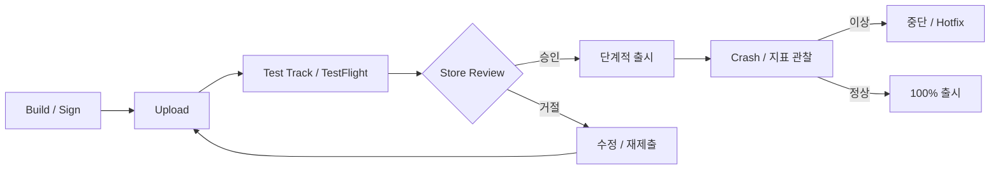

# 모바일 Store 배포: App Store와 Google Play

Web은 배포 즉시 모든 사용자에게 반영되지만, 모바일 앱은 **Store 심사**와 **사용자 Update**라는 두 관문을 지난다. 그래서 일정·정책·단계적 출시를 미리 설계해야 한다.

## 전체 흐름



## 계정과 비용 모델

| 항목 | Apple | Google |
|---|---|---|
| 개발자 계정 | Apple Developer Program 연간 Membership | Play Console 1회 등록비 |
| 심사 도구 | App Store Connect | Play Console |
| 사전 Test | TestFlight | Internal / Closed / Open Testing Track |

금액은 지역과 시점에 따라 다르므로 가입 화면에서 확인한다.

## Apple: 심사와 Test

- **TestFlight**: 내부 Tester 최대 100명, 외부 Tester 최대 10,000명. 외부 Test는 첫 Build가 App Review 승인을 받아야 한다.
- **App Review**: Apple은 평균적으로 제출의 90%를 24시간 이내에 심사한다고 안내한다. 치명적 Bug 수정이나 행사 일정이 있으면 **Expedited Review**를 요청할 수 있다.
- **Phased Release**: 자동 Update 사용자에게 7일에 걸쳐 나누어 배포한다. 최대 30일까지 일시 중지할 수 있으며, 수동 Download는 누구나 언제든 가능하다.
- 자주 거절되는 지점(App Review Guidelines):
  - 2.1 App Completeness: Placeholder 없이 완성된 상태, 로그인 앱은 Demo 계정 또는 Demo Mode 제공, 심사 중 Backend 가동
  - 5.1.1: 계정 생성을 지원하면 **앱 안에서 계정 삭제**도 제공

## Apple: 2026년 확인한 요구사항

| 시행일 | 요구사항 |
|---|---|
| 2024-05-01 | 목록에 있는 API(Required Reason API)를 쓰면 승인된 사유를 Privacy Manifest에 기재 |
| 2026-01-31 | 새 연령 등급 질문에 응답해야 Update 제출이 막히지 않음 |
| 2026-04-28 | Xcode 26 이상, iOS 26 등 26 SDK로 Build해야 Upload 가능 |
| 2026-09-09 | iOS · iPadOS 앱은 iOS 13 이상을 Target해야 Upload 가능 |

- 널리 쓰이는 Third-party SDK(Apple 목록)를 포함하면 해당 SDK의 **Privacy Manifest와 서명**이 필요하다.
- EU에 배포하는 앱은 DSA(Digital Services Act)에 따른 **Trader 상태** 등록이 필요하다.

## Google Play: Track과 신규 계정 조건

| Track | 용도 |
|---|---|
| Internal testing | 최대 100명, 빠른 내부 QA |
| Closed testing | 지정한 Tester 그룹, Track 여러 개 가능 |
| Open testing | 누구나 참여, Play Store에 Test 버전 노출 |
| Production | 일반 사용자 배포, Staged Rollout 가능 |

**2023-11-13 이후 만든 개인 개발자 계정**은 Production 접근을 신청하기 전에 **12명 이상의 Tester가 14일 연속 참여한 Closed Test**를 거쳐야 한다. 조건을 채워도 자동 승인은 아니다. 조직 계정과 그 이전 개인 계정은 해당하지 않는다.

## Google Play: 2026년 확인한 요구사항

| 시행일 | 요구사항 |
|---|---|
| 2026-08-31 | 신규 앱과 Update는 Android 16(API 36) 이상 Target. Wear OS · Automotive는 API 35, TV · XR은 API 34 |
| 2026-08-31 | 기존 앱은 API 35 이상이어야 더 높은 Android 버전의 신규 사용자에게 계속 노출 |
| 2026-11-01 | 위 기한의 연장 요청 시 최대 기한 |
| 2026-09-30 | Brazil, Indonesia, Singapore, Thailand에서 Android Developer Verification 시작(인증 기기, 참여 Store) |
| 2027-02-01 | Android 15 이상을 Target하는 앱의 Update가 16 KB Page Size를 지원하지 않으면 출시 불가 |

```kotlin
android {
    defaultConfig {
        targetSdk = 36
    }
}
```

- **Data safety** 양식: Closed · Open · Production Track에 있는 모든 앱이 작성해야 하며 Privacy Policy 링크가 필요하다. 수집하지 않는 앱도 작성한다.
- **Developer Verification**은 Play 밖에서 배포하는 앱에도 적용되며, 2027년 전 세계로 확대될 예정이다. 학생·취미 개발자용 제한 배포 계정(최대 20대 기기)도 안내되어 있다.

## Staged Rollout 운영

- Google Play의 Staged Rollout 비율은 **자동으로 오르지 않는다**. 지표를 보고 사람이 올린다.
- 문제가 생기면 **Halt**: 추가 사용자에게 배포가 멈추고, 이미 받은 사용자는 그 버전에 남는다.
- 100% 배포 후에도 Halt할 수 있으며, 이때 이전 버전이 신규 사용자에게 다시 제공된다.

## 나쁜 예 / 좋은 예

```text
나쁜 예: 출시 전날 첫 제출. Demo 계정 없이 로그인 필수 앱을 올려 거절, 일정 연기.
좋은 예: 2주 전 TestFlight와 Closed Test 시작, 심사용 Demo 계정 준비,
        Phased Release와 Server Feature Flag로 문제 발생 시 노출을 줄인다.
```

## 제출 전 Checklist

- [ ] 최신 SDK · Target API 기한을 확인했는가
- [ ] Privacy Manifest / Data safety가 실제 수집 내용과 일치하는가 (SDK 포함)
- [ ] 심사용 Demo 계정과 Backend가 준비되었는가
- [ ] 계정 삭제 경로가 앱 안에 있는가
- [ ] 단계적 출시 비율과 Halt 기준(Crash Rate 등)을 정했는가

## 참고 자료

- [Upcoming Requirements](https://developer.apple.com/news/upcoming-requirements/) — Apple Developer, 접근일 2026-09-28
- [TestFlight](https://developer.apple.com/testflight/) — Apple Developer, 접근일 2026-09-28
- [App Review](https://developer.apple.com/distribute/app-review/) — Apple Developer, 접근일 2026-09-28
- [App Review Guidelines](https://developer.apple.com/app-store/review/guidelines/) — Apple Developer, 접근일 2026-09-28
- [Release a version update in phases](https://developer.apple.com/help/app-store-connect/update-your-app/release-a-version-update-in-phases/) — App Store Connect Help, 접근일 2026-09-28
- [Third-party SDK requirements](https://developer.apple.com/support/third-party-SDK-requirements/) — Apple Developer, 접근일 2026-09-28
- [Membership Details - Apple Developer Program](https://developer.apple.com/programs/whats-included/) — Apple Developer, 접근일 2026-09-28
- [Target API level requirements for Google Play apps](https://developer.android.com/google/play/requirements/target-sdk) — Android Developers, 접근일 2026-09-28
- [Support 16 KB page sizes](https://developer.android.com/guide/practices/page-sizes) — Android Developers, 접근일 2026-09-28
- [Android developer verification](https://developer.android.com/developer-verification) — Android Developers, 접근일 2026-09-28
- [Set up an open, closed, or internal test](https://support.google.com/googleplay/android-developer/answer/9845334?hl=en) — Play Console Help, 접근일 2026-09-28
- [App testing requirements for new personal developer accounts](https://support.google.com/googleplay/android-developer/answer/14151465?hl=en) — Play Console Help, 접근일 2026-09-28
- [Release app updates with staged rollouts](https://support.google.com/googleplay/android-developer/answer/6346149?hl=en) — Play Console Help, 접근일 2026-09-28
- [Provide information for Google Play's Data safety section](https://support.google.com/googleplay/android-developer/answer/10787469?hl=en) — Play Console Help, 접근일 2026-09-28
