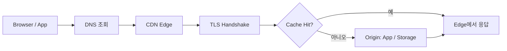

# Domain · DNS · TLS · CDN: 사용자가 도달하는 경로

사용자가 주소창에 Domain을 입력한 순간부터 첫 Byte를 받기까지, 여러 계층이 차례로 관여한다. 어느 한 곳이 틀리면 **서비스는 멀쩡해도 사용자는 접속하지 못한다**.

## 요청이 도달하는 경로



## Domain과 DNS 기본

| Record | 용도 | 예 |
|---|---|---|
| A / AAAA | 이름 → IPv4 / IPv6 주소 | `api.example.com → 203.0.113.10` |
| CNAME | 이름 → 다른 이름 | `www → mysite.hosting-provider.net` |
| TXT | 소유 확인, SPF 등 | Hosting 제공사 인증 문자열 |
| MX | Mail Server 지정 | Mail 서비스 제공사 |
| CAA | 이 Domain의 인증서를 발급할 수 있는 CA 지정 | `0 issue "letsencrypt.org"` |

- **TTL**은 변경이 퍼지는 속도를 정한다. 이전·전환 전에 TTL을 미리 낮춰 두면 되돌리기가 빨라진다.
- Domain 등록 계정에는 **2FA**와 **자동 갱신**을 켠다. Domain 만료는 가장 어이없고 가장 치명적인 장애다.
- Apex Domain(`example.com`)은 표준상 CNAME을 둘 수 없어서, 제공사가 ALIAS · ANAME · CNAME Flattening 같은 기능을 따로 제공하는 경우가 많다.

## TLS 인증서: 수명이 짧아진다

CA/Browser Forum은 2025-04 Ballot SC-081v3를 통과시켜 공개 TLS 인증서의 최대 유효 기간을 단계적으로 줄였다.

| 발급 시점 | 최대 유효 기간 |
|---|---|
| 2026-03-15 이후 | 200일 |
| 2027-03-15 이후 | 100일 |
| 2029-03-15 이후 | 47일 |

Let's Encrypt의 공지된 일정(2026-09-28 확인):

- 2026-01: 6일짜리 단기 인증서와 IP 주소 인증서 정식 제공
- 2026-05-13: Opt-in `tlsserver` Profile을 45일 인증서로 전환
- 2027-02-10: 기본 Profile 64일로 단축
- 2028-02-16: 기본 Profile 45일로 단축

결론은 하나다. **인증서 갱신은 사람이 하는 일이 아니라 자동화(ACME)되어야 하는 일**이다.

```text
나쁜 예: 1년짜리 인증서를 수동 발급하고 Calendar 알림으로 갱신한다.
좋은 예: Hosting / CDN / Ingress의 자동 발급을 쓰거나 ACME Client로 자동 갱신하고,
        만료 임박을 Monitoring 경보로 받는다.
```

**어떻게 자동화하나**

- **VM · 단일 Server**: certbot 같은 ACME Client가 발급하고 갱신 작업을 예약한다. Web Server를 Caddy로 두면 인증서 발급 · 갱신과 HTTP → HTTPS 전환이 기본 동작이다.
- **Kubernetes**: cert-manager가 `Certificate` Resource를 보고 ACME로 발급 · 갱신해 Secret에 저장하고, Ingress · Gateway가 그 Secret을 쓴다.
- **Managed Platform**: 대부분의 Hosting · CDN · Serverless Platform은 Custom Domain을 연결하면 인증서를 자동 발급 · 갱신한다. 할 일은 DNS와 CAA Record를 맞게 두는 것이다.

Let's Encrypt의 `shortlived`(6일)와 `tlsserver` Profile은 **Opt-in**이다. ACME Client가 Profile을 명시적으로 요청해야 하고, 요청하지 않으면 기본 `classic` Profile로 발급된다. Profile 선택을 지원하지 않는 Client도 있다.

## HTTPS 강제: HSTS

HSTS(RFC 6797)는 `Strict-Transport-Security` Header로 "이 사이트는 HTTPS로만 접속하라"고 Browser에 알린다.

```http
Strict-Transport-Security: max-age=31536000; includeSubDomains
```

- 처음에는 짧은 `max-age`로 시작해 문제가 없으면 늘린다.
- `includeSubDomains`는 모든 Subdomain이 HTTPS를 지원할 때만 켠다.

## CDN과 Cache

CDN은 사용자 가까운 Edge에서 응답해 **지연 시간과 Origin 부하**를 줄인다. Cache 동작은 HTTP Caching 표준(RFC 9111)의 `Cache-Control` Header로 제어한다.

| 대상 | 권장 Header 예 | 이유 |
|---|---|---|
| Hash가 붙은 정적 파일 (`app.3f9a.js`) | `public, max-age=31536000, immutable` | 내용이 바뀌면 파일명이 바뀐다 |
| HTML | `no-cache` 또는 짧은 `max-age` | 새 배포가 바로 보여야 한다 |
| 개인화 API 응답 | `private, no-store` | 다른 사용자에게 Cache되면 사고 |

```text
나쁜 예: 파일명을 그대로 두고 긴 Cache를 걸어, 배포 후에도 사용자가 옛 JS를 받는다.
좋은 예: Build 시 파일명에 Content Hash를 넣고, HTML만 짧게 Cache한다.
```

## Edge에서 막는 것

CDN · Edge는 캐시뿐 아니라 **나쁜 요청을 Origin 앞에서 거르는 곳**이다.

- **Rate Limit**: 로그인, 회원가입, 비밀번호 재설정, API Key 발급처럼 남용되기 쉬운 경로에 Client(IP, API Key 등)별 요청 수 제한을 건다. Cloudflare Rate Limiting Rules, AWS WAF Rate-based Rule 등이 있다.
- **Managed WAF Rule**: 제공사가 관리하고 갱신하는 규칙 묶음(Cloudflare Managed Ruleset, AWS Managed Rules)으로 알려진 공격 유형을 막는다. 처음에는 기록(Log / Count) 모드로 켜서 오탐을 확인한다.
- **Bot 필터링**: 알려진 Bot 패턴을 차단하거나 Challenge를 건다(Cloudflare Bot Fight Mode, AWS WAF Bot Control). 결제 Webhook이나 외부 연동처럼 정상 자동 요청은 예외로 둔다.

## 전환(Cutover) 절차

1. 전환 며칠 전 DNS TTL을 낮춘다.
2. 새 환경에서 인증서 발급과 HTTPS 응답을 먼저 확인한다.
3. DNS Record를 바꾸고 여러 지역에서 조회 결과를 확인한다.
4. 옛 환경은 TTL이 충분히 지날 때까지 유지한다.
5. 안정되면 TTL을 원래 값으로 돌린다.

## 참고 자료

- [RFC 8659: DNS Certification Authority Authorization (CAA) Resource Record](https://www.rfc-editor.org/info/rfc8659/) — IETF, 2019-11, 접근일 2026-09-28
- [RFC 6797: HTTP Strict Transport Security (HSTS)](https://www.rfc-editor.org/rfc/rfc6797.html) — IETF, 2012-11, 접근일 2026-09-28
- [RFC 9111: HTTP Caching](https://datatracker.ietf.org/doc/html/rfc9111) — IETF, 2022-06, 접근일 2026-09-28
- [Ballot SC081v3: Introduce Schedule of Reducing Validity and Data Reuse Periods](https://cabforum.org/2025/04/11/ballot-sc081v3-introduce-schedule-of-reducing-validity-and-data-reuse-periods/) — CA/Browser Forum, 2025-04-11, 접근일 2026-09-28
- [Decreasing Certificate Lifetimes to 45 Days](https://letsencrypt.org/2025/12/02/from-90-to-45) — Let's Encrypt, 2025-12-02, 접근일 2026-09-28
- [6-day and IP Address Certificates are Generally Available](https://letsencrypt.org/2026/01/15/6day-and-ip-general-availability) — Let's Encrypt, 2026-01-15, 접근일 2026-09-28
- [Certificate Lifetime Rationale and Plans](https://letsencrypt.org/docs/cert-lifetimes/) — Let's Encrypt, 접근일 2026-09-28
- [Profiles](https://letsencrypt.org/docs/profiles/) — Let's Encrypt, 접근일 2026-09-28
- [Rate limiting rules](https://developers.cloudflare.com/waf/rate-limiting-rules/) — Cloudflare WAF Docs, 접근일 2026-09-28
- [Cloudflare Managed Ruleset](https://developers.cloudflare.com/waf/managed-rules/reference/cloudflare-managed-ruleset/) — Cloudflare WAF Docs, 접근일 2026-09-28
- [Get started with Bot Fight Mode](https://developers.cloudflare.com/bots/get-started/bot-fight-mode/) — Cloudflare Docs, 접근일 2026-09-28
- [Using rate-based rule statements in AWS WAF](https://docs.aws.amazon.com/waf/latest/developerguide/waf-rule-statement-type-rate-based.html) — AWS Docs, 접근일 2026-09-28
- [Using managed rule groups in AWS WAF](https://docs.aws.amazon.com/waf/latest/developerguide/waf-managed-rule-groups.html) — AWS Docs, 접근일 2026-09-28
- [AWS WAF Bot Control](https://docs.aws.amazon.com/waf/latest/developerguide/waf-bot-control.html) — AWS Docs, 접근일 2026-09-28
- [Certbot](https://certbot.eff.org/) — EFF, 접근일 2026-09-28
- [Automatic HTTPS](https://caddyserver.com/docs/automatic-https) — Caddy Docs, 접근일 2026-09-28
- [ACME](https://cert-manager.io/docs/configuration/acme/) — cert-manager Docs, 접근일 2026-09-28
