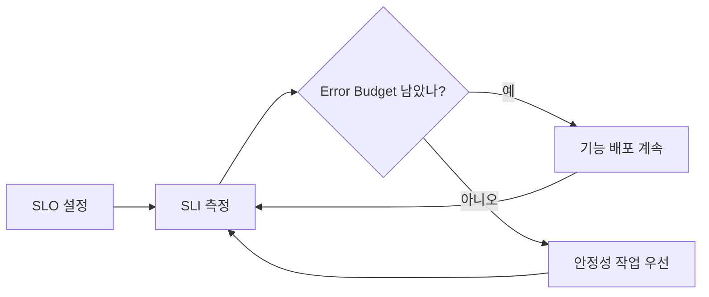
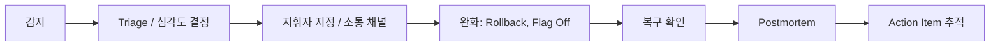

# Observability와 Incident: SLO · Error Budget · On-call · Postmortem

"서버가 떠 있다"와 "사용자가 원하는 일을 할 수 있다"는 다른 문장이다. 운영의 목표는 두 번째 문장을 **숫자로 약속하고 지키는 것**이다.

## SLI · SLO · SLA

| 용어 | 정의 (Google SRE Book 기준) | 예 |
|---|---|---|
| SLI | 서비스 수준을 측정하는 지표 | 정상 응답 요청 수 / 전체 요청 수 |
| SLO | SLI가 도달해야 하는 목표 값 또는 범위 | 30일 동안 99.9% |
| SLA | 목표 미달 시 결과(환불 등)가 따르는 고객과의 약속 | 월 가용성 미달 시 Credit 제공 |

- SLA는 사업·계약 결정이다. 엔지니어는 SLA보다 **엄격한 SLO**를 내부 목표로 둔다.
- 100%는 목표가 아니다. 사용자가 체감하지 못하는 수준 이상의 신뢰성은 **기능 개발 속도를 희생**한다.

## Error Budget

Error Budget은 **1 − SLO**다. SLO가 99.9%면 Budget은 0.1%다.

```text
4주 동안 요청 1,000,000건, SLO 99.9%
→ 허용 실패 = 1,000건
→ Budget이 남아 있으면: 새 기능 배포 계속
→ Budget을 다 쓰면: 배포 속도를 늦추고 안정성 작업 우선
```



Error Budget은 개발과 운영이 "배포해도 되나?"를 **감정이 아니라 숫자로** 합의하게 해 준다. 이를 문서로 합의한 것이 Error Budget Policy다.

## 경보는 SLO에서 출발한다

CPU 80% 같은 원인 지표로 사람을 깨우면 오탐이 많다. SRE Workbook은 **Burn Rate**(Budget을 소모하는 속도)로 경보하고, 여러 시간 창을 함께 보는 **Multiwindow, Multi-burn-rate** 방식을 권장한다.

```text
Burn Rate = 실제 Error 비율 / SLO가 허용하는 Error 비율
예) 30일(720시간) Budget의 2%를 1시간에 쓰면
    Burn Rate = 0.02 × 720 / 1 = 14.4
```

| 경보 등급 | 의미 | 대응 |
|---|---|---|
| Page | Budget이 빠르게 타고 있다 | 즉시 대응 |
| Ticket | 천천히 새고 있다 | 업무 시간에 처리 |

SRE Workbook이 권장하는 시작값(30일 SLO 기준)은 다음과 같다.

| 소모한 Budget | Long Window | Short Window | Burn Rate | 경보 |
|---|---|---|---|---|
| 2% | 1시간 | 5분 | 14.4 | Page |
| 5% | 6시간 | 30분 | 6 | Page |
| 10% | 3일 | 6시간 | 1 | Ticket |

두 창이 **모두** 기준을 넘을 때만 울린다. Long Window는 잠깐 튄 Error로 사람을 깨우지 않게 하고, Short Window는 이미 끝난 사고로 경보가 몇 시간씩 계속 울리지 않게 한다.

Prometheus 경보 규칙 예시(99.9% SLO, 즉 허용 Error 비율 0.001). `job:slo_errors_per_request:ratio_rate1h` 같은 Recording Rule이 창별 Error 비율을 미리 계산해 둔다고 가정한다.

```yaml
groups:
  - name: slo-burn-rate
    rules:
      - alert: ErrorBudgetBurn
        expr: |
          (
            job:slo_errors_per_request:ratio_rate1h{job="api"} > (14.4 * 0.001)
            and
            job:slo_errors_per_request:ratio_rate5m{job="api"} > (14.4 * 0.001)
          )
          or
          (
            job:slo_errors_per_request:ratio_rate6h{job="api"} > (6 * 0.001)
            and
            job:slo_errors_per_request:ratio_rate30m{job="api"} > (6 * 0.001)
          )
        labels:
          severity: page
```

## Observability의 세 신호

| 신호 | 답하는 질문 |
|---|---|
| Metrics | 얼마나, 얼마나 자주? (요청 수, Error Rate, Latency 분포) |
| Logs | 무슨 일이 있었나? (개별 Event와 Context) |
| Traces | 어디서 느려졌나? (Service 사이 요청 경로) |

**OpenTelemetry**는 Metrics, Logs, Traces를 공급사 중립적으로 수집·전송하는 표준이며, 2026-05 CNCF Graduated 단계가 되었다. Instrumentation을 OpenTelemetry로 해 두면 Backend(Monitoring 제품)를 바꿀 때 코드 수정이 줄어든다.

## On-call

- Google SRE Book은 **12시간 On-call 교대당 최대 2건의 Incident**를 목표로 제시한다. 사고 하나에 원인 분석, 복구, Postmortem 작성과 Bug 수정 같은 후속 작업까지 평균 약 6시간이 든다는 계산에서 나온 숫자다. 교대가 더 짧으면 그만큼 줄여 잡는다.
- 경보마다 **Runbook**(무엇을 확인하고 무엇을 해 볼지)을 연결한다.
- 대응하지 않아도 되는 경보는 지운다. 무시되는 경보는 진짜 경보까지 무시하게 만든다.

## Incident 대응 흐름



원인 분석보다 **완화가 먼저**다. 원인을 몰라도 Rollback이나 Flag Off로 사용자 영향을 먼저 멈춘다.

## Backup과 복구 목표

코드는 다시 배포하면 되지만 **Data는 Backup에서만 돌아온다**. 먼저 얼마나 잃고 얼마나 멈춰도 되는지 숫자로 정한다.

| 용어 | 정의 | 묻는 질문 |
|---|---|---|
| RPO (Recovery Point Objective) | 마지막 복구 지점 이후 허용 가능한 최대 시간. 잃어도 되는 Data의 양 | 최악의 경우 몇 분치 Data를 잃어도 되나? |
| RTO (Recovery Time Objective) | 서비스 중단부터 복구까지 허용 가능한 최대 지연 | 몇 분 · 몇 시간 안에 다시 열려야 하나? |

### Managed DB의 PITR

PITR(Point-in-Time Recovery)은 Backup과 Transaction Log로 보존 기간 안의 임의 시점을 복원한다.

- **Amazon RDS**: 자동 Backup 보존 기간은 1–35일. Transaction Log를 5분마다 S3에 올리므로 복원 가능한 최신 시점은 보통 현재보다 약 5분 전이다. 복원하면 기존 Instance를 덮지 않고 **새 DB Instance**가 생기며, Security Group · Parameter Group 같은 설정은 기본값으로 만들어질 수 있다.
- **Cloud SQL**: PITR Log 보존 기간은 Enterprise Plus 1–35일(기본 14일), Enterprise 1–7일(기본 7일).
- 새 Instance로 복원되므로 **연결 주소 교체와 설정 복구**가 Runbook에 있어야 RTO를 지킬 수 있다.

### 복구 연습 절차

1. 복원할 시점(예: 어제 14:00)과 목표 RTO를 정한다.
2. Production과 분리된 곳에 PITR로 새 Instance를 만든다. Production은 건드리지 않는다.
3. Row 수, 가장 최근 Record 시각, 핵심 Query를 확인하고 App을 붙여 Smoke Test를 한다.
4. 요청부터 App이 다시 쓸 수 있을 때까지 걸린 시간이 **측정된 RTO**, 복원된 마지막 Record 시각과 목표 시점의 차이가 **측정된 RPO**다.
5. 막힌 단계(권한, Network, Parameter, Secret)를 Runbook에 적는다.
6. 복원한 Instance를 지운다. 비용과 개인정보 노출을 줄인다.

### Cross-Region 복사는 언제 값어치가 있나

- 계약이나 규제가 Region 전체 장애에서도 복구를 요구할 때
- 유료 핵심 서비스라 Region 장애에도 RPO · RTO를 지켜야 할 때
- 계정 탈취나 실수 삭제에 대비해 **분리된 곳**에 사본이 필요할 때(다른 계정으로의 복사도 함께 검토)

Amazon RDS는 Snapshot과 Transaction Log를 다른 Region으로 복제하는 Cross-Region 자동 Backup을 제공한다. 초기 제품이거나 Data를 다시 만들 수 있다면 저장 · 전송 비용만큼의 가치가 없는 경우가 많다. 개인정보를 해외 Region으로 복사한다면 국외 이전 요건도 검토한다.

## Blameless Postmortem

Google은 **비난 없는(Blameless) Postmortem** 문화를 운영한다. 사고에 관련된 사람들은 당시 가진 정보로 최선의 판단을 했다고 전제하고, **사람이 아니라 환경과 System을 고친다**.

```text
나쁜 예: "배포한 사람이 확인을 안 해서 장애가 났다. 앞으로 주의할 것."
좋은 예: "배포 전 Migration 호환성 검사가 없었다.
         CI에 Schema 호환성 검사를 추가한다 (담당자, 기한)."
```

Postmortem 기본 항목: 요약, 영향(사용자·시간·Budget 소모), Timeline, 근본 원인과 기여 요인, 잘된 점, 운이 좋았던 점, Action Item(담당자·기한).

## 참고 자료

- [Service Level Objectives](https://sre.google/sre-book/service-level-objectives/) — Google SRE Book, 접근일 2026-09-28
- [Implementing SLOs](https://sre.google/workbook/implementing-slos/) — Google SRE Workbook, 접근일 2026-09-28
- [Error Budget Policy](https://sre.google/workbook/error-budget-policy/) — Google SRE Workbook, 접근일 2026-09-28
- [Alerting on SLOs](https://sre.google/workbook/alerting-on-slos/) — Google SRE Workbook, 접근일 2026-09-28
- [Being On-Call](https://sre.google/sre-book/being-on-call/) — Google SRE Book, 접근일 2026-09-28
- [Postmortem Culture: Learning from Failure](https://sre.google/sre-book/postmortem-culture/) — Google SRE Book, 접근일 2026-09-28
- [Disaster Recovery (DR) objectives](https://docs.aws.amazon.com/wellarchitected/latest/reliability-pillar/disaster-recovery-dr-objectives.html) — AWS Well-Architected Reliability Pillar, 접근일 2026-09-28
- [Restoring a DB instance to a specified time for Amazon RDS](https://docs.aws.amazon.com/AmazonRDS/latest/UserGuide/USER_PIT.html) — AWS Docs, 접근일 2026-09-28
- [Replicating automated backups to another AWS Region](https://docs.aws.amazon.com/AmazonRDS/latest/UserGuide/USER_ReplicateBackups.html) — AWS Docs, 접근일 2026-09-28
- [Configure point-in-time recovery (PITR)](https://docs.cloud.google.com/sql/docs/postgres/backup-recovery/configure-pitr) — Cloud SQL for PostgreSQL Docs, 접근일 2026-09-28
- [CNCF Announces OpenTelemetry's Graduation](https://www.cncf.io/announcements/2026/05/21/cloud-native-computing-foundation-announces-opentelemetrys-graduation-solidifying-status-as-the-de-facto-observability-standard/) — CNCF, 2026-05-21, 접근일 2026-09-28
