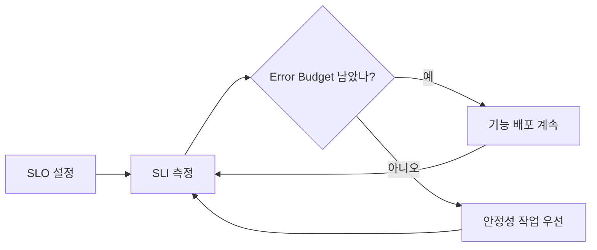

# Observability와 Incident: SLO · Error Budget · On-call · Postmortem

"서버가 떠 있다"와 "사용자가 원하는 일을 할 수 있다"는 다른 문장이다. 운영의 목표는 두 번째 문장을 **숫자로 약속하고 지키는 것**이다.

## SLI · SLO · SLA

| 용어 | 정의 (Google SRE Book 기준) | 예 |
|---|---|---|
| SLI | 서비스 수준을 측정하는 지표 | 정상 응답 요청 수 / 전체 요청 수 |
| SLO | SLI가 도달해야 하는 목표 값 또는 범위 | 30일 동안 99.9% |
| SLA | 목표 미달 시 결과(환불 등)가 따르는 고객과의 약속 | 월 가용성 미달 시 Credit 제공 |

- SLA는 사업·계약 결정이다. 엔지니어는 SLA보다 **엄격한 SLO**를 내부 목표로 둔다.
- 100%는 목표가 아니다. 사용자가 체감하지 못하는 수준 이상의 신뢰성은 **기능 개발 속도를 희생**한다.

## Error Budget

Error Budget은 **1 − SLO**다. SLO가 99.9%면 Budget은 0.1%다.

```text
4주 동안 요청 1,000,000건, SLO 99.9%
→ 허용 실패 = 1,000건
→ Budget이 남아 있으면: 새 기능 배포 계속
→ Budget을 다 쓰면: 배포 속도를 늦추고 안정성 작업 우선
```



Error Budget은 개발과 운영이 "배포해도 되나?"를 **감정이 아니라 숫자로** 합의하게 해 준다. 이를 문서로 합의한 것이 Error Budget Policy다.

## 경보는 SLO에서 출발한다

CPU 80% 같은 원인 지표로 사람을 깨우면 오탐이 많다. SRE Workbook은 **Burn Rate**(Budget을 소모하는 속도)로 경보하고, 여러 시간 창을 함께 보는 **Multiwindow, Multi-burn-rate** 방식을 권장한다.

```text
Burn Rate = 실제 Error 비율 / SLO가 허용하는 Error 비율
예) 30일(720시간) Budget의 2%를 1시간에 쓰면
    Burn Rate = 0.02 × 720 / 1 = 14.4
```

| 경보 등급 | 의미 | 대응 |
|---|---|---|
| Page | Budget이 빠르게 타고 있다 | 즉시 대응 |
| Ticket | 천천히 새고 있다 | 업무 시간에 처리 |

## Observability의 세 신호

| 신호 | 답하는 질문 |
|---|---|
| Metrics | 얼마나, 얼마나 자주? (요청 수, Error Rate, Latency 분포) |
| Logs | 무슨 일이 있었나? (개별 Event와 Context) |
| Traces | 어디서 느려졌나? (Service 사이 요청 경로) |

**OpenTelemetry**는 Metrics, Logs, Traces를 공급사 중립적으로 수집·전송하는 표준이며, 2026-05 CNCF Graduated 단계가 되었다. Instrumentation을 OpenTelemetry로 해 두면 Backend(Monitoring 제품)를 바꿀 때 코드 수정이 줄어든다.

## On-call

- Google SRE Book은 On-call 교대(8–12시간)당 **최대 2건의 Event**를 목표로 제시한다. 그래야 정확히 대응하고, 정리하고, Postmortem까지 쓸 시간이 남는다.
- 경보마다 **Runbook**(무엇을 확인하고 무엇을 해 볼지)을 연결한다.
- 대응하지 않아도 되는 경보는 지운다. 무시되는 경보는 진짜 경보까지 무시하게 만든다.

## Incident 대응 흐름


원인 분석보다 **완화가 먼저**다. 원인을 몰라도 Rollback이나 Flag Off로 사용자 영향을 먼저 멈춘다.

## Blameless Postmortem

Google은 **비난 없는(Blameless) Postmortem** 문화를 운영한다. 사고에 관련된 사람들은 당시 가진 정보로 최선의 판단을 했다고 전제하고, **사람이 아니라 환경과 System을 고친다**.

```text
나쁜 예: "배포한 사람이 확인을 안 해서 장애가 났다. 앞으로 주의할 것."
좋은 예: "배포 전 Migration 호환성 검사가 없었다.
         CI에 Schema 호환성 검사를 추가한다 (담당자, 기한)."
```

Postmortem 기본 항목: 요약, 영향(사용자·시간·Budget 소모), Timeline, 근본 원인과 기여 요인, 잘된 점, 운이 좋았던 점, Action Item(담당자·기한).

## 참고 자료

- [Service Level Objectives](https://sre.google/sre-book/service-level-objectives/) — Google SRE Book, 접근일 2026-09-28
- [Implementing SLOs](https://sre.google/workbook/implementing-slos/) — Google SRE Workbook, 접근일 2026-09-28
- [Error Budget Policy](https://sre.google/workbook/error-budget-policy/) — Google SRE Workbook, 접근일 2026-09-28
- [Alerting on SLOs](https://sre.google/workbook/alerting-on-slos/) — Google SRE Workbook, 접근일 2026-09-28
- [Being On-Call](https://sre.google/sre-book/being-on-call/) — Google SRE Book, 접근일 2026-09-28
- [Postmortem Culture: Learning from Failure](https://sre.google/sre-book/postmortem-culture/) — Google SRE Book, 접근일 2026-09-28
- [CNCF Announces OpenTelemetry's Graduation](https://www.cncf.io/announcements/2026/05/21/cloud-native-computing-foundation-announces-opentelemetrys-graduation-solidifying-status-as-the-de-facto-observability-standard/) — CNCF, 2026-05-21, 접근일 2026-09-28
