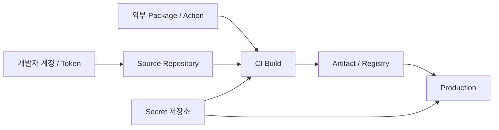

# 보안과 Supply Chain: Secret · SBOM · SLSA · 의존성

오늘날의 제품은 직접 쓴 코드보다 **가져다 쓴 코드와 도구**가 훨씬 많다. 공격자는 가장 약한 고리, 즉 의존성 Package, CI Action, 개발자 Token을 노린다.

## 공격 지점 지도



각 화살표가 공격 경로다. 방어도 같은 지점에 둔다.

| 지점 | 대표 위험 | 기본 방어 |
|---|---|---|
| 개발자 계정 | Token 유출, 탈취 | 2FA, 짧은 수명 Token |
| Source | 악성 Commit, 무단 변경 | Branch 보호, 필수 Review |
| 의존성 | 변조된 Package | Lockfile, 취약점 Scan, 버전 고정 |
| CI | 변조된 Action, Secret 노출 | SHA 고정, 최소 권한, OIDC |
| Artifact | 바꿔치기 | 서명, Provenance 검증 |
| Runtime | Secret 하드코딩 | Secret Manager, 주기적 교체 |

## 실제 사고에서 배우기

| 시기 | 사고 | 교훈 |
|---|---|---|
| 2025-03 | `tj-actions/changed-files` Action 변조(CVE-2025-30066), Workflow Log로 Secret 노출 가능 | Action SHA 고정, 노출 Secret 즉시 교체 |
| 2025-09 | npm 생태계 Worm("Shai-Hulud"): 탈취한 개발자 권한으로 다른 Package에 악성 코드 주입 후 재배포 | 게시용 장기 Token 제거, 게시 권한 최소화 |

이후 npm은 **Trusted Publishing(OIDC)** 을 2025-07-31 정식 제공했고, 2025년 말까지 Classic Token을 폐지하며 쓰기 권한 Granular Token의 수명을 짧게 제한했다.

## Secret 관리

```text
나쁜 예: .env 파일을 Repository에 Commit하고, 유출 후 Commit만 되돌린다.
좋은 예: Secret Manager에 저장하고 실행 시 주입한다. 유출되면 "삭제"가 아니라 "교체"한다.
```

- Git 이력에 한 번 들어간 Secret은 **이미 유출된 것**으로 본다.
- GitHub는 2024-03부터 개인 계정의 새 Public Repository에 Secret Scanning과 **Push Protection**을 기본으로 켠다. Push Protection은 지원되는 Secret이 포함된 Push를 막는다.
- CI에서 Cloud 접근은 OIDC로 받는 짧은 수명 Token을 쓴다(03 문서).

## SBOM: 무엇이 들어 있는가

SBOM(Software Bill of Materials)은 제품에 포함된 구성 요소 목록이다. 새 취약점이 발표되면 "우리 제품에 이 Library가 있나?"에 **몇 분 안에** 답하게 해 준다.

- 대표 형식: **SPDX**, **CycloneDX**. 둘 다 기계 처리가 가능하다.
- 미국 CISA 등은 2026-07-29 **2026 Minimum Elements for an SBOM**을 발표해 2021년 NTIA 최소 요소를 대체했다. Component Hash Algorithm, Component License, SBOM Tool Name, SBOM Generation Context 등이 새로 추가되었고, Open Source · AI Software · SaaS를 포함한 모든 Software에 적용된다.

## SLSA: 누가 어떻게 Build했는가

SLSA는 Supply Chain 보안 수준을 **Track과 Level**로 나눈 명세다. 2025-11-24 발표된 **v1.2**가 최신이며, v1.1과 하위 호환된다.

| Track | 초점 |
|---|---|
| Build Track | Artifact가 기대한 방식으로 Build되었는지 검증. 최저 Level은 Provenance 존재, 높을수록 Build · Provenance 변조 방지 강화 |
| Source Track (v1.2 신설) | Source 작성·Review·관리 과정의 위협. Level 2는 이력과 Provenance, Level 3는 기술적 통제의 지속적 강제 |

GitHub Artifact Attestations는 Build Provenance를 만들어 주며, GitHub 문서 기준 **SLSA v1.0 Build Level 2**를 제공한다.

Release Build Job에서 SBOM과 Provenance를 함께 만든다.

```yaml
permissions:
  contents: read
  id-token: write
  attestations: write
steps:
  - uses: actions/checkout@<commit-sha>
  - run: npm ci && npm run build
  - run: mkdir -p dist && tar -czf dist/app.tar.gz build
  - run: npm sbom --sbom-format cyclonedx > dist/sbom.cdx.json
  - uses: actions/attest-build-provenance@<commit-sha>
    with:
      subject-path: dist/app.tar.gz
```

- `npm sbom`은 설치된 의존성으로 CycloneDX 또는 SPDX 형식 SBOM을 만든다. 언어가 섞여 있거나 Container Image가 대상이면 syft(`syft <image> -o spdx-json`) 같은 도구를 쓴다.
- `attest-build-provenance`는 OIDC Token(`id-token: write`)으로 서명하고 `attestations: write` 권한으로 Attestation을 저장한다.

받는 쪽은 배포 전에 검증한다.

```bash
gh attestation verify ./dist/app.tar.gz --repo my-org/my-app
```

## 의존성 건강 상태

- **Lockfile**을 Commit하고 CI에서는 Lockfile 그대로 설치한다(`npm ci` 등).
- Dependabot 같은 도구로 취약점 알림과 Update PR을 받는다.
- **OpenSSF Scorecard**는 Open Source Project의 보안 관행(Branch 보호, 서명, 의존성 관리 등)을 자동 점검해 0–10점으로 보여 준다. 새 의존성을 들이기 전에 확인한다.

## 규제: EU Cyber Resilience Act

EU에 디지털 요소가 있는 제품을 판매한다면 CRA를 확인한다.

- **2026-09-11부터** 제조사는 실제 악용되는 취약점과 심각한 보안 사고를 보고해야 한다.
- 보고 시한: 인지 후 24시간 내 조기 경보, 72시간 내 통지, 최종 보고는 취약점의 경우 수정 조치 후 14일 이내, 심각한 사고는 통지 후 1개월 이내.
- 보고는 ENISA의 Single Reporting Platform을 통한다. 나머지 의무는 2027-12-11부터 적용된다.

## 최소 실천 목록

- [ ] 모든 계정 2FA, Token은 짧은 수명과 최소 권한
- [ ] Secret Scanning / Push Protection 사용
- [ ] Lockfile Commit, 의존성 취약점 알림 사용
- [ ] CI Action SHA 고정, Workflow `permissions` 최소화
- [ ] Release Artifact에 SBOM과 Provenance 첨부
- [ ] 취약점 신고 창구(Security Policy)와 대응 절차 문서화

## 참고 자료

- [Supply Chain Compromise of Third-Party tj-actions/changed-files](https://www.cisa.gov/news-events/alerts/2025/03/18/supply-chain-compromise-third-party-tj-actionschanged-files-cve-2025-30066-and-reviewdogaction) — CISA, 2025-03-18, 접근일 2026-09-28
- [Widespread Supply Chain Compromise Impacting npm Ecosystem](https://www.cisa.gov/news-events/alerts/2025/09/23/widespread-supply-chain-compromise-impacting-npm-ecosystem) — CISA, 2025-09-23, 접근일 2026-09-28
- [npm trusted publishing with OIDC is generally available](https://github.blog/changelog/2025-07-31-npm-trusted-publishing-with-oidc-is-generally-available/) — GitHub Changelog, 2025-07-31, 접근일 2026-09-28
- [npm classic tokens revoked, session-based auth and CLI token management now available](https://github.blog/changelog/2025-12-09-npm-classic-tokens-revoked-session-based-auth-and-cli-token-management-now-available/) — GitHub Changelog, 2025-12-09, 접근일 2026-09-28
- [Secret scanning and push protection are enabled by default on new public repositories](https://github.blog/changelog/2024-03-11-secret-scanning-and-push-protection-are-enabled-by-default-on-new-public-repositories/) — GitHub Changelog, 2024-03-11, 접근일 2026-09-28
- [2026 Minimum Elements for a Software Bill of Materials (SBOM)](https://www.cisa.gov/resources-tools/resources/2026-minimum-elements-software-bill-materials-sbom) — CISA, 2026-07-29, 접근일 2026-09-28
- [Announcing SLSA v1.2](https://slsa.dev/blog/2025/11/announce-slsa-v1.2) — SLSA, 2025-11-24, 접근일 2026-09-28
- [SLSA specification v1.2](https://slsa.dev/spec/v1.2/) — SLSA, 접근일 2026-09-28
- [Artifact attestations](https://docs.github.com/en/actions/concepts/security/artifact-attestations) — GitHub Docs, 접근일 2026-09-28
- [OpenSSF Scorecard](https://openssf.org/projects/scorecard/) — OpenSSF, 접근일 2026-09-28
- [Cyber Resilience Act - Reporting obligations](https://digital-strategy.ec.europa.eu/en/policies/cra-reporting) — European Commission, 접근일 2026-09-28
- [npm-sbom](https://docs.npmjs.com/cli/v11/commands/npm-sbom/) — npm Docs, 접근일 2026-09-28
- [Using artifact attestations to establish provenance for builds](https://docs.github.com/actions/security-for-github-actions/using-artifact-attestations/using-artifact-attestations-to-establish-provenance-for-builds) — GitHub Docs, 접근일 2026-09-28
- [actions/attest-build-provenance](https://github.com/actions/attest-build-provenance) — GitHub, 접근일 2026-09-28
- [anchore/syft](https://github.com/anchore/syft) — Anchore, 접근일 2026-09-28
