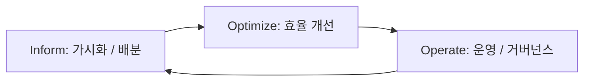
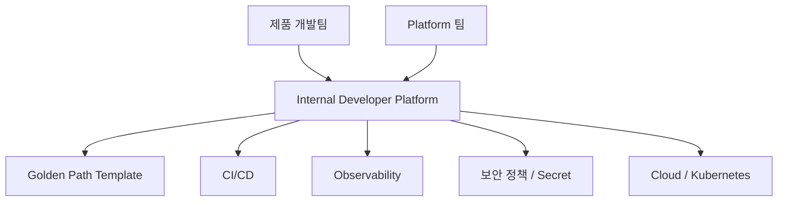

# FinOps와 Platform Engineering: 비용 책임과 내부 개발자 Platform

서비스가 커지면 두 가지 질문이 생긴다. "**이 비용은 누구 것이고 가치가 있는가?**" 그리고 "**팀마다 배포 방식을 새로 만들어야 하는가?**" 앞의 것이 FinOps, 뒤의 것이 Platform Engineering이다.

## FinOps란

FinOps Foundation은 FinOps를 Engineering, Finance, Business가 함께 **Technology 지출의 가치를 최대화**하는 운영 방식으로 본다. 핵심은 "비용 절감"이 아니라 **비용 대비 가치에 대한 공동 책임**이다.



| 단계 | 하는 일 | 예 |
|---|---|---|
| Inform | 누가 무엇에 얼마를 쓰는지 보이게 한다 | Tag · Label로 팀·서비스별 비용 배분, 예산 대비 추적 |
| Optimize | 낭비를 줄이고 단가를 낮춘다 | 쓰지 않는 자원 정리, Rightsizing, 약정 할인 검토 |
| Operate | 정책과 습관으로 굳힌다 | 예산 경보, 비용 Review 정례화, 설계 단계 비용 검토 |

## 2025–2026 Framework 변화

- **Framework 2025**: **Scopes**를 핵심 요소로 추가했다. Public Cloud뿐 아니라 SaaS, AI, License, Data Center 등 **Cloud+** 지출을 범위별로 관리한다.
- **Framework 2026**: Executive Strategy Alignment Capability를 추가해 Technology 지출을 경영 전략과 연결한다. Foundation의 Mission 표현도 "Cloud"에서 "Technology"로 바뀌었다.
- **FOCUS**(FinOps Open Cost and Usage Specification): 여러 Cloud · SaaS의 청구 Data를 같은 Schema로 맞추는 공개 명세. **v1.4**가 2026-06-04 비준되었다.

## 엔지니어가 할 수 있는 FinOps

```text
나쁜 예: 월말 청구서를 보고 놀란 뒤, 누가 만든 자원인지 찾느라 일주일을 쓴다.
좋은 예: 모든 자원에 owner · service · env Tag를 강제하고,
        예산의 일정 비율을 넘으면 담당 팀에 알림이 간다.
```

```yaml
labels:
  owner: team-checkout
  service: payment-api
  env: production
  cost-center: product
```

- **단위 비용**(Unit Cost)을 본다: "월 총비용"보다 "주문 1건당 Infra 비용"이 의사결정에 유용하다.
- 개발 · Staging 환경은 업무 시간 외 축소나 Scale to Zero를 검토한다.
- Egress(Data 전송) 비용과 Log 보관 비용은 자주 과소평가된다.
- AWS Well-Architected의 Cost Optimization Pillar처럼, 비용은 **설계 단계의 품질 속성**이다.

## Platform Engineering이란

CNCF Platforms White Paper(2023-04)는 Platform을 내부 사용자(제품 · 앱 팀)의 일을 쉽게 하는 **공통 기능과 경험의 묶음**으로 정의하고, Platform Engineering을 그 Platform을 계획하고 제공하는 실천으로 설명한다. 사람, Process, 정책, 기술이 모두 포함된다.



- **Golden Path**: "이 길로 가면 보안 · 관측 · 배포가 기본으로 갖춰진다"는 표준 경로. 강제가 아니라 **가장 쉬운 선택**이어야 한다.
- **Platform as a Product**: 내부 개발자를 고객으로 보고, 요구를 조사하고, 채택률과 만족도를 측정한다.
- 개발자 Portal(예: Backstage 같은 도구)은 수단일 뿐, Portal이 곧 Platform은 아니다.

## 성숙도 모델

CNCF Platform Engineering Maturity Model은 5개 측면을 4단계로 본다.

| 측면 | 질문 |
|---|---|
| Investment | Platform에 사람과 예산을 어떻게 배정하는가 |
| Adoption | 개발자가 왜, 어떻게 Platform을 쓰게 되는가 |
| Interfaces | 개발자는 어떤 방식(문서, CLI, Portal, API)으로 Platform을 쓰는가 |
| Operations | Platform 기능을 어떻게 운영하고 개선하는가 |
| Measurement | Platform의 효과를 어떻게 측정하는가 |

4단계: **Provisional → Operational → Scalable → Optimizing**. 모든 측면을 최고 단계로 올리는 것이 목표가 아니라, 조직 상황에 맞는 단계를 고르는 도구다.

## 언제 Platform 팀이 필요한가

```text
신호 있음: 팀마다 CI/CD · 인증서 · Monitoring 설정을 복사해 쓰고, 같은 사고가 반복된다.
시기상조:  제품 팀이 하나이고, 배포 방식이 이미 하나로 통일되어 있다.
```

작은 조직에서는 전담 팀 대신 **공통 Template Repository와 문서화된 배포 절차**가 Platform의 첫 형태가 될 수 있다.

## 참고 자료

- [What is FinOps?](https://www.finops.org/introduction/what-is-finops/) — FinOps Foundation, 접근일 2026-09-28
- [FinOps Phases](https://www.finops.org/framework/phases/) — FinOps Foundation, 접근일 2026-09-28
- [Framework 2025: Scopes](https://www.finops.org/insights/2025-finops-framework/) — FinOps Foundation, 2025, 접근일 2026-09-28
- [FinOps Framework 2026](https://www.finops.org/insights/2026-finops-framework/) — FinOps Foundation, 2026, 접근일 2026-09-28
- [FOCUS Specification](https://focus.finops.org/focus-specification/) — FinOps Foundation, 접근일 2026-09-28
- [Cost Optimization Pillar - AWS Well-Architected](https://docs.aws.amazon.com/wellarchitected/latest/framework/the-pillars-of-the-framework.html) — AWS Docs, 접근일 2026-09-28
- [CNCF Platforms White Paper](https://tag-app-delivery.cncf.io/whitepapers/platforms/) — CNCF TAG App Delivery, 2023-04, 접근일 2026-09-28
- [Platform Engineering Maturity Model](https://tag-app-delivery.cncf.io/whitepapers/platform-eng-maturity-model/) — CNCF TAG App Delivery, 2023-11, 접근일 2026-09-28
