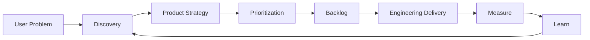

# Product Owner 전체 개요

Product Owner는 단순히 요구사항을 전달하거나 Backlog를 관리하는 사람이 아니다.

> **제한된 시간과 자원을 어디에 써야 가장 큰 사용자·사업 가치를 만들 수 있는지 결정하고, 팀이 그 방향으로 움직이게 만드는 역할**이다.

## PO가 책임지는 핵심 질문

1. 누구의 어떤 문제를 해결하는가?
2. 왜 지금 해야 하는가?
3. 무엇을 먼저 만들 것인가?
4. 무엇은 하지 않을 것인가?
5. 성공을 무엇으로 측정할 것인가?
6. 개발팀이 모호함 없이 구현할 수 있는가?
7. 결과가 실제 사용자 가치로 이어졌는가?



## PO의 책임 범위

| 영역 | PO의 책임 |
|---|---|
| 사용자 | 문제와 맥락 이해 |
| 제품 | 목표, Scope, 우선순위 |
| 사업 | 가치, 비용, 리스크 이해 |
| 개발 | 명확한 요구사항과 결정 제공 |
| 디자인 | 사용자 Workflow와 경험 품질 |
| 데이터 | 성공 기준과 결과 확인 |
| 조직 | 이해관계 조정과 의사결정 |

## PO의 산출물

PO는 문서를 만드는 사람이 아니라 **결정을 만드는 사람**이다. 문서는 그 결정을 전달하는 도구다.

대표 산출물:

- Product Goal
- Problem Statement
- User Scenario / Workflow
- Roadmap
- Backlog
- Acceptance Criteria
- Priority
- Decision Log
- Release Scope
- Metrics / Outcome Review

## PO의 하루를 단순화하면

```text
문제 이해
→ 선택
→ 명확화
→ 개발 지원
→ 검증
→ 학습
→ 다시 선택
```

좋은 PO는 기능 수를 늘리는 사람이 아니라 **틀린 기능을 만들 확률을 줄이는 사람**에 가깝다.