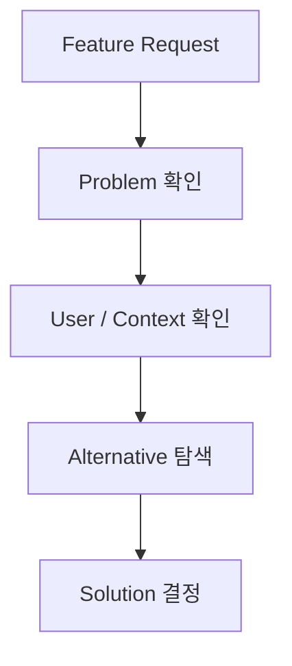

# PO의 자격과 핵심 역량

PO에게 반드시 필요한 것은 특정 학위나 자격증보다 **문제를 구조화하고 선택을 책임지는 능력**이다.

## 핵심 역량 8가지

| 역량 | 설명 |
|---|---|
| 문제 정의 | 증상과 근본 문제를 구분 |
| 사용자 이해 | 실제 Workflow와 Pain Point 파악 |
| 우선순위 | 가치·비용·리스크를 비교해 선택 |
| 제품 감각 | 기능보다 전체 경험과 맥락을 판단 |
| 기술 이해 | 구현 제약과 비용을 대화 가능한 수준으로 이해 |
| 커뮤니케이션 | 이해관계자 간 의미를 번역 |
| 데이터 해석 | Metric을 목표가 아니라 판단 근거로 사용 |
| 책임감 | 모호한 결정을 미루지 않음 |

## 좋은 PO의 사고 패턴

### 기능 요청을 그대로 받지 않는다

```text
요청:
"버튼을 하나 추가해 주세요."

PO:
왜 필요한가?
어떤 상황에서 쓰는가?
현재 Workflow의 문제는 무엇인가?
버튼 추가가 가장 작은 해결책인가?
```

### Solution보다 Problem을 먼저 고정한다



## 자격증은 필요한가?

Scrum/Agile 관련 자격은 개념 학습과 채용 신호에는 도움이 될 수 있지만 PO 역량 자체를 보장하지 않는다.

실무에서 더 중요한 증거는:

- 실제 사용자 문제를 찾아낸 사례
- 우선순위를 바꾼 근거
- 실패한 Feature를 중단한 판단
- 개발팀과 Scope를 줄인 경험
- 결과 Metric을 보고 다음 의사결정을 한 경험

## PO가 피해야 할 패턴

- 요청사항을 그대로 Ticket으로 옮기기
- 개발팀에게 Solution만 전달하기
- 모든 이해관계자를 만족시키려 하기
- Roadmap을 약속 목록으로 만들기
- Metric 상승 자체를 제품 가치로 착각하기
- 기술을 전혀 이해하지 않으려 하기
- 중요한 결정을 회의 뒤로 미루기

PO의 자격은 결국 **무엇을 만들지보다 무엇을 만들지 않을지를 설명할 수 있는 능력**에서 드러난다.