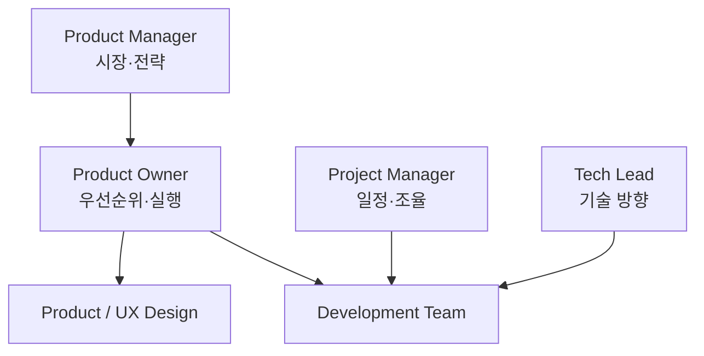

# PO · PM · Project Manager 차이

조직마다 명칭은 다르지만 책임의 중심을 구분하면 이해하기 쉽다.

| 역할 | 중심 질문 | 주요 책임 |
|---|---|---|
| Product Owner | 다음에 무엇을 만들 것인가? | Backlog, 우선순위, 팀 의사결정 |
| Product Manager | 어떤 제품을 왜 만들 것인가? | 시장, 전략, Product Direction |
| Project Manager | 어떻게 일정 안에 완료할 것인가? | 일정, 자원, 의존성, 실행 관리 |
| UX/Product Designer | 사용자가 어떻게 경험할 것인가? | Workflow, Interaction, Usability |
| Tech Lead | 기술적으로 어떻게 만들 것인가? | Architecture, 구현 방향, 품질 |



## 실제 조직에서는 겹친다

작은 팀에서는 한 사람이 PM + PO를 동시에 할 수 있다.

```text
Startup
Founder / Product Lead
├─ PM 역할
├─ PO 역할
└─ 일부 Project Management
```

큰 조직에서는 책임이 더 나뉜다.

## 역할을 구분하는 가장 쉬운 기준

### Product Manager

시장과 제품 전체를 본다.

- 시장
- 경쟁
- Positioning
- 가격
- 장기 전략
- Growth

### Product Owner

개발팀 가까이에서 제품 결정을 구체화한다.

- Backlog
- Scope
- Acceptance
- Priority
- Release 단위

### Project Manager

일이 계획대로 흘러가는지 관리한다.

- 일정
- Resource
- Dependency
- Risk
- Communication Plan

## 가장 흔한 실패

PO가 Project Manager처럼 일정만 추적하면 제품 판단이 사라진다.

반대로 전략만 말하고 개발팀의 세부 결정에 답하지 못하면 PO 역할이 비어 버린다.

> PO는 전략과 구현 사이를 연결하는 **의사결정 인터페이스**라고 볼 수 있다.