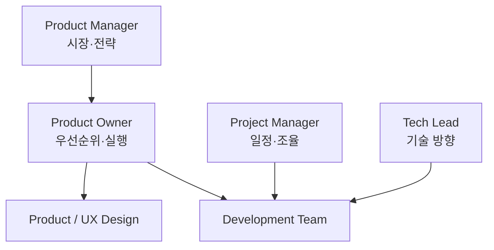

# PO · PM · Project Manager 차이

조직마다 명칭은 다르지만 책임의 중심을 구분하면 이해하기 쉽다.

| 역할 | 중심 질문 | 주요 책임 |
|---|---|---|
| Product Owner | 다음에 무엇을 만들 것인가? | Backlog, 우선순위, 팀 의사결정 |
| Product Manager | 어떤 제품을 왜 만들 것인가? | 시장, 전략, Product Direction |
| Project Manager | 어떻게 일정 안에 완료할 것인가? | 일정, 자원, 의존성, 실행 관리 |
| UX/Product Designer | 사용자가 어떻게 경험할 것인가? | Workflow, Interaction, Usability |
| Tech Lead | 기술적으로 어떻게 만들 것인가? | Architecture, 구현 방향, 품질 |



## 실제 조직에서는 겹친다

작은 팀에서는 한 사람이 PM + PO를 동시에 할 수 있다.

```text
Startup
Founder / Product Lead
├─ PM 역할
├─ PO 역할
└─ 일부 Project Management
```

큰 조직에서는 책임이 더 나뉜다.

## 역할을 구분하는 가장 쉬운 기준

### Product Manager

시장과 제품 전체를 본다.

- 시장
- 경쟁
- Positioning
- 가격
- 장기 전략
- Growth

### Product Owner

개발팀 가까이에서 제품 결정을 구체화한다.

- Backlog
- Scope
- Acceptance
- Priority
- Release 단위

### Project Manager

일이 계획대로 흘러가는지 관리한다.

- 일정
- Resource
- Dependency
- Risk
- Communication Plan

## 가장 흔한 실패

PO가 Project Manager처럼 일정만 추적하면 제품 판단이 사라진다.

반대로 전략만 말하고 개발팀의 세부 결정에 답하지 못하면 PO 역할이 비어 버린다.

> PO는 전략과 구현 사이를 연결하는 **의사결정 인터페이스**라고 볼 수 있다.

## Product Manager의 실제 업무

PM은 사용자 문제와 사업 목표를 연결하고, 출시 이후에도 제품 방향을 조정한다. 일상 업무는 다음과 같이 구체화할 수 있다.

| 업무 | 실제 행동 | 산출물 예 |
|---|---|---|
| Discovery | 인터뷰·사용 데이터·경쟁 제품에서 문제를 검증 | 문제 정의, 조사 요약 |
| 전략 | 대상 사용자와 차별점, 성공 기준을 정리 | Product Brief, 전략 문서 |
| 우선순위 | 기회를 비교하고 팀·이해관계자와 선택을 조율 | Outcome 중심 Roadmap, 결정 기록 |
| 성과 확인 | 출시 후 사용과 결과를 검토해 다음 투자를 조정 | 지표 검토, 실험 결과 |

책임의 구체적인 분담은 조직 규모와 팀 구성에 따라 달라진다. [Atlassian의 Product Manager 역할 설명](https://www.atlassian.com/agile/product-management/product-manager)을 바탕으로 정리했다.

## Project Manager의 실제 업무

Project Manager는 합의한 결과물을 전달할 수 있도록 실행 조건을 관리한다. 다음은 프로젝트 전반에서 사용하는 실무 예다.

| 업무 | 실제 행동 | 산출물 예 |
|---|---|---|
| 범위·계획 | 완료 조건을 합의하고 작업·일정·자원을 계획 | 범위 정의, 일정표, 자원 계획 |
| 의존성·위험 | 선행 작업과 병목을 확인하고 대응 담당자를 지정 | 의존성 목록, 위험·이슈 기록 |
| 진행·변경 | 계획 대비 상황과 변경 영향을 공유하고 승인을 조율 | 상태 보고, 변경 기록 |
| 종료 | 인수·운영 이관·남은 책임을 확인하고 교훈을 정리 | 인수 확인, 이관 문서, 회고 |

이 업무는 범위, 결과물, 위험, 팀 간 소통을 다루는 [PMI의 프로젝트 관리 설명](https://www.pmi.org/about/what-is-project-management)을 실제 작업으로 풀어낸 것이다.

## 협업과 결정의 경계

제품 방향·가치 판단은 PM/PO가, 실행 가능성과 구현 방법은 개발팀이, 일정·자원·의존성 조율은 Project Manager가 중심이 되어 논의한다. 예를 들어 일정 지연이 예상되면 Project Manager가 영향을 드러내고, PM/PO가 가치에 따른 범위 선택을 개발팀과 협의한다. 직함만으로 승인 권한이 정해지지는 않으므로 조직별 결정권자를 명시해야 한다.

Scrum에서 PO는 **제품 가치 극대화와 효과적인 Product Backlog 관리에 대한 최종 책임**을 진다. 단순한 Sprint 행정 담당자가 아니다. **Sprint Backlog는 Developers가 만들고 관리하는 계획**이며, 구현 방법 역시 Developers가 결정한다. PM과 Project Manager는 Scrum이 별도로 정의한 책임 역할이 아니다. [Scrum Guide](https://scrumguides.org/scrum-guide.html).
