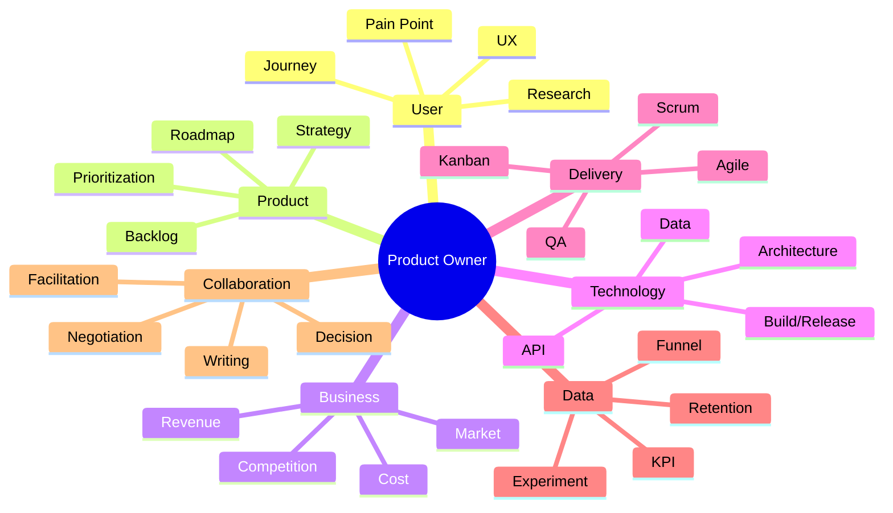

# PO가 알아야 할 지식 지도

PO는 모든 분야의 전문가일 필요는 없다. 하지만 여러 전문 영역 사이에서 **의미 있는 질문과 판단을 할 수 있을 정도의 넓이**가 필요하다.

## 1. 사용자·UX

알아야 할 것:

- Persona보다 실제 행동
- User Journey
- Task Flow
- Usability
- Discoverability
- Error State
- Accessibility
- Feedback Loop

## 2. Product Strategy

- Vision
- Product Goal
- Positioning
- Problem/Solution Fit
- Roadmap
- Opportunity Cost
- MVP / MLP
- Product-Market Fit의 개념

## 3. 기술

개발자가 될 필요는 없지만 다음 정도는 이해하면 강력하다.

- Client / Server
- API
- Database
- State
- File Format / Serialization
- Frontend / Backend
- Build / Deploy
- Git / Branch / PR
- Architecture / Dependency
- Performance / Memory 기본 개념

## 4. 데이터

- KPI
- North Star Metric
- Funnel
- Conversion
- Retention
- Cohort
- Leading / Lagging Indicator
- A/B Test
- Correlation vs Causation

## 5. Delivery

- Backlog
- Sprint
- Kanban
- Definition of Done
- Acceptance Criteria
- QA
- Release
- Technical Debt
- Dependency

## 6. 사업

- Revenue Model
- Cost Structure
- LTV / CAC의 기본 개념
- Pricing
- 시장 규모
- 경쟁 제품
- Customer Segment

PO의 목표는 이 모든 것을 깊게 아는 것이 아니라 **의사결정에 필요한 깊이를 상황에 맞게 조절하는 것**이다.