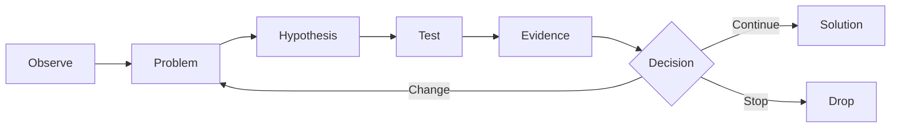
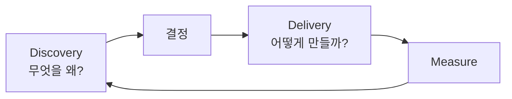

# 문제 발견 · Product Strategy · Roadmap

좋은 Delivery보다 먼저 필요한 것은 **올바른 문제를 선택하는 것**이다.

## Discovery Cycle



## Problem Statement

좋은 Problem Statement는 Solution을 포함하지 않는다.

나쁜 예:

> Camera Preset 버튼이 필요하다.

더 좋은 예:

> 사용자가 반복적으로 같은 Camera 상태를 재현해야 하지만 현재는 매번 값을 수동 입력해야 한다.

이렇게 쓰면 해결책 후보가 넓어진다.

## Opportunity를 평가하는 질문

- 얼마나 많은 사용자가 겪는가?
- 얼마나 자주 발생하는가?
- 얼마나 큰 고통인가?
- 현재 우회 방법은 무엇인가?
- 해결하면 어떤 행동 변화가 생기는가?
- 우리 제품 전략과 맞는가?
- 구현 비용과 위험은 어느 정도인가?

## Roadmap의 역할

Roadmap은 날짜별 Feature 약속 목록이 아니다.

```text
나쁜 Roadmap
Q1 Feature A
Q2 Feature B
Q3 Feature C

좋은 Roadmap
Now  : Animation workflow friction
Next : Asset interoperability
Later: Automation / scripting
```

즉 **Problem / Outcome 중심**으로 만드는 것이 좋다.

## 전략 계층

```text
Vision
↓
Product Strategy
↓
Product Goal
↓
Opportunity / Problem
↓
Initiative
↓
Feature / Experiment
↓
Backlog Item
```

위 계층이 연결되지 않는 Feature는 왜 만드는지 설명하기 어렵다.

## Discovery와 Delivery를 분리해서 생각하기



PO는 두 영역을 모두 연결하지만, Discovery가 약하면 개발 속도가 빠를수록 잘못된 것을 더 빨리 만들 수 있다.