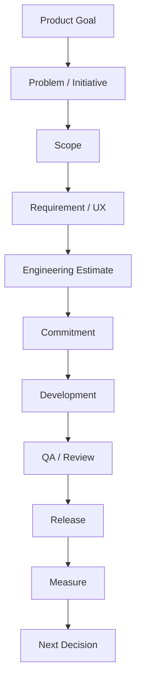

# Product Owner Delivery Work Process

Discovery에서 선택한 문제를 실제 제품 변경으로 만드는 흐름이다.

## 전체 Cycle



## 1. Intake

요청을 받는다.

바로 Backlog에 넣지 않는다.

확인:

- 누가 요청했는가
- 실제 문제는 무엇인가
- 빈도
- 영향
- 현재 우회 방법

## 2. Clarify

Problem과 Goal을 정리한다.

```text
Background
Problem
User
Expected Outcome
Constraints
```

## 3. Scope

가장 작은 유효 범위를 결정한다.

```text
Full Idea
↓
핵심 가치
↓
필수 Workflow
↓
MVP Scope
```

## 4. Design / Technical Alignment

Designer, Engineer와 함께:

- Interaction
- Error State
- Data
- Compatibility
- Performance
- Technical Risk
- Dependency

를 확인한다.

## 5. Ready for Development

개발 시작 전에 최소한 다음이 명확해야 한다.

- 왜 만드는가
- 누구를 위한 것인가
- 무엇이 Scope인가
- 무엇은 Scope 밖인가
- 완료 판단 기준
- 열린 질문

## 6. Development Support

개발 시작 후 PO가 사라지면 안 된다.

PO는:

- 모호한 요구사항 결정
- Scope trade-off
- 새로운 Edge Case 판단
- 우선순위 충돌 조정

을 빠르게 처리한다.

## 7. Acceptance

단순히 “Ticket Done”을 보는 것이 아니라 실제 User Workflow를 확인한다.

## 8. Release

Release Note, 문서, Migration, Rollout Risk를 확인한다.

## 9. Outcome Review

```text
우리가 만들었는가?  = Output
사용자가 썼는가?    = Adoption
문제가 줄었는가?    = Outcome
사업 가치가 생겼는가? = Impact
```

PO는 Output에서 끝나지 않고 Outcome까지 연결해야 한다.