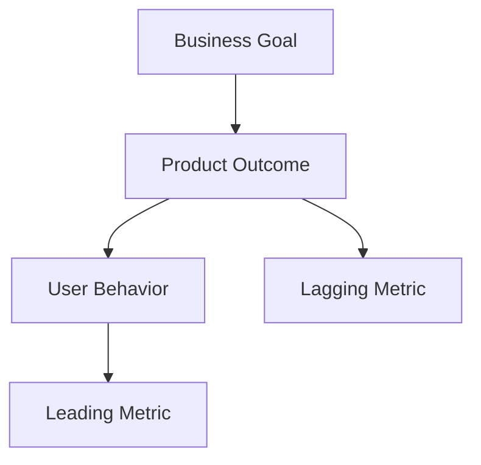

# 성과 측정 · 의사결정 · Metrics

좋은 Metric은 보고용 숫자가 아니라 **다음 행동을 바꾸는 정보**다.

## Output vs Outcome

| 구분 | 예 |
|---|---|
| Output | Feature 5개 출시 |
| Adoption | 사용자 40% 사용 |
| Outcome | 작업 시간 25% 감소 |
| Impact | Retention 증가 / Support 감소 |

PO는 Output보다 Outcome을 봐야 한다.

## Metric Tree



## 대표 Metric 유형

### Acquisition

사용자가 들어오는가?

### Activation

핵심 가치를 처음 경험했는가?

### Engagement

실제로 반복 사용되는가?

### Retention

다시 돌아오는가?

### Efficiency

시간·클릭·실패가 줄었는가?

### Quality

Crash, 오류, Support Issue가 줄었는가?

## Leading vs Lagging

```text
Leading
= 미래 결과를 먼저 보여주는 행동 지표

Lagging
= 이미 발생한 최종 결과
```

예:

- Leading: Camera Preset 저장 횟수
- Lagging: Camera Setup 소요 시간 감소

## Metric의 함정

- 숫자가 오르면 무조건 좋은 것으로 보기
- 측정하기 쉬운 것만 측정
- 평균만 보고 Segment 차이를 놓침
- 사용 증가가 불편 증가 때문일 가능성 무시
- Metric을 목표로 만들면서 Gaming 유발

## 의사결정 Framework

```text
Evidence
↓
Interpretation
↓
Options
↓
Trade-off
↓
Decision
↓
Expected Result
↓
Measure
```

Decision Log에는 적어도:

- 무엇을 결정했는가
- 어떤 근거였는가
- 무엇을 포기했는가
- 어떤 결과가 나오면 판단을 바꿀 것인가

를 남긴다.

PO에게 데이터는 “정답”이 아니라 **불확실성을 줄이는 도구**다.