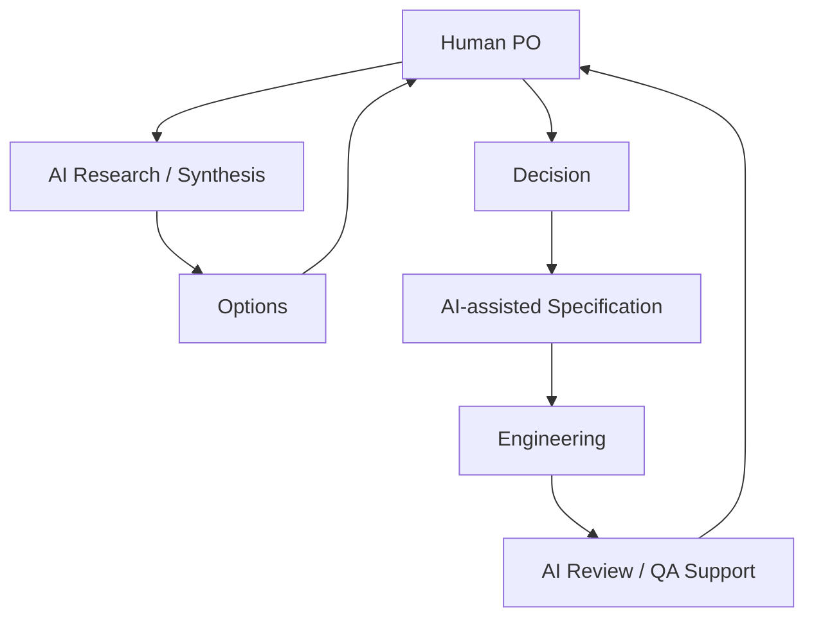

# AI 시대의 Product Owner

AI는 PO의 문서 작성 시간을 크게 줄일 수 있지만, 제품 책임 자체를 대신하지는 않는다.

## AI에게 맡기기 좋은 작업

- Interview 요약
- 경쟁 제품 비교
- Feedback Clustering
- 요구사항 초안
- Acceptance Criteria 후보
- Edge Case 탐색
- Ticket 정리
- Release Note 초안
- Metric 이상 패턴 탐색
- 회의 요약과 Decision 추출
- Prototype / Mockup 생성
- 코드베이스 조사

## 사람이 유지해야 할 책임

- 어떤 사용자를 우선할지
- 어떤 문제를 풀지
- 어떤 Trade-off를 받아들일지
- 어떤 Evidence를 신뢰할지
- Scope를 어디까지 줄일지
- 최종 품질 기준
- 제품 방향

## AI 보조 PO Workflow



## AI Agent 역할 예

| Agent | PO 업무 |
|---|---|
| Researcher | Feedback, 경쟁 제품, 코드 조사 |
| Analyst | Metric과 패턴 분석 |
| Spec Writer | Feature Spec 초안 |
| Reviewer | 누락된 Edge Case 검토 |
| Technical Explorer | 구현 영향 영역 조사 |
| Meeting Scribe | 결정·Action 추출 |

## 좋은 사용 원칙

### 1. AI에게 결정을 숨기지 않는다

```text
나쁜 지시:
"기능 기획해."

좋은 지시:
"목표는 X, 사용자는 Y, 제약은 Z다.
대안을 3개 비교하고 각각의 Trade-off를 보여줘.
결정은 내가 한다."
```

### 2. 코드베이스와 실제 데이터에 연결한다

AI가 일반론만 말하지 않도록:

- 실제 Repository
- 실제 사용자 Feedback
- 실제 Metric
- 실제 Design
- 실제 Issue

를 Context로 제공한다.

### 3. 반대 의견 Agent를 둔다

Feature를 옹호하는 Agent만 두지 않는다.

```text
Proposal
↓
Adversarial Review
- 정말 필요한가?
- 기존 기능으로 해결 가능한가?
- Scope가 너무 큰가?
- 사용자 Mental Model과 충돌하는가?
```

## AI 시대에 더 중요해지는 PO 능력

AI 때문에 약해지는 것이 아니라 오히려 중요해지는 역량:

- Problem Framing
- Taste / Product Judgment
- Prioritization
- Systems Thinking
- Technical Literacy
- Evidence Evaluation
- Decision Ownership

AI가 구현 비용을 낮출수록 **무엇을 만들지 선택하는 비용의 비중은 더 커진다.**

따라서 AI 시대의 PO는 문서를 많이 만드는 사람이 아니라 **빠르게 실험할 수 있는 환경에서 더 좋은 선택을 반복하는 사람**이 되어야 한다.