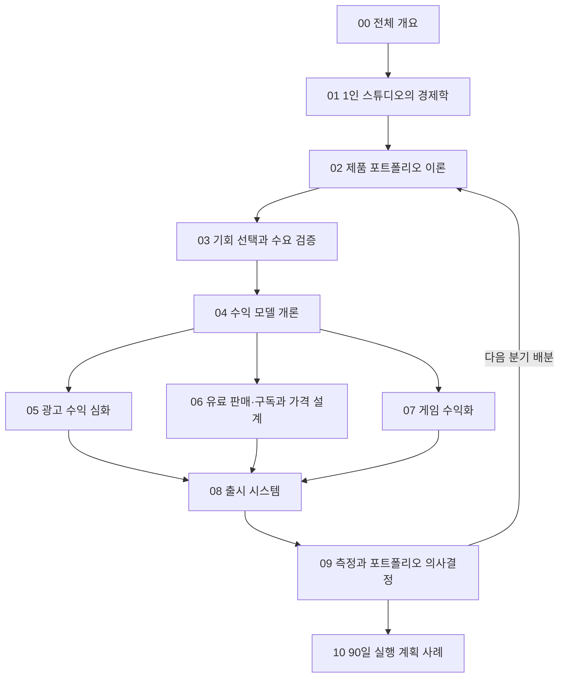

# 1인 스튜디오 수익화 전체 개요

> **학습 목표**: AI 에이전트가 제작 비용은 크게 낮췄지만 배포·주목 비용은 낮추지 못했다는 점을 이해하고, 이 트랙의 11개 문서가 "프로토타입은 많은데 출시와 매출은 적은" 문제를 어떤 순서로 푸는지 설명할 수 있다.

기준일: 2026-09-28. 수수료·정책·통계는 이 날짜에 확인한 값이며, 문서마다 출처와 날짜를 함께 적는다. 예시 숫자는 모두 **가정**이다.

## 핵심 개념

이 트랙은 무엇이든 빠르게 만들 수 있는 개발자·PO가 **무엇을 고르고, 어떻게 출시하고, 어떻게 돈을 받는지**를 교과서 순서로 다룬다.

| 용어 | 뜻 | 이 트랙에서 다루는 곳 |
|---|---|---|
| 제작 비용 | 아이디어를 동작하는 제품으로 만드는 데 드는 시간·돈 | 01 |
| 배포 비용 | 스토어 심사, 결제 연결, 약관, 세무, 출시 준비 | 04, 08 |
| 주목(Attention) 비용 | 낯선 사람이 제품을 발견하고 믿고 써 보게 만드는 비용 | 03, 05 |
| 베팅(Bet) | 결과가 불확실한 제품에 시간을 거는 일 | 02 |
| 수익 모델 | 사용자가 만든 가치를 돈으로 바꾸는 방식 | 04–07 |
| 포트폴리오 | 동시에 운영·제작·검증 중인 제품의 묶음과 시간 배분 | 02, 09 |

## 원리

### AI가 낮춘 비용과 낮추지 못한 비용

제품 매출은 대략 다음 곱으로 쓸 수 있다.

> 월 매출 = 제품에 도달한 사람 수 × 유료 전환율(또는 광고 노출) × 1인당 수익

AI 코딩 에이전트는 이 식의 **어느 항도 직접 키우지 않는다.** 줄어드는 것은 곱셈 바깥에 있는 제작 시간이다.

| 비용 항목 | AI 에이전트 이후 변화 | 이유 |
|---|---|---|
| 코드·UI·테스트 초안 | 크게 감소 | 에이전트가 반복 작업을 대신한다 |
| 에셋·문서 초안 | 감소 | 초안 생성은 빠르지만 검수 시간은 남는다 |
| 스토어 심사·결제·세무 | 조금 감소 | 규칙과 절차는 사람이 확인하고 책임진다 |
| 발견·신뢰·리뷰 | 줄지 않음, 오히려 경쟁 증가 | 같은 도구로 모두가 더 많이 출시한다 |

공급이 늘어난 증거는 이미 있다. Appfigures 집계에 따르면 2026년 1분기 전 세계 앱 출시 수는 App Store와 Google Play 합계로 전년 동기 대비 약 60% 늘었다 (TechCrunch 보도, 2026-04-18). SteamDB는 2025년 Steam 출시 게임이 19,000개를 넘었고 그중 거의 절반이 리뷰 10개 미만이라고 집계했다 (2025-12). 만들기가 쉬워질수록 **"만들었다"는 사실만으로는 아무도 찾아오지 않는다.**

### 핵심 문제: 프로토타입은 많고 출시는 적다

만드는 일은 즐겁고 AI 덕분에 빠르지만, 출시 직전 작업은 지루하고 AI로도 덜 줄어든다. 그래서 새 프로토타입을 시작하는 쪽이 늘 더 매력적으로 보이고, 시간은 여러 제품에 얇게 흩어진다.

1. **선택 기준이 없다** — 어떤 제품이 더 가치 있는지 비교할 숫자가 없다 (01, 02).
2. **검증 없이 만든다** — 수요가 있는지 모른 채 제작 시간을 쓴다 (03).
3. **돈을 받는 구조가 없다** — 출시해도 결제·광고가 붙어 있지 않다 (04–07).
4. **출시가 습관이 아니다** — 반복 가능한 출시 절차가 없다 (08).
5. **멈추지 못한다** — 중단 기준이 없어 제품이 계속 "진행 중"으로 남는다 (02, 09).

## 학습 지도

1부(00–04)는 개념과 이론, 2부(05–10)는 수익 모델 심화와 실행이다. 09의 측정 결과는 다시 02의 포트폴리오 판단으로 돌아간다.

| 번호 | 문서 | 답하는 질문 |
|---|---|---|
| 01 | 1인 스튜디오의 경제학 | 내 시간 1시간의 비용과 버틸 수 있는 기간은? |
| 02 | 제품 포트폴리오 이론 | 몇 개를, 어떤 크기로, 언제까지 걸 것인가? |
| 03 | 기회 선택과 수요 검증 | 만들기 전에 수요를 어떻게 확인하는가? |
| 04 | 수익 모델 개론 | 이 제품은 어떤 방식으로 돈을 받아야 하는가? |
| 05 | 광고 수익 심화 | 광고로 목표 금액을 벌려면 트래픽이 얼마나 필요한가? |
| 06 | 유료 판매·구독과 가격 설계 | 얼마에, 어떤 주기로 팔 것인가? |
| 07 | 게임 수익화 | 게임은 무엇으로 돈을 버는가? |
| 08 | 출시 시스템 | 출시를 반복 가능한 절차로 만들려면? |
| 09 | 측정과 포트폴리오 의사결정 | 무엇을 키우고, 유지하고, 중단할 것인가? |
| 10 | 90일 실행 계획 사례 | 예시 스튜디오는 90일 동안 무엇을 하는가? |

## 적용: 예시 스튜디오

트랙 전체가 같은 **예시 스튜디오**를 사용한다. 아래 숫자는 모두 가정이며, 특정 실제 사업을 가리키지 않는다.

| 항목 | 값 (가정) |
|---|---|
| 인원 | 1명 + AI 에이전트 |
| 월 작업 가능 시간 | 160시간 |
| 월 고정비 | 50만 원 (AI 구독, 서버, 도구) |
| 목표 생활비 | 월 300만 원 |
| 운영 자금 | 1,800만 원 |
| 프로토타입 | 12개: 게임 3, 창작 도구 4, 생산성 앱 3, 콘텐츠 사이트 2 |
| 콘텐츠 사이트 중 하나 | 애드센스를 준비 중인 기술 문서 사이트 |
| 출시한 제품 | 1개, 월 매출 0원 |

Runway는 운영 자금을 한 달에 나가는 돈으로 나눈다.

> Runway = 1,800만 원 ÷ (300만 원 + 50만 원) = 1,800 ÷ 350 ≈ 5.14 → **약 5.1개월**

매출이 없으면 약 5개월 뒤 운영 자금이 바닥난다. 이 트랙의 목표는 그 전에 **월 순매출 350만 원**(생활비 + 고정비)에 도달하는 경로를 설계하는 것이다. 세금은 이 계산에 넣지 않았다 (비즈니스 섹션 참고).

## 다른 섹션과의 연결

이 트랙은 사이트의 다른 섹션을 다시 설명하지 않고 필요한 곳에서 이름으로 가리킨다.

| 섹션 | 함께 볼 문서 | 이 트랙에서 쓰는 곳 |
|---|---|---|
| 제품 기획과 운영 | 문제 발견 · 전략 · Roadmap / 성과 측정 · 의사결정 · Metrics | 03, 09 |
| Marketing | 시장·고객 리서치 · Segmentation / AI 검색 · GEO/AEO / Marketing Metrics · Unit Economics | 03, 05, 09 |
| Platform 배포와 서비스 | App Store · Google Play / 작은 팀 실전 가이드 | 04, 08 |
| 비즈니스 | 사업자 등록 · 통신판매업 / 약관 · 개인정보 · 전자상거래 / 부가세 · 영세율 · 세금계산서 | 04, 06 |

## 심화

**왜 "더 많이 만들기"가 답이 아닌가.** 제품 성과는 소수가 대부분을 가져가는 멱법칙(Power Law) 분포를 따른다 (01에서 자료로 확인한다). 이런 분포에서는 시도 횟수가 중요하지만, **출시되지 않은 시도는 시도로 세지 않는다.** 스토어에도 검색에도 올라가지 않은 프로토타입은 꼬리의 큰 성공을 뽑을 기회 자체가 없다. 그래서 이 트랙은 "더 많이 만들기"가 아니라 "적게 고르고, 끝까지 출시하고, 빨리 판단하기"를 기본 전략으로 둔다.

## 흔한 오해

- **"AI로 만들기가 쉬워졌으니 수익화도 쉬워졌다"** — 쉬워진 것은 만들기다. 같은 도구를 쓰는 경쟁자도 늘었다.
- **"좋은 제품이면 알아서 퍼진다"** — 발견 경로(검색, 스토어, 커뮤니티)가 설계되지 않은 제품은 좋아도 보이지 않는다.
- **"수익 모델은 사용자가 모인 뒤 정하면 된다"** — 광고와 구독은 필요한 트래픽·신뢰·리텐션이 전혀 다르다. 모델이 제품 설계를 바꾼다 (04).
- **"프로토타입 12개는 자산이다"** — 출시되지 않은 프로토타입은 유지 비용과 주의력만 쓰는 재고에 가깝다 (02).

## 자기 점검 질문

1. AI 에이전트가 줄인 비용과 줄이지 못한 비용을 각각 두 가지씩 들 수 있는가?
2. 월 매출 식의 세 항 중 지금 내 제품에서 가장 약한 항은 무엇인가?
3. 예시 스튜디오의 Runway를 직접 계산해 보라. 월 고정비가 80만 원이라면 몇 개월이 되는가?
4. 이 트랙 11개 문서 중 지금 내 상황에서 가장 먼저 읽어야 할 문서는 무엇이고, 이유는 무엇인가?
5. 출시되지 않은 프로토타입이 멱법칙 분포에서 불리한 이유를 한 문장으로 설명할 수 있는가?

## 참고 자료

- [The App Store is booming again, and AI may be why — TechCrunch](https://techcrunch.com/2026/04/18/the-app-store-is-booming-again-and-ai-may-be-why/) (2026-04-18, Appfigures 집계 인용, 접속 2026-09-28)
- [Steam Game Release Summary by Year — SteamDB](https://steamdb.info/stats/releases/) (접속 2026-09-28)
- [More than 19,000 games launched on Steam this year—but almost half have fewer than 10 reviews — PC Gamer](https://www.pcgamer.com/gaming-industry/more-than-19-000-games-launched-on-steam-this-year-but-almost-half-have-fewer-than-10-reviews/) (2025-12, SteamDB 집계 인용, 접속 2026-09-28)
- [Default Alive or Default Dead? — Paul Graham](https://paulgraham.com/aord.html) (2015-10, 접속 2026-09-28)
