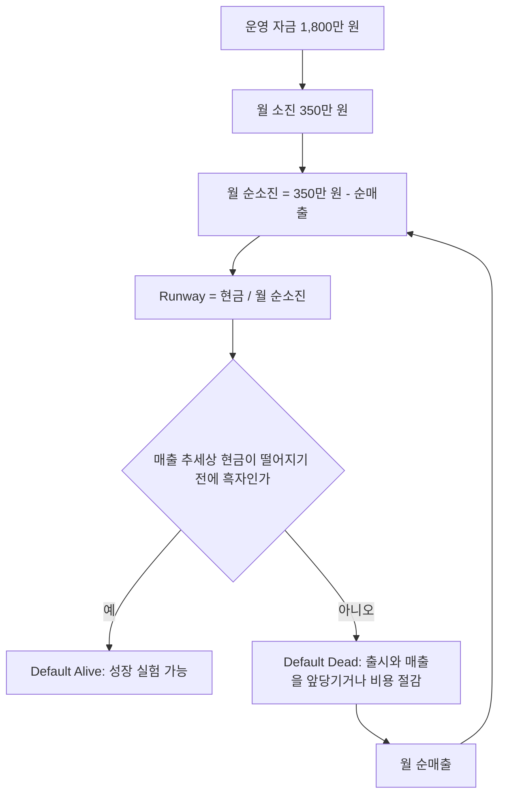

# 1인 스튜디오의 경제학

> **학습 목표**: 시간당 비용, 고정비와 변동비, Runway, 손익분기점을 예시 스튜디오 숫자로 직접 계산하고, 제품 성과가 멱법칙(Power Law)을 따른다는 사실이 전략에 주는 의미를 설명할 수 있다.

기준일: 2026-09-28. 예시 숫자는 모두 가정이며, 세금은 계산에서 뺐다.

## 핵심 개념

| 개념 | 정의 | 1인 스튜디오에서의 의미 |
|---|---|---|
| 기회비용(Opportunity Cost) | 한 선택 때문에 포기한 다른 선택의 가치 | 한 제품에 쓴 시간은 다른 제품에 쓸 수 없다 |
| 고정비(Fixed Cost) | 판매량과 관계없이 매달 나가는 돈 | AI 구독, 서버 기본료, 도구, 그리고 생활비 |
| 변동비(Variable Cost) | 판매·사용량에 비례해 늘어나는 돈 | 스토어·결제 수수료, 사용자당 AI API 비용 |
| 공헌이익(Contribution Margin) | 가격 − 단위당 변동비 | 한 건 팔 때 고정비를 갚는 데 쓰이는 돈 |
| Runway | 현금 ÷ 월 순소진액 | 매출 없이 버틸 수 있는 개월 수 |
| Default Alive | 지금의 비용과 매출 추세 그대로 가면 돈이 떨어지기 전에 흑자가 되는 상태 | Paul Graham이 2015년 에세이에서 제시한 판정 |
| 손익분기점(Break-even) | 순매출 = 총비용이 되는 지점 | 예시 스튜디오는 월 순매출 350만 원 |
| 멱법칙(Power Law) | 소수의 결과가 전체의 대부분을 차지하는 분포 | 평균이 아니라 중앙값으로 계획해야 하는 이유 |

## 원리

### 시간이 가장 희소한 자원

1인 스튜디오에서 돈보다 먼저 떨어지는 것은 시간이다. 한 달 비용을 작업 가능 시간으로 나누면 **시간당 기준 비용**이 나온다.

> 시간당 기준 비용 = (생활비 300만 원 + 고정비 50만 원) ÷ 160시간 = 3,500,000 ÷ 160 = **21,875원**

어떤 작업이든 이 금액과 비교한다. 새 프로토타입에 40시간을 쓰면 40 × 21,875 = **875,000원**어치 시간을 쓴 것이다. 여기에 그 40시간을 이미 출시한 제품의 마케팅에 썼다면 얻었을 결과, 즉 기회비용이 더해진다.

### 고정비와 변동비, 공헌이익

생활비는 회계상 사업 비용은 아니지만, 1인 스튜디오의 생존을 판단할 때는 고정비처럼 다룬다. 손익분기 판매량은 다음과 같다.

> 손익분기 수량 = 월 고정비 ÷ 단위당 공헌이익

예시 (가정): 월 5,000원 구독, 스토어 수수료 15%, 사용자당 AI API 비용 월 750원.

| 항목 | 금액 |
|---|---|
| 가격 | 5,000원 |
| 스토어 수수료 15% | − 750원 |
| AI API 비용 | − 750원 |
| 공헌이익 | **3,500원** |
| 손익분기 구독자 수 | 3,500,000 ÷ 3,500 = **1,000명** |

AI 기능이 들어간 제품은 사용량마다 API 비용이 붙는다. 전통적인 소프트웨어보다 변동비가 커질 수 있다는 점이 AI 시대 제품 경제의 새 변수다.

### Runway와 Default Alive

> Runway = 1,800만 원 ÷ 350만 원 ≈ 5.14 → **약 5.1개월** (매출 0원일 때)

Paul Graham은 2015년 에세이 "Default Alive or Default Dead?"에서, 지금의 비용과 매출 성장 추세를 그대로 연장했을 때 **돈이 떨어지기 전에 흑자에 도달하면 Default Alive**, 아니면 Default Dead라고 정의했다. 아래 두 시나리오(가정)는 순매출이 매달 50만 원씩 늘어나는 속도는 같고 **시작 시점만 한 달 다르다.**

| 월 | A 순매출 (3개월 차 시작) | A 월말 현금 | B 순매출 (4개월 차 시작) | B 월말 현금 |
|---|---|---|---|---|
| 1 | 0 | 1,450만 | 0 | 1,450만 |
| 2 | 0 | 1,100만 | 0 | 1,100만 |
| 3 | 50만 | 800만 | 0 | 750만 |
| 4 | 100만 | 550만 | 50만 | 450만 |
| 5 | 150만 | 350만 | 100만 | 200만 |
| 6 | 200만 | 200만 | 150만 | **0** |
| 7 | 250만 | 100만 | 200만 | 150만 부족 |
| 8 | 300만 | 50만 | — | — |
| 9 | 350만 | **50만 (손익분기)** | — | — |

A는 9개월 차에 손익분기에 도달하며 50만 원이 남는다 (Default Alive). B는 6개월 차 말에 현금이 0이 된다 (Default Dead). **출시가 한 달 늦어지는 것만으로 생존 여부가 뒤집힌다.** 1인 스튜디오에서 출시 속도가 경제 문제인 이유다.

### 제품 성과의 멱법칙

| 자료 | 내용 |
|---|---|
| RevenueCat, State of Subscription Apps 2025 | 새로 출시된 구독 앱 중 하위 25%는 첫해 매출이 19달러 이하, 상위 5%는 8,880달러 이상으로 400배 넘게 차이 |
| VG Insights, Global Indie Games Market Report 2024 (Game World Observer 보도) | 2024년 1~9월 Steam 인디 출시작 12,000개 이상 중 0.5% 미만이 전체 매출의 약 80%를 차지할 것으로 추정 |
| SteamDB (2025-12) | 2025년 Steam 출시작 19,000개 이상, 그중 거의 절반이 리뷰 10개 미만 |

이런 분포에서 **평균은 소수의 대성공이 끌어올린 숫자라 계획에 쓰면 안 된다.** 계획은 중앙값 이하를 가정하고, 꼬리의 큰 성공은 "여러 번 출시했을 때 생길 수 있는 보너스"로 다룬다. 그리고 꼬리에 닿으려면 먼저 출시해야 한다.

## 적용: 예시 스튜디오

| 지표 | 계산 | 결과 |
|---|---|---|
| 시간당 기준 비용 | 350만 ÷ 160 | 21,875원 |
| Runway (매출 0원) | 1,800만 ÷ 350만 | 약 5.1개월 |
| 프로토타입 12개에 균등 배분 시 제품당 월 시간 | 160 ÷ 12 | 약 13.3시간 |
| 손익분기 순매출 | 생활비 + 고정비 | 월 350만 원 |
| 수수료 15%일 때 필요한 총매출 | 350만 ÷ 0.85 | 약 411.8만 원 |

진단: 매출 0원이고 추세도 없으므로 지금은 **Default Dead**다. 12개 제품에 시간을 균등하게 나누면 제품당 한 달 13시간 남짓으로, 어느 제품도 출시·마케팅까지 가지 못한다. 02에서 WIP 제한으로 이 문제를 다룬다.

## 심화

### AI 에이전트가 바꾸는 것과 바꾸지 않는 것

| 구분 | 바뀌는 것 | 바뀌지 않는 것 |
|---|---|---|
| 고정비 | AI 구독료라는 새 고정비가 생긴다 | 생활비는 그대로다 |
| 변동비 | AI 기능 제품은 사용량당 API 비용이 붙는다 | 스토어·결제 수수료율은 그대로다 |
| 제작 시간 | 프로토타입까지의 시간이 크게 준다 | 검수, 정책 대응, 고객 지원 시간은 남는다 |
| 수요 | — | 사람들이 돈을 낼 만한 문제의 수는 AI 때문에 늘지 않는다 |
| 경쟁 | 같은 도구로 경쟁자도 빨라진다 | 발견과 신뢰를 얻는 비용은 줄지 않는다 |

### 1,000 True Fans로 손익분기 다시 보기

Kevin Kelly는 2008년 에세이 "1,000 True Fans"에서 창작자가 해마다 100달러를 쓰는 진짜 팬 1,000명이면 생계를 꾸릴 수 있다는 계산을 제시했다. 같은 논리를 예시 스튜디오에 적용하면 (가정: 팬 1명이 연 10만 원 지출):

> 연간 필요 순매출 = 350만 원 × 12 = 4,200만 원 → 4,200만 ÷ 10만 = **420명**

수백만 명이 아니라 수백 명의 돈을 내는 사용자를 목표로 삼을 수 있다는 점이 1인 스튜디오의 장점이다.

## 흔한 오해

- **"AI 덕분에 만드는 비용은 0에 가깝다"** — 에이전트 비용은 작아도 내 시간은 시간당 21,875원이다.
- **"평균 매출을 보고 계획한다"** — 멱법칙에서 평균은 소수가 끌어올린 값이다. 중앙값 이하로 계획한다.
- **"Runway는 잔고 ÷ 사업 고정비다"** — 1인 스튜디오에서는 생활비도 함께 나눠야 한다.
- **"매출이 곧 수입이다"** — 수수료, API 비용, 세금을 빼야 실제로 남는 돈이 된다.
- **"출시가 한 달 늦어져도 큰 차이 없다"** — 위 시나리오처럼 한 달이 생존 여부를 뒤집을 수 있다.

## 자기 점검 질문

1. 내 한 달 비용과 작업 가능 시간으로 시간당 기준 비용을 계산해 보라.
2. 월 8,000원 구독, 수수료 15%, 사용자당 API 비용 월 1,000원이면 손익분기 구독자는 몇 명인가?
3. 시나리오 B에서 현금이 바닥나지 않으려면 매달 순매출 증가 폭이 최소 얼마였어야 하는가? (표를 다시 계산해 보라)
4. 내 제품 분야에서 평균이 아니라 중앙값 자료를 찾는다면 어디서 찾겠는가?
5. AI 기능이 변동비를 키우는 경로를 하나 설명할 수 있는가?

## 참고 자료

- [Default Alive or Default Dead? — Paul Graham](https://paulgraham.com/aord.html) (2015-10, 접속 2026-09-28)
- [1000 True Fans — Kevin Kelly, The Technium](https://kk.org/thetechnium/1000-true-fans/) (2008-03, 접속 2026-09-28)
- [State of Subscription Apps 2025 — RevenueCat](https://www.revenuecat.com/state-of-subscription-apps-2025) (2025-03, 접속 2026-09-28)
- [Indie games come close to AA/AAA games in revenue on Steam — Game World Observer](https://gameworldobserver.com/2024/10/16/indie-games-revenue-steam-vs-aaa-titles-vg-insights) (2024-10-16, VG Insights 보고서 인용, 접속 2026-09-28)
- [More than 19,000 games launched on Steam this year—but almost half have fewer than 10 reviews — PC Gamer](https://www.pcgamer.com/gaming-industry/more-than-19-000-games-launched-on-steam-this-year-but-almost-half-have-fewer-than-10-reviews/) (2025-12, 접속 2026-09-28)
