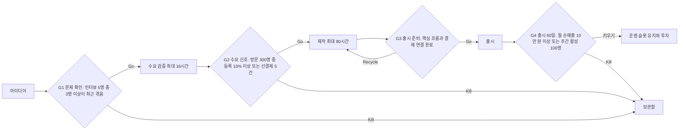

# 제품 포트폴리오 이론

> **학습 목표**: 제품을 베팅으로 보고 Expected Value와 분산을 계산하며, Small Bets·Barbell·Stage-Gate·사전 중단 기준·WIP 제한으로 한 달 160시간의 포트폴리오를 설계할 수 있다.

기준일: 2026-09-28. 확률과 금액은 모두 설명용 가정이다.

## 핵심 개념

| 개념 | 정의 | 출처 |
|---|---|---|
| 베팅(Bet) | 결과가 불확실한 곳에 한정된 자원을 거는 일 | 일반 의사결정 이론 |
| Expected Value | 결과별 (확률 × 값)의 합 | 확률론 |
| 분산(Variance) | 결과가 기대값에서 얼마나 흩어지는지 | 확률론 |
| Small Bets | 제품 하나에 모든 것을 걸지 말고 작은 베팅 여러 개로 신호를 찾으라는 접근 | Daniel Vassallo |
| Barbell 전략 | 아주 안전한 쪽과 아주 공격적인 쪽을 함께 갖고 어중간한 중간을 피하는 전략 | Nassim Nicholas Taleb, *Antifragile* (2012) |
| Stage-Gate | 단계(Stage) 사이에 관문(Gate)을 두고 미리 정한 기준으로 Go/Kill/Hold/Recycle을 결정하는 신제품 개발 모델 | Robert G. Cooper (1980년대 연구, 1986년 이후 체계화) |
| 사전 중단 기준(Kill Criteria) | 시작 전에 적어 두는 "이 숫자에 못 미치면 멈춘다"는 조건 | Stage-Gate의 관문 기준을 1인용으로 줄인 것 |
| 매몰비용 오류 | 이미 쓴 비용 때문에 계속하려는 경향 | Arkes & Blumer (1985) |
| WIP 제한 | 동시에 진행하는 작업 수의 상한 | Kanban (David J. Anderson, 2010), Little's Law |

## 원리

### Expected Value와 분산

> Expected Value = Σ (결과의 확률 × 결과의 값)

같은 480시간(한 달 160시간 × 3개월)을 두 가지로 쓴다고 하자. 값은 성공 시 월 순매출이다 (모두 가정).

| 전략 | 구성 | 성공 확률 | 성공 시 월 순매출 | 월 Expected Value | 표준편차 | 하나라도 성공할 확률 |
|---|---|---|---|---|---|---|
| 큰 베팅 | 480시간 × 1개 | 10% | 300만 원 | 30만 원 | 약 90만 원 | 10% |
| 작은 베팅 | 80시간 × 6개 (서로 독립 가정) | 각 15% | 각 50만 원 | 6 × 7.5만 = 45만 원 | 약 43.7만 원 | 62.3% |

계산 근거:

- 큰 베팅 분산 = 0.1 × (300 − 30)² + 0.9 × (0 − 30)² = 7,290 + 810 = 8,100 → 표준편차 90 (만 원)
- 작은 베팅 1개 분산 = 0.15 × (50 − 7.5)² + 0.85 × (0 − 7.5)² = 270.94 + 47.81 = 318.75, 6개 합 1,912.5 → 표준편차 약 43.7 (만 원)
- 하나라도 성공 = 1 − 0.85⁶ = 1 − 0.3771 = 0.6229

읽는 법: 이 가정에서는 작은 베팅이 기대값도 높고 흩어짐도 작다. 하지만 **확률과 성공 크기가 가정이라는 점**이 핵심이다. 작은 베팅의 성공 확률이 5%라면 기대값은 6 × 0.05 × 50 = 15만 원으로 큰 베팅보다 낮아진다. 이 표의 목적은 결론이 아니라 "숫자를 적어 두고 비교하는 습관"이다.

### Small Bets와 Barbell

Daniel Vassallo는 "제품 하나를 만들지 말고 작은 베팅의 포트폴리오를 만들라"고 말하며, 신호가 보일 때만 더 거는 방식을 권했다 (2020). Taleb의 Barbell 전략은 한쪽을 매우 안전하게 지키고 다른 쪽에서만 큰 위험을 지며, **어중간한 중간 위험을 피한다.**

1인 스튜디오에 옮기면 다음과 같다.

| 쪽 | 예 | 목적 |
|---|---|---|
| 안전한 쪽 | 확실한 현금 흐름: 이미 버는 제품 운영, 외주·서비스 계약 | Runway 보호 |
| 공격적인 쪽 | 손실 상한이 정해진 작은 베팅 여러 개 | 꼬리의 큰 성공에 노출 |
| 피할 중간 | 검증 없이 6개월을 쓰는 중간 규모 제품 | 손실은 크고 상한은 불분명 |

### Stage-Gate와 사전 중단 기준

Cooper의 Stage-Gate는 대기업 신제품 개발을 위한 모델이지만, 핵심인 **"관문마다 미리 정한 기준으로 Go/Kill을 결정한다"**는 1인 스튜디오에도 그대로 쓸 수 있다. 아래 기준 숫자는 예시(가정)이며, 03과 09에서 제품별로 다시 정한다.

기준은 **시작 전에 적고, 결과를 본 뒤에는 바꾸지 않는다.** 결과를 본 뒤 기준을 바꾸면 기준이 아니라 합리화가 된다.

### 매몰비용 오류

Arkes와 Blumer(1985)는 연극 시즌권을 더 비싸게 산 사람들이 할인받은 사람들보다 이후 몇 달 동안 공연을 더 많이 보러 간 현장 실험 등으로, 이미 쓴 비용이 이후 결정을 끌고 가는 현상을 보여 주었다. 제품에서는 "이미 200시간을 썼으니 조금만 더"라는 형태로 나타난다.

- **나쁜 예**: "이 앱에 벌써 200시간을 썼으니 버릴 수 없다. 기능 3개만 더 넣자."
- **좋은 예**: "앞으로 40시간(87.5만 원어치)을 더 쓰면 무엇이 달라지는가? G4 기준에 닿을 근거가 있는가? 없으면 보관함으로 옮기고 배운 점을 적는다."

### WIP 제한과 Little's Law

Little's Law는 안정된 흐름에서 **평균 리드타임 = 평균 WIP ÷ 처리량**이라는 관계다. Kanban은 이 관계를 이용해 동시에 진행하는 일의 수를 제한한다.

> 예시 스튜디오: WIP 12개, 처리량 월 0.5개 출시(가정) → 리드타임 = 12 ÷ 0.5 = **24개월**
> WIP 2개로 줄이고 처리량이 같다면 → 2 ÷ 0.5 = **4개월**

실제로는 WIP를 줄이면 문맥 전환이 줄어 처리량도 오르는 경우가 많다. 권장 출발점(가정): 제작 중 최대 2개, 검증 중 최대 2개, 운영 중인 제품은 개수 대신 시간 예산으로 관리한다.

## 적용: 예시 스튜디오

**시간 배분 (월 160시간, 가정)**

| 영역 | 시간 | 비율 | 내용 |
|---|---|---|---|
| 운영 | 32 | 20% | 출시한 제품 1개의 개선·마케팅·지원 |
| 제작 | 80 | 50% | WIP 2개를 출시까지 |
| 검증 | 24 | 15% | 신규 후보 2개의 수요 신호 확인 (03) |
| 관리 | 24 | 15% | 세무, 측정, 학습, 다음 달 계획 |
| 합계 | 160 | 100% | |

**프로토타입 12개 분류 (가정)**

| 상태 | 개수 | 예 |
|---|---|---|
| 제작 슬롯 | 2 | 애드센스를 준비 중인 기술 문서 사이트, 선결제 신호가 있는 창작 도구 1개 |
| 검증 슬롯 | 2 | 게임 1개 (Steam 페이지 신호, 07), 생산성 앱 1개 (인터뷰, 03) |
| 보관함 | 8 | 나머지 게임 2, 창작 도구 3, 생산성 앱 2, 콘텐츠 사이트 1 |
| 합계 | 12 | |

보관함은 삭제가 아니다. 저장소를 정리하고 "다시 꺼낼 조건"을 한 줄 적어 둔 뒤 손대지 않는다. 출시한 제품 1개는 이와 별도로 운영 슬롯에 둔다.

## 심화

**포트폴리오의 상관관계.** 금융 포트폴리오처럼 제품도 서로 같이 움직이면 분산 효과가 사라진다. 네 제품이 모두 Google 검색 유입과 애드센스에 의존한다면, 검색 알고리즘 변화 하나가 전부를 동시에 흔든다. 분산할 축은 **유입 채널**(검색, 스토어, 커뮤니티), **수익 모델**(광고, 판매, 구독), **플랫폼**(웹, iOS, Android, Steam)이다. 04의 적합도 표를 이 관점에서 다시 본다.

**검증은 정보를 사는 일이다.** 16시간짜리 검증으로 80시간짜리 제작을 피할 수 있다면, 그 16시간(350,000원어치)은 최대 64시간(1,400,000원어치)을 아끼는 보험이다.

## 흔한 오해

- **"작은 베팅은 항상 큰 베팅보다 낫다"** — 확률과 성공 크기에 따라 뒤집힌다. 숫자를 적고 비교한다.
- **"Barbell은 절반씩 나누는 것이다"** — 핵심은 비율이 아니라 중간 위험을 피하는 구조다.
- **"중단 기준은 결과를 보고 정하면 된다"** — 결과를 본 뒤의 기준은 합리화가 된다.
- **"많이 동시에 진행해야 빨리 끝난다"** — Little's Law상 WIP가 많을수록 각 제품의 리드타임은 길어진다.
- **"보관함에 넣으면 실패다"** — 명시적 중단은 시간을 되찾는 결정이다.

## 자기 점검 질문

1. 작은 베팅 6개의 성공 확률이 각각 8%라면 월 Expected Value와 "하나라도 성공할 확률"은 얼마인가?
2. 내 현재 제품들을 Barbell의 안전한 쪽, 공격적인 쪽, 피할 중간으로 나눠 보라.
3. 지금 진행 중인 제품 하나에 대해 G4 기준을 시작 전에 적었다면 무엇이었어야 하는가?
4. 지금 내 WIP와 월 출시 처리량으로 리드타임을 계산해 보라.
5. 내 제품들이 공유하는 유입 채널은 무엇이고, 그 채널이 막히면 몇 개가 동시에 영향을 받는가?

## 참고 자료

- [Daniel Vassallo, "Don't build a product. Build a portfolio of small bets." — X](https://twitter.com/dvassallo/status/1258518741106618368) (2020-05, 접속 2026-09-28)
- [Daniel Vassallo — dvassallo.com](https://dvassallo.com/) (접속 2026-09-28)
- [Antifragile (book) — Wikipedia](https://en.wikipedia.org/wiki/Antifragile_%28book%29) (Taleb, 2012, 접속 2026-09-28)
- [The Stage-Gate Model: An Overview — Stage-Gate International](https://www.stage-gate.com/blog/the-stage-gate-model-an-overview/) (접속 2026-09-28)
- [The psychology of sunk cost — Arkes & Blumer, Organizational Behavior and Human Decision Processes 35(1)](https://www.sciencedirect.com/science/article/abs/pii/0749597885900494) (1985, 접속 2026-09-28)
- [Stable Systems: Little's Law and Kanban — Nave](https://getnave.com/blog/kanban-littles-law/) (접속 2026-09-28)
