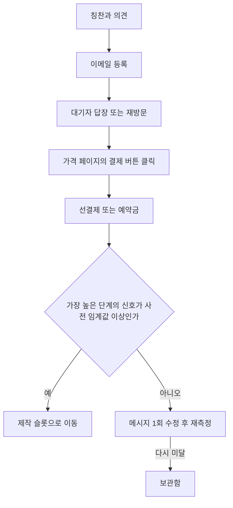

# 기회 선택과 수요 검증

> **학습 목표**: 기회 후보를 bottom-up으로 크기 추정하고, Mom Test 인터뷰와 Fake Door·선판매·대기자 명단으로 만들기 전에 수요를 확인하며, 통과 기준을 미리 정해 판단할 수 있다.

기준일: 2026-09-29. 시장 크기와 임계값 숫자는 모두 가정이며, 실제 값은 직접 조사로 채운다.

## 핵심 개념

| 개념 | 뜻 |
|---|---|
| 기회 원천 | 해결할 문제를 발견하는 출처 (내 불편, 사용자 불만, 플랫폼 변화, 검색 수요 등) |
| TAM / SAM / SOM | 전체 시장 / 내가 실제로 닿을 수 있는 시장 / 현실적으로 가져올 수 있는 몫 |
| Bottom-up 추정 | "고객 수 × 1인당 지불액"으로 아래에서부터 시장 크기를 쌓는 방식 |
| Fake Door (Smoke Test) | 아직 없는 제품·기능의 가격 페이지나 버튼을 먼저 열고 반응을 재는 실험 |
| 선판매(Pre-sale) | 출시 전에 할인가 등으로 실제 결제를 받는 검증 |
| 대기자 명단(Waitlist) | 출시 알림을 받을 이메일을 모으는 검증 |
| Mom Test | 칭찬이 아니라 과거의 구체적 행동을 묻는 고객 인터뷰 규칙 (Rob Fitzpatrick) |
| 신호 임계값 | 실험 전에 정해 두는 통과 기준 숫자 |

## 원리

### 기회는 어디서 오는가

| 원천 | 신호를 찾는 곳 | 장점 | 위험 |
|---|---|---|---|
| 내가 겪는 불편 | 반복해서 우회하는 작업 | 문제를 깊이 안다 | 나 한 명만의 문제일 수 있다 |
| 기존 제품의 불만 | 스토어 리뷰의 낮은 별점, 커뮤니티 불만 글 | 이미 돈을 쓰는 사람들이 있다 | 불만만 크고 전환 의사는 약할 수 있다 |
| 플랫폼 변화 | 새 OS API, 스토어 정책·수수료 변경 | 경쟁자가 적은 짧은 창이 열린다 | 창이 빨리 닫힌다 |
| 검색 수요 | Search Console, 키워드 도구, 질문 사이트 | 수요가 숫자로 보인다 | AI 답변이 클릭을 줄일 수 있다 (05) |
| 인접 확장 | 이미 출시한 제품 사용자의 요청 | 첫 고객이 이미 있다 | 시장이 작을 수 있다 |

### 작은 제품의 시장 크기: Bottom-up

작은 제품에 "전 세계 디자인 소프트웨어 시장의 1%" 같은 top-down 추정은 쓸모가 없다. 누가 몇 명이고 얼마를 내는지 아래에서부터 쌓는다.

> TAM = 문제를 가진 잠재 고객 수 × 연간 지불 의향액
> SAM = TAM 중 내 언어·플랫폼·결제 수단으로 닿을 수 있는 부분
> SOM = SAM 중 첫 1~2년에 현실적으로 확보할 수 있는 몫

**예시: 가상의 창작 도구 (모든 숫자 가정)**

| 단계 | 계산 | 결과 |
|---|---|---|
| TAM | 잠재 고객 50,000명 × 연 2만 원 | 10억 원 |
| SAM | 한국어·영어, 웹 결제 가능 비율 20% → 10,000명 × 2만 원 | 2억 원 |
| SOM | SAM 고객의 2% → 200명 × 2만 원 | 연 400만 원 (월 약 33.3만 원) |

- **나쁜 예**: "TAM이 10억 원이니 1%만 가져와도 연 1,000만 원이다."
- **좋은 예**: "SOM은 월 33만 원 수준이라 이 제품 하나로는 손익분기(월 350만 원)의 약 10%다. 월 고정비 50만 원을 덮는 보조 제품으로 보거나, SAM을 넓힐 방법이 있을 때만 진행한다."

### 만들기 전 수요 검증: 증거의 사다리

말보다 행동, 행동보다 돈이 강한 증거다.

- **Fake Door**: 버튼을 누른 사람에게 "아직 준비 중이며 출시 알림을 드린다"고 바로 알린다. 돈을 받거나 있는 척 속이지 않는다.
- **선판매**: 실제 결제를 받으므로 가장 강한 신호다. 대신 환불 조건, 제공 시점, 통신판매업 신고 등 전자상거래 의무가 생긴다. 비즈니스 섹션의 「사업자 등록 · 통신판매업」과 「약관 · 개인정보 · 전자상거래」를 먼저 본다.
- **대기자 명단**: 이메일을 모으면 개인정보 수집 동의와 처리방침이 필요하다. 등록 후 답장률·재방문으로 신호의 질을 한 번 더 거른다.
- **Steam Wishlist**: 게임에서는 강력한 사전 신호다. 해석 기준은 07에서 다룬다.

### Mom Test 인터뷰

Rob Fitzpatrick은 *The Mom Test*(2013)에서, 엄마조차 거짓말을 할 수 없게 묻는 세 가지 규칙을 제시했다: **내 아이디어가 아니라 상대의 삶을 이야기한다, 미래에 대한 의견이 아니라 과거의 구체적 사례를 묻는다, 말하기보다 듣는다.**

| 나쁜 질문 | 왜 나쁜가 | 좋은 질문 |
|---|---|---|
| "이런 앱이 있으면 쓰시겠어요?" | 미래 가정, 예의상 "네"가 나온다 | "지난번에 이 작업을 했을 때 어떻게 하셨어요?" |
| "월 5,000원이면 내실 건가요?" | 가격에 대한 의견은 행동을 예측하지 못한다 | "이 문제를 풀려고 지금 돈이나 시간을 쓰고 계신 게 있나요?" |
| "제 아이디어 어떠세요?" | 칭찬을 수집하게 된다 | "이 문제가 마지막으로 생긴 게 언제였어요? 그때 무엇을 잃으셨어요?" |

### 신호 임계값을 먼저 정한다

실험 뒤에 기준을 정하면 어떤 결과든 "가능성이 있다"로 읽힌다. 실험 전에 한 줄로 적는다.

> 가설 / 측정 지표 / 기간 / 통과 임계값 / 통과 시 행동 / 미달 시 행동

예 (가정): "생산성 앱 P는 프리랜서의 일정 정리 문제를 푼다 / 랜딩 페이지 방문 대비 대기자 등록률 / 2주 / 방문 300명 중 10% 이상 / 제작 슬롯으로 / 메시지 1회 수정 후 재측정, 다시 미달이면 보관함."

## 적용: 예시 스튜디오

02에서 검증 슬롯에 둔 제품과, 다른 유형의 첫 검증 방법을 정리한다. 임계값은 모두 가정이며 월 검증 예산 24시간 안에서 돌린다.

| 유형 | 먼저 볼 신호 | 방법 | 통과 임계값 예 (가정) | 기간 |
|---|---|---|---|---|
| 게임 | Steam 페이지 Wishlist, 데모 플레이 | Steam 페이지 공개, 짧은 데모 | 07의 기준을 따른다 | 07 참고 |
| 창작 도구 | 선결제 | 가격 페이지 + 얼리버드 결제 | 방문 300명 중 결제 5건 | 3주 |
| 생산성 앱 | 과거 행동, 대기자 등록 | Mom Test 인터뷰 5명 + 대기자 페이지 | 인터뷰 3명 이상이 최근 겪음, 등록 10% | 2주 |
| 콘텐츠 사이트 | 검색 유입 페이지뷰 | 글 20개 발행 후 Search Console과 분석 도구 | 8주 차 월 페이지뷰 3,000 이상 (09·10의 C2 중단선과 같은 단위·값) | 8주 |

기술 문서 사이트(C2)는 이미 글이 있어 이 검증 단계를 지났다. 그래서 "수요 검증"보다 05의 트래픽 계산이 먼저이고, 게이트도 같은 단위(월 페이지뷰)로 09·10에서 정한다. 방문자 수가 목표 RPM 계산에 턱없이 모자라면 광고 대신 다른 모델(04)을 함께 검토한다.

## 심화

**작은 표본에서 전환율은 흔들린다.** 전환율 p의 표준오차는 √(p × (1 − p) ÷ n)이다 (정규 근사, 작은 표본에서는 거친 추정).

| 방문자 n | 관측 등록률 | 표준오차 | 대략 95% 범위 (± 1.96 × 표준오차) |
|---|---|---|---|
| 300 | 10% | √(0.09 ÷ 300) ≈ 1.73%p | 약 6.6% ~ 13.4% |
| 50 | 10% | √(0.09 ÷ 50) ≈ 4.24%p | 약 1.7% ~ 18.3% |

방문자 50명에서 본 10%는 2%일 수도 18%일 수도 있다. 그래서 임계값과 함께 **최소 표본 크기**도 미리 정한다. 표본을 채울 트래픽이 없다는 사실 자체가 "유입 채널이 없다"는 중요한 신호다.

## 흔한 오해

- **"칭찬을 많이 받았으니 수요가 있다"** — 칭찬은 증거의 사다리 맨 아래다.
- **"TAM이 크면 좋은 기회다"** — 1인 스튜디오의 문제는 SOM과 도달 경로다.
- **"경쟁자가 없으면 기회다"** — 수요가 없어서 경쟁자가 없을 수도 있다. 이미 돈을 쓰는 사람이 있는지 먼저 본다.
- **"Fake Door는 사용자를 속이는 것이다"** — 즉시 사실을 알리고 돈을 받지 않으면 정직한 실험이다. 결제를 받는 순간부터는 선판매이며 법적 의무가 따른다.
- **"검증 결과가 애매하면 조금 더 만들어 본다"** — 애매함은 미달이다. 메시지를 한 번 고쳐 재측정하고, 다시 미달이면 멈춘다.

## 자기 점검 질문

1. 지금 후보 하나의 TAM/SAM/SOM을 bottom-up으로 적어 보라. SOM은 손익분기의 몇 %인가?
2. 내가 최근 한 고객 대화에서 Mom Test를 어긴 질문 하나를 찾아 좋은 질문으로 바꿔 보라.
3. 증거의 사다리에서 내 제품이 지금 확보한 가장 높은 단계는 어디인가?
4. 방문자 100명, 등록률 10%일 때 대략 95% 범위를 계산해 보라.
5. 선판매를 시작하기 전에 확인해야 할 법적 의무 두 가지는 무엇인가?

## 참고 자료

- [The Mom Test — Rob Fitzpatrick (Goodreads)](https://www.goodreads.com/en/book/show/52283963-the-mom-test) (2013, 접속 2026-09-28)
- [The Mom Test by Rob Fitzpatrick — mtlynch.io book report](https://mtlynch.io/book-reports/the-mom-test/) (접속 2026-09-28)
- [Fake Door Testing: What It Is and How to Run One — Learning Loop](https://learningloop.io/plays/fake-door-testing) (접속 2026-09-28)
