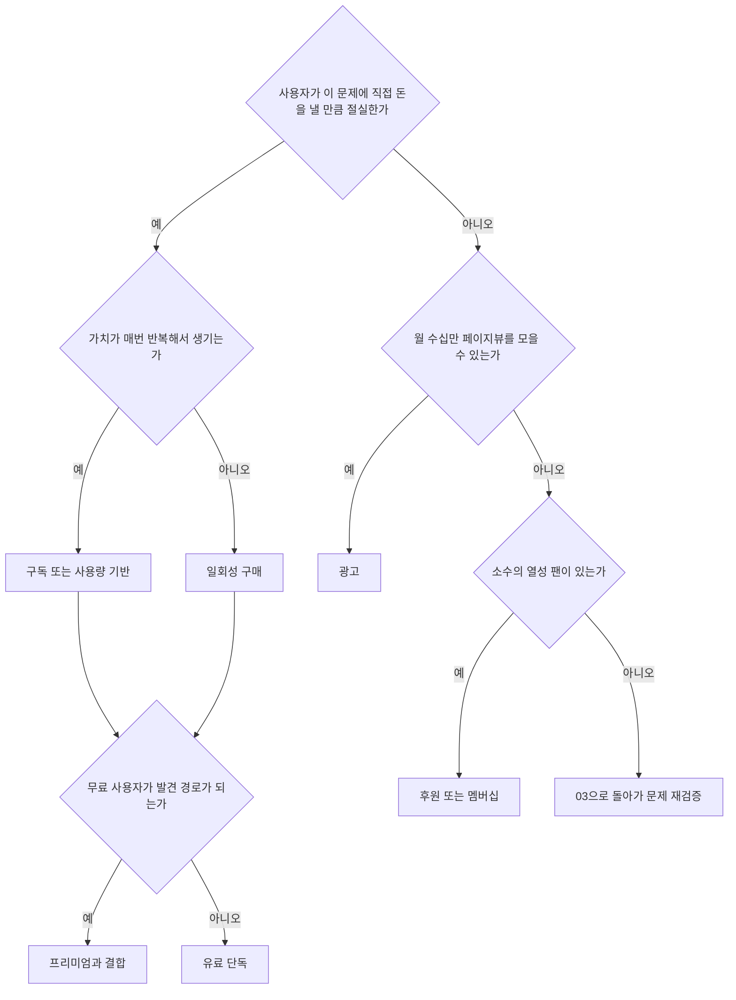

# 수익 모델 개론

> **학습 목표**: 9가지 수익 모델이 각각 무엇을 필요로 하는지 구분하고, 제품 유형별 적합도와 모델별 단위 경제를 계산하며, 2026-09-29 기준 주요 플랫폼·결제 수수료를 출처와 함께 읽을 수 있다.

기준일: 2026-09-29. 수수료는 자주 바뀌므로 실행 전에 표의 공식 문서를 다시 확인한다. 예시 숫자는 모두 가정이며 세금은 뺐다.

## 핵심 개념

| 모델 | 누가 무엇에 돈을 내는가 | 대표 예 |
|---|---|---|
| 광고 | 광고주가 사용자의 주목에 | 콘텐츠 사이트, 무료 모바일 게임 |
| 일회성 구매 | 사용자가 한 번 | 유료 앱, Steam 게임, 템플릿 |
| 구독 | 사용자가 주기적으로 | 생산성 앱, 멤버십 |
| 프리미엄(Freemium) | 무료 사용자 중 일부가 유료 기능에 | 무료 도구 + Pro 요금제 |
| 사용량 기반 | 쓴 만큼 | AI 생성 크레딧, API 호출 |
| 수수료·마켓플레이스 | 거래가 일어날 때 거래액의 일정 비율 | 에셋 마켓, 중개 플랫폼 |
| 라이선스 | 기업·개발자가 사용 권리에 | 폰트, 에셋, 소스 코드 상업 라이선스 |
| 후원·기부 | 팬이 창작자에게 | Patreon, 후원 버튼 |
| 서비스 | 고객이 내 시간에 | 외주, 설치·도입 지원, 강의 |

**Merchant of Record(MoR)**: 법적으로 "판매자"가 되어 결제, 국가별 부가세·판매세 계산과 납부, 환불을 대신 처리하는 결제 대행 방식이다. 수수료는 일반 결제 대행보다 높지만 해외 세무 부담을 줄인다.

## 원리

### 모델마다 필요한 것이 다르다

| 모델 | 트래픽 | 신뢰 | 리텐션 | 결제 인프라 |
|---|---|---|---|---|
| 광고 | 매우 높음 | 낮음 | 중간 | 낮음 (광고 네트워크 계정) |
| 일회성 구매 | 중간 | 중간 | 낮음 | 중간 |
| 구독 | 중간 | 높음 | 매우 높음 | 높음 |
| 프리미엄 | 높음 | 중간 | 높음 | 높음 |
| 사용량 기반 | 중간 | 높음 | 중간 | 높음 (원가 관리 포함) |
| 수수료·마켓플레이스 | 양쪽 모두 높음 | 매우 높음 | 높음 | 매우 높음 (정산) |
| 라이선스 | 낮음 | 높음 | 낮음 | 낮음 (계약) |
| 후원·기부 | 낮음 (소수의 팬) | 매우 높음 | 높음 | 낮음 (플랫폼 이용) |
| 서비스 | 낮음 | 높음 | 낮음 | 낮음 (세금계산서) |

1인 스튜디오에서 가장 흔한 실수는 **트래픽이 없는 제품에 광고를, 리텐션이 검증되지 않은 제품에 구독을** 붙이는 것이다.

### 제품 유형별 적합도

아래는 판단 기준을 보여 주는 예시(가정)다. 게임 세부는 07, 가격 설계는 06에서 다룬다.

| 모델 | 게임 | 창작 도구 | 생산성 앱 | 콘텐츠 사이트 |
|---|---|---|---|---|
| 광고 | 중간 (모바일 캐주얼은 높음) | 낮음 | 낮음 | 높음 |
| 일회성 구매 | 높음 (PC) | 높음 | 중간 | 중간 (전자책·템플릿) |
| 구독 | 낮음 | 중간 | 높음 | 중간 (멤버십) |
| 프리미엄 | 중간 (F2P, 운영 부담 큼) | 높음 | 높음 | 낮음 |
| 사용량 기반 | 낮음 | 중간 (AI 생성 기능) | 중간 | 낮음 |
| 수수료·마켓플레이스 | 낮음 | 중간 (템플릿·에셋) | 낮음 | 낮음 |
| 라이선스 | 낮음 | 중간 | 낮음 | 낮음 |
| 후원·기부 | 중간 | 중간 | 낮음 | 중간 |
| 서비스 | 낮음 | 낮음 | 중간 (도입 지원) | 중간 (강의·자문) |

### 모델별 단위 경제: 월 순매출 350만 원에 필요한 규모

| 모델 | 식 | 가정 | 필요한 규모 |
|---|---|---|---|
| 광고 | 페이지뷰 × RPM ÷ 1,000 | RPM 3,000원 | 3,500,000 ÷ 3,000 × 1,000 ≈ **1,166,667 PV/월** |
| 일회성 구매 | 판매량 × 가격 × (1 − 수수료율) | 10,000원, 수수료 15% → 8,500원 | 3,500,000 ÷ 8,500 ≈ **412개/월** |
| 구독 | 유지 구독자 × 월 가격 × (1 − 수수료율) | 월 5,000원, 15% → 4,250원 | 3,500,000 ÷ 4,250 ≈ **824명 유지** |
| 프리미엄 | 무료 활성 사용자 × 유료 전환율 × 유료 순단가 | 전환 3%, 순단가 4,250원 | 824 ÷ 0.03 ≈ **27,467명 활성** |
| 사용량 기반 | 사용 매출 × (1 − 원가율) | 원가율 40% (AI API) | 3,500,000 ÷ 0.6 ≈ **583만 원어치 사용** |
| 마켓플레이스 | 거래액(GMV) × Take Rate | Take Rate 10% | **GMV 3,500만 원/월** |
| 라이선스 | 계약 수 × 계약 금액 | 건당 50만 원 | **7건/월** |
| 후원 | 후원자 × 금액 × (1 − 플랫폼 수수료) | 월 5,000원, 10% → 4,500원 | 3,500,000 ÷ 4,500 ≈ **778명** (결제 처리 수수료 별도) |
| 서비스 | 판매 시간 × 시간당 단가 | 시간당 5만 원 | **70시간/월** (160시간의 44%) |

구독의 가치는 월 매출보다 **LTV**로 본다. 월 해지율 8%(가정)라면 LTV ≈ 4,250 ÷ 0.08 = **53,125원**이다. 해지율 계산과 가격 설계는 06에서 깊이 다룬다.

### 플랫폼·결제 수수료 (기준 2026-09-29)

| 플랫폼 | 수수료 | 조건·비고 |
|---|---|---|
| Apple App Store | 표준 30%, Small Business Program 15% | 전년도 proceeds 100만 달러 이하 개발자·신규 개발자가 신청. 1년 넘게 유지된 자동 갱신 구독은 15%. 한국 제3자 결제 수수료는 26% (06). EU·미국의 외부 링크 규정은 이 트랙에서 다루지 않으므로 Apple 문서에서 직접 확인한다 |
| Google Play (한국, 현행) | 연 첫 100만 달러 15% (신청 필요), 초과분 30%, 자동 갱신 구독 15%. 한국 대체 결제(개발자 자체 결제)를 쓰면 4%p 낮아져 11% (15% 구간)·26% (30% 구간) | 대체 결제 요율은 Play Console 도움말 기준. 2026-03-04 발표한 새 구조는 한국에 2026-12-31까지 적용 예정 (보도) |
| Google Play (미국·영국·EEA, 2026-06-30부터) | 서비스 수수료: 연 첫 100만 달러와 자동 갱신 구독 10%. 100만 달러 초과분의 비반복 상품은 Apps Experience Program 참여 시 신규 설치 15%·기존 설치 20%, 비참여 시 20%·25%. Google Play 결제를 쓰면 결제 수수료 5% 별도 | 프로그램 신청은 2026-09부터 Play Console에서. 호주 2026-09-30, 일본·한국 2026-12-31, 그 외 2027-09-30까지 순차 적용 (보도) |
| Steam | 게임별 매출 1,000만 달러까지 30%, 1,000만~5,000만 달러 25%, 초과분 20% | 2018-10-01 이후 매출부터. 앱당 Steam Direct 100달러, 조정 총매출 1,000달러 이후 정산에서 회수 (07) |
| itch.io | 개발자가 0~100% 중 선택, 기본 10% | 2015년 도입한 open revenue sharing |
| Stripe (미국 기준) | 국내 카드 2.9% + 30센트 | 한국은 Stripe 가맹점 지원 국가 목록에 없다 |
| Paddle (MoR) | 5% + 50센트 | 세금 계산·징수·납부를 Paddle이 판매자로서 처리 |
| Lemon Squeezy (MoR) | 5% + 50센트, 해외 결제·PayPal·구독 등 추가 요율 | 2024년 Stripe가 인수, Stripe Managed Payments로 이전 중. 신규 가입: 대기자 명단·초대제라는 보도 (2026-09 기준, 공식 확인 안 됨). 새로 시작한다면 Paddle 또는 Gumroad |
| Stripe Managed Payments (MoR) | Stripe 결제 수수료 + 거래당 3.5% | 약 35개국 판매자 대상, 대기자 명단으로 접근 (2026 보도). 한국 판매자 이용 가능 여부 확인 안 됨 |
| Gumroad | 직접 판매 10% + 50센트, Discover 경유 30% | 2025-01부터 MoR |
| Patreon | 2025-08-04 이후 신규 크리에이터 10% + 결제 처리 수수료 | 그 전 크리에이터는 기존 요율 유지 |
| Google AdSense (콘텐츠) | 게시자 몫 80% (구매 측 플랫폼 수수료 차감 후) | Google Ads 경유 광고는 광고주 지출 대비 약 68% (05) |

## 적용: 예시 스튜디오

프로토타입 유형별로 **처음 시험할 모델 하나**만 고른다 (가정).

| 유형 (개수) | 첫 모델 | 이유 | 심화 문서 |
|---|---|---|---|
| 게임 (3) | PC 일회성 구매 | Steam은 유료 판매 구조가 성숙하고 Wishlist로 사전 신호를 볼 수 있다 | 07 |
| 창작 도구 (4) | 일회성 구매 또는 프리미엄, MoR 경유 | 한국에서 Stripe를 직접 쓰기 어렵고 해외 세무를 줄인다 | 06 |
| 생산성 앱 (3) | 구독 (무료 체험) | 반복 사용 가치가 있을 때만 | 06 |
| 콘텐츠 사이트 (2) | 광고 + 보조 모델 | 기술 문서 사이트는 애드센스 준비 중 | 05 |

**조합 예 (가정)**: 광고 50만 원 (RPM 3,000원이면 166,667 PV) + 창작 도구 일회성 150만 원 (8,500원 × 177개) + 생산성 앱 구독 150만 원 (4,250원 × 353명) = **약 350만 원** (3,504,750원). 하나의 모델로 1,166,667 PV나 824명을 모으는 것보다 세 경로를 작게 쌓는 편이 02의 상관관계 관점에서도 안전하다.

## 심화

### 모델을 섞을 때의 비용

모델을 하나 더할 때마다 결제 연동, 환불 정책, 약관, 측정 지표가 하나씩 늘어난다. 1인 스튜디오에서는 **제품당 주 모델 1개 + 보조 모델 최대 1개**를 출발점으로 삼는다.

**보조 모델을 더하는 규칙**: 주 모델이 02의 G4(출시 60일: 월 순매출 10만 원 이상 또는 주간 활성 100명)를 통과하기 전에는 보조 모델을 붙이지 않는다. 주 모델이 신호를 내기 전에 모델을 더하면 어느 쪽이 효과를 냈는지 가를 수 없고, 결제·약관·지표 작업만 두 배가 된다. 통과한 뒤에도 03처럼 보조 모델의 임계값과 기간을 먼저 적고, 보조 모델이 주 모델의 핵심 지표(예: 체험 → 결제)를 떨어뜨리면 걷어 낸다. 예: T1은 일회성 판매가 G4를 통과한 뒤에만 구독형 에셋 팩을 시험한다. C2의 주 모델은 광고이며, C2에서 T1로 가는 링크는 수익 모델이 아니라 유통이다 (02 심화).

### MoR과 직접 PG의 손익분기

"MoR은 비싸다"는 수수료만 보면 맞지만, 세무 시간까지 넣으면 판매량에 따라 답이 바뀐다. 06의 해외 일회성 판매($29, 1,400원 환율 가정 = 40,600원)로 계산한다. 모든 숫자는 가정이다.

| 항목 | Paddle (MoR) | 직접 PG (토스페이먼츠 3.4% 가정) |
|---|---|---|
| 건당 수수료 | $29 × 5% + $0.50 = $1.95 = 2,730원 | 40,600 × 3.4% ≈ 1,380원 |
| 해외 세무 | Paddle이 판매자로서 계산·징수·신고 | 직접 한다. EU 소비자에게 파는 디지털 상품은 EU 밖 사업자도 첫 판매부터 EU 부가세 의무가 생기며, non-Union OSS로 한 나라에 모아 신고할 수 있다. 다른 나라는 나라마다 따로 확인 |
| 월 고정 비용 | 0 | 세무 작업 월 4시간 × 21,875원 = 87,500원 + 연 관리비 11만 원 ÷ 12 ≈ 9,167원 = 약 96,667원 |

> 건당 차이 = 2,730 − 1,380.4 = 1,349.6원 → 손익분기 판매량 = 96,667 ÷ 1,349.6 ≈ **월 72건** (총매출 약 291만 원)

| 월 세무 시간 (가정) | 월 고정 비용 | MoR이 더 싼 구간 |
|---|---|---|
| 2시간 | 약 52,917원 | 월 39건 이하 |
| 4시간 | 약 96,667원 | 월 71건 이하 |
| 8시간 | 약 184,167원 | 월 136건 이하 |

- 읽는 법: T1의 60일째 순매출 45만 원(09)은 06의 $29 판매로 환산하면 월 약 12건(450,000 ÷ 37,870)이다. 손익분기보다 훨씬 아래이므로 예시 스튜디오에는 MoR이 싸다.
- 빠진 것: PG 가입비 22만 원, 세무사 비용, 차지백·사기 대응 시간, 국내 부가세 신고(두 경로 모두 필요). 해외 카드 결제 요율은 계약마다 다르며 3.4%보다 높을 수 있다 (확인 필요). 요율이 높을수록 손익분기 판매량이 올라가 MoR이 더 오래 유리하다.

### 모델·채널·플랫폼 상관관계 점검

02 심화의 세 축(수익 모델, 유입 채널, 플랫폼)으로 예시 스튜디오의 조합 예(광고 50만 + 창작 도구 일회성 150만 + 생산성 앱 구독 150만)를 점검한다. 두 경로가 축을 공유하면 1점, 일부 공유하면 0.5점, 공유하지 않으면 0점이다 (점수 기준은 가정).

| 경로 | 수익 모델 | 주 유입 채널 | 플랫폼·결제 계정 |
|---|---|---|---|
| A: C2 광고 (50만) | 광고 | Google 검색 | 웹, AdSense 계정 |
| B: T1 일회성 (150만) | 사용자 직접 결제 (일회성) | C2의 링크(검색 경유)와 커뮤니티 | 웹, Paddle |
| C: 생산성 앱 구독 (150만) | 사용자 직접 결제 (구독) | 커뮤니티와 스튜디오 뉴스레터 | 웹, 토스페이먼츠 |

| 쌍 | 모델 | 채널 | 플랫폼·결제 | 합계 (최대 3) |
|---|---|---|---|---|
| A–B | 0 | 0.5 | 0.5 | 1.0 |
| A–C | 0 | 0.5 (뉴스레터 가입이 C2에서 온다) | 0.5 | 1.0 |
| B–C | 0.5 | 0.5 | 0.5 | 1.5 |
| 전체 | | | | 3.5 / 9 |

같은 350만 원을 콘텐츠 사이트 광고 셋으로 만들면 모든 쌍이 3점이라 9 / 9다.

- 충격 시험 (가정): Google 검색 유입이 50% 줄고 B 유입의 절반이 검색·C2 경유라면, A는 25만 원, B는 150 × (1 − 0.5 × 0.5) = 112.5만 원, C는 단기적으로 150만 원 그대로 → 합계 287.5만 원 (−17.9%). 광고 단일 경로였다면 175만 원 (−50%)이다.
- 가장 큰 단일 위험은 결제 계정이다. Paddle 계정이 멈추면 B의 150만 원(전체의 42.9%)이 한꺼번에 빠진다. 그래서 B와 C를 서로 다른 결제 경로에 둔다.
- 점검 순서: ① 경로마다 세 축을 적는다 ② 쌍마다 점수를 매긴다 ③ 가장 많이 공유된 축 하나로 충격 시험을 한다 ④ 한 축이 전체의 절반 이상을 흔들면, 다음 베팅은 그 축을 공유하지 않는 후보에서 고른다.

### 세금과 표시 가격

국내 소비자 판매가는 부가세를 포함해 표시하고, 앱스토어·해외 매출은 부가세 처리 방식이 다르다. 이 표의 순단가는 세금을 뺀 설명용 숫자다. 비즈니스 섹션의 「부가세 · 영세율 · 세금계산서」를 함께 본다.

## 흔한 오해

- **"무료로 풀고 광고를 붙이면 된다"** — 광고는 트래픽 요구량이 가장 큰 모델이다.
- **"구독이 가장 좋은 모델이다"** — 반복 가치와 낮은 해지율이 없으면 구독은 환불과 해지만 늘린다.
- **"수수료는 30%다"** — 2026년 기준 소규모 개발자는 결제 방식에 따라 10~15%가 흔하다 (예: Google Play 미국 연 첫 100만 달러 10%에 Google Play 결제 시 결제 수수료 5% 별도, 한국 현행 15%, 한국 대체 결제 11%). 지역·설치 시점마다 또 다르다.
- **"MoR은 비싸기만 하다"** — 해외 부가세 신고를 직접 할 때의 시간·세무 비용과 비교해야 한다.
- **"수익 모델은 나중에 붙인다"** — 모델이 온보딩, 무료 범위, 측정 지표를 바꾼다.

## 자기 점검 질문

1. 내 제품 하나를 골라, 위 필요 조건 표의 네 항목 중 가장 약한 것을 말해 보라.
2. 월 9,900원 구독, 수수료 15%일 때 월 순매출 350만 원에 필요한 유지 구독자는 몇 명인가?
3. 무료 활성 사용자 10,000명, 유료 전환 2%, 순단가 4,250원이면 월 순매출은 얼마인가?
4. 한국에서 Stripe를 직접 쓰기 어려울 때 해외 판매용으로 고려할 수 있는 결제 방식 두 가지는?
5. 예시 스튜디오의 조합 예에서 광고를 빼고 같은 350만 원을 만들려면 무엇을 얼마나 늘려야 하는가?

## 참고 자료

- [App Store Small Business Program — Apple Developer](https://developer.apple.com/app-store/small-business-program/) (접속 2026-09-28)
- [Membership details — Apple Developer Program](https://developer.apple.com/programs/whats-included/) (1년 넘은 구독 갱신 15%, 접속 2026-09-28)
- [Apple announces App Store Small Business Program — Apple Newsroom](https://www.apple.com/newsroom/2020/11/apple-announces-app-store-small-business-program/) (2020-11, 접속 2026-09-28)
- [Distributing apps using a third-party payment provider in South Korea — Apple Developer](https://developer.apple.com/support/storekit-external-entitlement-kr/) (접속 2026-09-28)
- [Service fees — Play Console Help](https://support.google.com/googleplay/android-developer/answer/112622?hl=en) (접속 2026-09-28)
- [Changes to Google Play's billing requirements for developers serving users in South Korea — Play Console Help](https://support.google.com/googleplay/android-developer/answer/11222040?hl=en) (대체 결제 4%p 인하, 접속 2026-09-29)
- [Google Play Apps Experience Program — Google Play Console](https://play.google.com/console/about/programs/appsexperience/) (100만 달러 초과분 프로그램 요율, 접속 2026-09-29)
- [Understanding Google Play's lower service fees — Play Console Help](https://support.google.com/googleplay/android-developer/answer/16954621?hl=en) (접속 2026-09-28)
- [Expanded billing choice and lower fees on Google Play — Android Developers Blog](https://android-developers.googleblog.com/2026/06/play-expanded-billing.html) (2026-06, 접속 2026-09-28)
- [Google settles with Epic Games, drops its Play Store commissions to 20% — TechCrunch](https://techcrunch.com/2026/03/04/google-settles-with-epic-games-drops-its-play-store-commissions-to-20/) (2026-03-04, 접속 2026-09-28)
- [Valve creates new rev share tiers to give big sellers a break — Game Developer](https://www.gamedeveloper.com/business/valve-creates-new-rev-share-tiers-to-give-big-sellers-a-break) (2018-11, 접속 2026-09-28)
- [Steam Direct Fee — Steamworks Documentation](https://partner.steamgames.com/doc/gettingstarted/appfee) (접속 2026-09-28)
- [Introducing open revenue sharing — itch.io](https://itch.io/updates/introducing-open-revenue-sharing) (2015, 접속 2026-09-28)
- [Pricing — Stripe](https://stripe.com/pricing) / [Global availability — Stripe](https://stripe.com/global) (접속 2026-09-28)
- [Pricing — Paddle](https://www.paddle.com/pricing) (접속 2026-09-28)
- [Fees — Lemon Squeezy Docs](https://docs.lemonsqueezy.com/help/getting-started/fees) (접속 2026-09-28)
- [2026 Update: Lemon Squeezy + Stripe Managed Payments — Lemon Squeezy](https://www.lemonsqueezy.com/blog/2026-update) (2026, 검색 결과로 확인, 접속 2026-09-29)
- [Managed Payments pricing — Stripe Support](https://support.stripe.com/questions/managed-payments-pricing) (접속 2026-09-29)
- [EU VAT One Stop Shop (OSS) — Your Europe](https://europa.eu/youreurope/business/taxation/vat/one-stop-shop/index_en.htm) (non-Union OSS, 접속 2026-09-29)
- [Gumroad's fees — Gumroad Help Center](https://gumroad.com/help/article/66-gumroads-fees) (접속 2026-09-28)
- [A standard platform fee for new creators — Patreon Help Center](https://support.patreon.com/hc/en-us/articles/36426991446797-A-standard-platform-fee-for-new-creators-effective-after-August-4-2025) (2025, 접속 2026-09-28)
- [Updates to how publishers monetize with AdSense — Google](https://blog.google/products/adsense/evolving-how-publishers-monetize-with-adsense/) (2023-11, 접속 2026-09-28)
