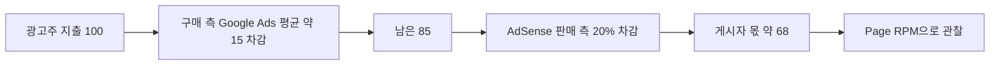

# 광고 수익 심화

> **학습 목표**: 노출·CTR·CPC·CPM·RPM·Fill Rate로 광고 수익이 만들어지는 구조를 설명하고, 목표 금액에 필요한 페이지뷰를 계산하며, RPM을 올리는 요인과 계정을 잃는 행동을 구분할 수 있다.

기준일: 2026-09-28. 수익 배분율과 정책은 공식 문서 기준이며, RPM 숫자는 모두 가정이다. 환율은 트랙 공통 가정 1달러 = 1,400원을 쓴다 (2026-09-09 서울 외환시장 종가는 1,336.1원).

## 핵심 개념

| 지표 | 정의 | 식 |
|---|---|---|
| 노출(Impression) | 광고가 페이지에 표시된 횟수 | 광고 요청 × Fill Rate |
| Fill Rate | 광고 요청 중 실제로 광고가 채워진 비율 | 채워진 요청 ÷ 전체 요청 |
| CTR | 노출 대비 클릭 비율 | 클릭 ÷ 노출 |
| CPC | 클릭 1회당 광고주 비용 | 광고비 ÷ 클릭 |
| CPM | 노출 1,000회당 광고주 비용 | 광고비 ÷ 노출 × 1,000 |
| Page RPM | 페이지뷰 1,000회당 게시자 예상 수익 | 예상 수익 ÷ 페이지뷰 × 1,000 |
| Viewability | 광고가 실제로 화면에 보인 정도 | 측정 도구마다 기준이 다르다 |
| 무효 트래픽(Invalid Traffic) | 실제 사용자 관심이 아닌 클릭·노출 | 정책 위반, 수익 차감·계정 정지 사유 |

CPM과 CPC는 **광고주가 내는 값**, RPM은 **게시자가 받는 값**이다. Google 도움말의 예: 페이지뷰 25회에서 0.15달러를 벌었다면 Page RPM = (0.15 ÷ 25) × 1,000 = 6.00달러 (1,400원 환율 가정 시 8,400원).

## 원리

### 광고비는 어떻게 게시자에게 오는가

Google은 2023년 11월, 2024년 초부터 AdSense의 수익 배분을 구매 측과 판매 측으로 나누고 주로 노출 기준(per impression)으로 지급한다고 발표했다. **AdSense for content 게시자는 광고주 플랫폼 수수료를 뺀 금액의 80%를 받는다.** Google Ads로 구매된 광고에서는 Google Ads가 광고주 지출의 평균 약 15%를 가져가므로, 게시자 몫은 광고주 지출 대비 약 68%가 된다.

> 100 × (1 − 0.15) × 0.80 = 68

### Page RPM 분해

> Page RPM ≈ 페이지당 광고 요청 수 × Fill Rate × 노출 1,000회당 게시자 수익

예 (가정): 페이지당 광고 3개, Fill Rate 90%, 노출 1,000회당 게시자 수익 1,000원.

- 페이지뷰 1,000회 → 광고 요청 3,000회 → 노출 2,700회
- 수익 = 2,700 × 1,000 ÷ 1,000 = 2,700원 → **Page RPM 2,700원**

광고를 더 넣으면 요청 수는 늘지만, Viewability와 사용자 경험이 떨어져 노출당 수익과 재방문이 줄 수 있다. 식의 세 항은 서로 독립이 아니다.

### 트래픽 계산: 목표 금액에 필요한 페이지뷰

> 필요 월 페이지뷰 = 목표 월 수익 ÷ Page RPM × 1,000

Google은 AdSense 수익이 콘텐츠 카테고리와 방문자 지역에 따라 달라진다고 안내하며 고정된 평균 RPM을 공개하지 않는다. 그래서 아래 RPM은 **범위를 보기 위한 가정**이다.

| 목표 월 수익 | RPM 1,000원 (가정) | RPM 3,000원 (가정) | RPM 6,000원 (가정) |
|---|---|---|---|
| 50만 원 (예시 스튜디오 고정비) | 500,000 PV | 166,667 PV | 83,333 PV |
| 350만 원 (손익분기) | 3,500,000 PV | 1,166,667 PV | 583,333 PV |

RPM 3,000원에서 고정비 50만 원만 덮으려 해도 하루 약 5,556 PV(166,667 ÷ 30)가 필요하다. 실제 계획은 광고 게재 4~8주 뒤 **내 사이트의 Page RPM**으로 이 표를 다시 계산한다.

### RPM을 올리는 요인

| 요인 | 작동 방식 | 할 수 있는 일 | 주의 |
|---|---|---|---|
| 주제 | 주제마다 광고주 경쟁이 다르다 | 구매 의도가 있는 주제(도구 비교, 도입 가이드)를 전문성 안에서 다룬다 | RPM만 보고 모르는 주제를 쓰면 품질이 떨어진다 |
| 지역 | 방문자 국가에 따라 광고 수요가 다르다 | 영어 페이지로 다른 지역 독자에게 닿는다 | 기계 번역 수준의 페이지는 품질 문제를 만든다 |
| 레이아웃 | 보이지 않는 광고는 가치가 낮다 | 본문 흐름 속에 적당한 수의 광고를 둔다 | 콘텐츠로 오인하게 만드는 배치는 정책 위반 |
| Core Web Vitals | 느리고 흔들리는 페이지는 검색과 사용자 모두에게 불리하다 | 광고 슬롯 크기를 미리 잡아 CLS를 막는다 | LCP 2.5초, INP 200ms, CLS 0.1 이하가 "좋음" 기준 |

Google Search Central은 좋은 Core Web Vitals를 권장하며, 핵심 순위 시스템이 보상하려는 방향과 일치한다고 설명한다. 광고가 페이지를 느리게 만들면 **검색 유입이 줄어 전체 수익이 줄 수 있다.**

### 계정을 잃는 길: 무효 트래픽과 정책

AdSense는 자기 광고 클릭, 클릭 요청, 자동화된 노출·클릭 등으로 광고 노출·클릭을 인위적으로 부풀리는 것을 금지한다. 무효 트래픽이 많으면 계정이 정지되거나 해지될 수 있고, 해지 시 미지급 수익은 지급되지 않으며 광고주에게 환불된다.

- **나쁜 예**: "광고 테스트 겸 내 사이트 광고를 몇 번 눌러 봤다." / "글 끝에 '광고 한 번 눌러 주세요'라고 적었다." / "싼 트래픽을 사서 페이지뷰를 올렸다."
- **좋은 예**: "광고 미리보기 도구로 확인하고, 유입 채널별로 트래픽을 나눠 이상한 급증을 감시한다. 콘텐츠로 방문자를 모은다."

승인 단계에서는 "사이트가 광고를 게재할 준비가 되지 않았다(가치가 낮은 콘텐츠)"는 거절이 흔하다. Google은 독창적이고 유용한 콘텐츠와 좋은 사용자 경험·탐색 구조를 요구한다.

### 콘텐츠 사이트에 검색·AI 검색 유입이 필요한 이유

광고 모델은 반복되는 대량 방문이 전제다. 1인 콘텐츠 사이트에서 그런 규모의 유입은 대부분 검색에서 온다. 그런데 Pew Research Center의 2025년 조사(2025-07-22)에서 Google 검색 결과에 AI 요약이 나온 방문에서는 일반 결과 링크 클릭이 8%, 나오지 않은 방문에서는 15%였고, AI 요약 안의 출처 링크 클릭은 1%였다. 검색 유입 전략은 Marketing 섹션의 「AI 검색 · GEO/AEO」 문서를 함께 본다.

### 앱·게임 광고

| 형식 | 특징 | AdMob 정책 핵심 |
|---|---|---|
| 배너 | 화면 일부에 계속 노출 | 콘텐츠·버튼과 겹쳐 실수 클릭을 유도하지 않는다 |
| 전면(Interstitial) | 전환 지점에 전체 화면 | 자연스러운 전환 지점에만. 예상치 못한 로딩, 매 클릭마다 표시, 게임 플레이 중 표시는 금지 |
| 보상형(Rewarded) | 보상을 받으려고 사용자가 선택 | 사용자가 명확히 동의한 뒤에만 표시. 보상형 전면은 소개 화면과 거부 선택지 필요 |

게임에서 광고를 경제 설계와 어떻게 맞물릴지는 07에서 다룬다.

## 적용: 예시 스튜디오

애드센스를 준비 중인 기술 문서 사이트의 현재 월 페이지뷰를 20,000으로 가정하면:

| 항목 | 계산 | 결과 |
|---|---|---|
| RPM 3,000원일 때 월 광고 수익 | 20,000 × 3,000 ÷ 1,000 | 60,000원 |
| 고정비 50만 원까지 필요한 배수 | 166,667 ÷ 20,000 | 약 8.3배 |
| 손익분기 350만 원까지 필요한 배수 | 1,166,667 ÷ 20,000 | 약 58.3배 |

결론: 광고만으로 이 사이트가 스튜디오를 먹여 살리기는 어렵다. 이 사이트의 역할은 **광고로 바닥 수익을 만들고, 스튜디오의 다른 제품이 발견되는 통로가 되는 것**이다. 실행 순서 (가정):

1. 승인 준비: 얇은 페이지를 합치거나 보강하고, 탐색 구조와 개인정보 처리방침·쿠키 고지를 확인한다.
2. 광고 배치: 슬롯 크기를 미리 잡아 CLS를 막고, 페이지당 광고 수를 적게 시작한다.
3. 측정: 4~8주 뒤 실제 Page RPM으로 위 표를 다시 계산한다 (09).
4. 연결: 각 문서에서 관련 도구 제품으로 가는 링크를 둔다 (04의 조합 예).

## 심화

### AdSense 밖의 광고 관리 회사

규모가 커지면 광고 관리 회사를 검토한다. Raptive는 2025-10-16 가입 기준을 월 25,000 페이지뷰로 낮췄지만, 25,000~99,999 페이지뷰 구간은 트래픽의 50% 이상이 미국·영국·캐나다·뉴질랜드·호주에서 와야 한다. Mediavine의 Journey는 2026-01-15부터 30일간 Tier 1 국가 세션 1,000회 이상이면 신청할 수 있다고 안내된다. 두 곳 모두 **영어권 트래픽**을 전제로 하므로, 한국어 사이트라면 영어판 페이지의 트래픽이 조건을 좌우한다.

### 광고는 바닥이지 천장이 아니다

광고 수익은 방문자 한 명당 금액이 작아서, 같은 방문자에게 전자책·템플릿·도구를 팔 때보다 한 명당 수익이 낮다. 광고는 트래픽을 돈으로 바꾸는 가장 쉬운 첫 단계이고, 트래픽이 확인되면 04의 다른 모델을 겹쳐 올린다.

## 흔한 오해

- **"AdSense 80%면 광고주가 쓴 돈의 80%를 받는다"** — 구매 측 수수료를 뺀 뒤의 80%다. Google Ads 경유 광고는 약 68%다.
- **"광고를 많이 넣을수록 수익이 는다"** — Viewability, Core Web Vitals, 재방문이 떨어지면 오히려 줄 수 있다.
- **"승인만 받으면 돈이 된다"** — 승인은 시작이다. 수익은 페이지뷰 × RPM이다.
- **"실수로 한 번 눌러도 괜찮겠지"** — 자기 광고 클릭은 금지다. 확인은 미리보기 도구로 한다.
- **"검색 순위만 오르면 트래픽은 따라온다"** — AI 요약이 있는 결과에서는 클릭이 줄어든다는 조사가 있다.

## 자기 점검 질문

1. 페이지당 광고 2개, Fill Rate 80%, 노출 1,000회당 게시자 수익 1,500원이면 Page RPM은 얼마인가?
2. Page RPM 2,000원에서 월 100만 원을 벌려면 하루 평균 몇 페이지뷰가 필요한가?
3. 광고주가 100만 원을 Google Ads로 썼을 때 AdSense 게시자 몫은 대략 얼마인가?
4. 전면 광고를 넣으면 안 되는 순간 두 가지를 말해 보라.
5. 내 콘텐츠 사이트가 광고 외에 스튜디오에 줄 수 있는 가치는 무엇인가?

## 참고 자료

- [Updates to how publishers monetize with AdSense — Google](https://blog.google/products/adsense/evolving-how-publishers-monetize-with-adsense/) (2023-11, 접속 2026-09-28)
- [AdSense revenue share — Google AdSense Help](https://support.google.com/adsense/answer/180195?hl=en) (접속 2026-09-28)
- [Page RPM — Google AdSense Help](https://support.google.com/adsense/answer/112030?hl=en) (접속 2026-09-28)
- [How much will you earn with AdSense? — Google AdSense Help](https://support.google.com/adsense/answer/9902?hl=en) (접속 2026-09-28)
- [Invalid traffic — Google AdSense Help](https://support.google.com/adsense/answer/16737?hl=en) (접속 2026-09-28)
- [Top invalid traffic and policy violations that lead to account closure — Google AdSense Help](https://support.google.com/adsense/answer/2660562?hl=en) (접속 2026-09-28)
- [What to do when your site is not ready to show ads — Google AdSense Help](https://support.google.com/adsense/answer/12176698?hl=en) (접속 2026-09-28)
- [Understanding Core Web Vitals and Google search results — Google Search Central](https://developers.google.com/search/docs/appearance/core-web-vitals) (접속 2026-09-28)
- [Google users are less likely to click on links when an AI summary appears in the results — Pew Research Center](https://www.pewresearch.org/short-reads/2025/07/22/google-users-are-less-likely-to-click-on-links-when-an-ai-summary-appears-in-the-results/) (2025-07-22, 접속 2026-09-28)
- [Interstitial ad guidance — Google AdMob Help](https://support.google.com/admob/answer/6066980?hl=en) (접속 2026-09-28)
- [Policies for ad units that offer rewards — Google AdMob Help](https://support.google.com/admob/answer/7313578?hl=en) (접속 2026-09-28)
- [Raptive Drops Traffic Requirement By 75% To 25,000 Views — Search Engine Journal](https://www.searchenginejournal.com/raptive-drops-traffic-requirement-by-75-to-25000-views/558780/) (2025-10, 접속 2026-09-28)
- [Journey Minimum Requirements — Journey by Mediavine](https://journeymv.zendesk.com/hc/en-us/articles/24633185741723-Journey-Minimum-Requirements) (접속 2026-09-28)
- [원·달러 환율 9.5원 내린 1336.1원 — 아시아경제](https://view.asiae.co.kr/article/2026090915324235252) (2026-09-09, 접속 2026-09-28)
