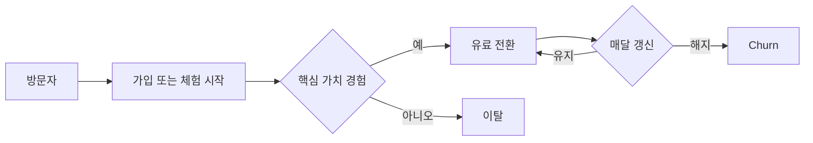
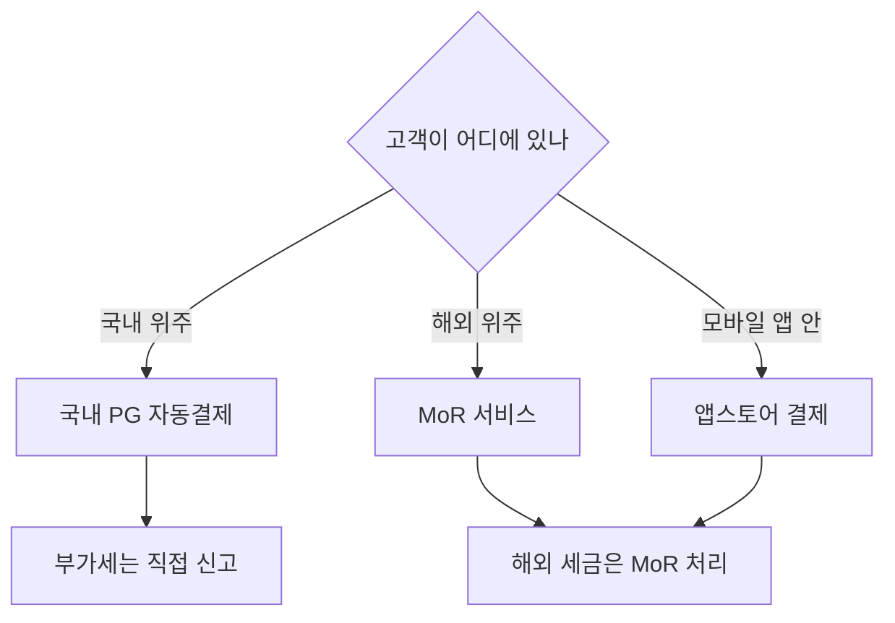

# 유료 판매·구독과 가격 설계

> **학습 목표**: 일회성 판매·구독·Freemium의 경제 구조를 계산으로 비교하고, 가격을 정하는 방법과 한국 1인 개발자가 쓸 수 있는 결제 경로를 고를 수 있다.

04 문서가 수익 모델의 지도를 그렸다면, 이 문서는 "사용자가 직접 돈을 내는" 모델만 깊게 판다. 숫자는 설명용 가정이며, 수수료·벤치마크는 출처와 확인 날짜를 붙였다.

## 핵심 개념

| 용어 | 정의 | 계산 |
|---|---|---|
| MRR | 월 반복 매출 (Monthly Recurring Revenue) | 유료 구독자 수 × 구독자당 월 매출 |
| ARR | 연 반복 매출 | MRR × 12 |
| Churn | 한 달 동안 해지한 유료 구독자 비율 | 월 해지 수 ÷ 월초 유료 구독자 수 |
| LTV | 한 고객이 떠날 때까지 남기는 순매출 | 월 순매출 ÷ 월 Churn (단순 모델) |
| 전환율 | 무료 사용자·체험자 중 결제한 비율 | 결제자 ÷ 대상자 |

세 가지 판매 방식의 차이는 **돈이 들어오는 모양**이다.

| 방식 | 돈의 모양 | 장점 | 1인 스튜디오의 함정 |
|---|---|---|---|
| 일회성 판매 | 출시 직후 봉우리, 이후 꼬리 | 구현 단순, 사용자 거부감 낮음 | 매달 새 구매자를 계속 찾아야 하는 러닝머신 |
| 구독 | 계단식 누적 (Churn만큼 새어 나감) | 매출 예측 가능, LTV가 큼 | 지속적인 가치 제공 의무, 해지 관리 |
| Freemium | 넓은 무료층 위의 얇은 유료층 | 유입 마찰 최소 | 무료 사용자 지원 비용, 낮은 전환율 |

## 원리

### 가치 기반 가격 (Value-based Pricing)

가격의 상한은 **고객이 느끼는 가치**, 하한은 **원가**, 그 사이의 위치는 **대안(경쟁 제품, 무료 도구, 직접 하는 수고)**이 정한다. AI로 만든 제품은 원가가 거의 0이라 원가 가산 방식은 의미가 없다. Madhavan Ramanujam과 Georg Tacke의 『Monetizing Innovation』(2016)은 만들기 **전에** 지불 의향(Willingness to Pay)을 묻고 제품을 가격에 맞춰 설계하라고 권한다. 03 문서의 사전 판매(pre-sale)가 그 가장 강한 형태다.

### 가격 심리: Anchoring과 Decoy

- **Anchoring**: 처음 본 숫자가 이후 판단의 기준점이 된다 (Tversky & Kahneman, 1974). 가격표에서 가장 비싼 요금제를 먼저 보여 주면 가운데 요금제가 합리적으로 보인다.
- **Decoy (비대칭 우위 효과)**: 한 선택지에만 명백히 밀리는 세 번째 선택지를 넣으면 그 선택지의 선택률이 오른다 (Huber, Payne & Puto, 1982). 재현성 논란이 있으므로 A/B로 확인한다.

### 요금제로 하는 가격 차별

같은 제품에 다른 가격을 받는 방법은 고객이 **스스로 자기 구간을 고르게** 만드는 것이다. 기준 축은 사용량(내보내기 횟수), 기능(고급 기능), 주체(개인/팀), 기간(월/연)이다. 연간 요금제 할인은 현금을 앞당기고 Churn을 낮추는 도구다.

### Van Westendorp 가격 민감도 측정

네덜란드 경제학자 Peter van Westendorp가 1976년 제안한 설문으로, 네 가지를 묻는다: 너무 비싸서 안 산다 / 비싸지만 고려한다 / 싸다(좋은 거래) / 너무 싸서 품질이 의심된다. 누적 곡선의 교차점이 **수용 가능한 가격 범위**를 준다. 응답자는 실제 목표 고객이어야 하고, 말한 가격은 실제 지불보다 관대하다는 점을 감안한다.

### 체험 설계와 전환 벤치마크

| 지표 | 벤치마크 | 출처 |
|---|---|---|
| Free trial → 유료 (웹 SaaS) | 좋음 8~12%, 매우 좋음 15~25% | Lenny's Newsletter + Kyle Poyar(OpenView), 1,000여 제품 설문, 2023 |
| Freemium self-serve → 유료 | 좋음 3~5%, 매우 좋음 6~8% | 같은 출처 |
| 앱 체험 17~32일 vs 4일 미만 → 유료 (중앙값) | 42.5% vs 25.5% | RevenueCat 체험 기간 분석, 2026 |
| 설치 후 35일 내 유료 전환 (중앙값) | Hard paywall 10.7%, Freemium 2.1% | RevenueCat State of Subscription Apps 2026 |
| 연간 구독 1년 뒤 유지 (중앙값) | 28% (월간 구독은 약 11%) | 같은 보고서 |
| B2C SaaS 월 Churn | 좋음 3~5%, 매우 좋음 2% 미만 | Lenny's Newsletter, 2022 |

- 벤치마크는 **분모가 다르다**. 방문자 대비인지, 가입자 대비인지, 체험 시작자 대비인지 먼저 확인한다.
- 카드 입력을 요구하는 체험(opt-out)은 체험 시작이 줄고 전환율은 높게 보인다. 한국에서 무료→유료 자동 전환에는 전자상거래법상 사전 동의·고지 의무가 있다 (비즈니스 트랙 「약관 · 개인정보 · 전자상거래」).



## 적용: 예시 스튜디오

예시 스튜디오(가정)는 월 350만 원(생활비 300 + 고정비 50)이 필요하다. 부가세는 제외하고 공급가 기준으로 계산한다.

**A. 국내 웹 구독 (토스페이먼츠 일반 카드 수수료 3.4% 가정)**

```text
월 9,000원 × (1 − 0.034) = 구독자당 월 순매출 8,694원
필요 구독자 = 3,500,000 ÷ 8,694 = 402.6 → 403명
월 Churn 5% 가정: 매달 403 × 0.05 = 20.15 → 약 21명이 빠진다
LTV = 8,694 ÷ 0.05 = 173,880원 (평균 유지 20개월)
ARR = 350만 × 12 = 4,200만 원
```

403명을 유지하려면 **매달 신규 유료 21명**이 필요하다. 체험→유료 25%(가정)라면 체험 시작 84명, 방문→체험 2%(가정)라면 월 방문 4,200명이다.

**B. 해외 일회성 판매 (Paddle 5% + $0.50, 환율 1,400원 가정)**

```text
$29 − ($29 × 0.05 + $0.50) = $27.05 → 37,870원
필요 판매량 = 3,500,000 ÷ 37,870 = 92.4 → 매달 93건, 다음 달에도 93건
```

**C. iOS 구독 (Small Business Program 15%)**

```text
$4.99 × 0.85 = $4.2415 → 5,938원
필요 구독자 = 3,500,000 ÷ 5,938 = 589.4 → 590명
```

나쁜 예:

> "일단 무료로 풀고 사용자가 모이면 나중에 유료화하자." 가격을 한 번도 묻지 않은 채 6개월이 지났다.

좋은 예:

> 출시 전 대기자 30명에게 Van Westendorp 네 질문을 보내고, 수용 범위 안의 가격으로 얼리버드 결제 링크를 열어 실제 결제 수를 쟀다.

## 심화

### 결제 인프라 선택 (2026-09-29 확인)

| 경로 | 수수료 (공시 기준) | 특징 |
|---|---|---|
| Apple App Store | 표준 30%, Small Business Program 15% (전년 수익 100만 달러 이하), 구독 2년차 갱신분 15% | 한국은 외부 결제 허용 시 26% 수수료 구조 (2022 발표) |
| Google Play | 현행 연 100만 달러까지 15%, 자동 갱신 구독 15% (2022-01-01부터) | 한국에 새 체계(첫 100만 달러 10% 등) 2026-12-31 시행 예정 보도, 04 문서 표로 재확인 |
| 토스페이먼츠 (국내 PG) | 일반 카드 3.4%, 가입비 22만 원, 연 관리비 11만 원 (비교 자료 기준) | 영세·중소 우대 수수료, 자동결제(빌링)는 별도 심사·계약 |
| Paddle (MoR) | 5% + 50센트 | 한국 판매자 지원, 세금 계산·징수·신고를 Paddle이 판매자로서 처리 |
| Lemon Squeezy (MoR) | 5% + 50센트 + 해외 결제·구독 등 추가 요율 | 2024년 Stripe 인수, Stripe Managed Payments로 이전 중 |
| Stripe (직접 처리) | 해당 없음 | 한국은 Stripe 가맹점 지원 국가 목록에 없음. 해외 법인이 있어야 가능 |

### Merchant of Record가 바꾸는 것

- **MoR**은 법적으로 고객에게 파는 판매자가 된다. 각국 부가세·판매세를 MoR이 계산·징수·신고하고, 개발자는 MoR로부터 **정산금**을 받는다.
- 직접 처리(PG, Stripe)는 개발자가 판매자이므로 국가별 세금 의무가 개발자에게 남는다.
- 정산금이 국내 과세에서 어떻게 처리되는지(영세율 여부, 증빙)는 이 트랙에서 반복하지 않는다. 비즈니스 트랙의 「부가세 · 영세율 · 세금계산서」와 「소득세 · 법인세 · 원천징수 · 장부」를 보고 세무사와 확인한다.



## 흔한 오해

- **"싸게 받으면 더 많이 판다."** 1인 스튜디오의 병목은 유입이다. 가격을 절반으로 내리면 같은 매출에 두 배의 고객과 두 배의 지원 부담이 필요하다.
- **"구독이 항상 낫다."** 매달 새 가치를 주지 못하는 도구에 구독을 붙이면 Churn이 LTV를 먹는다. 일회성 판매 + 유료 업데이트가 맞는 제품도 있다.
- **"벤치마크보다 낮으면 실패다."** 분모와 가격대가 다르면 비교가 성립하지 않는다. 자기 제품의 지난달 숫자가 첫 기준이다.
- **"수수료가 낮은 곳이 최선이다."** MoR의 5%에는 세금 처리 대행이 들어 있다. 국가별 세무를 직접 하는 비용과 비교한다.

## 자기 점검 질문

1. 월 순매출 8,694원 구독자로 월 350만 원을 만들려면 몇 명이 필요하고, 월 Churn 5%에서 매달 몇 명을 새로 얻어야 하나?
2. Van Westendorp 설문의 네 질문은 무엇이며, 응답을 그대로 믿으면 안 되는 이유는?
3. 체험 전환율 벤치마크를 비교하기 전에 확인할 분모는 무엇인가?
4. MoR과 직접 처리 결제의 차이를 세금 의무 관점에서 설명하라.
5. 자기 제품 하나에 대해 사용량·기능·주체·기간 중 어느 축으로 요금제를 나눌지 정하라.

## 참고 자료

- [RevenueCat - State of Subscription Apps 2026](https://www.revenuecat.com/state-of-subscription-apps) (접근 2026-09-29)
- [RevenueCat - How long should your free trial be?](https://www.revenuecat.com/blog/growth/free-trial-length) (접근 2026-09-29)
- [Lenny's Newsletter - What is good free-to-paid conversion](https://www.lennysnewsletter.com/p/what-is-a-good-free-to-paid-conversion) (2023, 접근 2026-09-29)
- [Lenny's Newsletter - What is good monthly churn](https://www.lennysnewsletter.com/p/monthly-churn-benchmarks) (2022, 접근 2026-09-29)
- [Wikipedia - Van Westendorp's Price Sensitivity Meter](https://en.wikipedia.org/wiki/Van_Westendorp%27s_Price_Sensitivity_Meter) (접근 2026-09-29)
- [Huber, Payne & Puto (1982), Journal of Consumer Research](https://academic.oup.com/jcr/article/9/1/90/1839380) (접근 2026-09-29)
- [Apple Developer - App Store Small Business Program](https://developer.apple.com/app-store/small-business-program/) (접근 2026-09-29)
- [Apple Developer - Auto-renewable Subscriptions](https://developer.apple.com/app-store/subscriptions/) (접근 2026-09-29)
- [CNBC - Apple opens up third-party app payments in South Korea (2022-06-30)](https://www.cnbc.com/2022/06/30/apple-opens-up-third-party-app-payments-in-korea-will-take-26percent-cut-.html) (접근 2026-09-29)
- [Google Play Console Help - Service fees](https://support.google.com/googleplay/android-developer/answer/112622?hl=en) (접근 2026-09-29)
- [경향신문 - 구글플레이 수수료 인하, 한국은 12월 시행 (2026-03-05)](https://www.khan.co.kr/article/202603052151005) (접근 2026-09-29)
- [PortOne 블로그 - 2026년 국내 PG사 비교](https://blog.portone.io/opi_pg-comparison2026/) (접근 2026-09-29)
- [토스페이먼츠 개발자센터 - 자동결제(빌링) 이해하기](https://docs.tosspayments.com/guides/v2/billing) (접근 2026-09-29)
- [Paddle Help Center - Which countries are supported by Paddle?](https://www.paddle.com/help/start/intro-to-paddle/which-countries-are-supported-by-paddle) (접근 2026-09-29)
- [Lemon Squeezy - 2026 Update: Lemon Squeezy + Stripe Managed Payments](https://www.lemonsqueezy.com/blog/2026-update) (접근 2026-09-29)
- [Stripe - Global availability](https://stripe.com/global) (접근 2026-09-29)
