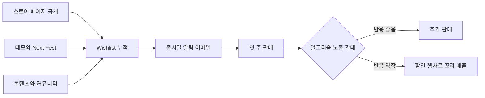

# 게임 수익화

> **학습 목표**: 유료(Premium)·F2P·광고형 게임의 돈 구조를 구분하고, Steam과 모바일의 핵심 숫자와 한국 규제를 알고 1인 개발자의 게임 범위를 통제할 수 있다.

게임은 1인 스튜디오 포트폴리오에서 분산(variance)이 가장 큰 자산이다. 02 문서의 표현으로는 barbell의 공격 쪽이다. 이 문서는 그 베팅을 계산 가능한 크기로 줄이는 법을 다룬다.

## 핵심 개념

| 모델 | 돈을 내는 사람 | 핵심 지표 | 1인 개발자 적합도 |
|---|---|---|---|
| Premium (유료 판매) | 구매자 한 번 | Wishlist, 전환율, 가격 | 높음: 운영 부담이 적고 PC에서 검증된 경로 |
| F2P + IAP | 소수의 과금 사용자 | 리텐션, ARPDAU, 과금 전환율 | 낮음: 콘텐츠 운영과 유저 획득 비용이 크다 |
| 광고형 (Rewarded Ads 등) | 광고주 | DAU, 광고 노출, eCPM | 중간: 대량 설치가 전제 |
| 하이브리드 | 광고 + IAP | ARPDAU | 중간: 설계가 복잡하다 |

- **Wishlist**: Steam 사용자가 "관심 있음"을 표시한 목록. 출시 알림의 대상이 된다.
- **D1/D7/D30 리텐션**: 설치 후 1·7·30일째에 다시 접속한 사용자 비율.
- **ARPDAU**: 일일 활성 사용자 1명당 하루 매출 = 하루 매출 ÷ DAU.
- **Rewarded Ads**: 사용자가 보상을 받으려고 스스로 선택해 보는 광고. 광고 단가 계산은 05 문서를 본다.

## 원리

### Steam의 돈 구조

| 항목 | 내용 | 출처 |
|---|---|---|
| 수익 배분 | 게임별 누적 매출 1,000만 달러까지 Valve 30%, 1,000만~5,000만 달러 25%, 5,000만 달러 초과 20% | Valve 발표, 2018-10-01 이후 매출부터 적용 |
| Steam Direct 수수료 | 앱당 100달러, 환불 불가. 조정 총매출 1,000달러를 넘으면 정산에서 돌려받음 | Steamworks 문서 |
| 매출 분포 | 최근 3년 출시작 약 4만 1천 개 중 절반이 총매출 500달러 이하 | Game World Observer, 2023-10-06 보도 |

마지막 줄이 01 문서의 멱법칙(power law)이 게임에서 드러나는 모습이다. 중앙값의 게임은 생활비를 벌지 못한다.

### Wishlist와 출시 가시성

- Steamworks 문서에 따르면 Wishlist에 넣은 사용자는 **출시할 때**와 **20% 이상 할인할 때** 이메일 알림을 받는다. 그래서 출시일 Wishlist 수가 첫 주 판매의 바탕이 된다.
- Chris Zukowski(howtomarketagame.com)의 **경험칙(heuristic)**: 짧은 기간에 약 7,000 Wishlist가 모이면 "Popular Upcoming" 노출 가능성이 높다. 첫 주 판매는 출시 시점 Wishlist의 대략 15~25%이며, Wishlist가 5,000 미만인 게임은 중앙값 15% 수준이라고 인용된다. 원문이 아닌 2차 자료로 확인했으므로 계획용 가정으로만 쓴다.
- **Steam Next Fest**: 출시 전 데모를 한 주 동안 노출하는 행사. 한 게임은 한 번만 참가할 수 있다. 2026년 10월 행사는 10월 19~26일(제출 마감 9월 28일), 2027년 2월 행사는 2월 22일~3월 1일(등록 마감 2027-01-10)로 공지되었다.
- **지역 가격**: Valve는 USD 기준가에 대해 통화별 권장가를 제시하는 도구를 제공하고, 최종 가격은 개발자가 정한다.



### 모바일 게임의 숫자

- GameAnalytics 2025 모바일 벤치마크(게임 약 11,600개)는 중앙값 D1 약 22%, D7 약 3.4~3.9%, D30 1% 미만, 상위 25%의 D1 약 26~28%를 보고했다 (2차 요약 기준).
- 매출 = DAU × ARPDAU. DAU는 신규 설치와 리텐션의 곱으로 만들어지므로, 리텐션이 낮으면 매일 대량 설치(대개 유료 광고)가 필요하다.
- IAP 매출에는 앱스토어 수수료가 붙는다 (06 문서). 광고 매출은 광고 네트워크 정산 기준이다 (05 문서).

## 적용: 예시 스튜디오

예시 스튜디오(가정)의 게임 프로토타입은 3개다: GM1 로그라이크 퍼즐(PC), GM2 하이퍼캐주얼(모바일), GM3 내러티브 어드벤처(PC).

**GM1을 Steam에서 9.99달러에 판다면 (모두 가정)**

```text
부가세·환불·지역가·할인 반영 후 평균 실수령 단가 7달러 가정
Valve 30% 차감 → 7 × 0.7 = 4.90달러 → 1,400원 환율에서 6,860원
출시 Wishlist 3,000 × 첫 주 15% (경험칙) = 450장
첫 주 매출 = 450 × 4.90 = 2,205달러 ≈ 308.7만 원
월 350만 원을 첫 주에 벌려면: 3,500,000 ÷ 6,860 = 510.2 → 511장
필요 Wishlist = 511 ÷ 0.15 = 3,406.7 → 약 3,407개
```

**GM2를 광고형으로 운영한다면 (모두 가정)**

```text
목표 DAU 2,000 × ARPDAU 0.04달러 = 하루 80달러
30일 = 2,400달러 ≈ 336만 원 (총매출, 광고 네트워크 정산 전)
설치 1건당 평균 활동일 3일 가정 → DAU 2,000 유지에 하루 설치 약 667건, 월 2만 건
```

월 2만 설치를 광고 없이 얻을 채널이 없다면 GM2는 숫자상 성립하지 않는다. GM1은 Wishlist라는 **출시 전 선행 지표**가 있어 베팅 크기를 조절할 수 있다.

나쁜 예:

> 오픈월드 제작 도구에 멀티플레이까지 넣은 GM3를 2년째 만들고 있다. 스토어 페이지는 아직 없다.

좋은 예:

> GM1의 핵심 루프 하나만 담은 20분 데모를 먼저 만들고, 스토어 페이지를 열어 Wishlist 증가 속도를 본 뒤 제작 범위를 정했다.

### 1인 개발자의 범위 통제

- **핵심 루프 1개**: 30초 안에 반복되는 재미가 없으면 콘텐츠를 늘려도 살아나지 않는다.
- **Vertical slice**: 최종 품질의 짧은 구간 하나를 먼저 완성해 스토어 자료(트레일러, 캡처)로 쓴다.
- **고정 시간, 가변 범위**: 08 문서의 appetite를 게임에도 적용한다. 날짜를 고정하고 기능을 자른다.
- **운영형 모델 회피**: F2P 라이브 운영은 매일 이벤트와 밸런스를 요구한다. 1인에게는 Premium이 기본값이다.

## 심화

### 한국에서 게임을 팔 때의 의무 (2026-09-29 확인)

| 의무 | 내용 | 1인 개발자에게의 의미 |
|---|---|---|
| 등급분류 | 게임을 유통하려면 등급분류를 받아야 한다 (게임산업법 제21조). Google·Apple 등 자체등급분류사업자로 지정된 플랫폼은 스토어 설문으로 처리 | 모바일 스토어는 설문 절차로 끝나는 경우가 많다 |
| Steam 등 비지정 플랫폼 | 2024년 7월 보도 기준 Valve는 자체등급분류사업자 지정을 검토하는 단계였다 | 전체·12세·15세 PC 게임은 게임콘텐츠등급분류위원회, 청소년이용불가는 게임물관리위원회에 신청. 수수료표상 PC 36만 원, 게임제작업 등록증 필요 |
| 확률형 아이템 정보 공개 | 2024-03-22부터 종류·확률 정보 표시 의무 (게임산업법 시행령 개정) | 뽑기·랜덤 박스를 넣으면 게임 안과 홈페이지에 확률을 표시 |
| 확률 표시 위반 배상 | 2025-08-01 시행: 고의 위반 시 손해의 최대 3배 배상, 게임사가 고의·과실 없음을 입증 | 확률형 아이템은 1인에게 법적 위험이 크다 |

- 법 조문과 절차의 기본은 비즈니스 트랙 「약관 · 개인정보 · 전자상거래」의 게임물 등급분류 항목에 있다.
- 게임 매출의 부가세·해외 원천징수는 비즈니스 트랙 세무 문서를 본다.

## 흔한 오해

- **"좋은 게임이면 알아서 팔린다."** Steam에서 노출은 Wishlist와 초기 반응으로 결정된다. 출시 당일에 첫 마케팅을 시작하면 늦다.
- **"F2P가 돈을 더 번다."** 상위 소수의 이야기다. F2P는 리텐션, 콘텐츠 운영, 유저 획득 예산이 모두 있어야 성립한다.
- **"Wishlist 전환율은 고정값이다."** 장르, 가격, 트레일러에 따라 크게 흔들린다. 경험칙은 범위로만 쓴다.
- **"Next Fest는 언제든 다시 나가면 된다."** 한 게임당 한 번이다. 데모 품질이 준비된 뒤에 쓴다.

## 자기 점검 질문

1. Premium, F2P, 광고형 게임은 각각 누가 돈을 내며 어떤 지표가 핵심인가?
2. 실수령 단가 4.90달러, 첫 주 전환 15%라면 첫 주 매출 500만 원에 필요한 Wishlist는 몇 개인가? (환율 1,400원)
3. D1 22%인 모바일 게임이 DAU를 유지하려면 무엇이 필요한가?
4. Steam에 PC 게임을 내는 한국 1인 개발자가 받아야 할 등급분류 경로는 무엇인가?
5. 확률형 아이템을 넣을 때 2024년과 2025년에 생긴 의무는 각각 무엇인가?

## 참고 자료

- [Variety - Valve Introduces New Revenue Split Changes For Steam Sales (2018)](https://variety.com/2018/gaming/news/valve-revenue-split-changes-1203078700/) (접근 2026-09-29)
- [Steamworks - Steam Direct Fee](https://partner.steamgames.com/doc/gettingstarted/appfee) (접근 2026-09-29)
- [Steamworks - Wishlists](https://partner.steamgames.com/doc/marketing/wishlist) (접근 2026-09-29)
- [Steamworks - Discounting](https://partner.steamgames.com/doc/marketing/discounts) (접근 2026-09-29)
- [Steamworks - Steam Next Fest: October 2026](https://partner.steamgames.com/doc/marketing/upcoming_events/nextfest/2026october) (접근 2026-09-29)
- [Steamworks - Steam Next Fest: February 2027](https://partner.steamgames.com/doc/marketing/upcoming_events/nextfest/feb_2027) (접근 2026-09-29)
- [Steamworks - Pricing](https://partner.steamgames.com/doc/store/pricing) (접근 2026-09-29)
- [How To Market A Game - Benchmarks](https://howtomarketagame.com/benchmarks/) (접근 2026-09-29)
- [presskit.gg - How to Get More Steam Wishlists Before Launch](https://presskit.gg/field-guides/how-to-build-steam-wishlist) (접근 2026-09-29)
- [Game World Observer - 41k games released on Steam over past 3 years (2023-10-06)](https://gameworldobserver.com/2023/10/06/steam-stats-41k-games-last-3-years-half-made-500-or-less) (접근 2026-09-29)
- [GameAnalytics - 2025 Mobile Gaming Benchmarks](https://www.gameanalytics.com/reports/2025-mobile-gaming-benchmarks) (접근 2026-09-29)
- [대한민국 정책브리핑 - 게임 확률형 아이템 정보, 3월 22일부터 공개](https://www.korea.kr/news/policyNewsView.do?newsId=148924297) (접근 2026-09-29)
- [법률신문 - 확률형 아이템 표시의무 위반에 관한 소송 특례 시행](https://www.lawtimes.co.kr/news/articleView.html?idxno=210245) (접근 2026-09-29)
- [아시아경제 - 스팀, 국내 자체등급분류 사업자 자격 획득 검토 (2024-07-03)](https://www.asiae.co.kr/article/2024070317305284345) (접근 2026-09-29)
- [게임콘텐츠등급분류위원회 - 수수료 안내](https://www.gcrb.or.kr/Mobile_NEW/sub/fee%20calculation.aspx) (접근 2026-09-29)
