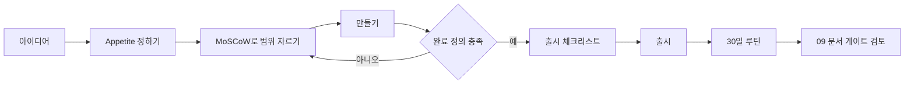

# 출시 시스템

> **학습 목표**: 프로토타입이 출시되지 못하는 원인을 알고, 완료 정의·범위 자르기·반복 가능한 출시 체크리스트·출시 주기·출시 후 30일 루틴으로 이루어진 출시 시스템을 만들 수 있다.

AI 에이전트 덕분에 만드는 속도는 빨라졌지만 **출시하는 속도는 저절로 빨라지지 않는다**. 예시 스튜디오(가정)가 프로토타입 12개에 출시 1개인 이유도 여기에 있다. 출시는 의지가 아니라 시스템으로 만든다.

기준일: 2026-09-29.

## 핵심 개념

### 프로토타입이 출시되지 못하는 다섯 가지 이유

| 원인 | 증상 | 시스템으로 막는 법 |
|---|---|---|
| 범위 팽창 (scope creep) | "이것만 더 넣고" 가 반복된다 | 시간을 먼저 고정하고 범위를 자른다 (appetite) |
| 다듬기 루프 (polish loop) | 이미 되는 화면을 계속 고친다 | 완료 정의에 "충분함"의 기준을 적는다 |
| 출시 공포 | 출시일이 계속 밀린다 | 작게, 자주 출시해 한 번의 무게를 줄인다 |
| 유통 부재 | 만들고 나서야 "누구에게 알리지?" | 만들기 전에 첫 100명의 출처를 정한다 |
| 문맥 전환 | 12개를 번갈아 조금씩 만진다 | 동시 진행 수(WIP)를 제한한다 (02 문서) |

### 1인 스튜디오의 완료 정의 (Definition of Done)

출시 가능 = 아래가 **모두** 참이다.

- 핵심 작업 하나를 처음 온 사용자가 도움 없이 끝낼 수 있다.
- 돈을 받는 경로가 동작한다 (결제, 광고, 또는 사전 판매 링크). 무료 제품은 연락처를 받는 경로.
- 측정이 켜져 있다: 방문, 활성화, 결제 이벤트 (09 문서).
- 약관·개인정보 처리방침·사업자 정보 표시가 있다 (비즈니스 트랙).
- 알려진 버그 목록이 있고, 치명 버그가 0개다.
- 첫 공지를 올릴 채널 3곳이 정해져 있다.

## 원리

### 시간을 고정하고 범위를 자른다

- **Parkinson의 법칙**: "일은 주어진 시간을 채울 때까지 늘어난다" (C. Northcote Parkinson, The Economist, 1955). 마감이 없으면 다듬기가 끝나지 않는다.
- **Appetite (Shape Up)**: Basecamp의 Ryan Singer가 『Shape Up』(2019)에서 제시한 개념. "얼마나 걸릴까?" 대신 "이 일에 시간을 얼마나 쓸 가치가 있나?"를 먼저 정하고, 그 시간 안에 맞게 해법을 설계한다. Basecamp는 6주 개발 주기와 2주 cooldown을 쓴다.
- **MoSCoW**: Dai Clegg가 1994년 Oracle에서 만든 우선순위 기법으로 Must/Should/Could/Won't로 나눈다. DSDM(Agile Business Consortium) 지침은 Must의 **노력(시간) 비중을 60% 이하**로, Could를 약 20%로 두어 일정이 밀려도 Must를 지킬 여유를 만들라고 권한다. 개수가 아니라 시간으로 나눈다.

### 작게 자주 출시한다

- Reid Hoffman(LinkedIn 공동창업자)의 말로 널리 인용되는 문장: "첫 버전이 부끄럽지 않다면 너무 늦게 출시한 것이다." 품질을 버리라는 뜻이 아니라, 배우기 전에 오래 숨기지 말라는 뜻이다.
- Pieter Levels는 2014년 "12개월 동안 12개 스타트업" 도전을 공개적으로 시작했고, 그 과정에서 Nomad List와 Remote OK가 나왔다. 출시 주기를 고정하면 출시가 사건이 아니라 습관이 된다.



## 적용: 예시 스튜디오

예시 스튜디오는 T1 픽셀 아트 편집기(창작 도구)의 MVP에 **60시간 appetite**를 준다 (가정). 월 160시간 중 T1에 주 16시간을 쓰면 약 4주 분량이다.

| 분류 | 항목 | 시간 | 비중 |
|---|---|---|---|
| Must | 캔버스·팔레트·레이어 2개, PNG 내보내기, 결제(얼리버드) | 36시간 | 60% |
| Should | 애니메이션 프레임 4개, 단축키 | 12시간 | 20% |
| Could | 테마, 공유 링크 | 12시간 | 20% |
| Won't (이번엔 안 함) | 협업, 모바일 앱, 플러그인 | 0시간 | 0% |
| 합계 | | 60시간 | 100% |

Must가 60%를 넘으면 범위를 다시 자른다. 45시간째에 Must가 끝나지 않았다면 Could를 버리고 Should를 줄인다. **출시일은 움직이지 않는다.**

### 출시 주기

- 예시 스튜디오는 **8주 주기**(6주 만들기 + 2주 cooldown)를 쓴다 (가정). 1년 52주 ÷ 8주 = 6.5, 즉 연 6~7번의 출시 기회다.
- 한 주기에 "큰 출시" 1개(신제품 또는 유료화)와 "작은 출시" 여러 개(기능, 가격 실험)를 허용한다.
- Cooldown 2주에는 버그 수리, 09 문서의 게이트 검토, 다음 주기 베팅을 한다.

### 반복 가능한 출시 체크리스트

```text
[D-14] 첫 100명 출처 3곳 확정, 대기자 명단 페이지 공개
[D-7]  완료 정의 점검, 결제 테스트 결제·환불 1회씩
[D-3]  스토어·랜딩 문구, 스크린샷, 가격표 확정
[D-1]  측정 이벤트 확인, 롤백 방법 확인, 공지 초안 3개
[D-0]  배포, 대기자에게 메일, 채널 3곳 공지, 첫 24시간 문의 응대
```

첫 100명은 제품보다 먼저 설계한다. 채널 고르기와 Launch 등급 나누기는 마케팅 트랙의 「Go-to-Market · Launch · PLG/SLG」, 「채널 · Content · Paid · Lifecycle」를 본다.

### 출시 후 30일 루틴

| 시점 | 할 일 | 보는 숫자 |
|---|---|---|
| D+1 | 오류 로그, 결제 실패, 첫 문의 답변 | 치명 오류 수 |
| D+3 | 활성화 단계에서 막히는 지점 수정 | 가입 → 핵심 작업 완료율 |
| D+7 | 사용자 5명과 짧은 대화 (03 문서의 Mom Test) | 첫 주 리텐션, 첫 결제 수 |
| D+14 | 가격 또는 온보딩 실험 1개 | 전환율 |
| D+30 | 09 문서의 게이트 검토: 중단·유지·확대 | 사전에 정한 임계값 |

나쁜 예:

> 출시 다음 날 새 프로토타입을 시작했다. 한 달 뒤 보니 결제 버튼이 모바일에서 동작하지 않고 있었다.

좋은 예:

> 30일 루틴을 달력에 먼저 넣고, 그 기간에는 새 프로토타입 시간을 0으로 두었다.

## 심화

### AI 에이전트로 출시 파이프라인 돌리기

| 단계 | 에이전트에게 맡길 일 | 사람이 지키는 관문 |
|---|---|---|
| 빌드·테스트 | CI에서 테스트, 린트, 빌드 실행과 실패 요약 | 테스트가 무엇을 검증하는지 |
| 릴리스 노트 | 커밋과 이슈로 변경 사항 초안 작성 | 사용자에게 보낼 문장 |
| 스토어 자료 | 스크린샷 규격 맞추기, 설명문 초안, 번역 초안 | 약속하는 기능이 실제로 있는지 |
| 배포 | 스테이징 배포, 스모크 테스트 | Production 승인과 롤백 판단 |
| 출시 후 | 오류 로그 요약, 문의 분류 | 환불·개인정보 관련 답변 |

파이프라인 구성은 플랫폼 트랙의 「CI/CD · OIDC · GitOps」와 「작은 팀 실전 가이드」을 따른다. 결제·개인정보·Production 승인은 사람의 관문으로 남긴다.

## 흔한 오해

- **"조금만 더 다듬으면 반응이 좋아질 것이다."** 출시 전 다듬기는 가설을 검증하지 않는다. 반응은 출시 후에만 측정된다.
- **"출시는 한 번의 큰 행사다."** 작은 출시를 자주 하면 한 번의 실패 비용이 작아지고 배우는 속도가 빨라진다.
- **"AI가 만들면 범위를 줄일 필요가 없다."** 만드는 비용이 줄어도 테스트·지원·유지보수 비용은 기능 수에 비례해 남는다.
- **"사용자는 출시 후에 찾으면 된다."** 첫 100명의 출처가 없는 출시는 아무도 보지 않는 출시다.

## 자기 점검 질문

1. 자기 프로토타입 하나가 출시되지 못한 원인을 다섯 가지 중에서 고르고, 막을 시스템을 적어 보라.
2. 80시간 appetite에서 DSDM 지침을 따르면 Must에 최대 몇 시간을 배정하나?
3. Appetite와 추정(estimate)은 어떻게 다른가?
4. 예시 스튜디오가 8주 주기(6주 + 2주 cooldown) 대신 5주 주기(4주 + 1주 cooldown)를 쓰면 1년 출시 기회는 몇 번인가? 출시 후 30일 루틴과 cooldown에 할 일(버그 수리, 게이트 검토, 다음 베팅)을 고려할 때 어느 쪽이 이 스튜디오에 맞는지 근거를 적어라.
5. 출시 후 30일 동안 새 프로토타입을 시작하지 말아야 하는 이유는?

## 참고 자료

- [Basecamp - Shape Up: Stop Running in Circles and Ship Work that Matters](https://basecamp.com/shapeup) (접근 2026-09-29)
- [Agile Business Consortium - MoSCoW Prioritisation (DSDM Handbook)](https://www.agilebusiness.org/dsdm-project-framework/moscow-prioritisation.html) (접근 2026-09-29)
- [Wikipedia - MoSCoW method](https://en.wikipedia.org/wiki/MoSCoW_method) (접근 2026-09-29)
- [Wikipedia - Parkinson's law](https://en.wikipedia.org/wiki/Parkinson%27s_law) (접근 2026-09-29)
- [levels.io - I'm Launching 12 Startups in 12 Months (2014)](https://levels.io/12-startups-12-months) (접근 2026-09-29)
- [Product Hunt - Launch Guide](https://www.producthunt.com/launch) (접근 2026-09-29)
