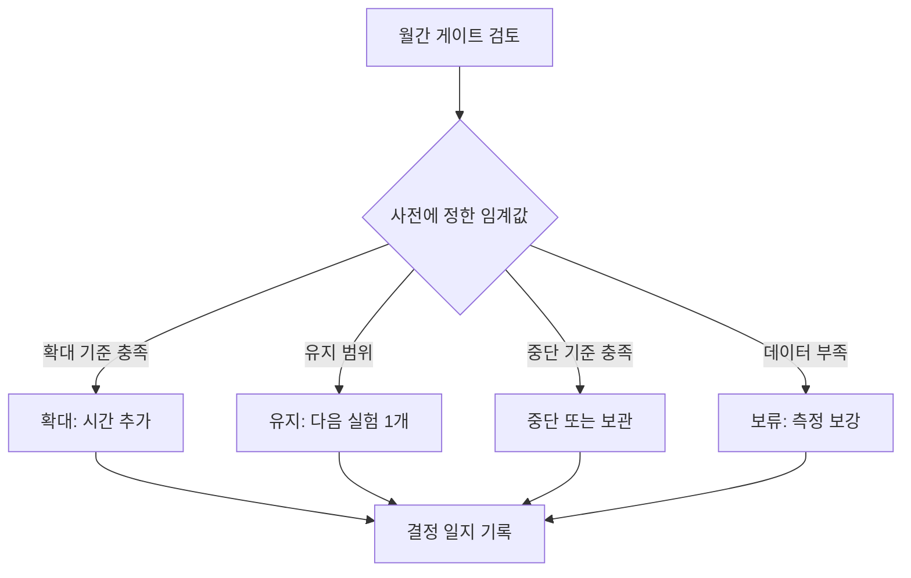

# 측정과 포트폴리오 의사결정

> **학습 목표**: 제품마다 단계에 맞는 지표를 고르고, 미리 정한 임계값으로 중단·유지·확대를 결정하며, 수익 모델이 다른 제품을 시간당 가치로 비교할 수 있다.

02 문서가 "제품은 베팅"이라는 이론을 줬다면, 이 문서는 그 베팅을 **매주·매달 다시 평가하는 운영 절차**다. 측정이 없으면 포트폴리오는 기분으로 관리된다.

기준일: 2026-09-29.

## 핵심 개념

### 선행 지표와 후행 지표

- **후행 지표(lagging)**: 결과. 매출, MRR, 순이익. 확실하지만 늦게 온다.
- **선행 지표(leading)**: 결과보다 먼저 움직이는 신호. 대기자 가입률, 활성화율, Wishlist 증가 속도. 빨리 오지만 결과와의 연결을 검증해야 한다.
- 초기 제품은 후행 지표가 0이므로 **선행 지표로 판단하고, 후행 지표로 선행 지표를 검증**한다.

### 단계별 지표

Dave McClure의 AARRR(2007, Acquisition·Activation·Retention·Referral·Revenue)을 1인 스튜디오의 단계에 맞춰 줄이면 다음과 같다.

| 단계 | 질문 | 지표 예 | 종류 |
|---|---|---|---|
| 검증 | 원하는 사람이 있나 | 랜딩 방문 → 대기자 가입률, 사전 판매 수, fake door 클릭률 | 선행 |
| 활성화 | 처음 온 사람이 가치를 경험하나 | 가입 → 핵심 작업 완료율 | 선행 |
| 유지 | 다시 오나 | 주간·월간 리텐션, 게임은 D1/D7, Steam은 Wishlist 속도 | 선행 |
| 매출 | 돈이 되나 | 월 순매출, MRR, Churn, RPM | 후행 |

### Vanity Metric과 Actionable Metric

Eric Ries는 누적 가입자·페이지뷰처럼 **기분은 좋지만 행동을 바꾸지 못하는 숫자**를 vanity metric, 원인과 결과가 분명해 결정을 바꾸는 숫자를 actionable metric이라고 불렀다 (2009 기고, 『The Lean Startup』 2011).

| 나쁜 예 (vanity) | 좋은 예 (actionable) |
|---|---|
| 누적 가입자 3,000명 | 이번 주 가입자 중 핵심 작업 완료 비율 34% |
| 총 페이지뷰 | 유입 경로별 대기자 가입률 |
| Wishlist 총합 | 최근 7일 하루 평균 Wishlist 증가 |
| GitHub star 수 | 결제 페이지 도달 → 결제 완료율 |

## 원리

### 게이트는 투자 결정이다

Robert G. Cooper의 Stage-Gate(1986년 제안, 1988년 용어 출간)는 단계 사이 관문에서 **Go·Kill·Hold·Recycle** 네 가지 중 하나를 고른다. 1인 스튜디오에서는 이것을 확대·중단·보류·재작업으로 번역한다. 관문의 질문은 "이 제품에 다음 단계의 시간을 줄 것인가"이다.

### 임계값은 미리 정한다

Annie Duke는 『Quit』(2022)에서 중단 기준(kill criteria)을 **상태와 날짜(states and dates)**로 미리 적으라고 권한다: "(날짜)까지 (상태)에 도달하지 못하면 그만둔다." 데이터를 본 뒤에 기준을 정하면 매몰비용과 애착이 기준을 옮긴다.

- 확대 신호의 예: Sean Ellis의 설문에서 "이 제품을 더 못 쓰면 매우 실망" 응답이 40% 이상이면 제품-시장 적합의 신호로 본다.
- 한 번의 게이트에 **한 개의 주 지표**와 최대 두 개의 보조 지표만 쓴다.



### 수익 모델이 다른 제품을 비교하는 법

광고 사이트의 RPM과 구독 앱의 MRR과 게임의 Wishlist는 단위가 다르다. 공통 단위는 **1인의 시간**이다.

```text
실현 시간당 매출 = 최근 30일 순매출 ÷ 최근 30일 투입 시간
기대 시간당 가치 = 12개월 기대 순매출 ÷ 앞으로 12개월 필요 시간
기대 순매출 = Σ (시나리오 확률 × 시나리오 순매출)
예시 스튜디오의 필요 시급 = 월 350만 원 ÷ 160시간 = 21,875원
```

참고로 2026년 최저임금은 시간급 10,320원이다 (고용노동부 고시). 기회비용의 바닥을 떠올리는 기준으로만 쓴다.

## 적용: 예시 스튜디오

10 문서의 90일 계획 중 60일째라고 가정한 대시보드다. 모든 숫자는 가정이다.

| 제품 | 단계 | 주 지표 (현재) | 최근 30일 순매출 | 투입 시간 | 실현 시간당 매출 |
|---|---|---|---|---|---|
| T1 픽셀 아트 편집기 | 유료 베타 | 체험 → 결제 11% | 45만 원 | 64시간 | 7,031원 |
| C2 기술 문서 사이트 | 광고 승인 | 월 페이지뷰 6,200 | 3만 원 | 24시간 | 1,250원 |
| GM1 로그라이크 퍼즐 | 스토어 페이지 | 하루 평균 Wishlist 7개, 누적 600 | 0원 | 32시간 | 0원 |
| P1 습관 추적 앱 | 출시·유지보수 (G4 이전 출시, D90 판정) | 주간 활성 40명 | 0원 | 4시간 | 0원 |

C2의 3만 원은 광고 게재 약 30일분이고, 실측 Page RPM은 30,000 ÷ 6,200 × 1,000 ≈ 4,839원이다. 05의 가정 3,000원보다 높으므로 05의 표를 이 실측값으로 다시 계산한다 (05 적용의 3단계). C2의 월 페이지뷰는 D0의 5,000에서 6,200으로 24% 늘었다.

실현 시간당 매출만 보면 모두 21,875원에 못 미친다. 초기 제품이므로 기대 시간당 가치를 함께 본다.

| 제품 | 12개월 시나리오 (가정) | 기대 순매출 | 필요 시간 | 기대 시간당 가치 |
|---|---|---|---|---|
| GM1 | 60%: 200만 / 30%: 800만 / 10%: 3,000만 | 120 + 240 + 300 = 660만 원 | 400시간 | 16,500원 |
| T1 | 50%: 월 50만 × 12 / 30%: 월 150만 × 12 / 20%: 0 | 300 + 540 + 0 = 840만 원 | 768시간 | 10,938원 |
| C2 | 70%: 월 5만 × 12 / 30%: 월 20만 × 12 | 42 + 72 = 114만 원 | 288시간 | 3,958원 |

- GM1의 기대 시간당 가치가 가장 높지만 **분산이 크고 돈이 출시 후에 온다**. 출시가 9개월 뒤라면 5.1개월 runway 안에는 한 푼도 들어오지 않는다 (01 문서).
- T1은 중간 기대값에 **지금 매출이 생기는** 제품이다. runway를 늘리는 역할이다.
- C2는 기대값이 낮지만 시간이 적게 들고 안정적이다. 광고 단가(RPM)의 근거는 05 문서를 본다.
- 결론(가정): T1을 주력으로 유지하고, GM1은 Wishlist라는 선행 지표가 기준을 넘을 때만 시간을 늘린다. 02 문서의 barbell 배분과 같다.

### 사전 결정 규칙 (D60 검토, 판정일은 행마다 표기)

| 제품 | 중단 | 보류 | 유지 | 확대 |
|---|---|---|---|---|
| T1 | 60일째 체험 → 결제 3% 미만 (먼저 확인) → 보관 | 결제 10건 미만 → 표본 부족, 보류, D70 정식 출시 후 D90 재판정 | 3% 이상 10% 미만, 또는 10% 이상이고 순매출 40만 원 미만 | 10% 이상이고 순매출 40만 원 이상 → 주 4시간 (월 16시간) 추가 |
| C2 | 90일째 월 페이지뷰 3,000 미만 | — | 3,000~10,000 | 10,000 이상 → 글 발행 주기 2배 |
| GM1 | 90일째 누적 Wishlist 500 미만 | — | 500~1,500 | 1,500 이상 → Next Fest 준비 착수 |
| P1 | 90일째 주간 활성 100명 미만이고 월 순매출 10만 원 미만 → 보관 | — | 판정일까지 유지보수 주 1시간만 | G4 충족 (주간 활성 100명 이상 또는 월 순매출 10만 원 이상) → 다음 분기 트리아지에서 운영 시간 재배정 |

판정은 중단 → 보류 → 유지 → 확대 순서로 보고, 처음 맞는 하나만 쓴다. 그래서 T1의 네 칸은 겹치지도 비지도 않는다. 보류된 T1은 D90에 같은 규칙으로 다시 판정하되, 그때도 결제 10건 미만이면 중단한다. 보류는 위 흐름도의 "데이터 부족 → 보류: 측정 보강"이다.

P1은 G4 관문을 만들기 전에 출시되어 사전 기준이 없었으므로 위 표의 P1 행은 판정일이 D90이다. 이 기준을 처음 적은 이유와 과정은 「90일 실행 계획 사례」 1단계에 있다.

60일째 대시보드를 규칙에 대면 T1은 확대(11%, 45만 원, 결제 약 12건 = 450,000 ÷ 37,870), C2와 GM1과 P1은 90일째 판정 대기다. P1의 주간 활성 40명은 기준 100명의 40%라 지금 추세로는 보관 쪽이다.

## 심화

### 검토 의식

| 주기 | 시간 | 안건 |
|---|---|---|
| 매주 (월요일) | 30분 | 제품별 주 지표 1개 기록, 이번 주 시간 배분 확인, 막힌 것 1개 |
| 매달 (cooldown 첫날) | 2시간 | 게이트 판정, 시간 재배분, runway 재계산, 결정 일지 복기 |
| 분기 (90일) | 반나절 | 포트폴리오 전체 재평가, 새 베팅 선정 (10 문서) |

시간 기록 규칙 (가정). 실현 시간당 매출의 분모이므로 검토 전에 먼저 맞춘다.

- 도구와 형식: 스프레드시트 한 장 또는 시간 추적 앱. 한 행에 날짜, 코드, 시간, 한 줄 메모를 적는다.
- 단위와 코드: 30분 단위로 적고, 코드는 제품 코드(T1, C2, GM1, P1, P2)와 공통 코드(유통, 관리) 두 종류만 쓴다.
- 세는 것: 사람이 실제로 쓴 시간만 센다. 한 제품만을 위한 일(제작, 지원, 그 제품의 마케팅)은 제품 코드, 여러 제품에 걸친 일은 공통 코드에 넣는다. 에이전트가 혼자 돈 시간은 세지 않고 지시·검토한 시간은 센다.

### 결정 일지 (Decision Journal)

Farnam Street(Shane Parrish)가 소개한 결정 일지는 결정하는 순간에 다음을 적고, 나중에 결과와 비교한다.

```text
날짜와 상태: 2026-12-04, 피곤함 보통
결정: T1에 주 4시간 추가, P1은 유지보수만
시간 출처 (D60~D90, 월): T1 64 → 80, GM1 32 → 24, P2 4 → 0 (fake door는 D28에 끝남), 관리·검토 16 → 12
근거가 된 숫자: 체험 → 결제 11%, 결제 12건 (보류 기준 10건 이상), 월 순매출 45만 원
예상 결과: 90일째 월 순매출 80만 원, 확률 60%
버린 대안: GM1 데모 제작 앞당기기
복기 날짜: 2027-01-03
```

결과가 나쁘다고 결정이 나빴던 것은 아니다. 일지는 **운과 판단을 분리**해 다음 베팅의 확률 추정을 고친다.

## 흔한 오해

- **"숫자가 많을수록 잘 보인다."** 지표가 많으면 좋은 숫자만 골라 보게 된다. 제품당 주 지표 1개가 기본이다.
- **"매출이 0이면 실패다."** 검증 단계의 제품은 선행 지표로 판단한다. 다만 선행 지표가 매출로 이어지는지는 반드시 확인한다.
- **"조금만 더 기다리면 올라온다."** 기준을 사후에 바꾸면 모든 제품이 영원히 유지된다. 날짜와 상태를 미리 적는다.
- **"기대값이 가장 큰 제품에 전부 건다."** runway 안에 돈이 들어오는지, 분산을 버틸 수 있는지를 같이 본다.

## 자기 점검 질문

1. 자기 제품 하나의 선행 지표와 후행 지표를 하나씩 적고, 둘의 연결을 어떻게 검증할지 설명하라.
2. 최근 30일 순매출 30만 원, 투입 20시간인 제품의 실현 시간당 매출은? 필요 시급 21,875원과 비교하라.
3. 확률 40%로 1,000만 원, 60%로 100만 원인 제품에 200시간이 필요하다면 기대 시간당 가치는?
4. 60일째 대시보드의 T1, C2, GM1, P1에 확대·중단·보류·재작업(Go·Kill·Hold·Recycle) 중 하나씩을 붙이고, 각각 근거가 된 숫자를 적어라. 네 결정 중 이 대시보드에서 쓰이지 않은 것은 어떤 상황에서 쓰는가?
5. "states and dates" 형식으로 자기 제품의 중단 기준을 한 문장으로 써 보라.

## 참고 자료

- [Tim Ferriss 블로그 - Vanity Metrics vs. Actionable Metrics (Eric Ries 기고, 2009)](https://tim.blog/2009/05/19/vanity-metrics-vs-actionable-metrics/) (접근 2026-09-29)
- [Wikipedia - Dave McClure (Startup Metrics for Pirates, 2007)](https://en.wikipedia.org/wiki/Dave_McClure) (접근 2026-09-29)
- [Stage-Gate International - The Stage-Gate Model: An Overview](https://www.stage-gate.com/blog/the-stage-gate-model-an-overview/) (접근 2026-09-29)
- [Behavioral Scientist - Annie Duke, Mental Models to Help You Cut Your Losses](https://behavioralscientist.org/annie-duke-quit-mental-models-to-help-you-cut-your-losses/) (접근 2026-09-29)
- [Wikipedia - Product-market fit](https://en.wikipedia.org/wiki/Product-market_fit) (접근 2026-09-29)
- [Farnam Street - Decision Journal](https://fs.blog/decision-journal/) (접근 2026-09-29)
- [고용노동부 - 2026년 적용 최저임금 시간급 10,320원](https://www.moel.go.kr/news/enews/report/enewsView.do?news_seq=18144) (접근 2026-09-29)
