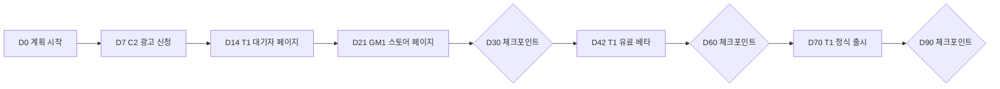

# 90일 실행 계획 사례

> **학습 목표**: 01~09 문서의 도구를 예시 스튜디오에 한꺼번에 적용해, 프로토타입 12개를 선별하고 시간·실험·출시일·수익 시나리오·runway·체크포인트가 들어간 90일 계획을 직접 세울 수 있다.

이 문서는 새 이론을 더하지 않는다. 앞 문서의 도구를 **순서대로 한 번에** 쓰는 연습이다. 모든 숫자는 설명용 가정이며, 수수료·벤치마크의 출처는 해당 문서에 있다.

기준일: 2026-09-29.

## 핵심 개념

출발점 (가정, 01 문서의 예시 스튜디오):

| 항목 | 값 |
|---|---|
| 인원 | 1명 + AI 에이전트 |
| 월 작업 가능 시간 | 160시간 |
| 월 필요 금액 | 생활비 300만 원 + 고정비 50만 원 = 350만 원 |
| 운영 자금 | 1,800만 원 |
| Runway | 1,800 ÷ 350 = 5.14 → 약 5.1개월 |
| 프로토타입 | 12개 (출시한 P1 포함): 게임 3, 창작 도구 4, 생산성 앱 3, 콘텐츠 사이트 2 |
| 현재 매출 | 출시 1개 (P1, 생산성 앱, 2026-06-15 출시 가정), 월 매출 0원 |
| C2 트래픽 | D0 기준 월 5,000 페이지뷰 (05) |

90일 계획은 일곱 단계로 진행한다: ① 12개 트리아지(02, 03) ② 베팅 2~3개 선택(02) ③ 합계 160시간의 시간 배분(01, 08) ④ 검증 실험과 임계값(03, 09) ⑤ 출시 일정(08) ⑥ 수익 시나리오와 runway(01, 04~07) ⑦ 30·60·90일 체크포인트(09).

## 원리

- **왜 90일인가**: runway 5.1개월 중 90일을 쓰고도 약 2개월이 남아, 계획이 틀렸을 때 방향을 바꿀 여유가 있다. 08 문서의 8주 주기 하나와 다음 주기 일부가 들어간다.
- **점수표의 기준** (각 1~5점, 합계 25점):
  - D 수요 신호: 03 문서 기준의 증거 (대화, 대기자, 사전 판매)
  - M 수익 경로: 돈 받는 수단이 명확하고 바로 붙일 수 있는가 (04~07)
  - S 출시 근접도: 남은 작업이 적을수록 높다
  - R 유통 접근: 첫 100명을 데려올 채널이 이미 있는가 (08)
  - F 적합: 역량, 흥미, 기존 자산
- **동점 처리 규칙**: 점수가 같으면 **포트폴리오의 모델 분산을 늘리는 쪽**을 고른다 (02 문서의 barbell).
- **WIP 한도**: 02 문서의 권장 출발점대로 제작 2개(T1, C2), 검증 2개(GM1 스토어 페이지, P2 fake door)까지. 여기에 운영 중인 P1이 더해진다 (02의 운영 슬롯).

## 적용: 예시 스튜디오

### 1단계: 트리아지

| 코드 | 프로토타입 (가정) | D | M | S | R | F | 합계 | 판정 |
|---|---|---|---|---|---|---|---|---|
| T1 | 픽셀 아트 편집기 (웹) | 4 | 4 | 4 | 4 | 4 | 20 | 주력 베팅 |
| C2 | 기술 문서 사이트 (애드센스 준비 중) | 3 | 3 | 5 | 4 | 5 | 20 | 저비용 베팅 |
| GM1 | 로그라이크 퍼즐 (PC) | 3 | 4 | 2 | 3 | 5 | 17 | 작은 베팅 (Wishlist) |
| P2 | 프리랜서 견적서 생성기 | 4 | 4 | 3 | 3 | 3 | 17 | 검증: fake door 1회 |
| T3 | 폰트 조합 도구 | 2 | 2 | 5 | 3 | 2 | 14 | 보관 |
| P1 | 습관 추적 앱 (출시됨) | 2 | 2 | 5 | 2 | 3 | 14 | 유지보수만, D90 판정 |
| T2 | 음악 스케치 도구 | 3 | 3 | 2 | 2 | 3 | 13 | 보관 |
| T4 | 영상 자막 편집기 | 3 | 3 | 2 | 2 | 3 | 13 | 보관 |
| GM3 | 내러티브 어드벤처 (PC) | 2 | 3 | 1 | 2 | 4 | 12 | 보관 |
| C1 | 레시피 큐레이션 사이트 | 2 | 2 | 4 | 2 | 2 | 12 | 보관 |
| GM2 | 하이퍼캐주얼 (모바일) | 2 | 2 | 4 | 1 | 2 | 11 | 보관 |
| P3 | 가계부 앱 | 2 | 2 | 3 | 2 | 2 | 11 | 보관 |

- GM1과 P2가 17점 동점이다. P2는 T1과 같은 "도구를 웹에서 판매" 모델이고, GM1은 Premium 게임이라는 다른 모델을 더한다. 동점 규칙에 따라 GM1에 월 32시간을 주고 Steam 스토어 페이지로 검증하며, P2는 월 4시간짜리 fake door 검증만 한다.
- **P1과 G4 관문**: P1은 2026-06-15에 출시되어(가정) G4의 60일 창(2026-08-14)이 D0 전에 이미 지났지만, 02의 G4(출시 60일: 월 순매출 10만 원 이상 또는 주간 활성 100명)를 만들기 전이라 사전 기준이 없었다. 매출 0원이라 G4의 매출 기준에는 이미 못 미치지만, 결과를 본 뒤 기준을 만들어 곧바로 판정하는 것도 사후 판단이다. 그래서 D0에 G4와 **같은 숫자**로 날짜와 상태를 처음 적는다: "D90(2027-01-03)에 주간 활성 100명 미만이고 월 순매출 10만 원 미만이면 P1을 보관하고, 유지보수 4시간은 T1으로 옮긴다 (T1이 D60에 보관됐다면: P2가 D28 G2를 통과했을 때 P2 제작으로, P2도 미달이면 C2 운영과 다음 분기 트리아지 준비로)." 그때까지는 유지보수 4시간만 주고, 이 기준은 다시 바꾸지 않는다 (09의 판정 규칙 표).
- **P2의 검증 방법**: 02·03은 생산성 앱 후보를 인터뷰(G1)로 먼저 검증한다. P2는 지난 분기 인터뷰 5명 중 4명이 최근 겪었다고 답해 G1을 통과했으므로(D 4점의 근거, 가정), 이번 분기에는 G2를 fake door 대기자 페이지로 잰다. 방법이 바뀐 것이 아니라 관문이 한 단계 앞으로 간 것이다.
- 보관 7개(게임 GM2·GM3, 창작 도구 T2·T3·T4, 생산성 앱 P3, 콘텐츠 사이트 C1)는 02의 보관함과 같다. 운영 1 + 제작 2 + 검증 2 + 보관 7 = 12.
- **보관**은 삭제가 아니다. 저장소는 남기고 시간 배정만 0으로 한다. 다음 분기 트리아지에 다시 들어간다.

### 2~3단계: 베팅과 시간 배분

| 항목 | 주당 | 월 (× 4주) | 비중 |
|---|---|---|---|
| T1 픽셀 아트 편집기 | 16시간 | 64시간 | 40% |
| GM1 로그라이크 퍼즐 (스토어 페이지, 데모 핵심 루프) | 8시간 | 32시간 | 20% |
| C2 기술 문서 사이트 (글, 광고 신청) | 6시간 | 24시간 | 15% |
| 유통 공통 (커뮤니티, 뉴스레터, 대기자 관리) | 4시간 | 16시간 | 10% |
| 관리·검토 (회계, 주간·월간 검토) | 4시간 | 16시간 | 10% |
| P2 fake door | 1시간 | 4시간 | 2.5% |
| P1 유지보수 | 1시간 | 4시간 | 2.5% |
| 합계 | 40시간 | 160시간 | 100% |

**02 기본 배분과 달라진 곳** (02의 표가 기본값이다)

| 02 영역 | 02 기본 | 이 계획 | 차이 | 이유 |
|---|---|---|---|---|
| 운영 | 32 | 20 (유통 공통 16 + P1 4) | −12 | P1은 D90 판정 전까지 유지보수만. 유통 공통 16시간의 내용은 02 심화의 표 |
| 제작 | 80 | 88 (T1 64 + C2 24) | +8 | T1이 주력 베팅이라 주 16시간 (08의 60시간 appetite를 약 4주에) |
| 검증 | 24 | 36 (GM1 32 + P2 4) | +12 | 동점 규칙으로 GM1 스토어 페이지·데모에 32시간. 02의 16시간 상한은 랜딩·fake door 검증(G2: 방문 → 등록)을 전제한다; Steam 페이지 검증은 플레이 가능한 데모가 필요해(03, 07) 32시간을 준다. P2는 G1을 통과해 fake door 4시간만 |
| 관리 | 24 | 16 (관리·검토) | −8 | 회계와 주간·월간 검토(09)만 남기고 이번 분기 학습 시간은 0 |
| 합계 | 160 | 160 | 0 | |

### 4단계: 검증 실험과 임계값

| 제품 | 실험 | 기간 | 확대·통과 | 중단·재작업 |
|---|---|---|---|---|
| T1 | 대기자 페이지 + Van Westendorp 설문 + 얼리버드 사전 판매 (03, 06) | D14~D42 | 방문 300명 중 등록 10% 이상 또는 얼리버드 결제 5건 (02 문서 G2 관문) | 통과 기준 미달 → 메시지 1회 수정 후 재측정 (03). 03에서는 재측정도 미달이면 보관이지만, T1은 이미 제작 슬롯(02)이고 D42 유료 베타가 예정되어 있으므로 재측정 미달 시 D60 결제 판정으로 넘긴다 |
| T1 | 유료 베타 체험 → 결제 | D42~D60 | 10% 이상이고 순매출 40만 원 이상 (09 규칙) | 3% 미만 (보류·유지는 09 규칙) |
| C2 | 애드센스 신청, 글 주 2편 | D7~D90 | D90 월 페이지뷰 10,000 이상 | 3,000 미만 |
| GM1 | Steam 스토어 페이지 공개 | D21~D90 | D90 누적 Wishlist 1,500 이상 | 500 미만 |
| P2 | 커뮤니티 게시로 fake door 랜딩 | D14~D28 | 방문 300명 중 등록 10% 이상 (02 문서 G2 관문) → 다음 분기 제작 후보 (T1이 D60에 보관되면 그때부터) | 미달 → 보관 |

### 5단계: 출시 일정 (D0 = 2026-10-05 월요일)

| 날짜 | 일차 | 일 |
|---|---|---|
| 2026-10-12 | D7 | C2 애드센스 신청 |
| 2026-10-19 | D14 | T1 대기자 페이지 공개, P2 fake door 게시 |
| 2026-10-26 | D21 | GM1 Steam 스토어 페이지 공개 |
| 2026-11-04 | D30 | 체크포인트 1 |
| 2026-11-16 | D42 | T1 유료 베타 출시 (얼리버드) |
| 2026-12-04 | D60 | 체크포인트 2 (09 문서의 대시보드) |
| 2026-12-14 | D70 | T1 정식 출시 |
| 2027-01-03 | D90 | 체크포인트 3, 다음 분기 트리아지 |

### 6단계: 수익 시나리오와 runway (가정)

월 순매출(수수료 차감 후)을 만 원 단위로 가정하고, 4개월째부터는 3개월째 수준이 유지된다고 둔다. 일회성 비용 20만 원(Steam Direct 100달러 ≈ 14만 원 + 도메인·도구 6만 원)을 포함한다.

| 시나리오 | 1개월 | 2개월 | 3개월 | 90일 뒤 잔액 | 이후 월 순소진 | 남은 개월 | 총 runway |
|---|---|---|---|---|---|---|---|
| 매출 없음 (기준) | 0 | 0 | 0 | 1,800 − 1,050 = 750 | 350 | 2.1 | 5.1개월 |
| 비관 | 0 | 0 | 10 | 1,800 − 1,050 + 10 − 20 = 740 | 350 − 10 = 340 | 740 ÷ 340 = 2.2 | 5.2개월 |
| 기본 (D60 T1 결제율 5% 가정 → 보류) | 0 | 30 | 80 | 1,800 − 1,050 + 110 − 20 = 840 | 350 − 80 = 270 | 840 ÷ 270 = 3.1 | 6.1개월 |
| 낙관 | 0 | 60 | 180 | 1,800 − 1,050 + 240 − 20 = 970 | 350 − 180 = 170 | 970 ÷ 170 = 5.7 | 8.7개월 |

- 기본 행의 2개월째 30만 원에서 C2 약 3만 원을 빼면 T1은 약 27만 원, 결제 약 7건(270,000 ÷ 37,870 = 7.1)이다. 09 규칙은 중단을 먼저 보므로, 결제율(5% 가정)이 3% 이상이면 결제 10건 미만이라 T1은 D60에 **보류**되고 D70 정식 출시 후 D90에 재판정한다. 3개월째 80만 원이면 T1 약 77만 원, 결제 약 20건이다. 낙관 행(60만 − 3만 = 57만 원, 약 15건)은 결제율이 10% 이상이면 D60에 확대다.
- 기준 행은 비교용이라 일회성 비용을 넣지 않았다. 750 ÷ 350 = 2.14 → 3 + 2.1 = 5.1개월.
- 어느 시나리오도 90일 안에 월 350만 원(default alive, 01 문서)에 닿지 않는다. 90일의 목표는 생존이 아니라 **runway를 늘리며 다음 분기에 확대할 제품을 찾는 것**이다.
- 09 문서의 60일째 대시보드(T1 45만 + C2 3만 = 48만 원)는 기본(30만)과 낙관(60만) 사이다.

### 7단계: 체크포인트

| 시점 | 질문 | 통과 기준 | 통과하지 못하면 |
|---|---|---|---|
| D30 (11-04) | T1 대기자가 모이는가, P2 fake door 결과는 | T1 등록 10% 이상 또는 얼리버드 결제 5건 이상 | T1 메시지·가격 재작업, 유료 베타 1주 연기 가능 (출시일은 한 번만 이동) |
| D60 (12-04) | 사람들이 돈을 내는가 | 09 규칙, 처음 맞는 하나만. 확대: 10% 이상이고 순매출 40만 원 이상 → 주 4시간 (월 16시간) 추가 (아래) | 중단: 60일째 체험 → 결제 3% 미만 (먼저 확인) → 보관 (T1이 D60에 보관되면 T1의 월 64시간은 P2가 D28 G2를 통과했을 때 P2 제작으로, 미달이면 C2 운영과 다음 분기 트리아지 준비로 옮긴다. GM1·C2·P1은 D90 판정까지 그대로). 보류: 결제 10건 미만 → 표본 부족, 보류, D70 정식 출시 후 D90 재판정. 유지: 3% 이상 10% 미만, 또는 10% 이상이고 순매출 40만 원 미만 |
| D90 (01-03) | 어느 시나리오에 있는가 | 기본 이상 (3개월째 순매출 80만 원 이상) | 순매출 30만~80만 원이면 기본 배분 유지, 다음 달 1일 R1 재확인. 심화의 R1(잔액 700만 원 미만 또는 순매출 30만 원 미만)에 걸리면 월 80시간을 외주로 돌리고, 베팅은 09 게이트를 통과한 제품 1개만 (T1이 D60에 보관됐다면 제품 80시간은 우선순위대로: ① D90 누적 Wishlist 1,500 이상인 GM1 (09 게이트 통과) → GM1 56시간 + C2 운영 24시간 = 80시간 ② 아니면 D28 G2를 통과한 P2 → P2 제작 56시간 + C2 운영 24시간 = 80시간 ③ 둘 다 아니면 베팅 0, 80시간은 C2 운영과 다음 분기 트리아지 준비). D60에 보류된 T1은 이날 09 규칙으로 재판정한다 |

- D90에 GM1이 Wishlist 1,500 이상이면 2027년 2월 Next Fest 등록 마감(2027-01-10) 전에 참가를 결정한다 (07 문서). 기준 미달이면 GM1은 보관한다.
- D60에 T1이 확대 판정을 받으면 D60~D90의 월 배분을 T1 64 → 80, GM1 32 → 24, P2 4 → 0 (fake door는 D28에 끝남), 관리·검토 16 → 12로 바꾼다. 합계는 160시간 그대로다 (09의 결정 일지).
- D90에 P1은 1단계에 적은 규칙대로 판정한다 (주간 활성 100명 미만이고 월 순매출 10만 원 미만 → 보관, 4시간은 T1으로, T1이 D60에 보관됐다면 1단계에 적은 대체 규칙대로).
- 모든 판정은 09 문서의 결정 일지에 남긴다.

나쁜 예:

> 12개를 모두 "조금씩" 진행하기로 했다. 90일 뒤 출시는 0개, 잔액은 750만 원이었다.

좋은 예:

> 제작 2개와 검증 2개에만 시간을 주고, P1은 유지보수만 하며, 나머지 7개는 보관 목록에 날짜와 함께 적었다. D60에 T1의 결제율이 기준을 넘어 시간을 늘렸다.

## 심화

### 계획이 틀렸을 때

- **비관 시나리오**는 default dead 신호다. 매출을 늘리는 것보다 **소진을 줄이는 것이 빠르다**. 외주·강의처럼 확실한 수입으로 월 순소진을 줄이면 runway가 다시 늘어난다.
- **숫자가 기준 근처에서 애매할 때**: 사전에 정한 규칙대로 "유지"로 두고, 다음 게이트까지 주 지표를 가장 크게 움직일 실험 하나만 한다.
- **새 아이디어가 떠오를 때**: 보관 목록에 적고 다음 분기 트리아지에서 같은 점수표로 겨루게 한다. 분기 중간에 WIP를 늘리지 않는다.

### 외주·취업으로 전환하는 규칙

09의 "상태와 날짜" 형식으로 스튜디오 전체의 중단선도 미리 적는다. 모든 숫자는 가정이며 세금은 뺐다 (외주 수입은 세전).

| 규칙 | 언제 확인 | 상태 | 행동 |
|---|---|---|---|
| R1 외주 전환 | D90 (2027-01-03), 이후 매달 1일 | 잔액 < 700만 원 (2개월 소진액) 또는 직전 달 월 순매출 < 30만 원 | 다음 달부터 월 80시간 외주 (시급 5만 원 가정 = 월 400만 원, 04의 서비스 모델 단가와 같음). 제품 시간은 80시간, 베팅은 09 게이트를 통과한 제품 1개만 (T1이 D60에 보관됐다면 제품 80시간은 우선순위대로: ① D90 누적 Wishlist 1,500 이상인 GM1 (09 게이트 통과) → GM1 56시간 + C2 운영 24시간 = 80시간 ② 아니면 D28 G2를 통과한 P2 → P2 제작 56시간 + C2 운영 24시간 = 80시간 ③ 둘 다 아니면 베팅 0, 80시간은 C2 운영과 다음 분기 트리아지 준비) |
| R2 전일제 전환 | 매주 월요일 검토 (09) | 잔액 < 350만 원 (1개월 소진액) | 전일제 계약 또는 취업. 제품은 보관하거나 주 4시간 유지보수만 |
| 외주 축소 | 매달 1일 | 제품 월 순매출이 2개월 연속 175만 원 (소진액의 절반) 이상 | 외주를 월 40시간으로 줄인다 |

6단계의 시나리오에 R1을 대면 (만 원, 외주 시급 5만 원, 외주 중에도 제품 순매출은 3개월째 수준 유지 가정):

| 시나리오 | D90 잔액 | 3개월째 순매출 | R1 | 이후 월 순소진 | 결과 |
|---|---|---|---|---|---|
| 매출 없음 | 750 | 0 | 발동 (순매출) | 350 − 0 − 400 = −50 | 매달 50 흑자, 소진 없음. T1은 D60에 이미 보관 |
| 비관 | 740 | 10 | 발동 (순매출) | 350 − 10 − 400 = −60 | 매달 60 흑자, 소진 없음. T1은 D60에 이미 보관 |
| 기본 | 840 | 80 | 미발동 | 270 | T1 보류(결제 10건 미만) → D90 재판정. 5개월째 초 잔액 570 < 700 → 그때 발동 (순매출이 늘지 않으면). 입금 지연 계약이면 4개월째 1일에 외주 영업 시작 (아래) |
| 낙관 | 970 | 180 | 미발동 | 170 | 6개월째 초 잔액 630 < 700 → 그때 발동 (순매출이 늘지 않으면) |

매출 없음·비관 행에서는 T1이 D60 규칙으로 이미 보관되므로 남는 80시간은 대체 규칙을 따른다: ① D90 누적 Wishlist 1,500 이상인 GM1 (09 게이트 통과) → GM1 56시간 + C2 운영 24시간 = 80시간 ② 아니면 D28 G2를 통과한 P2 → P2 제작 56시간 + C2 운영 24시간 = 80시간 ③ 둘 다 아니면 베팅 0, 80시간은 C2 운영과 다음 분기 트리아지 준비.

외주 시급이 가정보다 낮을 때 (매출 없음 시나리오, D90 잔액 750만 원):

| 외주 시급 | 월 외주 수입 | 월 순소진 | runway |
|---|---|---|---|
| 5만 원 | 400만 원 | −50만 원 | 소진 없음 |
| 4만 원 | 320만 원 | 30만 원 | 750 ÷ 30 = 25개월 |
| 3만 원 | 240만 원 | 110만 원 | 750 ÷ 110 ≈ 6.8개월 |

- 첫 입금이 한 달 늦는 계약(외주에서 흔하다)이면 R1을 기다리면 늦다. 기본 시나리오에서 R1은 5개월째 1일(잔액 570)에 발동하고 그달 일한 돈은 6개월째에 들어오므로, 5개월째 말 잔액이 570 − 270 = 300만 원으로 R2 선(350만 원) 아래가 된다. 그래서 잔액이 700만 + 다음 달 순소진액 아래로 내려가는 달의 1일에 외주 영업을 시작한다 (기본 시나리오는 4개월째 1일, 840 < 700 + 270 = 970). 4개월째에 일을 시작하면 5개월째에 첫 입금이 들어와 잔액은 840 → 570 → 700만 원(570 + 400 − 270)이 되어 R2에 닿지 않는다. 매출 없음 시나리오는 D90에 R1이 바로 발동하므로 입금이 한 달 늦어도 750 → 400 → 450만 원이다.
- 외주도 없이 매출 없음이 이어지면 잔액은 D126(2027-02-08, 월요일 검토)에 약 330만 원(750 − 36일 × 350 ÷ 30)이 되어 R2가 발동한다.
- 외주는 제품 시간을 절반으로 줄인다. 이 규칙은 스튜디오를 포기하는 것이 아니라 02 barbell의 안전한 쪽을 다시 세우는 일이다.

## 흔한 오해

- **"점수표가 정답을 준다."** 점수표는 판단을 기록하고 비교하게 만드는 도구다. 점수의 근거를 한 줄씩 남겨야 다음 분기에 교정할 수 있다.
- **"보관하면 버리는 것이다."** 보관은 시간을 주지 않는다는 결정일 뿐이다. 새 신호가 생기면 다음 트리아지에서 돌아온다.
- **"낙관 시나리오를 계획으로 삼는다."** 계획은 기본 시나리오로 세우고, 비관 시나리오의 대응을 미리 적어 둔다.
- **"90일 안에 생활비를 벌어야 성공이다."** 이 예시의 성공 기준은 runway 연장과 확대할 제품 1개의 발견이다.

## 자기 점검 질문

1. 자기 프로토타입 목록에 D·M·S·R·F 점수를 매기고 합계 상위 3개를 골라 보라. 동점이면 어떤 규칙으로 가르나?
2. 주 40시간 중 주력 베팅에 40%를 주면 월 몇 시간인가? 나머지를 어디에 배분할지 합계 160시간으로 맞춰 보라.
3. 3개월째 월 순매출이 50만 원이고 이후 유지된다면, 일회성 비용 20만 원을 포함한 총 runway는 몇 개월인가? (1·2개월 순매출은 0과 20만 원)
4. D60 체크포인트에서 T1 결제율이 5%, 결제 12건이라면 09 문서의 규칙상 판정은 무엇인가? 결제율은 같고 결제가 8건이라면?
5. 비관 시나리오에서 매출보다 소진을 먼저 줄이는 이유를 runway 공식으로 설명하라.

## 참고 자료

- [Paul Graham - Default Alive or Default Dead? (2015)](https://paulgraham.com/aord.html) (접근 2026-09-29)
- [Basecamp - Shape Up](https://basecamp.com/shapeup) (접근 2026-09-29)
- [Behavioral Scientist - Annie Duke, Mental Models to Help You Cut Your Losses](https://behavioralscientist.org/annie-duke-quit-mental-models-to-help-you-cut-your-losses/) (접근 2026-09-29)
- [Steamworks - Steam Direct Fee](https://partner.steamgames.com/doc/gettingstarted/appfee) (접근 2026-09-29)
- [Steamworks - Steam Next Fest: February 2027](https://partner.steamgames.com/doc/marketing/upcoming_events/nextfest/feb_2027) (접근 2026-09-29)
