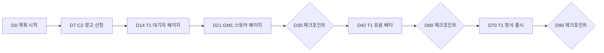

# 90일 실행 계획 사례

> **학습 목표**: 01~09 문서의 도구를 예시 스튜디오에 한꺼번에 적용해, 프로토타입 12개를 선별하고 시간·실험·출시일·수익 시나리오·runway·체크포인트가 들어간 90일 계획을 직접 세울 수 있다.

이 문서는 새 이론을 더하지 않는다. 앞 문서의 도구를 **순서대로 한 번에** 쓰는 연습이다. 모든 숫자는 설명용 가정이며, 수수료·벤치마크의 출처는 해당 문서에 있다.

## 핵심 개념

출발점 (가정, 01 문서의 예시 스튜디오):

| 항목 | 값 |
|---|---|
| 인원 | 1명 + AI 에이전트 |
| 월 작업 가능 시간 | 160시간 |
| 월 필요 금액 | 생활비 300만 원 + 고정비 50만 원 = 350만 원 |
| 운영 자금 | 1,800만 원 |
| Runway | 1,800 ÷ 350 = 5.14 → 약 5.1개월 |
| 프로토타입 | 12개: 게임 3, 창작 도구 4, 생산성 앱 3, 콘텐츠 사이트 2 |
| 현재 매출 | 출시 1개 (P1), 월 매출 0원 |

90일 계획은 일곱 단계로 진행한다: ① 12개 트리아지(02, 03) ② 베팅 2~3개 선택(02) ③ 합계 160시간의 시간 배분(01, 08) ④ 검증 실험과 임계값(03, 09) ⑤ 출시 일정(08) ⑥ 수익 시나리오와 runway(01, 04~07) ⑦ 30·60·90일 체크포인트(09).

## 원리

- **왜 90일인가**: runway 5.1개월 중 90일을 쓰고도 약 2개월이 남아, 계획이 틀렸을 때 방향을 바꿀 여유가 있다. 08 문서의 8주 주기 하나와 다음 주기 일부가 들어간다.
- **점수표의 기준** (각 1~5점, 합계 25점):
  - D 수요 신호: 03 문서 기준의 증거 (대화, 대기자, 사전 판매)
  - M 수익 경로: 돈 받는 수단이 명확하고 바로 붙일 수 있는가 (04~07)
  - S 출시 근접도: 남은 작업이 적을수록 높다
  - R 유통 접근: 첫 100명을 데려올 채널이 이미 있는가 (08)
  - F 적합: 역량, 흥미, 기존 자산
- **동점 처리 규칙**: 점수가 같으면 **포트폴리오의 모델 분산을 늘리는 쪽**을 고른다 (02 문서의 barbell).
- **WIP 한도**: 02 문서의 권장 출발점대로 제작 2개(T1, C2), 검증 2개(GM1 스토어 페이지, P2 fake door)까지.

## 적용: 예시 스튜디오

### 1단계: 트리아지

| 코드 | 프로토타입 (가정) | D | M | S | R | F | 합계 | 판정 |
|---|---|---|---|---|---|---|---|---|
| T1 | 픽셀 아트 편집기 (웹) | 4 | 4 | 4 | 4 | 4 | 20 | 주력 베팅 |
| C2 | 기술 문서 사이트 (애드센스 준비 중) | 3 | 3 | 5 | 4 | 5 | 20 | 저비용 베팅 |
| GM1 | 로그라이크 퍼즐 (PC) | 3 | 4 | 2 | 3 | 5 | 17 | 작은 베팅 (Wishlist) |
| P2 | 프리랜서 견적서 생성기 | 4 | 4 | 3 | 3 | 3 | 17 | 검증: fake door 1회 |
| T3 | 폰트 조합 도구 | 2 | 2 | 5 | 3 | 2 | 14 | 보관 |
| P1 | 습관 추적 앱 (출시됨) | 2 | 2 | 5 | 2 | 3 | 14 | 유지보수만 |
| T2 | 음악 스케치 도구 | 3 | 3 | 2 | 2 | 3 | 13 | 보관 |
| T4 | 영상 자막 편집기 | 3 | 3 | 2 | 2 | 3 | 13 | 보관 |
| GM3 | 내러티브 어드벤처 (PC) | 2 | 3 | 1 | 2 | 4 | 12 | 보관 |
| C1 | 레시피 큐레이션 사이트 | 2 | 2 | 4 | 2 | 2 | 12 | 보관 |
| GM2 | 하이퍼캐주얼 (모바일) | 2 | 2 | 4 | 1 | 2 | 11 | 보관 |
| P3 | 가계부 앱 | 2 | 2 | 3 | 2 | 2 | 11 | 보관 |

- GM1과 P2가 17점 동점이다. P2는 T1과 같은 "도구를 웹에서 판매" 모델이고, GM1은 Premium 게임이라는 다른 모델을 더한다. 동점 규칙에 따라 GM1에 월 32시간을 주고 Steam 스토어 페이지로 검증하며, P2는 월 4시간짜리 fake door 검증만 한다.
- 02 문서의 기본 배분은 출시한 제품 운영에 32시간을 두지만, P1은 14점이라 유지보수 4시간만 주고 나머지를 베팅에 돌린다.
- **보관**은 삭제가 아니다. 저장소는 남기고 시간 배정만 0으로 한다. 다음 분기 트리아지에 다시 들어간다.

### 2~3단계: 베팅과 시간 배분

| 항목 | 주당 | 월 (× 4주) | 비중 |
|---|---|---|---|
| T1 픽셀 아트 편집기 | 16시간 | 64시간 | 40% |
| GM1 로그라이크 퍼즐 (스토어 페이지, 데모 핵심 루프) | 8시간 | 32시간 | 20% |
| C2 기술 문서 사이트 (글, 광고 신청) | 6시간 | 24시간 | 15% |
| 유통 공통 (커뮤니티, 뉴스레터, 대기자 관리) | 4시간 | 16시간 | 10% |
| 운영·검토 (회계, 주간·월간 검토) | 4시간 | 16시간 | 10% |
| P2 fake door | 1시간 | 4시간 | 2.5% |
| P1 유지보수 | 1시간 | 4시간 | 2.5% |
| 합계 | 40시간 | 160시간 | 100% |

### 4단계: 검증 실험과 임계값

| 제품 | 실험 | 기간 | 확대·통과 | 중단·재작업 |
|---|---|---|---|---|
| T1 | 대기자 페이지 + Van Westendorp 설문 + 얼리버드 사전 판매 (03, 06) | D14~D42 | 방문 300명 중 등록 10% 이상 또는 얼리버드 결제 5건 (02 문서 G2 관문) | 등록 5% 미만이고 결제 0건 → 메시지 1회 수정 후 재측정 |
| T1 | 유료 베타 체험 → 결제 | D42~D60 | 10% 이상 (09 규칙) | 3% 미만 |
| C2 | 애드센스 신청, 글 주 2편 | D7~D90 | D90 월 페이지뷰 10,000 이상 | 3,000 미만 |
| GM1 | Steam 스토어 페이지 공개 | D21~D90 | D90 누적 Wishlist 1,500 이상 | 500 미만 |
| P2 | 커뮤니티 게시로 fake door 랜딩 | D14~D28 | 방문 300명 중 등록 10% 이상 → 다음 분기 제작 후보 | 미달 → 보관 |

### 5단계: 출시 일정 (D0 = 2026-10-05 월요일)

| 날짜 | 일차 | 일 |
|---|---|---|
| 2026-10-12 | D7 | C2 애드센스 신청 |
| 2026-10-19 | D14 | T1 대기자 페이지 공개, P2 fake door 게시 |
| 2026-10-26 | D21 | GM1 Steam 스토어 페이지 공개 |
| 2026-11-04 | D30 | 체크포인트 1 |
| 2026-11-16 | D42 | T1 유료 베타 출시 (얼리버드) |
| 2026-12-04 | D60 | 체크포인트 2 (09 문서의 대시보드) |
| 2026-12-14 | D70 | T1 정식 출시 |
| 2027-01-03 | D90 | 체크포인트 3, 다음 분기 트리아지 |

### 6단계: 수익 시나리오와 runway (가정)

월 순매출(수수료 차감 후)을 만 원 단위로 가정하고, 4개월째부터는 3개월째 수준이 유지된다고 둔다. 일회성 비용 20만 원(Steam Direct 100달러 ≈ 14만 원 + 도메인·도구 6만 원)을 포함한다.

| 시나리오 | 1개월 | 2개월 | 3개월 | 90일 뒤 잔액 | 이후 월 순소진 | 남은 개월 | 총 runway |
|---|---|---|---|---|---|---|---|
| 매출 없음 (기준) | 0 | 0 | 0 | 1,800 − 1,050 = 750 | 350 | 2.1 | 5.1개월 |
| 비관 | 0 | 0 | 10 | 1,800 − 1,050 + 10 − 20 = 740 | 350 − 10 = 340 | 740 ÷ 340 = 2.2 | 5.2개월 |
| 기본 | 0 | 30 | 80 | 1,800 − 1,050 + 110 − 20 = 840 | 350 − 80 = 270 | 840 ÷ 270 = 3.1 | 6.1개월 |
| 낙관 | 0 | 60 | 180 | 1,800 − 1,050 + 240 − 20 = 970 | 350 − 180 = 170 | 970 ÷ 170 = 5.7 | 8.7개월 |

- 기준 행은 비교용이라 일회성 비용을 넣지 않았다. 750 ÷ 350 = 2.14 → 3 + 2.1 = 5.1개월.
- 어느 시나리오도 90일 안에 월 350만 원(default alive, 01 문서)에 닿지 않는다. 90일의 목표는 생존이 아니라 **runway를 늘리며 다음 분기에 확대할 제품을 찾는 것**이다.
- 09 문서의 60일째 대시보드(T1 45만 + C2 3만 = 48만 원)는 기본(30만)과 낙관(60만) 사이다.

### 7단계: 체크포인트

| 시점 | 질문 | 통과 기준 | 통과하지 못하면 |
|---|---|---|---|
| D30 (11-04) | T1 대기자가 모이는가, P2 fake door 결과는 | T1 등록 10% 이상 또는 얼리버드 결제 5건 이상 | T1 메시지·가격 재작업, 유료 베타 1주 연기 가능 (출시일은 한 번만 이동) |
| D60 (12-04) | 사람들이 돈을 내는가 | T1 체험 → 결제 10% 이상, 30일 순매출 40만 원 이상 | 3~10%면 유지, 3% 미만이면 T1 중단 검토, P2를 다음 베팅 후보로 |
| D90 (01-03) | 어느 시나리오에 있는가 | 기본 이상 (3개월째 순매출 80만 원 이상) | 비관이면 즉시 소진 줄이기: 월 80시간을 외주 수입으로 돌리고 베팅을 T1 하나로 축소 |

- D90에 GM1이 Wishlist 1,500 이상이면 2027년 2월 Next Fest 등록 마감(2027-01-10) 전에 참가를 결정한다 (07 문서). 기준 미달이면 GM1은 보관한다.
- 모든 판정은 09 문서의 결정 일지에 남긴다.

나쁜 예:

> 12개를 모두 "조금씩" 진행하기로 했다. 90일 뒤 출시는 0개, 잔액은 750만 원이었다.

좋은 예:

> 제작 2개와 검증 2개에만 시간을 주고, P1은 유지보수만 하며, 나머지 7개는 보관 목록에 날짜와 함께 적었다. D60에 T1의 결제율이 기준을 넘어 시간을 늘렸다.

## 심화

### 계획이 틀렸을 때

- **비관 시나리오**는 default dead 신호다. 매출을 늘리는 것보다 **소진을 줄이는 것이 빠르다**. 외주·강의처럼 확실한 수입으로 월 순소진을 줄이면 runway가 다시 늘어난다.
- **숫자가 기준 근처에서 애매할 때**: 사전에 정한 규칙대로 "유지"로 두고, 다음 게이트까지 주 지표를 가장 크게 움직일 실험 하나만 한다.
- **새 아이디어가 떠오를 때**: 보관 목록에 적고 다음 분기 트리아지에서 같은 점수표로 겨루게 한다. 분기 중간에 WIP를 늘리지 않는다.

## 흔한 오해

- **"점수표가 정답을 준다."** 점수표는 판단을 기록하고 비교하게 만드는 도구다. 점수의 근거를 한 줄씩 남겨야 다음 분기에 교정할 수 있다.
- **"보관하면 버리는 것이다."** 보관은 시간을 주지 않는다는 결정일 뿐이다. 새 신호가 생기면 다음 트리아지에서 돌아온다.
- **"낙관 시나리오를 계획으로 삼는다."** 계획은 기본 시나리오로 세우고, 비관 시나리오의 대응을 미리 적어 둔다.
- **"90일 안에 생활비를 벌어야 성공이다."** 이 예시의 성공 기준은 runway 연장과 확대할 제품 1개의 발견이다.

## 자기 점검 질문

1. 자기 프로토타입 목록에 D·M·S·R·F 점수를 매기고 합계 상위 3개를 골라 보라. 동점이면 어떤 규칙으로 가르나?
2. 주 40시간 중 주력 베팅에 40%를 주면 월 몇 시간인가? 나머지를 어디에 배분할지 합계 160시간으로 맞춰 보라.
3. 3개월째 월 순매출이 50만 원이고 이후 유지된다면, 일회성 비용 20만 원을 포함한 총 runway는 몇 개월인가? (1·2개월 순매출은 0과 20만 원)
4. D60 체크포인트에서 T1 결제율이 5%라면 09 문서의 규칙상 판정은 무엇인가?
5. 비관 시나리오에서 매출보다 소진을 먼저 줄이는 이유를 runway 공식으로 설명하라.

## 참고 자료

- [Paul Graham - Default Alive or Default Dead? (2015)](https://paulgraham.com/aord.html) (접근 2026-09-29)
- [Basecamp - Shape Up](https://basecamp.com/shapeup) (접근 2026-09-29)
- [Behavioral Scientist - Annie Duke, Mental Models to Help You Cut Your Losses](https://behavioralscientist.org/annie-duke-quit-mental-models-to-help-you-cut-your-losses/) (접근 2026-09-29)
- [Steamworks - Steam Direct Fee](https://partner.steamgames.com/doc/gettingstarted/appfee) (접근 2026-09-29)
- [Steamworks - Steam Next Fest: February 2027](https://partner.steamgames.com/doc/marketing/upcoming_events/nextfest/feb_2027) (접근 2026-09-29)
